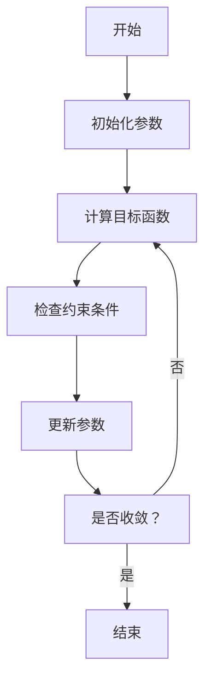
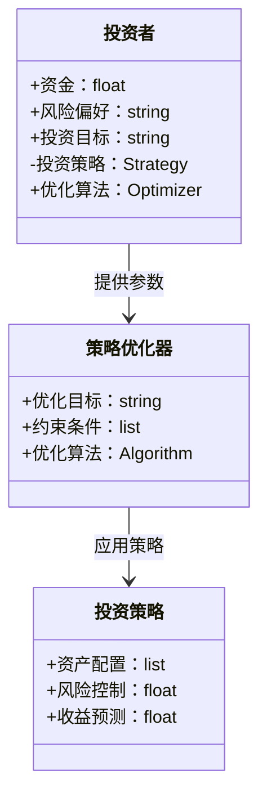
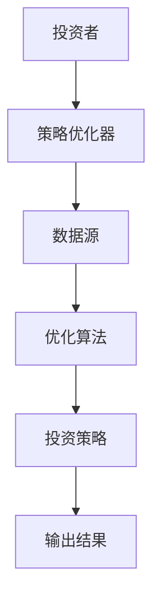
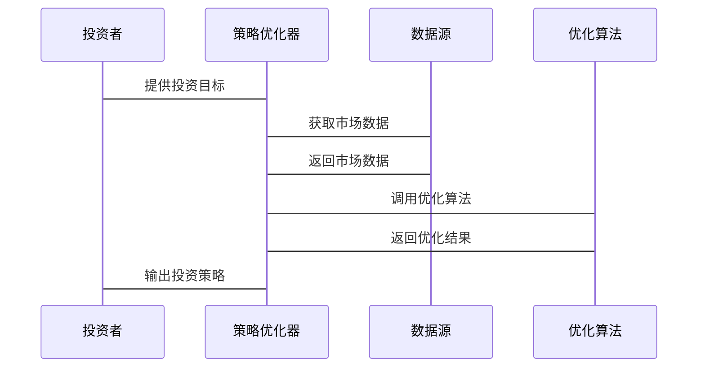

                 


# 《智能系统优化特殊情况投资策略》

> 关键词：智能系统优化，特殊情况投资策略，算法原理，系统架构，数学模型，项目实战

> 摘要：本文探讨了智能系统优化在特殊情况投资策略中的应用，从背景、核心概念、算法原理、系统架构到项目实战，详细分析了如何利用智能系统优化技术解决特殊情况下的投资策略问题，提供了一套完整的解决方案和实践指南。

---

## 第1章 智能系统优化与特殊情况投资策略概述

### 1.1 智能系统优化的背景与意义
#### 1.1.1 传统投资策略的局限性
传统投资策略依赖于人工分析和经验判断，存在以下问题：
- 数据处理能力有限，难以应对海量数据。
- 投资决策容易受到主观因素影响。
- 对市场波动和突发事件的反应不够及时。

#### 1.1.2 智能系统优化的核心优势
智能系统优化通过算法和数据驱动的方式，显著提升了投资策略的科学性和效率：
- 自动化处理海量数据，提高决策效率。
- 降低人为情绪干扰，实现理性投资。
- 及时捕捉市场变化，优化投资组合。

#### 1.1.3 特殊情况投资策略的定义与特点
特殊情况投资策略是指在市场出现极端波动、突发事件或特殊经济周期时，采用针对性投资策略以实现收益最大化。其特点包括：
- 数据复杂性高。
- 市场不确定性大。
- 策略灵活性要求高。

### 1.2 特殊情况投资策略的挑战与机遇
#### 1.2.1 市场波动与不确定性
特殊情况下的市场波动往往不可预测，投资者需要快速调整策略以应对。
- 例如，2020年新冠疫情对全球市场的影响就是一个典型案例。

#### 1.2.2 数据驱动的投资决策
通过智能系统优化，投资者可以利用大数据分析和预测模型，制定更为科学的投资策略。
- 数据来源包括历史价格、市场情绪、新闻事件等。

#### 1.2.3 人工智能在投资策略中的应用前景
人工智能技术在投资领域的应用越来越广泛，尤其是在处理复杂数据和优化投资组合方面表现出色。

### 1.3 本章小结
本章介绍了智能系统优化在特殊情况投资策略中的背景、意义及特点，为后续内容奠定了基础。

---

## 第2章 智能系统优化的核心概念与联系

### 2.1 智能系统优化的基本原理
#### 2.1.1 系统优化的定义与目标
系统优化是指通过调整系统中的变量和参数，使其达到最优状态。目标包括：
- 最小化成本。
- 最大化收益。
- 提高系统效率。

#### 2.1.2 智能优化算法的特点
智能优化算法是一种基于人工智能的优化方法，具有以下特点：
- 全局搜索能力强。
- 自适应性强。
- 并行计算能力高。

#### 2.1.3 优化问题的数学建模
优化问题通常可以表示为数学模型：
$$ \text{目标函数} + \text{约束条件} $$

---

### 2.2 特殊情况投资策略的系统分析
#### 2.2.1 投资策略的系统构成
投资策略系统包括以下组成部分：
- 数据采集模块。
- 数据分析模块。
- 策略优化模块。
- 执行模块。

#### 2.2.2 特殊情况下的优化目标
在特殊情况下的优化目标包括：
- 风险最小化。
- 收益最大化。
- 策略快速调整。

#### 2.2.3 系统优化与投资策略的关联
通过系统优化，投资策略可以更加灵活和高效地应对市场变化。

---

### 2.3 核心概念对比与ER实体关系图
#### 2.3.1 核心概念属性对比表
| 概念 | 属性 | 描述 |
|------|------|------|
| 优化问题 | 目标函数 | 需要优化的目标 |
|        | 约束条件 | 优化过程中的限制条件 |
| 投资策略 | 资产配置 | 资金在不同资产之间的分配 |
|        | 风险控制 | 控制投资风险的策略 |

#### 2.3.2 ER实体关系图
```mermaid
erDiagram
    actor 投资者
    actor 系统优化器
    actor 数据源
    class 优化算法
    class 投资策略
    class 数据库
    投资者 --> 优化算法 : 提供目标
    系统优化器 --> 投资策略 : 应用策略
    数据源 --> 数据库 : 存储数据
```

---

## 第3章 智能系统优化算法原理

### 3.1 常见优化算法概述
#### 3.1.1 贪心算法
贪心算法是一种简单且高效的优化方法，适用于某些特定问题。

#### 3.1.2 动态规划算法
动态规划算法通过分解问题为子问题，逐步求解最优解。

#### 3.1.3 遗传算法
遗传算法模拟生物进化过程，通过迭代优化得到最优解。

#### 3.1.4 支持向量机（SVM）优化
SVM优化是一种监督学习方法，常用于分类和回归问题。

---

### 3.2 算法流程图与实现代码
#### 3.2.1 算法流程图


#### 3.2.2 Python代码实现示例
```python
def greedy_algorithm(target, constraints):
    # 初始化参数
    params = initialize_params()
    while not converged(params):
        # 计算目标函数
        value = compute_objective(params)
        # 更新参数
        params = update_params(params, value, constraints)
    return params
```

### 3.3 数学模型与公式
#### 3.3.1 优化问题的数学建模
$$ \text{minimize } f(x) $$
$$ \text{subject to } g(x) \leq 0 $$
$$ h(x) = 0 $$

---

## 第4章 系统分析与架构设计方案

### 4.1 问题场景介绍
特殊情况下的投资策略需要应对市场波动和突发事件，要求系统具有快速响应能力和高容错性。

### 4.2 项目介绍
本项目旨在开发一个智能投资策略优化系统，用于特殊情况下的投资决策。

### 4.3 系统功能设计
#### 4.3.1 领域模型（Mermaid类图）


### 4.4 系统架构设计
#### 4.4.1 系统架构图


### 4.5 系统接口设计
系统接口包括数据输入接口、算法调用接口和结果输出接口。

### 4.6 系统交互设计
#### 4.6.1 交互序列图


---

## 第5章 项目实战

### 5.1 环境安装
项目需要以下环境：
- Python 3.8+
- 计算机视觉库（如OpenCV）
- 数据分析库（如Pandas）
- 优化算法库（如Scipy）

### 5.2 系统核心实现源代码
```python
import numpy as np
from scipy.optimize import minimize

def objective_function(params, *args):
    # 目标函数
    return np.sum(params**2)

def constraint_function(params, *args):
    # 约束条件
    return np.sum(params) - 1

# 初始化参数
initial_guess = np.array([1.0, 1.0])

# 定义约束
constraints = {'type': 'eq', 'fun': constraint_function}

# 调用优化算法
result = minimize(objective_function, initial_guess, constraints=constraints)

# 输出结果
print(result.x)
```

### 5.3 代码应用解读与分析
上述代码展示了如何使用Scipy的最小化函数来求解优化问题。目标是最小化目标函数，同时满足约束条件。

### 5.4 实际案例分析
以某股票市场为例，分析系统如何在市场波动时优化投资组合。

### 5.5 项目小结
通过项目实战，验证了智能系统优化在特殊情况投资策略中的有效性和可行性。

---

## 第6章 最佳实践与总结

### 6.1 最佳实践 tips
- 定期更新数据源和优化算法。
- 优化过程中注意模型的可解释性。
- 保持系统的灵活性和扩展性。

### 6.2 小结
本文系统地介绍了智能系统优化在特殊情况投资策略中的应用，从理论到实践，提供了一套完整的解决方案。

### 6.3 注意事项
- 数据质量和完整性直接影响优化效果。
- 系统需要具备快速响应能力。
- 优化过程需要考虑计算资源限制。

### 6.4 拓展阅读
推荐相关书籍和论文，供读者进一步学习。

---

**本文通过详细分析智能系统优化在特殊情况投资策略中的应用，结合理论与实践，为投资者提供了一套高效的投资决策解决方案。**

