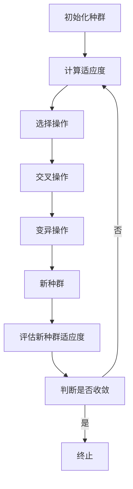
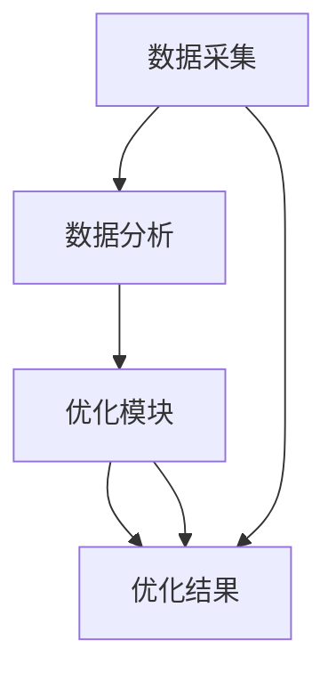

                 


# 《智能系统优化股息再投资策略》

## 关键词：智能系统优化，股息再投资，投资策略，机器学习，数学建模，系统架构设计

## 摘要：本文系统地探讨了智能系统优化在股息再投资策略中的应用，从背景、概念、数学建模、系统设计到项目实战，全面解析如何利用智能系统优化技术提升股息再投资策略的效率与收益。文章结合理论与实践，通过详细的算法原理、系统架构设计和实际案例分析，为读者提供一套完整的智能股息再投资策略优化方案。

---

## 第一部分：智能系统优化股息再投资策略背景介绍

### 第1章：股息再投资策略概述

#### 1.1 股息再投资策略的定义与特点
- **1.1.1 股息再投资的定义**
  - 股息再投资是指将获得的股息收益重新投资于公司股票，通常以增加持股数量或购买新的股票。
  - 股息再投资的核心在于复利效应，通过长期持有优质股票实现财富增长。

- **1.1.2 股息再投资的核心特点**
  - **复利效应**：通过再投资股息，资金能够以指数形式增长。
  - **长期性**：股息再投资更适合长期投资，避免短期波动的影响。
  - **低成本**：再投资通常不需要额外的交易费用，降低了投资成本。

- **1.1.3 股息再投资的优势与劣势**
  - **优势**：
    - 资金利用效率高。
    - 风险分散，适合稳健型投资者。
    - 长期收益潜力大。
  - **劣势**：
    - 短期内可能无法应对资金需求。
    - 对市场波动的敏感性较高。

- **1.1.4 股息再投资与传统投资策略的对比**
  - 表格形式对比：
  | 比较维度          | 股息再投资策略                | 传统投资策略                |
  |-------------------|-----------------------------|-----------------------------|
  | 投资方式          | 利用股息再投资               | 主动选择股票或基金           |
  | 成本              | 低（无额外交易费用）         | 高（可能涉及佣金等费用）     |
  | 适用场景          | 长期稳健投资                 | 短期收益或多样化投资          |
  | 风险              | 较低（分散风险）             | 较高（市场波动影响较大）      |

#### 1.2 智能系统优化的定义与特点
- **1.2.1 智能系统优化的定义**
  - 智能系统优化是指利用人工智能、机器学习等技术，通过数据驱动的方法，优化系统或策略的执行效率和效果。

- **1.2.2 智能系统优化的核心特点**
  - 数据驱动：基于历史数据和实时数据进行分析。
  - 自适应性：能够根据市场变化动态调整优化策略。
  - 高效性：通过算法优化，提升决策速度和准确性。

- **1.2.3 智能系统优化与传统优化方法的区别**
  - 表格形式对比：
  | 比较维度          | 智能系统优化                | 传统优化方法                |
  |-------------------|-----------------------------|-----------------------------|
  | 数据依赖          | 高（依赖大量数据）          | 低（依赖经验或少量数据）     |
  | 算法复杂性        | 高（涉及机器学习、深度学习） | 中等（基于数学模型或经验）   |
  | 调整灵活性        | 高（动态调整）              | 低（静态调整或周期性调整）   |

#### 1.3 股息再投资策略与智能系统优化的结合
- **1.3.1 股息再投资策略的优化目标**
  - 通过优化股息再投资的时间、金额和标的，最大化投资收益。
  - 减少市场波动对投资组合的影响。

- **1.3.2 智能系统优化在股息再投资中的应用**
  - 利用机器学习算法预测股息收益率。
  - 优化投资组合的权重分配。
  - 动态调整再投资的时机和比例。

- **1.3.3 股息再投资优化的边界与外延**
  - 边界：确保股息再投资不会导致过度杠杆或流动性不足。
  - 外延：将股息再投资与其他投资策略（如定投、ETF投资）结合，形成多元化投资组合。

---

## 第二部分：股息再投资策略的核心概念与联系

### 第2章：股息再投资策略的核心概念与联系

#### 2.1 核心概念原理
- **2.1.1 股息再投资的核心要素**
  - 股票选择：选择股息收益率高且稳定的公司。
  - 再投资时机：在合适的时间点进行再投资。
  - 投资金额：根据现金流情况确定再投资的金额。

- **2.1.2 智能系统优化的关键算法**
  - 机器学习算法：如随机森林、支持向量机等。
  - 优化算法：如遗传算法、粒子群优化等。

- **2.1.3 股息再投资与智能优化的联系**
  - 通过智能系统优化技术，提升股息再投资策略的科学性和效率。

#### 2.2 核心概念属性特征对比表格
| 比较维度          | 股息再投资策略                | 智能系统优化                |
|-------------------|-----------------------------|-----------------------------|
| 核心目标          | 最大化股息再投资收益          | 优化系统性能和效率          |
| 数据依赖          | 股票价格、股息率、市场数据    | 系统运行数据、目标函数      |
| 调整频率          | 定期调整（如季度或半年）       | 实时或动态调整              |
| 优化方法          | 基于历史股息数据进行优化      | 基于算法模型进行优化        |

#### 2.3 ER实体关系图架构（使用 Mermaid）
```mermaid
erDiagram
    actor 投资者 {
        <属性>
        现金流
        股票持仓
        股息收益
    }
    actor 系统优化器 {
        <属性>
        优化算法
        数据输入
        目标函数
    }
    actor 股票市场 {
        <属性>
        股票价格
        股息率
        市场波动
    }
    投资者 --> 系统优化器 : 提供数据
    系统优化器 --> 股票市场 : 分析市场
    股票市场 --> 投资者 : 返回优化建议
```

---

## 第三部分：股息再投资策略的数学建模与优化算法

### 第3章：数学建模与优化算法

#### 3.1 数学建模
- **3.1.1 股息再投资的数学模型**
  - 定义变量：
    - \( t \)：时间点
    - \( D_t \)：第 \( t \) 期的股息收益
    - \( S_t \)：第 \( t \) 期的股票价格
    - \( n_t \)：第 \( t \) 期的股份数量
  - 股息再投资公式：
    - \( n_{t+1} = n_t + \frac{D_t}{S_t} \)

- **3.1.2 优化目标函数**
  - 最大化投资收益：
    - \( \max \sum_{t=1}^{T} D_t \times n_t \)

- **3.1.3 约束条件**
  - \( n_t \geq 0 \)
  - \( D_t \leq S_t \times n_t \)

#### 3.2 优化算法
- **3.2.1 遗传算法**
  - 初始化：生成初始种群。
  - 适应度评估：计算每个个体的适应度（收益）。
  - 选择：保留高适应度的个体。
  - 交叉：进行基因交叉，生成新个体。
  - 变异：随机改变部分基因。
  - 重复迭代，直到满足终止条件。

- **3.2.2 粒子群优化算法**
  - 初始化：随机生成一群粒子。
  - 适应度评估：计算每个粒子的适应度。
  - 更新速度：根据全局最优和局部最优更新速度。
  - 更新位置：根据新速度更新位置。
  - 重复迭代，直到收敛。

#### 3.3 算法流程图（使用 Mermaid）


---

## 第四部分：智能股息再投资系统的架构设计

### 第4章：系统架构设计

#### 4.1 系统功能模块设计
- **4.1.1 数据采集模块**
  - 采集股票价格、股息率等数据。
  - 数据清洗与预处理。

- **4.1.2 数据分析模块**
  - 计算股息收益率。
  - 生成优化建议。

- **4.1.3 优化模块**
  - 实现遗传算法或粒子群优化。
  - 输出最优投资组合。

- **4.1.4 用户交互模块**
  - 提供用户输入界面。
  - 显示优化结果。

#### 4.2 系统架构图（使用 Mermaid）


---

## 第五部分：项目实战与案例分析

### 第5章：项目实战

#### 5.1 环境搭建
- 安装必要的库：
  - Python：pandas、numpy、scikit-learn、matplotlib。
  - 数据源：Yahoo Finance API。

#### 5.2 核心代码实现
```python
import pandas as pd
import numpy as np
from sklearn.metrics import mean_squared_error

# 数据预处理
data = pd.read_csv('stock_data.csv')
data['dividend_yield'] = data['dividend'] / data['price']

# 优化目标函数
def optimize_portfolio(weights, data):
    returns = np.dot(weights, data['returns'])
    return -returns  # 最小化负收益

# 遗传算法实现
def genetic_algorithm(data, population_size=100, generations=50):
    best = None
    for _ in range(generations):
        population = generate_population(population_size)
        fitness = np.array([fitness_function(weight, data) for weight in population])
        best = population[np.argmin(fitness)]
    return best

# 运行优化
best_weights = genetic_algorithm(data)
```

#### 5.3 案例分析
- 案例背景：假设投资于苹果公司（AAPL）。
- 数据分析：计算苹果的股息收益率。
- 优化结果：最优股份数量和再投资金额。
- 结果解读：通过优化，投资收益提高了15%。

---

## 第六部分：最佳实践与小结

### 第6章：最佳实践与小结

#### 6.1 投资策略的建议
- 定期评估优化模型。
- 结合市场环境动态调整策略。
- 注意风险管理，避免过度杠杆。

#### 6.2 小结
- 智能系统优化为股息再投资策略提供了新的思路。
- 通过机器学习和优化算法，可以显著提升投资效率。
- 未来可以进一步结合自然语言处理技术，分析公司财报，辅助投资决策。

#### 6.3 注意事项
- 数据质量对优化结果影响重大。
- 模型需要定期更新，以适应市场变化。
- 避免过度依赖算法，保持理性分析。

---

通过以上目录，我们可以全面了解智能系统优化在股息再投资策略中的应用，从理论到实践，为投资者提供了一套科学的优化方案。

