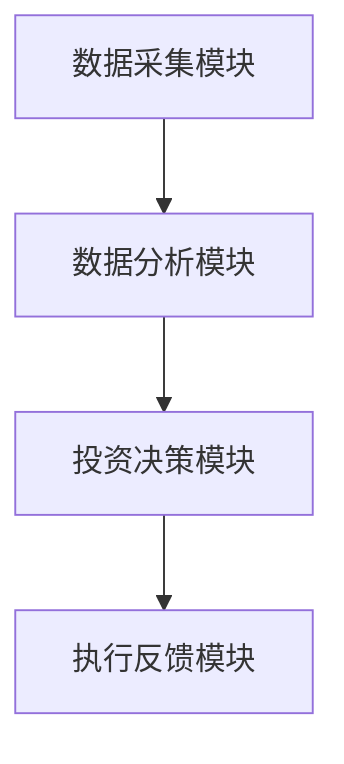
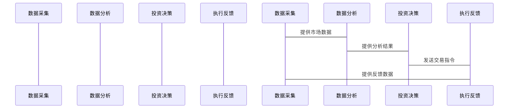

                 


# 智能系统优化逆向投资策略执行

> 关键词：智能系统优化，逆向投资策略，投资组合优化，遗传算法，模拟退火，系统架构设计

> 摘要：本文探讨了智能系统优化在逆向投资策略中的应用，结合数学建模和优化算法，详细讲解了如何利用智能优化方法执行逆向投资策略。文章从理论基础到算法实现，再到系统架构设计，最后通过实际案例分析，展示了智能系统优化如何提升投资决策的效率和效果。

---

## 第1章: 智能系统优化与逆向投资策略概述

### 1.1 智能系统优化的基本概念

#### 1.1.1 智能系统优化的定义
智能系统优化是指利用人工智能、机器学习等技术，对复杂系统进行建模、分析和优化的过程。其核心在于通过算法和模型，寻找最优解或近似最优解，以提高系统的性能和效率。

#### 1.1.2 智能系统优化的特点
- **数据驱动**：依赖大量数据进行建模和分析。
- **动态适应**：能够根据实时数据和环境变化调整优化策略。
- **多目标优化**：在多个目标之间寻找平衡点，例如在投资中平衡风险和收益。

#### 1.1.3 智能系统优化的应用场景
- **金融投资**：优化投资组合，降低风险。
- **资源分配**：优化资源使用，提高效率。
- **供应链管理**：优化物流路径，降低成本。

### 1.2 逆向投资策略的基本概念

#### 1.2.1 逆向投资的定义
逆向投资是一种投资策略，指在市场下跌、资产价格被低估时进行投资，而在市场上涨时卖出。其核心思想是“买低卖高”。

#### 1.2.2 逆向投资的核心思想
- **逆周期操作**：在市场低迷时寻找投资机会，在市场繁荣时规避风险。
- **价值发现**：寻找被市场低估的资产，长期持有，等待价值回归。

#### 1.2.3 逆向投资的应用领域
- **股票投资**：在市场低点买入优质股票。
- **房地产投资**：在房地产市场低迷时购买低价房产。
- **债券投资**：在债券市场下跌时买入高息债券。

### 1.3 智能系统优化与逆向投资策略的结合

#### 1.3.1 结合的意义
- **提高决策效率**：利用智能系统优化算法快速分析市场数据，制定投资策略。
- **降低风险**：通过优化模型，减少投资决策的不确定性。
- **动态调整**：根据市场变化实时优化投资组合，提升收益。

#### 1.3.2 结合的实现方式
1. **数据采集**：收集市场数据，包括股票价格、市场指数等。
2. **模型构建**：建立数学模型，描述投资问题。
3. **算法优化**：使用智能优化算法求解模型，找到最优投资组合。
4. **策略执行**：根据优化结果执行投资操作。

#### 1.3.3 结合的优势与挑战
- **优势**：提高投资决策的科学性和效率。
- **挑战**：市场不确定性高，模型的有效性依赖于数据质量和算法的优化能力。

---

## 第2章: 智能系统优化的核心算法

### 2.1 算法原理概述

#### 2.1.1 算法的基本原理
智能优化算法是一种模拟生物进化或物理过程的优化方法，常见的包括遗传算法、模拟退火、粒子群优化等。这些算法通过迭代优化，找到问题的最优解。

#### 2.1.2 算法的数学模型
以遗传算法为例，其数学模型包括：
1. **编码**：将问题转化为二进制或其他编码形式。
2. **适应度函数**：衡量解的优劣。
3. **选择、交叉和变异**：模拟生物进化过程，生成新的解。

#### 2.1.3 算法的优化目标
在投资中，优化目标通常是最大化收益或最小化风险。

### 2.2 常用优化算法

#### 2.2.1 遗传算法
遗传算法（GA）是一种模拟自然选择的优化方法，适用于复杂的非线性优化问题。其步骤包括：
1. 初始化种群。
2. 计算适应度。
3. 选择优秀个体。
4. 进行交叉和变异。
5. 重复迭代，直到满足终止条件。

#### 2.2.2 模拟退火算法
模拟退火（SA）是一种全局优化算法，适用于解决组合优化问题。它通过模拟金属冷却的过程，逐步降低温度，找到全局最优解。

#### 2.2.3 蚁群算法
蚁群算法（ACO）是一种模拟蚂蚁觅食行为的优化方法，适用于解决路径优化问题。通过信息素更新，逐步优化路径。

### 2.3 算法的实现与优化

#### 2.3.1 算法的实现步骤
以遗传算法为例：
1. 初始化种群：随机生成一组解。
2. 计算适应度：评估每个解的优劣。
3. 选择：选择适应度较高的解作为父代。
4. 交叉：生成子代。
5. 变异：随机改变子代的部分特征。
6. 重复步骤，直到满足终止条件。

#### 2.3.2 算法的优化方法
- **自适应选择**：动态调整选择压力。
- **动态变异**：根据适应度变化调整变异概率。
- **混合策略**：结合多种算法的优点。

#### 2.3.3 算法的性能评估
通过适应度值、收敛速度、解的质量等指标评估算法的性能。

---

## 第3章: 逆向投资策略的数学模型

### 3.1 投资策略的数学建模

#### 3.1.1 投资组合优化的数学模型
投资组合优化的目标是在给定风险下最大化收益，或在给定收益下最小化风险。数学模型如下：

$$
\text{目标函数：} \max \sum_{i=1}^n w_i r_i \\
\text{约束条件：} \sum_{i=1}^n w_i = 1, \sum_{i=1}^n w_i^2 \leq \sigma^2
$$

其中，$w_i$ 是第 $i$ 只股票的权重，$r_i$ 是其收益率，$\sigma^2$ 是风险容忍度。

#### 3.1.2 逆向投资的数学表达式
逆向投资的数学模型通常基于市场情绪和资产价格的偏离度。例如，使用市盈率（P/E）比率作为估值指标，当P/E低于历史平均水平时，视为被低估，适合买入。

#### 3.1.3 投资组合的风险与收益分析
通过夏普比率（Sharpe Ratio）衡量投资组合的风险调整后收益：

$$
\text{夏普比率} = \frac{E[r_p] - r_f}{\sigma_p}
$$

其中，$E[r_p]$ 是组合的期望收益，$r_f$ 是无风险利率，$\sigma_p$ 是组合的收益波动率。

### 3.2 算法的数学推导

#### 3.2.1 优化问题的数学形式
假设投资组合由 $n$ 只股票组成，权重为 $w_i$，收益率为 $r_i$，市场风险为 $\sigma_i$。目标是最小化风险，同时保持期望收益不变：

$$
\min \sum_{i=1}^n w_i^2 \sigma_i^2 \\
\text{约束条件：} \sum_{i=1}^n w_i r_i = \mu, \sum_{i=1}^n w_i = 1
$$

#### 3.2.2 约束条件的数学表达
常见的约束条件包括权重非负、总和为1、最大权重限制等：

$$
w_i \geq 0, \sum_{i=1}^n w_i = 1, w_{\text{max}} \leq w_i \leq w_{\text{min}}
$$

#### 3.2.3 目标函数的优化过程
通过拉格朗日乘数法，将约束条件融入目标函数，形成新的优化问题：

$$
L = \sum_{i=1}^n w_i^2 \sigma_i^2 + \lambda_1 \left(\sum_{i=1}^n w_i r_i - \mu\right) + \lambda_2 \left(1 - \sum_{i=1}^n w_i\right)
$$

求解 $L$ 对 $w_i$ 的导数，得到最优权重。

### 3.3 算法的实现与验证

#### 3.3.1 算法的实现步骤
1. 数据采集：获取股票的历史价格、收益率等数据。
2. 建立模型：选择优化目标和约束条件。
3. 算法实现：编写代码，实现优化算法。
4. 验证模型：通过回测检验模型的有效性。

#### 3.3.2 算法的验证方法
- **回测分析**：在历史数据上验证模型的收益和风险。
- **分组测试**：将股票分为多组，测试模型在不同组的表现。
- **压力测试**：模拟极端市场情况，检验模型的鲁棒性。

#### 3.3.3 算法的性能评估
通过夏普比率、最大回撤、收益波动率等指标评估模型的性能。

---

## 第4章: 智能系统优化与逆向投资策略的系统架构设计

### 4.1 系统架构概述

#### 4.1.1 系统的整体架构
系统包括数据采集、数据分析、投资决策和执行反馈四个模块。

#### 4.1.2 系统的功能模块划分
- **数据采集模块**：从数据源获取市场数据。
- **数据分析模块**：对数据进行清洗、转换和分析。
- **投资决策模块**：利用优化算法生成投资策略。
- **执行反馈模块**：根据策略执行交易，并反馈结果。

#### 4.1.3 系统的交互流程设计
1. 数据采集模块获取市场数据。
2. 数据分析模块对数据进行处理，生成分析结果。
3. 投资决策模块根据分析结果，生成投资策略。
4. 执行反馈模块根据策略执行交易，并反馈结果。

### 4.2 系统功能设计

#### 4.2.1 数据采集模块
- 数据源：股票市场数据、经济指标等。
- 数据格式：CSV、JSON等。
- 数据清洗：处理缺失值、异常值。

#### 4.2.2 数据分析模块
- 数据建模：建立投资组合优化模型。
- 数据可视化：绘制收益曲线、风险曲线等。

#### 4.2.3 投资决策模块
- 算法实现：编写优化算法，生成最优投资组合。
- 策略生成：根据优化结果，制定投资策略。

### 4.3 系统架构设计

#### 4.3.1 系统架构图


#### 4.3.2 系统接口设计
- 数据接口：API接口用于数据交换。
- 交易接口：API接口用于执行交易指令。

#### 4.3.3 系统交互流程图


---

## 第5章: 项目实战与优化

### 5.1 环境安装与配置

#### 5.1.1 环境配置
- 安装Python、Pandas、NumPy、Scipy等库。
- 安装优化算法库，如PyGAD（遗传算法库）。

#### 5.1.2 数据源配置
- 数据接口：使用Yahoo Finance API获取股票数据。
- 数据存储：使用Pandas DataFrames存储数据。

### 5.2 核心实现与代码解读

#### 5.2.1 数据采集与处理
```python
import pandas as pd
import numpy as np
from pandas_datareader import data as pdr

# 获取股票数据
def get_data(tickers, start, end):
    data = pd.DataFrame()
    for ticker in tickers:
        df = pdr(ticker, start=start, end=end)
        data[ticker] = df['Close']
    return data

tickers = ['AAPL', 'GOOGL', 'MSFT']
data = get_data(tickers, '2020-01-01', '2023-12-31')
```

#### 5.2.2 投资组合优化
```python
import numpy as np
from scipy.optimize import minimize

# 定义目标函数
def objective(weights, returns, risk_aversion):
    return (weights.T.dot(returns.dot(weights))) * risk_aversion

# 定义约束条件
def constraint(weights):
    return np.sum(weights) - 1

# 求解优化问题
weights = np.array([1/3, 1/3, 1/3])
result = minimize(objective, weights, args=(returns, 1))
optimized_weights = result.x
```

#### 5.2.3 策略执行与反馈
```python
import pygad
import numpy as np

# 遗传算法参数设置
def fitness_func(solution, solution_idx):
    returns = np.dot(solution, stock_returns)
    return -returns.mean()

ga = pygad.GA(num_generations=100, num_parents_mating=2, 
              population_size=100, fitness_func=fitness_func,
              mutation_rate=0.01, crossover_rate=0.8)

# 运行遗传算法
ga.run()
```

### 5.3 实际案例分析与优化

#### 5.3.1 实际案例分析
以2020年新冠疫情后的市场为例，利用逆向投资策略，选择被低估的股票进行投资。

#### 5.3.2 系统优化方向
- **算法优化**：改进遗传算法的适应度函数和选择策略。
- **数据优化**：引入更多的市场数据，如新闻、情绪指标等。
- **系统优化**：提高系统的实时性和稳定性。

### 5.4 项目小结

#### 5.4.1 项目总结
通过项目实战，验证了智能系统优化在逆向投资中的有效性，提高了投资决策的科学性和效率。

#### 5.4.2 优化方向
- **算法改进**：研究更高效的优化算法。
- **数据丰富化**：引入更多数据源，提高模型的准确性。
- **系统优化**：提升系统的运行效率和稳定性。

---

## 第6章: 总结与展望

### 6.1 总结
智能系统优化与逆向投资策略的结合，为投资领域带来了新的思路和方法。通过数学建模和优化算法，能够有效提高投资决策的效率和效果。

### 6.2 展望
未来的研究方向包括：
1. **算法改进**：研究更高效的优化算法。
2. **数据丰富化**：引入更多数据源，如社交媒体情绪数据。
3. **系统优化**：提升系统的实时性和稳定性。

### 6.3 最佳实践 tips
- **数据质量**：确保数据的准确性和完整性。
- **模型选择**：根据实际情况选择合适的优化算法。
- **风险管理**：建立有效的风险控制机制。

---

通过以上详细的内容，您可以系统地学习和理解智能系统优化在逆向投资策略中的应用，从理论到实践，全面掌握相关知识和技能。

