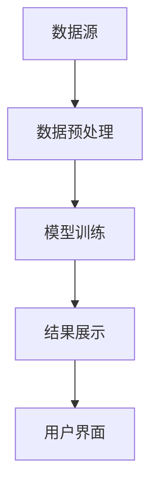
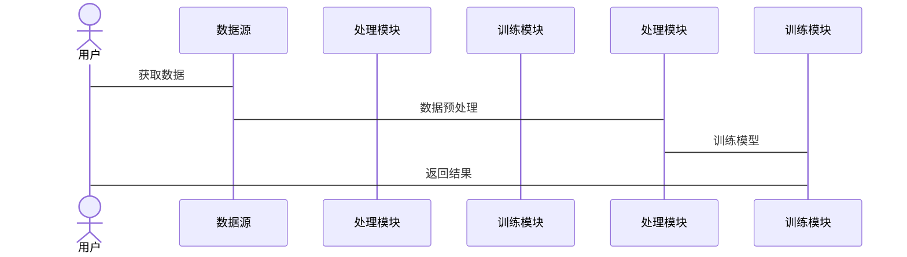

                 

# 智能系统辅助公司品牌价值评估

## 关键词：智能系统、品牌价值、数据驱动、机器学习、自然语言处理、系统架构

## 摘要：本文探讨如何利用智能系统辅助公司品牌价值评估，通过数据分析和机器学习技术，结合自然语言处理，实现品牌价值的精准评估。文章从背景、核心概念、算法原理、系统架构到项目实战，全面解析智能系统在品牌价值评估中的应用。

---

# 第一部分: 背景介绍

## 第1章: 问题背景与定义

### 1.1 问题背景
品牌价值是衡量企业市场竞争力的重要指标，传统评估方法依赖主观判断，存在数据分散、评估周期长、结果不精准等问题。引入智能系统，通过数据驱动和机器学习，可实现高效、客观的评估。

### 1.2 品牌价值评估的定义
品牌价值指品牌为企业带来的经济价值，综合考虑品牌知名度、客户忠诚度、市场表现等因素。

### 1.3 智能系统辅助的必要性
智能系统通过整合多源数据，利用机器学习和NLP技术，提升品牌价值评估的准确性和效率。

---

# 第二部分: 核心概念与原理

## 第2章: 核心概念与联系

### 2.1 数据驱动的品牌价值评估
- 数据来源：财务数据、市场数据、社交媒体数据、消费者反馈等。
- 数据特征：文本特征、数值特征、时间特征。

### 2.2 机器学习在品牌价值预测中的应用
- 算法选择：线性回归、随机森林、支持向量机。
- 模型训练：数据预处理、特征提取、模型调优。

### 2.3 自然语言处理在品牌情感分析中的作用
- 技术应用：情感分析、关键词提取、主题建模。
- 实例分析：利用NLP分析社交媒体数据，评估品牌情感倾向。

---

# 第三部分: 算法原理

## 第3章: 基于机器学习的品牌价值预测

### 3.1 算法原理概述
- 线性回归模型：适用于线性关系的数据，公式为$$y = \beta_0 + \beta_1x_1 + ... + \beta_nx_n$$。
- 随机森林模型：通过集成学习提升模型鲁棒性，适用于高维数据。

### 3.2 算法实现细节
#### 数据预处理
- 数据清洗：处理缺失值、异常值。
- 特征工程：提取关键词、计算情感得分。

#### 模型训练
- 线性回归：使用最小二乘法求解系数。
- 随机森林：通过袋装法和特征随机化构建多棵决策树。

#### 模型评估
- 评估指标：均方误差（MSE）、决定系数（R²）。
- 调参优化：网格搜索法选择最佳参数。

---

# 第四部分: 系统架构设计

## 第4章: 系统架构与功能设计

### 4.1 系统功能模块
- 数据采集模块：从多源数据获取信息。
- 数据预处理模块：清洗和特征提取。
- 模型训练模块：选择并训练机器学习模型。
- 结果展示模块：可视化评估结果。

### 4.2 系统架构图

### 4.3 系统交互图

---

# 第五部分: 项目实战

## 第5章: 项目实战与案例分析

### 5.1 环境安装
- 安装Python、机器学习库（如scikit-learn）、NLP库（如spaCy）。

### 5.2 数据收集
- 从社交媒体平台爬取品牌相关数据。

### 5.3 特征工程
- 使用NLP技术提取情感特征。

### 5.4 模型实现
- 实现线性回归和随机森林模型，比较其性能。

### 5.5 结果分析
- 分析模型预测结果，评估品牌价值。

### 5.6 模型优化
- 调整超参数，提升模型准确率。

---

# 第六部分: 最佳实践与未来展望

## 第6章: 最佳实践与注意事项

### 6.1 小结
智能系统通过数据驱动和机器学习，显著提升了品牌价值评估的效率和准确性。

### 6.2 注意事项
- 数据隐私保护：确保数据合法合规。
- 模型解释性：选择可解释性更强的模型。

### 6.3 未来趋势
- 更多结合AI技术：如深度学习在品牌分析中的应用。
- 实时评估：开发实时监控系统，动态评估品牌价值。

### 6.4 扩展阅读
建议阅读相关书籍和论文，深入学习机器学习和NLP技术。

---

# 结语

智能系统辅助品牌价值评估是数据驱动决策的重要体现。通过机器学习和NLP技术，企业能够更精准地评估品牌价值，提升市场竞争力。未来，随着技术进步，智能系统的应用将更加广泛和深入。

