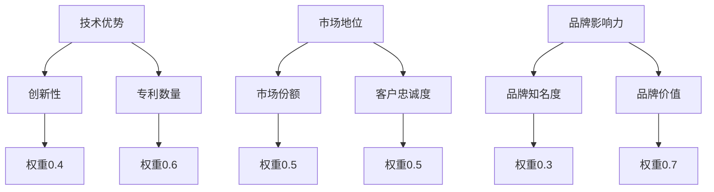
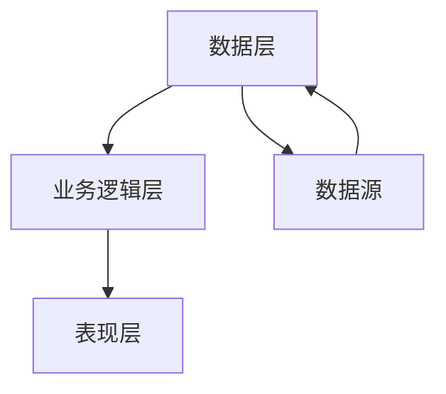
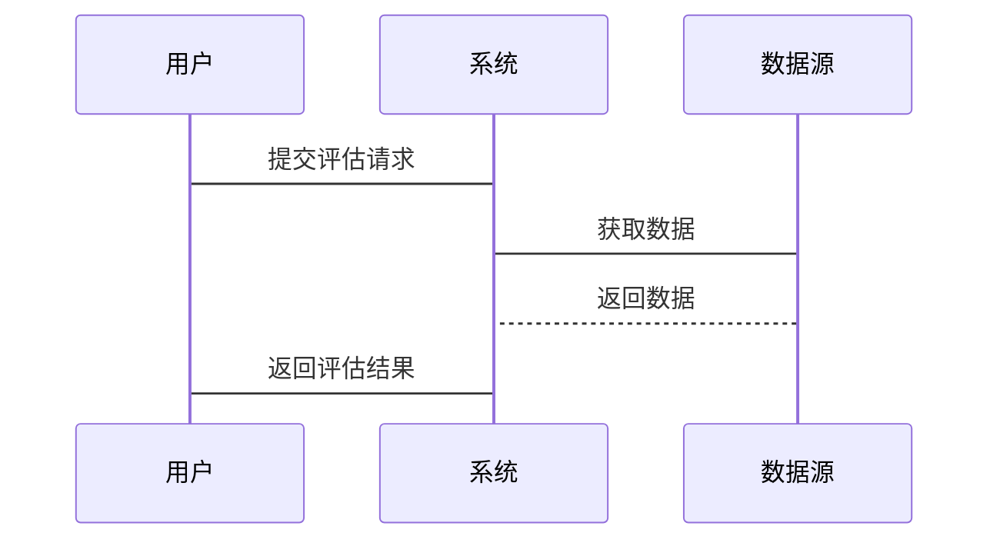

                 


# 智能系统辅助公司护城河动态评估

> 关键词：智能系统、护城河评估、动态评估、层次分析法、系统架构、项目实战

> 摘要：本文探讨了如何利用智能系统辅助公司护城河的动态评估。通过分析护城河评估的核心要素，结合层次分析法和动态评估模型，提出了一种基于智能系统的评估方法。文章详细阐述了算法原理、系统架构设计、项目实战和最佳实践，为企业的护城河评估提供了新的思路和解决方案。

---

## 第一部分: 背景介绍与核心概念

### 第1章: 公司护城河的定义与动态评估背景

#### 1.1 问题背景与描述
在企业竞争日益激烈的今天，护城河的概念变得尤为重要。护城河是指企业在市场中保持竞争优势的壁垒，可以是技术优势、品牌影响力、成本优势等。然而，传统的护城河评估方法往往静态且单一，难以适应市场环境的快速变化。随着人工智能和大数据技术的发展，动态评估的需求日益迫切。

#### 1.2 护城河动态评估的核心问题
- **传统评估的局限性**：传统方法通常基于静态数据，无法捕捉市场的动态变化。
- **智能系统的优势**：利用AI和大数据技术，可以实时收集和分析数据，提供动态的评估结果。
- **动态评估的外延**：不仅包括企业内部因素，还需要考虑外部市场环境的变化。

#### 1.3 本章小结
本章介绍了护城河评估的背景和动态评估的必要性，为后续的智能系统辅助评估奠定了基础。

---

## 第二部分: 智能系统辅助护城河评估的核心概念与联系

### 第2章: 智能系统与护城河评估的核心概念

#### 2.1 智能系统辅助评估的原理
智能系统通过收集和分析大量数据，利用算法模型对护城河要素进行评估。层次分析法（AHP）被广泛应用于这种场景，因为它可以有效地处理多维度的评估问题。

#### 2.2 护城河评估的关键要素与特征对比
护城河评估的关键要素包括技术优势、市场地位、品牌影响力等。通过对比这些要素的特征，可以更好地理解它们在评估中的权重。

| 评估要素 | 特征 | 重要性 |
|----------|------|--------|
| 技术优势 | 创新性、专利数量 | 高 |
| 市场地位 | 市场份额、客户忠诚度 | 中高 |
| 品牌影响力 | 品牌知名度、品牌价值 | 中 |

#### 2.3 智能系统辅助评估的实体关系图
使用Mermaid图可以清晰地展示护城河评估的实体关系和权重计算。



#### 2.4 本章小结
本章详细介绍了智能系统辅助评估的原理和关键要素，为后续的算法实现奠定了基础。

---

## 第三部分: 智能系统辅助护城河评估的算法原理

### 第3章: 智能系统辅助评估的核心算法

#### 3.1 层次分析法（AHP）原理
层次分析法是一种用于多维度决策的分析方法。其步骤包括构建层次结构、确定各层要素的权重、进行一致性检验等。

##### 3.1.1 层次分析法的基本概念
层次分析法将问题分解为多个层次，每个层次包含多个要素，通过比较判断矩阵确定各要素的权重。

##### 3.1.2 层次分析法的步骤与流程
1. 构建层次结构。
2. 确定比较判断矩阵。
3. 计算各要素的权重。
4. 进行一致性检验。

##### 3.1.3 层次分析法的优缺点
- **优点**：适用于多维度问题，结果直观。
- **缺点**：计算复杂，依赖于专家判断。

#### 3.2 护城河评估的动态评估模型
动态评估模型基于时间序列分析，考虑市场环境的变化，对护城河要素进行动态调整。

##### 3.2.1 动态评估模型的构建
动态评估模型通过引入时间因素，对护城河要素的权重进行动态调整。

##### 3.2.2 动态评估模型的数学表达
$$ D(t) = \alpha \cdot S(t) + \beta \cdot T(t) $$

其中，$D(t)$ 表示时间 $t$ 的动态评估值，$S(t)$ 是静态因素，$T(t)$ 是时间序列因素，$\alpha$ 和 $\beta$ 是权重系数。

##### 3.2.3 动态评估模型的实现步骤
1. 收集历史数据。
2. 计算静态和动态因素。
3. 确定权重系数。
4. 计算动态评估值。

#### 3.3 算法实现的数学模型与公式
使用层次分析法和动态评估模型，可以实现护城河的动态评估。

##### 3.3.1 层次分析法的数学模型
$$ A = \lambda \cdot W + (1-\lambda) \cdot R $$

其中，$A$ 是综合评估值，$\lambda$ 是权重系数，$W$ 是专家权重，$R$ 是随机权重。

##### 3.3.2 动态评估模型的数学公式
$$ D(t) = \alpha \cdot S(t) + \beta \cdot T(t) $$

##### 3.3.3 算法实现的代码示例
```python
def dynamic_assessment(data, lambda_val):
    weighted_sum = lambda_val * data['static_factors'] + (1 - lambda_val) * data['dynamic_factors']
    return weighted_sum
```

---

## 第四部分: 智能系统辅助护城河评估的系统架构与设计

### 第4章: 系统架构与功能设计

#### 4.1 系统应用场景与目标
智能系统辅助护城河评估系统主要用于企业内部决策，帮助企业在动态市场中保持竞争优势。

#### 4.2 系统功能设计
系统功能包括数据采集、评估计算、结果展示和报告生成。

##### 4.2.1 数据采集模块
负责收集企业的各项数据，包括技术、市场、品牌等。

##### 4.2.2 评估计算模块
利用层次分析法和动态评估模型，计算护城河的综合评估值。

##### 4.2.3 结果展示模块
以可视化的方式展示评估结果，帮助决策者理解。

##### 4.2.4 报告生成模块
生成详细的评估报告，提供改进建议。

#### 4.3 系统架构设计
使用分层架构，包括数据层、业务逻辑层和表现层。



#### 4.4 系统接口设计
系统通过API接口与企业数据源对接，确保数据的实时性和准确性。

#### 4.5 系统交互设计
使用Mermaid序列图描述系统交互流程。



---

## 第五部分: 智能系统辅助护城河评估的项目实战

### 第5章: 项目实战与案例分析

#### 5.1 项目背景与目标
某科技公司希望通过智能系统动态评估其护城河，优化市场竞争策略。

#### 5.2 系统核心实现
实现数据采集、评估计算和结果展示功能。

##### 5.2.1 数据采集与处理
使用爬虫和API接口获取企业数据，清洗和预处理。

##### 5.2.2 评估计算与分析
利用层次分析法和动态评估模型，计算综合评估值。

##### 5.2.3 可视化展示
通过图表展示评估结果，帮助用户理解。

#### 5.3 案例分析与效果评估
通过具体案例分析，验证系统的有效性和准确性。

##### 5.3.1 案例分析
分析某企业的护城河评估结果，提出改进建议。

##### 5.3.2 效果评估
评估系统的准确性和实用性，总结经验教训。

#### 5.4 项目小结
本章通过项目实战，验证了智能系统辅助护城河评估的有效性。

---

## 第六部分: 最佳实践与注意事项

### 第6章: 最佳实践与注意事项

#### 6.1 项目小结
总结项目的实施过程和取得的成果。

#### 6.2 注意事项
- 数据质量是关键，确保数据的准确性和完整性。
- 算法选择要根据实际情况，避免过于复杂。
- 系统维护要定期更新，适应市场变化。

#### 6.3 拓展阅读
推荐相关的技术书籍和论文，供读者深入学习。

---

## 第七部分: 总结

### 7.1 本文总结
智能系统辅助护城河动态评估为企业提供了新的思路和解决方案，具有重要的应用价值。

### 7.2 未来展望
随着技术的发展，护城河评估将更加智能化和动态化，为企业决策提供更有力的支持。

---

# 结束语

通过本文的详细阐述，读者可以深入了解智能系统辅助公司护城河动态评估的原理、方法和应用。希望本文能为企业的护城河评估提供新的思路和解决方案，帮助企业更好地应对市场竞争。

---

**注**：由于篇幅限制，本文仅为部分内容，实际文章将更加详细。

