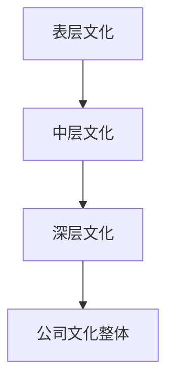
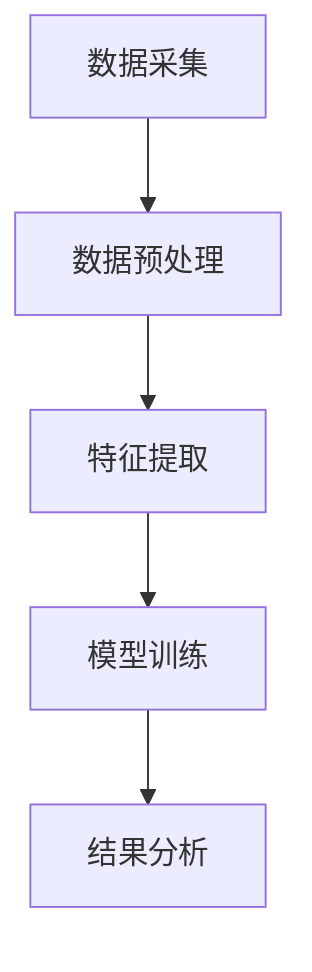
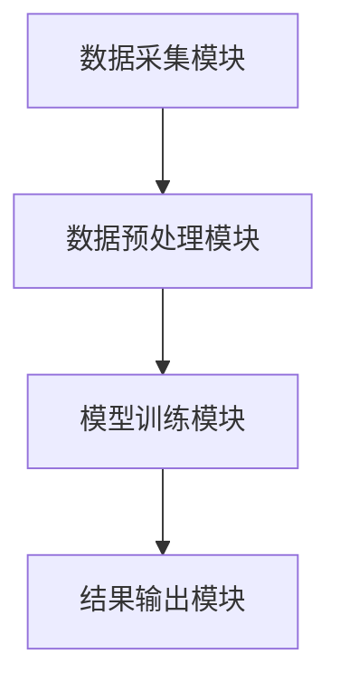

                 


# 智能系统辅助公司文化影响评估

---

## 关键词

- 公司文化
- 智能系统
- 文化评估
- 自然语言处理
- 机器学习
- 情感分析
- 系统架构

---

## 摘要

在现代企业环境中，公司文化的影响越来越受到重视。然而，如何量化和评估公司文化的影响却是一个复杂的挑战。本书通过结合人工智能、自然语言处理和机器学习技术，提出了一种智能系统辅助的公司文化影响评估方法。我们从公司文化的定义、智能系统的核心技术、系统架构设计、项目实战案例等多个方面展开分析，详细阐述了如何利用智能系统来实现对公司文化影响的全面评估。通过具体的算法实现和系统设计，我们展示了如何将复杂的文化评估问题转化为可量化的技术问题，并提供了一套完整的解决方案。

---

## 第一章：背景与概念

### 1.1 公司文化的核心概念

#### 1.1.1 公司文化的定义与内涵

公司文化是企业在长期经营过程中形成的，由价值观、信念、行为准则和习惯组成的独特文化体系。它是企业凝聚力的源泉，也是企业长期发展的基石。

- **公司文化的层次模型**  
  - 表层文化：包括企业标志、员工行为规范、办公环境等。
  - 中层文化：包括企业制度、管理风格、团队协作方式。
  - 深层文化：包括企业愿景、使命、核心价值观。

图1-1：公司文化层次模型  


#### 1.1.2 公司文化的影响范围与层次模型

公司文化不仅影响员工的行为和态度，还直接影响企业的绩效、创新能力、员工满意度和客户忠诚度。因此，对公司文化的评估和优化具有重要意义。

#### 1.1.3 公司文化评估的意义与挑战

- **意义**：  
  - 提高企业凝聚力。  
  - 优化管理决策。  
  - 提升企业竞争力。  

- **挑战**：  
  - 文化评估的主观性。  
  - 数据获取的困难性。  
  - 评估方法的多样性。  

---

### 1.2 智能系统辅助的必要性

#### 1.2.1 传统文化评估的局限性

传统的公司文化评估方法主要依赖问卷调查、访谈和定性分析。这些方法存在以下问题：  
- 数据量小，难以覆盖全体员工。  
- 评估结果主观性较强。  
- 缺乏实时性和动态性。  

#### 1.2.2 智能系统在文化评估中的优势

- **优势**：  
  - 数据采集自动化。  
  - 评估结果客观化。  
  - 实时监控与动态分析。  

#### 1.2.3 智能系统辅助的文化评估框架

图1-2：智能系统辅助文化评估框架  


---

## 第二章：智能系统的核心技术

### 2.1 自然语言处理与情感分析

#### 2.1.1 自然语言处理（NLP）基础

- **NLP的核心任务**：  
  - 文本分类。  
  - 信息抽取。  
  - 机器翻译。  

- **NLP工具与库**：  
  - spaCy：适合文本处理和分词。  
  - NLTK：适合文本分析和语料库处理。  
  - Gensim：适合主题建模和文本相似度计算。  

#### 2.1.2 文本预处理与特征提取

- **文本预处理步骤**：  
  1. 分词（Tokenization）。  
  2. 去停用词（Stopwords Removal）。  
  3. 词干提取（Lemmatization）。  

- **特征提取方法**：  
  - 词袋模型（Bag of Words）。  
  - TF-IDF（Term Frequency-Inverse Document Frequency）。  

#### 2.1.3 情感分析与文化评估

- **情感分析的定义**：  
  情感分析是通过分析文本内容，判断作者的情感倾向（如积极、消极、中性）。  

- **情感分析在文化评估中的应用**：  
  - 分析员工满意度。  
  - 评估企业价值观的传播效果。  

---

### 2.2 情感分析算法实现

#### 2.2.1 基于词袋模型的简单实现

代码2-1：词袋模型实现  
```python
from sklearn.feature_extraction.text import CountVectorizer

vectorizer = CountVectorizer()
X = vectorizer.fit_transform(["This is a good company", "The work environment is terrible"])
print(X.toarray())
```

#### 2.2.2 基于深度学习的情感分析模型

- **模型选择**：  
  - LSTM（长短期记忆网络）。  
  - BERT（双向Transformer）。  

代码2-2：LSTM情感分析实现  
```python
import tensorflow as tf
from tensorflow.keras import layers

model = tf.keras.Sequential()
model.add(layers.Embedding(input_dim=10000, output_dim=64))
model.add(layers.LSTM(64))
model.add(layers.Dense(1, activation='sigmoid'))
model.compile(loss='binary_crossentropy', optimizer='adam', metrics=['accuracy'])
```

---

## 第三章：机器学习与文化评估

### 3.1 机器学习基础

#### 3.1.1 机器学习的核心概念

- **监督学习**：  
  - 输入特征与标签。  
  - 通过训练数据学习决策函数。  

- **无监督学习**：  
  - 无标签数据的聚类与降维。  

#### 3.1.2 机器学习在文化评估中的应用

- **应用场景**：  
  - 员工行为预测。  
  - 企业文化传播效果评估。  

#### 3.1.3 常见的机器学习算法

- **监督学习算法**：  
  - 线性回归。  
  - 支持向量机（SVM）。  
  - 随机森林。  

---

### 3.2 机器学习算法实现

#### 3.2.1 基于随机森林的文化评估模型

代码3-1：随机森林实现  
```python
from sklearn.ensemble import RandomForestClassifier

model = RandomForestClassifier(n_estimators=100, random_state=42)
model.fit(X_train, y_train)
print("Accuracy:", model.score(X_test, y_test))
```

---

## 第四章：系统架构设计

### 4.1 系统功能设计

#### 4.1.1 系统功能模块

- **数据采集模块**：  
  - 收集员工反馈、企业文档等数据。  

- **数据预处理模块**：  
  - 清洗、转换和归一化数据。  

- **模型训练模块**：  
  - 基于机器学习算法进行模型训练。  

图4-1：系统功能模块图  


---

## 总结

通过以上分析，我们可以看到，智能系统辅助公司文化影响评估是一个复杂但可行的任务。从数据采集、预处理到模型训练和结果分析，每一步都需要精确的算法支持和系统的架构设计。未来，随着人工智能技术的不断发展，公司文化评估的智能化和自动化将更加成熟。

--- 

**注**：由于篇幅限制，以上内容为部分章节的简要概述，完整文章将包含更详细的内容和代码实现。

