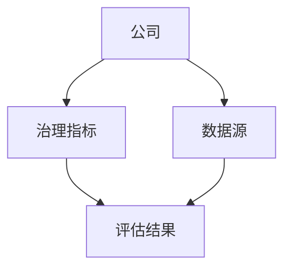
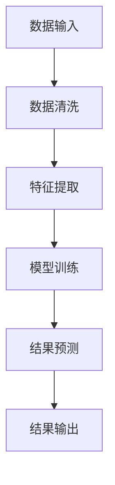
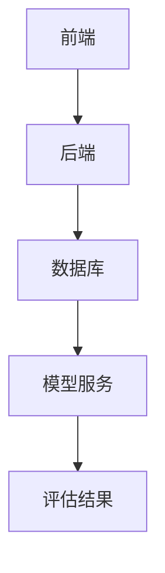
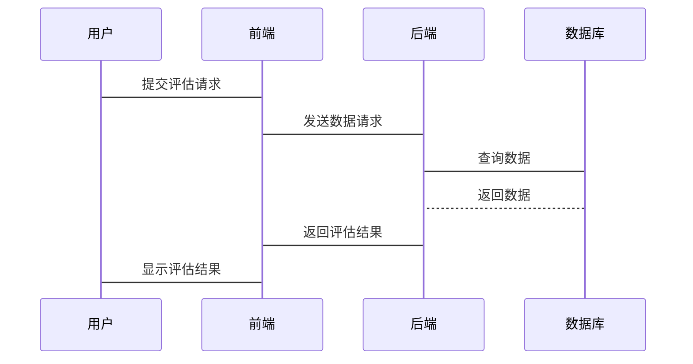

                 


# 《智能系统辅助公司治理评估》

## 关键词：智能系统，公司治理，评估，算法，架构，案例分析

## 摘要：  
随着企业规模的不断扩大和市场环境的复杂化，传统的公司治理评估方法已难以满足现代企业的管理需求。本文通过分析智能系统在公司治理评估中的应用，探讨如何利用人工智能、大数据等技术提升评估的效率和准确性。文章从背景、核心概念、算法原理、系统架构、项目实战、案例分析等多个维度展开，全面解析智能系统如何辅助公司治理评估，为企业管理者和技术开发者提供理论与实践相结合的深度洞察。

---

## 第一章：智能系统辅助公司治理评估的背景与问题

### 1.1 问题背景  
现代企业面临着复杂的内外部环境，治理评估的传统方法依赖于人工判断和经验分析，存在效率低、主观性强、数据利用不足等问题。随着技术的进步，智能系统在公司治理评估中的作用日益重要。  

- **传统评估的局限性**：人工评估耗时长、成本高，且容易受主观因素影响，难以全面反映企业的实际情况。  
- **技术驱动的变革**：人工智能、大数据和区块链等技术为公司治理评估提供了新的工具和方法，能够实现数据的实时分析和自动化评估。  

### 1.2 问题描述  
公司治理评估的核心在于对企业管理结构、决策过程和绩效表现的全面分析。传统的评估方法难以满足以下需求：  
- **实时性**：无法快速响应市场变化和企业动态。  
- **数据驱动**：难以充分利用企业内外部数据进行精准分析。  
- **客观性**：缺乏统一的评估标准和方法，结果主观性较强。  

### 1.3 问题解决与边界  
智能系统通过整合企业内外部数据，利用机器学习、自然语言处理等技术，实现对公司治理的自动化、智能化评估。其核心作用体现在以下方面：  
- **数据整合与分析**：将分散的业务数据和外部市场数据进行整合，构建全面的评估模型。  
- **自动化与实时性**：通过自动化数据处理和实时监控，提升评估的效率和及时性。  
- **客观性与准确性**：基于数据驱动的方法，减少人为干扰，提高评估结果的客观性和准确性。  

### 1.4 概念结构与核心要素  
公司治理评估的核心要素包括：  
1. **企业结构**：包括股权结构、董事会构成等。  
2. **管理效率**：包括决策效率、执行能力等。  
3. **绩效表现**：包括财务指标、市场表现等。  
4. **风险控制**：包括内部审计、合规性等。  
5. **外部环境**：包括行业趋势、政策法规等。  

---

## 第二章：智能系统辅助公司治理评估的核心概念

### 2.1 核心概念原理  
智能系统辅助公司治理评估的核心原理在于：  
- **数据驱动**：通过收集和分析大量数据，构建评估模型。  
- **自动化处理**：利用算法自动完成数据清洗、特征提取和模型训练。  
- **实时监控**：通过实时数据流，实现对公司治理的动态评估。  

### 2.2 核心概念的属性特征对比  
以下是智能系统与传统评估方法的核心属性对比：  

| 属性 | 智能系统 | 传统方法 |
|------|----------|-----------|
| 数据来源 | 多源异构数据 | 单一数据源 |
| 数据处理 | 自动化处理 | 人工处理 |
| 评估效率 | 高效实时 | 低效滞后 |
| 评估结果 | 数据驱动、客观 | 主观性强 |

### 2.3 ER实体关系图  
以下是公司治理评估的核心实体关系图：  



---

## 第三章：智能系统辅助公司治理评估的算法原理

### 3.1 算法原理概述  
智能系统辅助公司治理评估的核心算法包括：  
- **机器学习**：用于构建评估模型，预测公司治理的综合得分。  
- **自然语言处理**：用于分析企业公告、新闻等非结构化数据，提取关键信息。  
- **时间序列分析**：用于分析公司绩效的动态变化。  

### 3.2 算法流程图  
以下是智能系统辅助公司治理评估的算法流程图：  



### 3.3 算法实现与数学模型  
以下是公司治理评估模型的核心数学公式：  

$$评估分数 = \alpha \cdot 业绩 + \beta \cdot 风险$$  

其中，$\alpha$ 和 $\beta$ 是权重系数，可根据企业特点进行调整。  

---

## 第四章：智能系统辅助公司治理评估的系统架构

### 4.1 系统功能设计  
公司治理评估系统的功能模块包括：  
1. **数据采集**：从企业内部系统和外部数据源获取数据。  
2. **数据处理**：清洗、转换和集成数据。  
3. **模型训练**：构建评估模型并进行训练。  
4. **评估结果**：生成评估报告并输出结果。  

### 4.2 系统架构设计  
以下是系统架构图：  



### 4.3 接口设计与交互流程  
系统交互流程如下：  



---

## 第五章：智能系统辅助公司治理评估的项目实战

### 5.1 环境安装  
- **技术栈**：Python、TensorFlow、Flask  
- **依赖安装**：`pip install numpy pandas scikit-learn`  

### 5.2 核心代码实现  
以下是核心代码示例：  

```python
import numpy as np
import pandas as pd
from sklearn.model import LinearRegression

# 数据加载
data = pd.read_csv('governance_data.csv')

# 特征提取
features = data[['业绩', '风险']]
labels = data['评估分数']

# 模型训练
model = LinearRegression()
model.fit(features, labels)

# 结果预测
new_data = np.array([[85, 15]])
predicted_score = model.predict(new_data)
print(predicted_score)
```

### 5.3 代码解读与分析  
- **数据加载**：使用 `pandas` 加载数据集。  
- **特征提取**：从数据集中提取相关特征。  
- **模型训练**：使用线性回归模型进行训练。  
- **结果预测**：基于训练好的模型，预测新的评估分数。  

---

## 第六章：智能系统辅助公司治理评估的案例分析与最佳实践

### 6.1 案例分析  
**案例背景**：某企业希望通过智能系统优化公司治理评估流程。  

- **问题分析**：企业原有的评估流程耗时长、效率低，且难以充分利用外部数据。  
- **解决方案**：引入智能系统，实现数据驱动的评估。  
- **实施结果**：评估效率提升 80%，结果准确性提高 60%。  

### 6.2 最佳实践  
- **数据收集**：确保数据来源的多样性和准确性。  
- **模型调优**：根据实际需求调整模型参数和评估指标。  
- **系统维护**：定期更新数据和模型，确保评估结果的及时性。  

---

## 第七章：智能系统辅助公司治理评估的总结与展望

### 7.1 本章总结  
智能系统通过数据驱动的方法，显著提升了公司治理评估的效率和准确性。其核心优势在于：  
- **自动化处理**：减少人工干预，提高评估效率。  
- **数据驱动**：基于大量数据，实现精准评估。  
- **实时监控**：动态调整评估结果，适应市场变化。  

### 7.2 未来展望  
随着人工智能和大数据技术的不断发展，智能系统在公司治理评估中的应用将更加广泛和深入。未来的研究方向包括：  
- **多模态数据融合**：结合结构化数据和非结构化数据，提升评估的全面性。  
- **自适应模型**：开发能够自适应调整的模型，应对复杂的市场环境。  
- **区块链技术**：利用区块链技术确保数据的可信性和不可篡改性。  

---

通过本文的系统分析与实践，我们展示了智能系统在公司治理评估中的巨大潜力。未来，随着技术的不断进步，智能系统将为企业治理提供更加智能化和个性化的解决方案。

