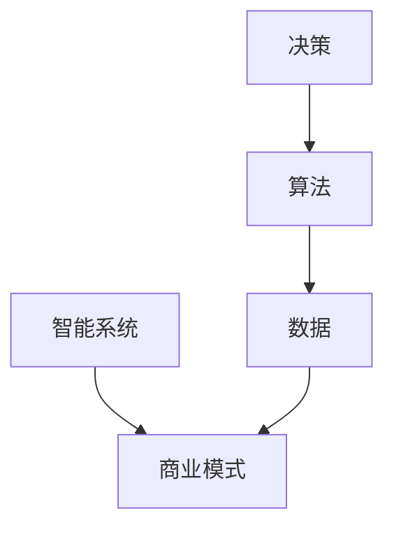
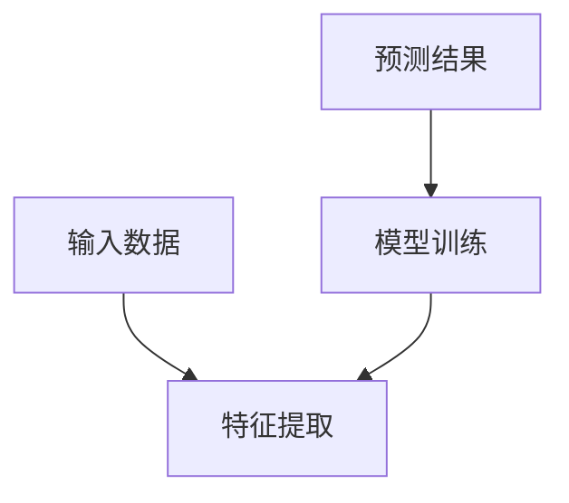
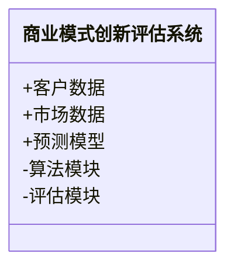
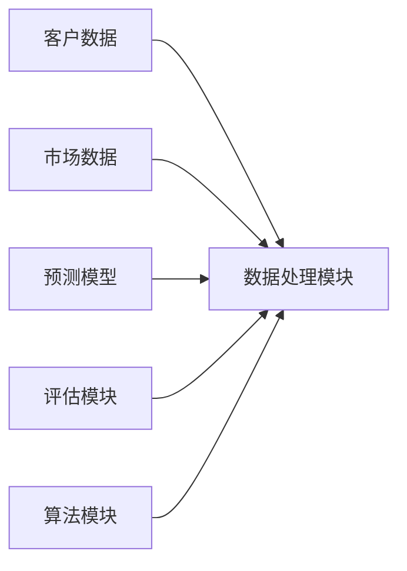
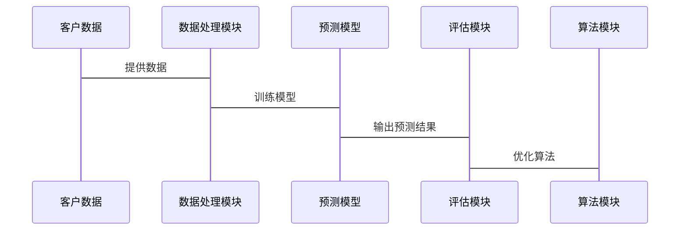

                 


# 智能系统辅助商业模式创新评估

> 关键词：智能系统、商业模式创新、评估、算法、系统架构、项目实战

> 摘要：本文探讨了智能系统如何辅助商业模式创新的评估，从背景介绍、核心概念、算法原理到系统架构和项目实战，详细分析了智能系统在商业模式创新中的应用及其对商业决策的推动作用。

---

## 第一部分: 智能系统辅助商业模式创新评估的背景与核心概念

### 第1章: 智能系统与商业模式创新概述

#### 1.1 智能系统的发展与应用
##### 1.1.1 智能系统的定义与特点
智能系统是指通过人工智能（AI）、机器学习（ML）等技术构建的能够自主学习、推理和决策的系统。其特点包括数据驱动、自动化、高效率和自我优化。

##### 1.1.2 智能系统在商业领域的应用现状
智能系统在商业领域的应用广泛，包括客户关系管理、供应链优化、市场预测和个性化推荐等。这些应用帮助企业在竞争激烈的市场中保持优势。

##### 1.1.3 商业模式创新的必要性与挑战
商业模式创新是企业适应市场变化、提升竞争力的关键。然而，传统模式面临效率低下、数据孤岛等问题，智能系统的引入为企业提供了新的解决方案。

#### 1.2 商业模式创新的核心要素
##### 1.2.1 商业模式的基本构成
商业模式包括价值主张、客户关系、分销渠道、客户获取、收入来源等核心要素。这些要素共同决定了企业的盈利能力和市场定位。

##### 1.2.2 智能系统对商业模式创新的推动作用
智能系统通过数据分析和预测，帮助企业优化价值主张、客户关系和收入来源，推动商业模式的创新。

##### 1.2.3 商业模式创新的边界与外延
商业模式创新并非无边界，需考虑法律、伦理和技术限制。外延则包括技术应用、市场拓展和组织变革等多个方面。

### 第2章: 智能系统辅助商业模式创新的理论基础

#### 2.1 智能系统辅助商业模式创新的原理
##### 2.1.1 数据驱动的商业模式优化
数据是智能系统优化商业模式的核心。通过对客户行为和市场趋势的数据分析，企业可以实时调整策略。

##### 2.1.2 人工智能在商业决策中的应用
人工智能技术如机器学习、自然语言处理等在商业决策中的应用，帮助企业在复杂市场中做出高效决策。

##### 2.1.3 智能系统辅助商业模式创新的机制
智能系统通过数据收集、分析和预测，提供实时反馈和建议，优化商业模式的各个环节。

#### 2.2 核心概念与联系
##### 2.2.1 智能系统与商业模式创新的核心要素对比
| 要素 | 智能系统 | 商业模式创新 |
|------|----------|--------------|
| 数据 | 数据采集与分析 | 数据驱动的创新 |
| 算法 | 算法优化 | 模型驱动的决策 |

##### 2.2.2 ER实体关系图架构（Mermaid流程图）


---

## 第二部分: 智能系统辅助商业模式创新的算法原理

### 第3章: 智能系统辅助商业模式创新的算法原理

#### 3.1 算法原理概述
##### 3.1.1 机器学习在商业模式创新评估中的应用
机器学习算法如线性回归、支持向量机（SVM）和随机森林等被广泛应用于市场预测和客户行为分析。

##### 3.1.2 算法流程图（Mermaid流程图）


##### 3.1.3 代码实现与数学模型
```python
def model(input_data):
    theta = 0.5
    b = 0.3
    return theta * input_data + b
```

##### 3.1.4 数学模型与公式
$$y = \theta x + b$$

#### 3.2 机器学习算法的实现与应用
##### 3.2.1 算法实现
通过Python代码实现线性回归模型，用于预测客户购买行为。

##### 3.2.2 代码示例
```python
import numpy as np
from sklearn.linear_model import LinearRegression

X = np.array([[1], [2], [3], [4]])
y = np.array([2, 4, 6, 8])

model = LinearRegression()
model.fit(X, y)
print(model.predict([[5]]))
```

##### 3.2.3 评估模型的准确性和可靠性
通过均方误差（MSE）和决定系数（R²）评估模型性能。

---

## 第三部分: 智能系统辅助商业模式创新的系统分析与架构设计

### 第4章: 智能系统辅助商业模式创新的系统分析与架构设计

#### 4.1 系统分析
##### 4.1.1 问题场景介绍
在电子商务领域，企业希望通过智能系统优化客户体验和收入来源。

##### 4.1.2 领域模型设计（Mermaid类图）


#### 4.2 系统架构设计
##### 4.2.1 系统架构图（Mermaid架构图）


##### 4.2.2 系统接口设计
系统接口包括数据输入接口、模型训练接口和结果输出接口。

#### 4.3 系统交互设计
##### 4.3.1 系统交互流程（Mermaid序列图）


---

## 第四部分: 智能系统辅助商业模式创新的项目实战

### 第5章: 项目实战

#### 5.1 项目背景与目标
以某电商平台为例，目标是通过智能系统优化客户推荐系统，提升客户购买率。

#### 5.2 核心代码实现
##### 5.2.1 环境安装
安装必要的Python库，如`scikit-learn`和`numpy`。

##### 5.2.2 代码实现
```python
from sklearn.datasets import make_regression
from sklearn.model_selection import train_test_split
from sklearn.linear_model import LinearRegression
from sklearn.metrics import mean_squared_error

# 创建数据集
X, y = make_regression(n_samples=100, n_features=1, random_state=42)
X_train, X_test, y_train, y_test = train_test_split(X, y, test_size=0.2, random_state=42)

# 训练模型
model = LinearRegression()
model.fit(X_train, y_train)

# 预测结果
y_pred = model.predict(X_test)

# 评估模型
mse = mean_squared_error(y_test, y_pred)
print(f"均方误差: {mse}")
print(f"决定系数: {model.score(X_test, y_test)}")
```

#### 5.3 项目案例分析与解读
分析电商平台的客户数据，通过模型预测客户购买行为，优化推荐策略。

#### 5.4 项目小结
通过智能系统实现客户推荐系统的优化，显著提升了客户的购买率和满意度。

---

## 第五部分: 最佳实践与总结

### 第6章: 最佳实践与总结

#### 6.1 最佳实践
##### 6.1.1 数据质量管理
确保数据的准确性和完整性，避免偏差影响模型性能。

##### 6.1.2 模型可解释性
选择可解释的模型，便于企业理解和优化策略。

#### 6.2 小结
智能系统辅助商业模式创新评估为企业提供了高效、精准的解决方案，帮助企业快速适应市场变化。

#### 6.3 注意事项
##### 6.3.1 数据隐私与安全
确保数据处理符合相关法律法规，保护客户隐私。

##### 6.3.2 技术与业务的结合
智能系统应与企业实际业务场景相结合，避免技术与业务脱节。

#### 6.4 拓展阅读
推荐阅读《智能系统与商业模式创新》和《机器学习在商业中的应用》等书籍。

---

通过以上章节的详细分析，本文全面探讨了智能系统如何辅助商业模式创新评估，从理论到实践，为读者提供了丰富的知识和实用的指导。

