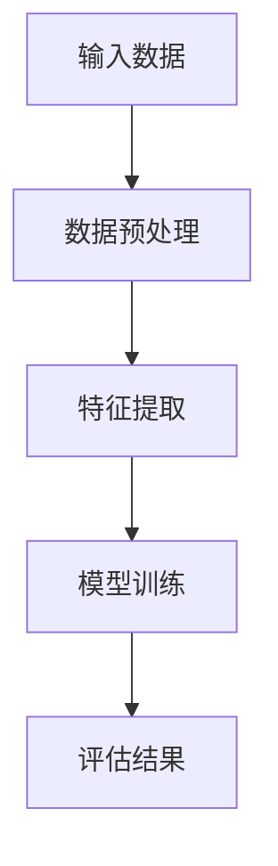
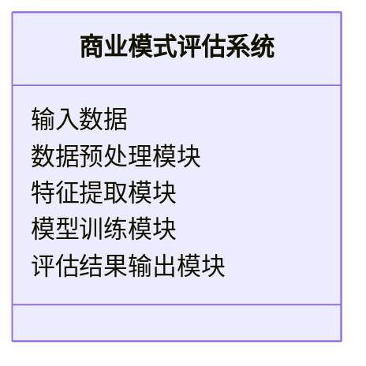

                 


# 智能系统辅助商业模式评估

## 关键词
智能系统, 商业模式评估, 人工智能, 数据分析, 算法原理, 系统架构, 项目实战

## 摘要
智能系统辅助商业模式评估是一种结合人工智能、大数据分析和系统架构的创新方法，旨在通过智能算法优化商业模式的设计与实施。本文将从背景介绍、核心概念、算法原理、系统架构、项目实战等多个维度，详细阐述智能系统如何辅助商业模式评估的过程，并通过实际案例展示其应用价值。

---

## 第1章: 背景介绍

### 1.1 问题背景
#### 1.1.1 商业模式评估的重要性
商业模式是企业成功的关键，其评估需要考虑市场、客户、资源等多个因素。传统评估方法依赖人工分析，效率低且主观性强。

#### 1.1.2 智能系统在商业模式评估中的作用
智能系统能够通过数据分析和机器学习算法，快速提取关键信息，提供客观的评估结果。

#### 1.1.3 当前商业模式评估的挑战与痛点
- 数据量大，人工分析效率低
- 评估结果缺乏客观性和准确性
- 需要实时更新和动态调整

### 1.2 问题描述
#### 1.2.1 商业模式的构成要素
商业模式由价值主张、客户关系、渠道通路、收入来源、资源与能力、关键活动、关键资源、关键伙伴等要素构成。

#### 1.2.2 智能系统辅助评估的目标
通过智能系统实现商业模式的自动化评估，提高评估效率和准确性。

#### 1.2.3 问题解决的边界与外延
- 边界：专注于商业模式的评估，不涉及企业战略规划。
- 外延：可扩展至市场分析、竞争对手分析等领域。

### 1.3 核心概念与联系
#### 1.3.1 商业模式评估的核心要素
- 价值主张：企业的核心价值是什么。
- 客户关系：如何与客户建立关系。
- 渠道通路：如何将产品或服务交付给客户。
- 收入来源：如何获得收入。

#### 1.3.2 智能系统辅助评估的原理
通过数据驱动的方法，利用机器学习算法对商业模式的关键要素进行分析和预测。

#### 1.3.3 概念结构与核心要素组成
商业模式评估的核心要素包括价值主张、客户关系、渠道通路和收入来源。

---

## 第2章: 核心概念与联系

### 2.1 商业模式评估的核心概念
#### 2.1.1 商业模式的定义与分类
商业模式是企业实现价值创造和价值传递的方式，常见的分类包括产品型、服务型和平台型。

#### 2.1.2 智能系统的定义与特点
智能系统是一种能够感知、分析和决策的系统，具有数据驱动、自动化和实时响应的特点。

#### 2.1.3 商业模式评估与智能系统的关联
智能系统通过数据处理和算法分析，为商业模式评估提供技术支持。

### 2.2 商业模式评估的核心要素
#### 2.2.1 价值主张
企业通过提供独特的价值主张吸引客户。

#### 2.2.2 客户关系
客户关系是商业模式成功的关键，智能系统可以通过客户数据分析优化客户关系管理。

#### 2.2.3 渠道通路
渠道通路的选择直接影响商业模式的实现效果。

#### 2.2.4 收入来源
收入来源的多样性直接影响企业的盈利能力。

### 2.3 智能系统辅助商业模式评估的原理
#### 2.3.1 数据驱动的评估方法
通过收集和分析大量数据，智能系统能够快速识别商业模式的关键问题。

#### 2.3.2 人工智能算法的应用
利用机器学习算法对商业模式的关键要素进行预测和优化。

#### 2.3.3 智能系统与商业模式的交互机制
智能系统通过数据输入、分析和输出，与商业模式的各个要素进行交互。

### 2.4 概念属性特征对比表格
以下表格对比了商业模式评估的核心要素和智能系统辅助评估的特点：

| **核心要素**       | **智能系统辅助评估的特点**                         |
|--------------------|--------------------------------------------------|
| 价值主张           | 数据驱动的分析与预测                             |
| 客户关系           | 基于客户行为数据的优化管理                         |
| 渠道通路           | 数据驱动的渠道选择与优化                         |
| 收入来源           | 基于市场趋势的收入预测与优化                     |

### 2.5 ER实体关系图
以下是一个简单的ER实体关系图：

```mermaid
erd
    左侧: 商业模式
    右侧: 智能系统
    左侧.属性: 价值主张、客户关系、渠道通路、收入来源
    右侧.属性: 数据输入、算法分析、评估结果
    左侧 --> 右侧: 数据交互
```

---

## 第3章: 算法原理讲解

### 3.1 算法概述
智能系统辅助商业模式评估的核心算法包括机器学习算法和数据分析算法。

### 3.2 算法流程
以下是一个算法流程图：



### 3.3 算法实现
以下是一个Python代码示例：

```python
import pandas as pd
from sklearn.model_selection import train_test_split
from sklearn.ensemble import RandomForestClassifier

# 数据预处理
data = pd.read_csv('business_model.csv')
X = data.drop('label', axis=1)
y = data['label']

# 数据分割
X_train, X_test, y_train, y_test = train_test_split(X, y, test_size=0.2)

# 模型训练
model = RandomForestClassifier()
model.fit(X_train, y_train)

# 评估结果
accuracy = model.score(X_test, y_test)
print(f'Accuracy: {accuracy}')
```

---

## 第4章: 数学模型和公式

### 4.1 模型构建
以下是一个简单的评估模型公式：

$$ \text{评估结果} = \sum_{i=1}^{n} w_i x_i $$

其中，$w_i$ 是权重，$x_i$ 是输入特征。

### 4.2 公式推导
假设我们有$m$个商业模式，每个模式有$n$个特征，评估结果可以通过以下公式计算：

$$ \text{评估结果} = \sum_{i=1}^{m} \sum_{j=1}^{n} w_{ij} x_{ij} $$

---

## 第5章: 系统分析与架构设计

### 5.1 问题场景介绍
智能系统辅助商业模式评估的系统需要处理大量数据，并提供实时的评估结果。

### 5.2 系统功能设计
以下是一个领域模型类图：



### 5.3 系统架构设计
以下是一个系统架构图：


---

## 第6章: 项目实战

### 6.1 环境安装
需要安装Python、机器学习库（如scikit-learn）和数据分析库（如pandas）。

### 6.2 系统核心实现
以下是一个核心代码实现示例：

```python
import pandas as pd
from sklearn.ensemble import RandomForestClassifier

# 数据加载
data = pd.read_csv('business_model.csv')

# 特征选择
features = ['feature1', 'feature2', 'feature3']
X = data[features]
y = data['label']

# 模型训练
model = RandomForestClassifier()
model.fit(X, y)

# 预测结果
predictions = model.predict(X)
print('预测结果:', predictions)
```

### 6.3 案例分析
通过实际案例分析，展示智能系统如何辅助商业模式评估。

---

## 第7章: 总结与展望

### 7.1 总结
智能系统辅助商业模式评估是一种高效、准确的方法，能够帮助企业优化商业模式。

### 7.2 展望
未来，随着人工智能技术的不断发展，智能系统在商业模式评估中的应用将更加广泛和深入。

---

## 最佳实践 tips

- 在使用智能系统辅助商业模式评估时，需注意数据的准确性和完整性。
- 定期更新模型，以适应市场变化。
- 结合实际情况选择合适的算法和模型。

---

## 小结
智能系统辅助商业模式评估是一种创新的方法，通过数据分析和机器学习算法，能够帮助企业优化商业模式的设计与实施。

