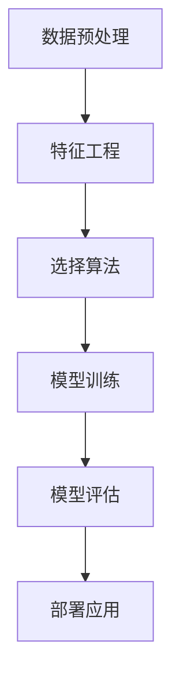
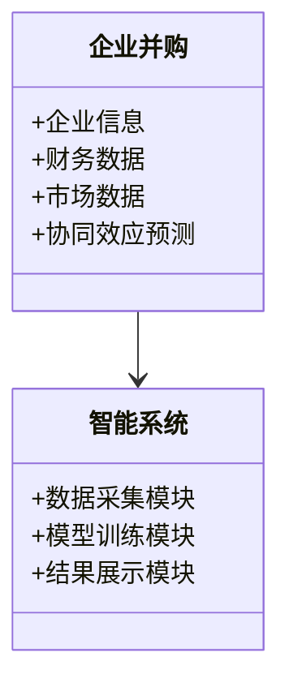
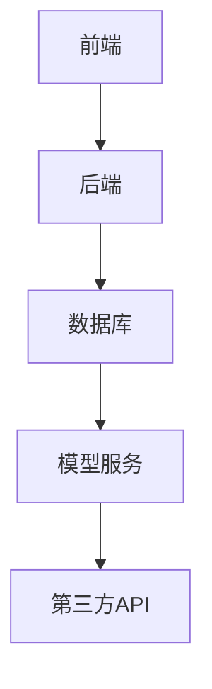
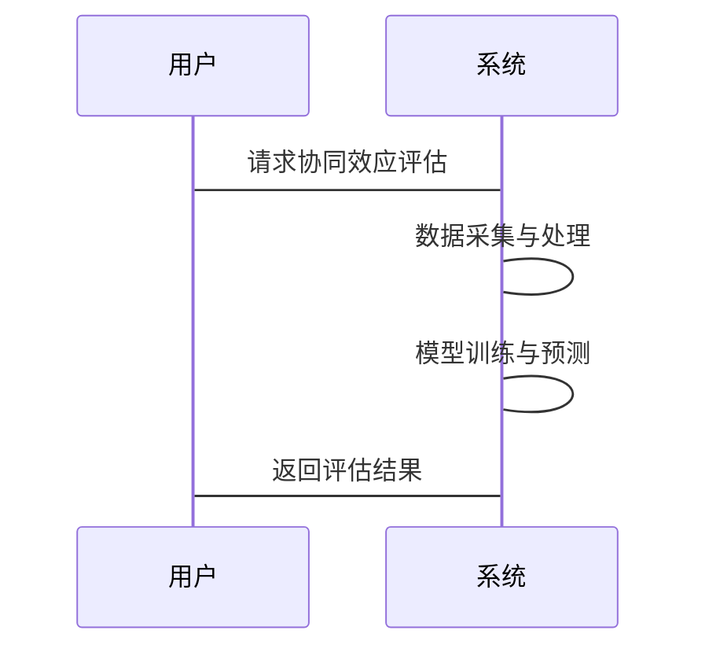

                 


# 智能系统辅助并购协同效应评估

## 关键词
智能系统，并购，协同效应，机器学习，数据分析，系统架构

## 摘要
智能系统辅助并购协同效应评估是通过机器学习和大数据技术，优化企业并购过程中的协同效应分析。传统评估方法存在效率低、准确性差的问题，而智能系统通过数据驱动的方法，实现协同效应的精准预测和优化。本文从背景、核心概念、算法原理、系统架构到项目实战，详细探讨智能系统在并购中的应用，为读者提供理论和实践的双重指导。

---

# 第一章: 智能系统辅助并购协同效应评估概述

## 1.1 并购协同效应的基本概念
### 1.1.1 并购的定义与类型
- 并购（Mergers and Acquisitions，M&A）是指一家企业合并或收购另一家企业，以实现资源优化配置和业务扩展。
- 并购类型包括：
  - 横向并购：同一行业内的并购。
  - 纵向并购：上下游产业的并购。
  - 混合并购：无直接关联的行业并购。

### 1.1.2 协同效应的定义与分类
- 协同效应是指并购后企业实现的效益提升，包括成本协同、收入协同和价值协同。
- 协同效应分类：
  - 财务协同：降低财务成本，提升资产效率。
  - 战略协同：优化业务布局，增强市场竞争力。
  - 运营协同：提高生产效率，降低成本。

### 1.1.3 智能系统在并购中的作用
- 数据驱动的协同效应预测。
- 机器学习辅助的决策优化。
- 自动化评估与实时监控。

## 1.2 智能系统辅助并购的背景与意义
### 1.2.1 并购中的传统评估方法及其局限性
- 传统评估方法依赖经验判断，存在主观性强、效率低的问题。
- 数据分析方法有限，难以覆盖多维度协同效应。

### 1.2.2 智能系统辅助并购的优势与必要性
- 提高评估效率：利用大数据快速处理信息。
- 提升准确性：通过机器学习模型优化预测结果。
- 实现动态评估：实时监控协同效应的变化。

### 1.2.3 当前行业趋势与技术发展
- 数据科学与人工智能技术的快速发展为智能系统提供了技术支持。
- 企业对高效、精准的并购评估需求日益增长。

## 1.3 智能系统辅助并购的实现路径
### 1.3.1 数据采集与处理
- 数据来源：企业财务数据、市场数据、行业报告。
- 数据清洗：去除噪声数据，确保数据质量。

### 1.3.2 智能模型构建
- 选择合适的机器学习算法，如随机森林、XGBoost。
- 模型训练：基于历史数据进行模型训练。

### 1.3.3 协同效应评估与优化
- 模型预测：利用智能系统预测协同效应。
- 优化建议：根据预测结果提出优化方案。

## 1.4 本章小结
本章介绍了并购协同效应的基本概念，分析了智能系统在并购中的作用，并提出了实现路径，为后续章节的展开奠定了基础。

---

# 第二章: 并购协同效应的核心概念与联系

## 2.1 协同效应的类型与影响因素
### 2.1.1 财务协同效应
- 成本协同：降低生产、销售和管理成本。
- 资产协同：优化资产配置，提升资产利用率。

### 2.1.2 战略协同效应
- 市场协同：扩大市场份额，提升品牌影响力。
- 技术协同：整合技术资源，提升研发效率。

### 2.1.3 运营协同效应
- 供应链协同：优化供应链管理，降低采购成本。
- 生产协同：提高生产效率，降低单位成本。

## 2.2 智能系统中的关键概念
### 2.2.1 数据驱动的协同效应评估
- 数据分析方法：利用大数据技术进行协同效应预测。
- 数据可视化：通过图表直观展示协同效应的变化。

### 2.2.2 机器学习模型的作用
- 监督学习：基于历史数据进行协同效应预测。
- 非监督学习：发现数据中的潜在模式。

### 2.2.3 知识图谱与语义分析
- 知识图谱构建：将企业信息转化为知识图谱。
- 语义分析：通过自然语言处理技术分析企业文本信息。

## 2.3 核心概念之间的关系
### 2.3.1 协同效应与数据质量的关系
- 数据质量越高，协同效应预测越准确。
- 数据清洗和特征工程是提高预测精度的关键。

### 2.3.2 模型复杂度与评估精度的关系
- 模型复杂度过高可能导致过拟合，降低预测精度。
- 需要权衡模型复杂度与预测精度。

### 2.3.3 业务场景与技术实现的匹配
- 技术实现需要结合业务场景，选择合适的算法和模型。
- 业务需求的深度理解是技术实现的基础。

## 2.4 本章小结
本章详细分析了协同效应的类型与影响因素，并探讨了智能系统中的关键概念及其关系，为后续章节的算法实现提供了理论基础。

---

# 第三章: 并购协同效应评估的算法原理

## 3.1 协同效应评估的数学模型
### 3.1.1 基于线性回归的协同效应预测
- 线性回归模型：$y = \beta_0 + \beta_1x + \epsilon$
- 案例分析：预测企业并购后的协同效应。

### 3.1.2 基于随机森林的协同效应评估
- 随机森林算法：通过多棵决策树的集成预测协同效应。
- 优势：抗噪声能力强，适合高维数据。

### 3.1.3 基于深度学习的协同效应预测
- 神经网络模型：利用深度学习算法预测协同效应。
- 案例分析：使用LSTM模型预测时间序列数据。

## 3.2 机器学习算法的选择与优化
### 3.2.1 算法选择的原则
- 数据类型：分类、回归、聚类。
- 数据规模：样本数量与算法复杂度。

### 3.2.2 超参数优化方法
- 网格搜索：系统地搜索最优参数组合。
- 随机搜索：随机选择参数组合进行优化。

### 3.2.3 模型评估与验证
- 交叉验证：评估模型的泛化能力。
- 指标选择：准确率、召回率、F1分数。

## 3.3 算法实现的流程图


## 3.4 本章小结
本章详细讲解了协同效应评估的数学模型，分析了机器学习算法的选择与优化方法，并通过流程图展示了算法实现的步骤。

---

# 第四章: 系统分析与架构设计方案

## 4.1 问题场景介绍
- 企业并购中的协同效应评估问题。
- 数据分散、信息不全、评估效率低。

## 4.2 系统功能设计
### 4.2.1 领域模型


### 4.2.2 系统架构设计


### 4.2.3 接口设计
- API接口：数据接口、模型接口、结果接口。
- 接口文档：定义接口的输入输出格式。

### 4.2.4 交互流程


## 4.3 本章小结
本章通过系统分析与架构设计，明确了智能系统的实现路径，为后续章节的项目实战奠定了基础。

---

# 第五章: 项目实战

## 5.1 环境安装
- 安装Python、Jupyter Notebook、Scikit-learn、XGBoost等工具。
- 配置开发环境：虚拟环境、版本控制工具。

## 5.2 核心代码实现
### 5.2.1 数据预处理
```python
import pandas as pd
import numpy as np

# 读取数据
data = pd.read_csv('并购数据.csv')
# 删除缺失值
data.dropna(inplace=True)
```

### 5.2.2 模型训练
```python
from sklearn.ensemble import RandomForestRegressor
from sklearn.metrics import mean_squared_error

# 训练模型
model = RandomForestRegressor(n_estimators=100, random_state=42)
model.fit(X_train, y_train)

# 模型评估
y_pred = model.predict(X_test)
print(mean_squared_error(y_test, y_pred))
```

### 5.2.3 结果展示
```python
import matplotlib.pyplot as plt

plt.scatter(y_test, y_pred)
plt.xlabel('真实值')
plt.ylabel('预测值')
plt.show()
```

## 5.3 案例分析
### 5.3.1 数据来源
- 某企业并购案例：目标企业财务数据、市场数据、行业报告。

### 5.3.2 数据分析
- 利用智能系统预测并购后的协同效应。
- 提出优化建议：整合供应链、优化组织结构。

## 5.4 项目总结
- 成功实现了智能系统辅助并购协同效应评估。
- 系统具有高效、准确、易用的特点。

## 5.5 本章小结
本章通过项目实战，展示了智能系统在并购中的实际应用，验证了系统的有效性和实用性。

---

# 第六章: 总结与展望

## 6.1 总结
智能系统辅助并购协同效应评估通过机器学习和大数据技术，显著提升了评估的效率和准确性。系统设计合理，实现路径清晰，具有重要的理论和实践意义。

## 6.2 展望
- 技术方面：探索更高效的算法，如强化学习。
- 应用方面：拓展至更多行业，如金融科技、医疗健康。
- 挑战与机遇：数据隐私、模型解释性、技术融合。

## 6.3 小结
本文从背景、核心概念、算法原理、系统架构到项目实战，全面探讨了智能系统辅助并购协同效应评估的应用，为未来的研究提供了方向。

---

# 结语

智能系统辅助并购协同效应评估是数据科学与人工智能技术的重要应用之一。通过本文的系统介绍，读者可以深入了解智能系统在并购中的作用，并掌握其实现方法。未来，随着技术的不断发展，智能系统将在并购领域发挥更大的作用，为企业创造更大的价值。

