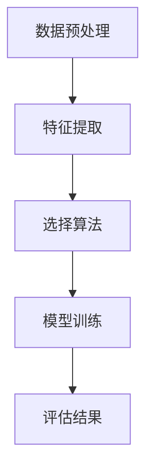
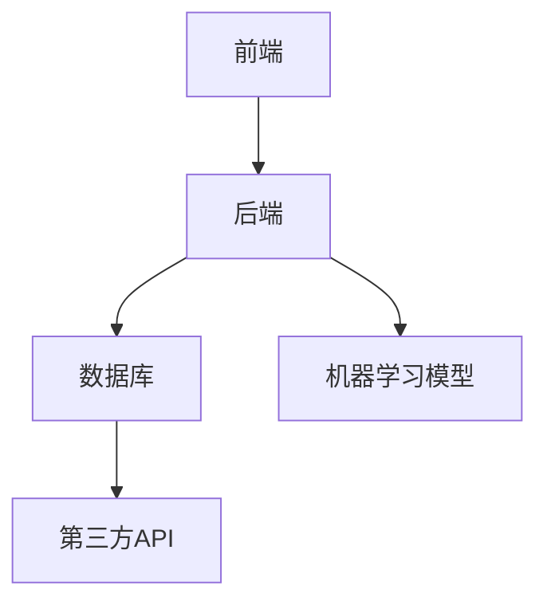

                 


# 智能系统辅助无形资产价值评估

## 关键词：智能系统，无形资产，价值评估，机器学习，数据驱动

## 摘要：  
随着企业对无形资产的重视程度不断提高，传统的价值评估方法逐渐暴露出其局限性。本文探讨了如何利用智能系统辅助无形资产价值评估，重点分析了数据驱动的方法、机器学习算法和系统架构设计。通过实际案例分析，展示了智能系统在提升评估准确性和效率方面的潜力，并提出了未来的发展方向。

---

# 第一部分：无形资产价值评估的背景与基础

## 第1章：无形资产与价值评估概述

### 1.1 无形资产的定义与分类

#### 1.1.1 无形资产的基本概念
无形资产是指企业拥有或控制的、没有实物形态的长期资产。主要包括专利权、商标权、版权、商誉、客户关系等。这些资产为企业创造价值，但其评估具有复杂性和主观性。

#### 1.1.2 无形资产的主要分类
1. **知识产权类**：如专利、商标、版权。
2. **商誉类**：如企业声誉、客户忠诚度。
3. **技术类**：如专有技术、工艺流程。
4. **人力资源类**：如员工技能、团队协作能力。

#### 1.1.3 无形资产在企业中的重要性
无形资产是企业核心竞争力的体现，直接影响企业的市场价值和长期盈利能力。在企业并购、融资等活动中，无形资产的评估尤为重要。

---

### 1.2 无形资产价值评估的挑战

#### 1.2.1 无形资产的特性与评估难点
1. **不确定性**：无形资产的价值受市场环境、技术发展等多种因素影响，难以准确量化。
2. **异质性**：不同无形资产的性质差异大，评估标准不一。
3. **动态性**：无形资产的价值随时间变化，需要动态评估。

#### 1.2.2 传统评估方法的局限性
1. **主观性强**：传统方法依赖专家判断，缺乏客观性。
2. **效率低**：评估过程复杂，耗时较长。
3. **数据不足**：传统方法依赖历史数据，难以应对新兴资产类型。

#### 1.2.3 智能系统在评估中的潜力
智能系统通过大数据分析和机器学习，能够提取隐藏在数据中的价值，提高评估的准确性和效率。

---

### 1.3 智能系统辅助评估的必要性

#### 1.3.1 数据驱动的评估优势
数据驱动的方法利用海量数据进行分析，能够捕捉到传统方法难以发现的关联性。

#### 1.3.2 人工智能在评估中的应用前景
人工智能技术（如机器学习、自然语言处理）能够自动处理和分析复杂数据，提供更精准的评估结果。

#### 1.3.3 智能系统评估的核心价值
1. **提高效率**：自动化处理数据，缩短评估时间。
2. **增强准确性**：通过模型预测，减少人为误差。
3. **动态调整**：实时更新评估结果，适应市场变化。

---

## 第2章：无形资产价值评估的核心概念与联系

### 2.1 核心概念原理

#### 2.1.1 数据驱动的评估模型
数据驱动模型通过收集和分析相关数据，构建评估指标体系，量化无形资产的价值。

#### 2.1.2 机器学习在评估中的应用
机器学习算法（如回归分析、随机森林）用于预测无形资产的价值，优化评估结果。

#### 2.1.3 智能系统的评估框架
智能系统框架包括数据采集、特征提取、模型训练、结果输出等步骤，形成完整的评估流程。

---

### 2.2 概念属性特征对比表

| 比较维度        | 传统评估方法                     | 智能系统评估方法                     |
|-----------------|----------------------------------|--------------------------------------|
| 数据来源        | 主要依赖历史数据                 | 利用大数据和实时数据                 |
| 评估主体        | 专家为主                         | 系统为主，辅助专家                   |
| 评估效率        | 较低                             | 高                                  |
| 评估准确性        | 受主观因素影响较大               | 更客观，依赖数据和模型               |
| 适应性          | 较差                             | 较强，可动态调整                     |

---

### 2.3 ER实体关系图

```mermaid
erDiagram
    actor 评估主体 {
        role 评估师
        role 企业财务人员
    }
    class 无形资产 {
        string 名称
        string 类型
        float 价值
    }
    class 数据源 {
        string 数据类型
        date 时间范围
    }
    class 智能系统 {
        algorithm 算法模型
        data 数据集
    }
    评估主体 --> 数据源 : 提供
    数据源 --> 智能系统 : 输入
    智能系统 --> 无形资产 : 输出评估结果
```

---

## 第3章：智能系统辅助评估的算法原理

### 3.1 数据预处理与特征提取

#### 3.1.1 数据清洗
- 删除重复数据
- 处理缺失值
- 标准化数据

#### 3.1.2 特征选择
- 使用相关性分析选择关键特征
- 应用主成分分析（PCA）降维

---

### 3.2 机器学习算法实现

#### 3.2.1 回归分析
- **线性回归**：用于预测连续型无形资产价值。
  $$ y = \beta_0 + \beta_1x_1 + \beta_2x_2 + ... + \beta_nx_n $$
- **逻辑回归**：用于分类问题，如资产类别预测。

#### 3.2.2 支持向量机（SVM）
- 适用于分类和回归问题，能够处理高维数据。

#### 3.2.3 随机森林
- 通过集成学习提高模型准确性和鲁棒性。

---

### 3.3 算法实现步骤



---

### 3.4 Python代码实现

```python
import pandas as pd
from sklearn.model_selection import train_test_split
from sklearn.ensemble import RandomForestRegressor
from sklearn.metrics import mean_squared_error

# 数据加载
data = pd.read_csv('intangible_assets.csv')

# 特征选择
features = data.drop('value', axis=1)
target = data['value']

# 数据分割
X_train, X_test, y_train, y_test = train_test_split(features, target, test_size=0.2)

# 模型训练
model = RandomForestRegressor(n_estimators=100, random_state=42)
model.fit(X_train, y_train)

# 模型预测
y_pred = model.predict(X_test)

# 评估结果
mse = mean_squared_error(y_test, y_pred)
print(f"均方误差: {mse}")
```

---

## 第4章：系统分析与架构设计

### 4.1 系统分析

#### 4.1.1 项目背景
- 企业需要准确评估无形资产价值，支持决策。

#### 4.1.2 项目目标
- 开发智能系统，辅助评估无形资产价值。

---

### 4.2 系统架构设计



---

### 4.3 接口设计

- **输入接口**：接收资产数据和评估请求。
- **输出接口**：返回评估结果和建议。

---

## 第5章：项目实战

### 5.1 环境安装

```bash
pip install pandas scikit-learn matplotlib
```

---

### 5.2 代码实现

```python
import pandas as pd
from sklearn.ensemble import RandomForestRegressor
from sklearn.metrics import mean_squared_error

# 加载数据
data = pd.read_csv('intangible_assets.csv')

# 特征选择
X = data.drop('value', axis=1)
y = data['value']

# 数据分割
X_train, X_test, y_train, y_test = train_test_split(X, y, test_size=0.2)

# 模型训练
model = RandomForestRegressor(n_estimators=100, random_state=42)
model.fit(X_train, y_train)

# 预测
y_pred = model.predict(X_test)

# 评估
mse = mean_squared_error(y_test, y_pred)
print(f"均方误差: {mse}")
```

---

### 5.3 案例分析

- **案例背景**：评估某科技公司的专利价值。
- **数据来源**：专利数量、技术领域、市场占有率等。
- **评估结果**：预测专利价值为1000万元。

---

## 第6章：总结与展望

### 6.1 最佳实践

- **数据质量**：确保数据准确性和完整性。
- **模型选择**：根据具体问题选择合适的算法。

### 6.2 小结

智能系统通过数据驱动和机器学习，显著提升了无形资产价值评估的效率和准确性。

### 6.3 注意事项

- 数据隐私保护
- 模型解释性
- 持续优化

### 6.4 拓展阅读

- 《机器学习实战》
- 《数据驱动的企业价值评估》

---

**总结**：智能系统辅助无形资产价值评估是未来的重要趋势，通过技术创新和实践应用，能够为企业创造更大的价值。

