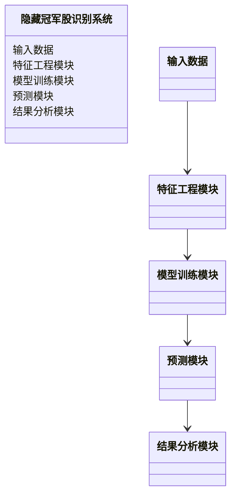
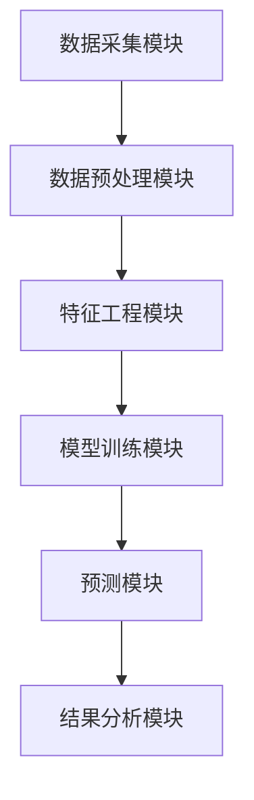
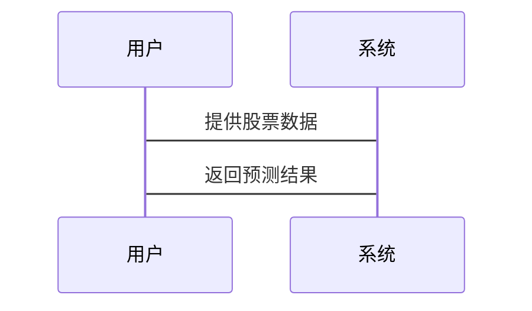

                 


# 智能系统辅助识别隐藏冠军股

## 关键词：智能系统，隐藏冠军股，机器学习，深度学习，股票预测

## 摘要：本文详细探讨了如何利用智能系统，特别是基于机器学习和深度学习的技术，来辅助识别隐藏冠军股。文章从概念背景、核心算法、系统架构到项目实战，全面阐述了智能系统在股票预测中的应用，并通过实际案例展示了其在识别隐藏冠军股中的潜力和挑战。

---

# 第一部分：智能系统辅助识别隐藏冠军股的背景与概念

## 第1章：隐藏冠军股的定义与识别挑战

### 1.1 隐藏冠军股的定义

- **隐藏冠军股**是指那些在某个细分市场中占据领先地位，但尚未被广泛认知，具有高增长潜力的公司股票。
- 这类股票通常具有较高的ROE（净资产收益率）、稳定的盈利能力以及较低的市盈率。
- 隐藏冠军股的关键特征包括：
  - 市场占有率高。
  - 增长潜力大。
  - 估值相对合理。
  - 股票流动性适中。

### 1.2 隐藏冠军股识别的挑战

- **数据获取的难度**：隐藏冠军股往往存在于非主流市场，数据获取困难。
- **市场波动的影响**：股票价格受市场情绪和宏观经济因素影响，增加了预测的难度。
- **信息不对称的问题**：投资者可能无法及时获得关键的公司信息。

## 第2章：智能系统在金融分析中的作用

### 2.1 智能系统的基本概念

- **人工智能与机器学习**：通过算法从数据中学习模式，自动进行预测和决策。
- **智能系统在金融领域的应用**：包括股票预测、风险评估、交易策略优化等。

### 2.2 智能系统的优势

- **数据处理能力**：能够处理海量数据，提取有价值的信息。
- **模型预测能力**：通过历史数据训练模型，预测未来走势。
- **自适应学习能力**：能够根据市场变化自动调整模型参数。

---

# 第二部分：智能系统辅助识别隐藏冠军股的核心概念与技术原理

## 第3章：智能系统的核心算法

### 3.1 机器学习算法

- **监督学习**：用于分类问题，如股票涨跌预测。
- **无监督学习**：用于聚类分析，发现隐藏的市场模式。
- **强化学习**：用于交易策略优化，通过试错不断改进。

### 3.2 深度学习算法

- **神经网络**：通过多层网络结构，学习复杂的非线性关系。
- **卷积神经网络（CNN）**：适用于图像数据，但也可用于时间序列分析。
- **循环神经网络（RNN）**：适用于处理序列数据，如股票价格的时间序列。

## 第4章：特征工程与数据处理

### 4.1 特征工程的重要性

- **特征选择**：筛选出对预测结果影响最大的特征。
- **特征提取**：通过降维技术提取特征，减少计算复杂度。
- **特征标准化**：确保不同特征的量纲一致，避免模型偏差。

### 4.2 数据预处理

- **数据清洗**：去除噪声数据，处理缺失值。
- **数据转换**：将数据转换为适合模型输入的形式，如归一化。
- **数据增强**：通过增加多样性的数据，提高模型的泛化能力。

---

# 第三部分：智能系统辅助识别隐藏冠军股的算法实现

## 第5章：基于机器学习的预测模型

### 5.1 支持向量机（SVM）模型

- **基本原理**：通过找到一个超平面，将数据分成两类，适用于分类问题。
- **数学模型**：$$\text{目标函数：} \min_{\theta} \frac{1}{2}\|\theta\|^2 + C \sum_{i=1}^n \xi_i$$
  $$\text{约束条件：} y_i (x_i \cdot \theta + \theta_0) \geq 1 - \xi_i, \xi_i \geq 0$$
- **应用示例**：使用SVM对股票价格进行二分类预测（涨/跌）。

### 5.2 随机森林模型

- **基本原理**：通过构建多个决策树，集成得到最终预测结果。
- **数学模型**：无显式公式，主要依赖树结构。
- **应用示例**：使用随机森林对股票的多分类预测（如行业分类）。

## 第6章：基于深度学习的预测模型

### 6.1 卷积神经网络（CNN）模型

- **基本原理**：适用于处理图像数据，但在时间序列分析中也有应用。
- **数学模型**：$$\text{卷积层：} f(x) = \sum_{k} w_k \ast x_k + b$$
  $$\text{池化层：} f(x) = \max(x_1, x_2)$$
- **应用示例**：将股票价格序列视为图像数据，进行模式识别。

### 6.2 循环神经网络（RNN）模型

- **基本原理**：适用于处理序列数据，通过循环结构捕捉时间依赖关系。
- **数学模型**：$$\text{状态更新：} s_t = \text{激活函数}(W_{hh} s_{t-1} + W_{xh} x_t)$$
  $$\text{输出：} y_t = \text{激活函数}(W_{hy} s_t)$$
- **应用示例**：预测股票价格的下一步走势。

---

# 第四部分：智能系统辅助识别隐藏冠军股的系统分析与架构设计

## 第7章：系统功能设计

### 7.1 领域模型



### 7.2 系统架构设计



### 7.3 接口设计

- **数据接口**：从数据库或API获取股票数据。
- **模型接口**：与其他系统或用户界面交互，接收输入并返回预测结果。

### 7.4 交互设计



---

# 第五部分：智能系统辅助识别隐藏冠军股的项目实战

## 第8章：环境安装与核心代码实现

### 8.1 环境安装

- **Python环境**：建议使用Anaconda，安装如下库：
  - `numpy`、`pandas`：数据处理。
  - `scikit-learn`：机器学习算法。
  - `keras` 或 `tensorflow`：深度学习框架。
  - `matplotlib`：数据可视化。

### 8.2 核心代码实现

```python
import numpy as np
import pandas as pd
from sklearn.svm import SVC
from sklearn.ensemble import RandomForestClassifier
from sklearn.metrics import accuracy_score
import matplotlib.pyplot as plt

# 数据加载
data = pd.read_csv('股票数据.csv')

# 特征选择
features = data[['市盈率', 'ROE', '营收增长率']]
labels = data['涨跌']

# 数据分割
from sklearn.model_selection import train_test_split
X_train, X_test, y_train, y_test = train_test_split(features, labels, test_size=0.2)

# 模型训练
svm_model = SVC()
svm_model.fit(X_train, y_train)

rf_model = RandomForestClassifier()
rf_model.fit(X_train, y_train)

# 预测与评估
 svm_pred = svm_model.predict(X_test)
 rf_pred = rf_model.predict(X_test)

 svm_acc = accuracy_score(y_test, svm_pred)
 rf_acc = accuracy_score(y_test, rf_pred)

 print(f"SVM准确率：{svm_acc}")
 print(f"随机森林准确率：{rf_acc}")
```

### 8.3 代码解读与分析

- **数据加载**：使用`pandas`读取CSV文件中的股票数据。
- **特征选择**：选择市盈率、ROE和营收增长率作为特征。
- **数据分割**：将数据分为训练集和测试集。
- **模型训练**：分别使用SVM和随机森林模型进行训练。
- **预测与评估**：对测试集进行预测，并计算准确率。

### 8.4 实际案例分析

假设我们有一个包含以下数据的CSV文件：

| 日期 | 收盘价 | 市盈率 | ROE | 营收增长率 | 涨跌 |
|------|-------|--------|-----|------------|-----|
| 2023-01-01 | 100 | 15 | 0.15 | 0.1 | 1 |
| 2023-01-02 | 105 | 14 | 0.16 | 0.05 | 1 |
| ... | ... | ... | ... | ... | ... |

通过上述代码训练模型后，可以得到SVM和随机森林模型的准确率。假设SVM的准确率为85%，随机森林的准确率为88%，则随机森林模型表现更优。

---

## 第9章：总结与展望

### 9.1 总结

- 智能系统在识别隐藏冠军股方面具有显著优势。
- 通过特征工程和模型训练，可以有效提高预测的准确性。
- 不同的算法适用于不同的场景，需要根据实际情况选择合适的模型。

### 9.2 展望

- **算法优化**：探索更高效的算法，如集成学习和深度学习。
- **数据多样性**：引入更多数据源，提高模型的泛化能力。
- **实时预测**：开发实时预测系统，帮助投资者及时捕捉机会。

### 9.3 最佳实践 tips

- **数据质量**：确保数据的准确性和完整性。
- **模型调优**：通过交叉验证和超参数优化提高模型性能。
- **风险控制**：结合技术分析和基本面分析，降低投资风险。

---

通过本文的详细讲解，读者可以了解智能系统在识别隐藏冠军股中的应用，并通过实际案例掌握相关技术的实现方法。未来，随着技术的进步，智能系统在金融领域的应用将更加广泛和深入。

