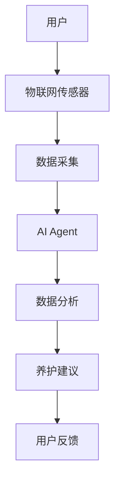
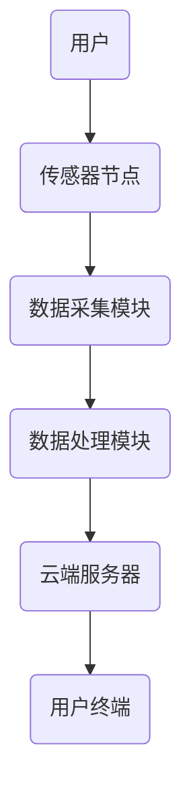
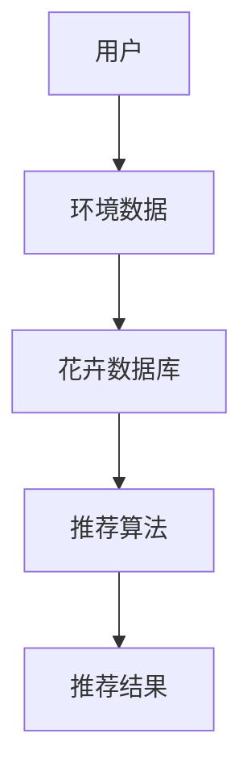
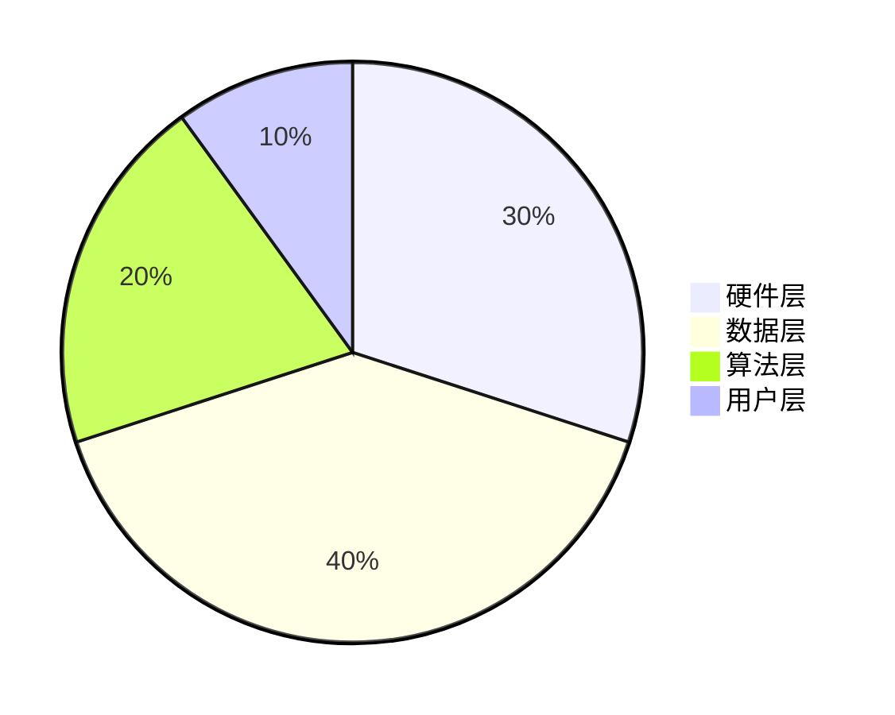
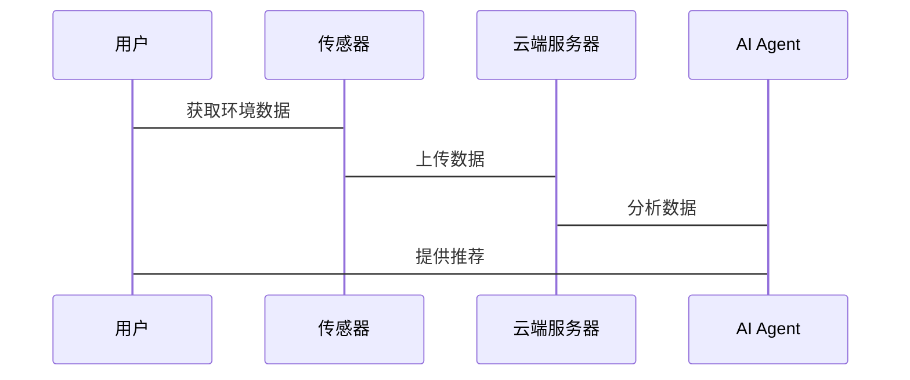

                 


# 智能花瓶：AI Agent的花卉养护专家

---

## 关键词
- AI Agent
- 智能花瓶
- 花卉养护
- 环境监测
- 物联网

---

## 摘要
智能花瓶是一种结合了AI Agent和物联网技术的智能设备，旨在通过环境监测和AI推荐实现花卉的精准养护。本文详细介绍了智能花瓶的核心概念、算法原理、系统架构以及实际实现，帮助读者全面理解智能花瓶的工作原理和应用场景。通过AI Agent的学习能力，智能花瓶能够根据环境数据为用户提供个性化的养护建议，提升花卉养护的智能化水平。

---

## 正文

### 第一部分：智能花瓶的背景与概念

#### 第1章：花卉养护的智能化需求

##### 1.1 花卉养护的现状与挑战
花卉养护是现代生活中常见的需求，但传统养护方式存在诸多问题：
- **人工依赖性高**：需要用户频繁浇水、施肥，容易遗忘或过度养护。
- **环境监测不足**：缺乏对温度、湿度、光照等环境因素的实时监测，难以精准养护。
- **知识门槛高**：普通用户缺乏专业养护知识，容易导致花卉死亡。

智能花瓶通过AI Agent和物联网技术，解决了这些问题，实现了花卉养护的智能化和便捷化。

##### 1.2 AI Agent在花卉养护中的应用
AI Agent是一种能够感知环境、自主决策并执行任务的智能实体。在智能花瓶中，AI Agent主要负责以下功能：
- **环境监测**：通过传感器采集花卉周围的温度、湿度、光照等数据。
- **数据分析**：基于历史数据和机器学习算法，分析环境因素对花卉生长的影响。
- **智能推荐**：根据分析结果，为用户提供个性化的养护建议。

##### 1.3 智能花瓶的定义与目标
智能花瓶是一种结合了AI技术和物联网的智能设备，其目标是通过实时监测环境数据，为用户提供精准的花卉养护建议，帮助用户轻松实现花卉的健康成长。

---

### 第二部分：AI Agent的核心原理与技术实现

#### 第2章：AI Agent的基本原理

##### 2.1 AI Agent的定义与分类
AI Agent可以根据智能水平分为以下几类：
| 类型       | 描述                                                                 |
|------------|----------------------------------------------------------------------|
| 反应式AI   | 基于当前感知做出反应，如环境监测中的实时反馈。                 |
| 计划式AI   | 具备决策和规划能力，能够制定养护计划。                         |
| 学习式AI   | 基于机器学习算法，通过数据训练提升推荐准确性。                 |

##### 2.2 AI Agent的核心算法
AI Agent的核心算法包括：
- **机器学习算法**：用于环境数据分析和花卉推荐。
- **自然语言处理（NLP）**：用于用户交互和指令理解。
- **规则引擎**：用于简单的逻辑推理和决策。

##### 2.3 AI Agent与物联网的结合
AI Agent与物联网的结合流程如下：


---

#### 第3章：智能花瓶的环境监测技术

##### 3.1 环境监测的核心算法
环境监测算法基于以下数学模型：
$$
\text{健康指数} = \alpha \times T + \beta \times H + \gamma \times L
$$
其中，$T$为温度，$H$为湿度，$L$为光照强度，$\alpha$、$\beta$、$\gamma$为权重系数。

##### 3.2 环境数据的采集与传输
环境数据采集流程如下：


##### 3.3 环境数据的分析与处理
环境数据分析的Python代码示例：
```python
import pandas as pd
from sklearn.linear_model import LinearRegression

# 数据预处理
data = pd.read_csv('environment_data.csv')
X = data[['temperature', 'humidity', 'light']]
y = data['health_index']

# 训练模型
model = LinearRegression()
model.fit(X, y)

# 预测健康指数
new_data = [[25, 60, 800]]  # 示例数据
prediction = model.predict(new_data)
print(f"预测健康指数为：{prediction[0]:.2f}")
```

---

#### 第4章：AI Agent的花卉推荐算法

##### 4.1 花卉推荐的核心原理
花卉推荐系统基于协同过滤算法，流程如下：


##### 4.2 花卉推荐算法的实现
花卉推荐算法的Python代码示例：
```python
import numpy as np
from sklearn.metrics.pairwise import cosine_similarity

# 用户环境数据
user_data = np.array([[25, 60, 800]])

# 花卉数据库
flower_db = np.array([[24, 60, 800], [25, 60, 800], [24, 60, 800]])

# 计算相似度
similarity = cosine_similarity(user_data, flower_db)
print(f"相似度矩阵为：{similarity}")
```

---

### 第三部分：系统架构与实现

#### 第5章：系统架构设计
智能花瓶的整体架构如下：


#### 第6章：系统接口设计
系统接口设计如下：


---

### 第四部分：项目实战

#### 第7章：环境配置与代码实现
环境配置步骤：
1. 安装Python和相关库（如pandas、scikit-learn）。
2. 配置物联网传感器（如DHT22温湿度传感器）。
3. 设置云端服务器（如AWS IoT）。

核心代码实现：
```python
import serial
import time

# 串口配置
ser = serial.Serial('COM3', 9600)
while True:
    try:
        data = ser.readline().decode().strip()
        if data:
            print(f"接收数据：{data}")
            # 处理数据并发送到云端
    except:
        print("数据读取失败")
    time.sleep(1)
```

---

### 第五部分：总结与展望

#### 第8章：总结与展望
智能花瓶通过AI Agent和物联网技术，实现了花卉养护的智能化和便捷化。未来，可以进一步优化算法，引入多传感器融合技术，提升推荐系统的准确性。

---

通过以上内容，读者可以全面了解智能花瓶的设计原理、实现方法和应用场景，掌握AI Agent在花卉养护中的实际应用。

