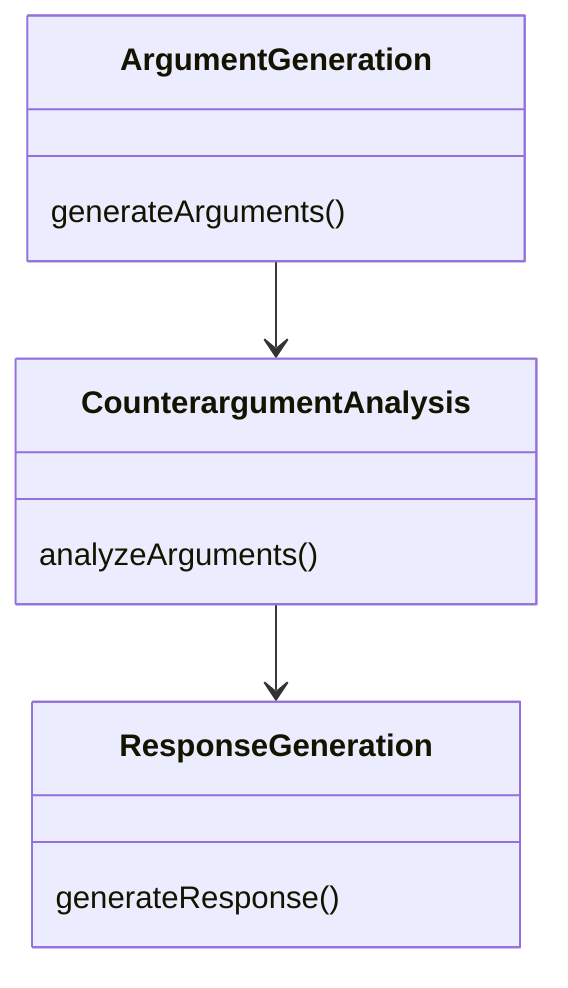
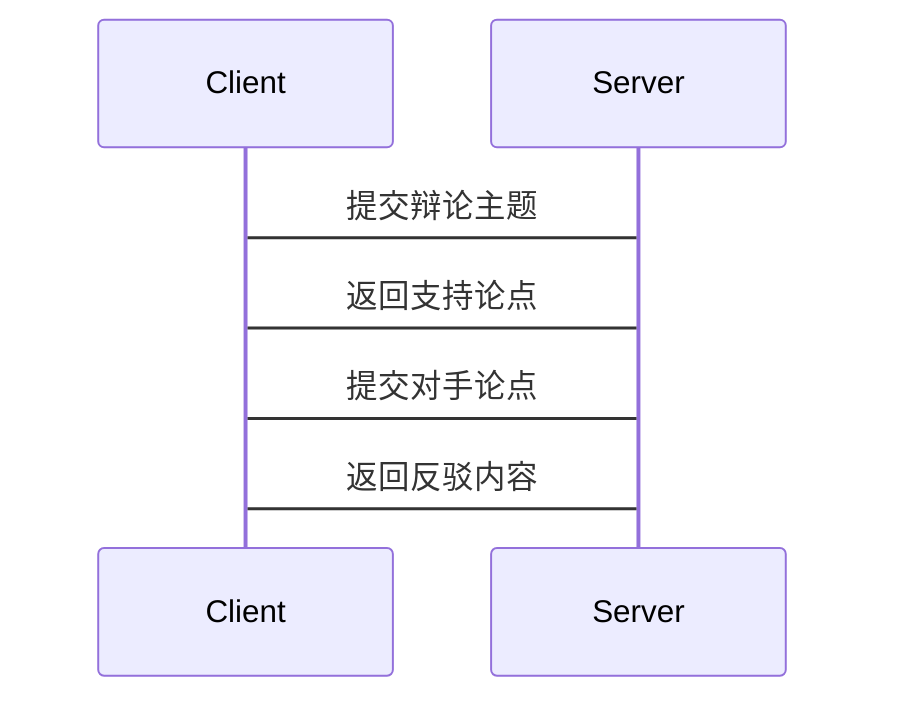

                 


# 智能辩论AI Agent：LLM驱动的论证与反驳系统

> 关键词：智能辩论AI Agent，LLM，大语言模型，论证，反驳，自然语言处理，对话管理

> 摘要：本文将探讨智能辩论AI Agent的构建与实现，基于大语言模型（LLM）的论证与反驳系统。通过分析系统的核心概念、算法原理、系统架构以及项目实战，详细阐述如何利用LLM技术实现智能辩论AI Agent，包括文本生成、对话管理与知识推理等关键环节。

---

# 第1章: 智能辩论AI Agent的背景介绍

## 1.1 问题背景与定义

### 1.1.1 辩论的定义与重要性
- 辩论是一种通过逻辑推理和语言表达来捍卫或反驳观点的活动。
- 在信息爆炸的时代，智能辩论系统能够帮助用户快速生成论点，提升沟通效率。
- 辩论能力是评估AI智能水平的重要指标。

### 1.1.2 智能辩论AI Agent的定义
- 智能辩论AI Agent是一种能够自动生成论点、进行逻辑推理并反驳对手观点的智能系统。
- 它基于大语言模型（LLM）构建，结合了自然语言处理、逻辑推理和对话管理等技术。

### 1.1.3 智能辩论AI Agent的应用场景
- 政策辩论：分析政策优缺点，提供支持或反驳论点。
- 法律辩论：辅助律师快速生成法律文书，进行案例分析。
- 教育领域：作为教学工具，帮助学生提升辩论能力。
- 商业谈判：为企业提供谈判策略支持。

## 1.2 智能辩论AI Agent的技术基础

### 1.2.1 大语言模型（LLM）的基本概念
- LLM是基于深度学习的自然语言处理模型，能够理解和生成人类语言。
- 例如，GPT系列模型通过大量的文本数据进行训练，具备强大的生成能力。

### 1.2.2 LLM在智能辩论中的应用
- 生成论点：根据给定主题，自动生成相关论点和论据。
- 进行反驳：识别对手论点中的漏洞，并生成反驳理由。
- 对话管理：在实时对话中，根据上下文调整生成内容。

### 1.2.3 论证与反驳的基本原理
- 论证：通过逻辑推理和证据支持某一观点。
- 这里给出论证的基本要素对比表格：

| 基本要素 | 描述 |
|---------|------|
| 论点     | 需要支持的观点 |
| 论据     | 支持论点的证据或理由 |
| 推理     | 从论据到论点的逻辑推理过程 |

## 1.3 智能辩论AI Agent的边界与外延

### 1.3.1 辩论的边界
- 辩论的内容和范围需明确界定，避免偏离主题。
- 例如，在政策辩论中，应聚焦于政策本身的优缺点，而非其他无关因素。

### 1.3.2 智能辩论AI Agent的局限性
- 知识更新：模型知识可能滞后，需定期更新。
- 理解深度：在复杂问题上，可能无法深入理解特定领域知识。
- 创造性不足：生成的论点可能缺乏创新性。

### 1.3.3 辩论与智能系统的结合
- AI辅助：AI作为辅助工具，帮助人类提升辩论效率。
- 人机协作：AI与人类协同工作，结合人类的创造力和AI的效率。

## 1.4 本章小结
- 本章介绍了智能辩论AI Agent的背景，包括定义、应用场景及其技术基础。
- 接下来，将深入探讨智能辩论系统的核心概念与原理。

---

# 第2章: 智能辩论AI Agent的核心概念与原理

## 2.1 大语言模型（LLM）的基本原理

### 2.1.1 LLM的训练过程
- 基于大量文本数据进行预训练，通过自监督学习优化模型参数。
- 使用Transformer架构，包括编码器和解码器两部分。

### 2.1.2 LLM的推理机制
- 解码过程：模型逐词生成输出，依赖上下文信息。
- 注意力机制：聚焦输入中的重要部分，提升生成质量。

### 2.1.3 LLM的生成能力
- 多模型对比：GPT与BERT在生成任务上的优劣对比。

## 2.2 论证与反驳的结构化表示

### 2.2.1 论证的基本要素
- 论点、论据、推理三者的关系。

### 2.2.2 论证的逻辑结构
- 论点：中心思想。
- 论据：支持论点的事实或证据。
- 推理：逻辑连接论点与论据。

### 2.2.3 论证的可计算性
- 将论证过程转化为可计算的逻辑形式，便于计算机处理。

## 2.3 智能辩论AI Agent的系统架构

### 2.3.1 系统的输入输出接口
- 输入：用户提供的辩论主题和对手论点。
- 输出：生成的论点和反驳内容。

### 2.3.2 系统的核心模块划分
- 论证生成模块：负责生成支持论点。
- 对抗分析模块：分析对手论点，识别漏洞。
- 反驳生成模块：根据分析结果生成反驳内容。

### 2.3.3 系统的灵活性与扩展性
- 支持多种辩论主题，适应不同应用场景。
- 知识库的动态更新，提升系统能力。

## 2.4 本章小结
- 本章详细介绍了智能辩论AI Agent的核心概念，包括LLM的基本原理和论证结构化表示。
- 接下来，将探讨智能辩论系统中使用的算法原理。

---

# 第3章: 智能辩论AI Agent的算法原理

## 3.1 基于LLM的文本生成算法

### 3.1.1 变压器模型的基本结构
- 编码器和解码器的结构，以及自注意力机制。

### 3.1.2 注意力机制的实现
- 查询、键、值的计算过程。

### 3.1.3 解码器的生成策略
- 基于贪心算法的生成方式，以及beam search的优化策略。

## 3.2 对话管理算法

### 3.2.1 对话状态表示
- 使用向量表示当前对话的状态。

### 3.2.2 对话策略选择
- 基于状态的策略选择，如生成友好的回应。

### 3.2.3 对话历史的利用
- 结合历史记录，生成连贯的对话内容。

## 3.3 知识推理算法

### 3.3.1 知识图谱的构建
- 实体与关系的抽取，构建领域知识图谱。

### 3.3.2 基于知识图谱的推理
- 使用图遍历算法，推导新的事实。

### 3.3.3 推理结果的验证
- 通过验证机制，确保推理的正确性。

## 3.4 本章小结
- 本章详细讲解了智能辩论AI Agent中的关键算法，包括文本生成、对话管理和知识推理。
- 接下来，将分析系统的架构设计。

---

# 第4章: 智能辩论AI Agent的系统架构设计

## 4.1 问题场景介绍
- 辩论主题：如环境保护政策的优缺点。
- 对手论点：如“应该全面禁止塑料袋使用”。

## 4.2 系统功能设计

### 4.2.1 领域模型设计
- 使用Mermaid类图展示系统模块划分：



### 4.2.2 系统架构设计
- 使用Mermaid架构图展示整体架构：

```mermaid
client
    server
        argumentGeneration
        counterargumentAnalysis
        responseGeneration
```

## 4.3 系统接口设计

### 4.3.1 输入接口
- REST API：接收辩论主题和对手论点。

### 4.3.2 输出接口
- 返回生成的论点和反驳内容。

## 4.4 系统交互流程

### 4.4.1 交互流程
- 使用Mermaid序列图展示交互过程：



## 4.5 本章小结
- 本章分析了智能辩论AI Agent的系统架构，包括功能模块划分和交互流程。
- 接下来，将通过项目实战部分，展示系统的具体实现。

---

# 第5章: 智能辩论AI Agent的项目实战

## 5.1 环境安装与配置

### 5.1.1 安装依赖
- 安装Python和相关库（如Hugging Face的Transformers库）。

## 5.2 系统核心实现

### 5.2.1 论证生成模块实现
```python
def generate_arguments(topic):
    # 使用LLM生成支持论点
    pass
```

### 5.2.2 对抗分析模块实现
```python
def analyze_arguments(counter_argument):
    # 分析对手论点，识别漏洞
    pass
```

### 5.2.3 反驳生成模块实现
```python
def generate_counterarguments(vulnerabilities):
    # 根据漏洞生成反驳内容
    pass
```

## 5.3 案例分析

### 5.3.1 实际案例
- 辩论主题：环境保护政策。
- 对手论点：全面禁止塑料袋使用。
- 系统生成的反驳论点：应该推广可降解材料，而非全面禁止。

## 5.4 项目总结

### 5.4.1 项目成果
- 成功实现智能辩论AI Agent的基本功能。

### 5.4.2 经验总结
- 知识库的构建对系统性能影响显著。
- 对话管理算法的优化能够提升用户体验。

## 5.5 本章小结
- 本章通过项目实战，展示了智能辩论AI Agent的具体实现过程。
- 接下来，将讨论系统的优化与未来发展方向。

---

# 第6章: 智能辩论AI Agent的优化与未来展望

## 6.1 最佳实践与优化建议

### 6.1.1 知识库优化
- 增加领域知识的覆盖范围，提升生成内容的准确性。

### 6.1.2 对话管理优化
- 引入情感分析，生成更具亲和力的回应。

## 6.2 系统的灵活性与扩展性

### 6.2.1 动态知识库更新
- 支持实时更新，保持系统知识的前沿性。

### 6.2.2 多语言支持
- 扩展系统，支持多种语言的辩论任务。

## 6.3 未来研究方向

### 6.3.1 更复杂的逻辑推理
- 研究支持多层逻辑推理的算法，提升反驳的深度。

### 6.3.2 更自然的对话生成
- 探索生成更接近人类对话风格的文本。

## 6.4 本章小结
- 本章总结了智能辩论AI Agent的优化建议，并展望了未来的发展方向。
- 结束语：随着技术的进步，智能辩论AI Agent将在更多领域发挥重要作用。

---

# 附录: 参考文献与工具

## 附录A: 参考文献
- 列出本文中引用的所有文献和资料。

## 附录B: 开源工具与库
- 列出项目中使用的开源库和工具。

---

# 结语
智能辩论AI Agent的开发与应用，不仅体现了技术的进步，也展示了人工智能在复杂场景中的潜力。通过本文的详细讲解，读者可以深入了解智能辩论系统的核心技术，并为未来的研究和实践提供有价值的参考。

