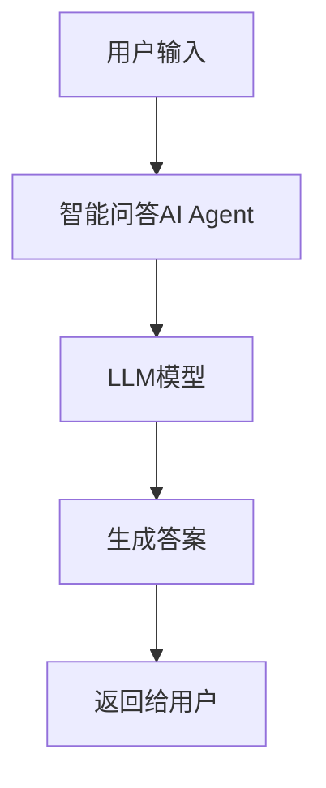

                 


# 智能问答AI Agent：基于LLM的精准答疑系统

> 关键词：智能问答，AI Agent，大语言模型，LLM，精准答疑，自然语言处理，问答系统

> 摘要：本文详细探讨了基于大语言模型（LLM）的智能问答AI Agent的设计与实现。从问题背景、核心概念、算法原理到系统架构设计，再到项目实战与案例分析，深入剖析了精准答疑系统的关键技术与实现细节。通过本文，读者可以全面了解基于LLM的智能问答系统的工作原理、系统架构和实际应用，掌握构建高效精准问答系统的完整方法。

---

## 第1章: 智能问答AI Agent的背景与问题背景

### 1.1 问题背景

#### 1.1.1 传统问答系统的局限性
传统问答系统主要依赖关键词匹配和规则库，存在以下问题：
- **准确性不足**：难以处理复杂语义和上下文关系。
- **可扩展性差**：难以应对大规模数据和多样化问题。
- **响应速度慢**：依赖预定义规则，难以实时更新和优化。

#### 1.1.2 大语言模型的崛起
大语言模型（LLM）的出现，为智能问答系统带来了革命性的变化：
- **强大的语义理解能力**：基于深度学习的模型能够理解上下文和隐含含义。
- **自适应性**：通过微调和提示工程技术，可以适应不同领域和场景。
- **实时更新能力**：基于大量数据的训练，能够实时提供最新信息。

#### 1.1.3 智能问答AI Agent的定义与目标
智能问答AI Agent是一种基于LLM的自动化问答系统，其目标是通过自然语言处理技术实现精准答疑，提供高效、智能的交互体验。

---

### 1.2 问题描述

#### 1.2.1 现有问答系统的不足
- **知识覆盖有限**：传统问答系统依赖固定的规则库，难以应对未知问题。
- **语义理解能力弱**：难以处理复杂句子和上下文关系。
- **个性化不足**：无法根据用户背景和需求提供定制化答案。

#### 1.2.2 智能问答AI Agent的核心问题
- 如何利用LLM实现精准的语义理解。
- 如何设计高效的交互流程以提高问答系统的响应速度和准确性。
- 如何处理复杂场景中的多轮对话和上下文依赖。

#### 1.2.3 问题解决的路径与方法
- **基于LLM的语义理解**：通过模型的上下文理解能力，准确解析用户问题。
- **多轮对话管理**：通过对话历史和上下文，逐步优化问答流程。
- **实时知识库集成**：结合实时数据和知识库，提供准确的答案。

---

### 1.3 问题解决

#### 1.3.1 基于LLM的智能问答系统的优势
- **强大的语义理解能力**：能够理解复杂句子和上下文关系。
- **自适应性**：可以通过微调模型适应不同领域和场景。
- **实时更新能力**：基于最新数据进行训练和优化。

#### 1.3.2 精准答疑的关键技术
- **提示工程技术（Prompt Engineering）**：通过设计合适的提示，引导模型生成准确答案。
- **上下文感知**：利用对话历史和上下文信息，优化回答质量。
- **实时知识库集成**：结合实时数据和知识库，提供准确答案。

#### 1.3.3 系统设计与实现的挑战
- **模型优化**：如何在保证准确性的前提下，提高系统的响应速度。
- **知识库管理**：如何高效管理和更新知识库，确保信息的准确性和及时性。
- **多轮对话管理**：如何处理复杂的多轮对话，保持上下文一致性。

---

### 1.4 边界与外延

#### 1.4.1 智能问答系统的边界
- **输入限制**：用户输入的格式和内容范围。
- **输出限制**：系统的回答范围和形式。
- **场景限制**：系统的适用场景和领域。

#### 1.4.2 精准答疑的外延与扩展
- **领域扩展**：将智能问答系统应用于更多领域，如医疗、法律、教育等。
- **功能扩展**：增加多语言支持、个性化推荐等功能。
- **技术扩展**：结合其他AI技术，如视觉识别、语音识别等。

#### 1.4.3 相关技术的对比与选择
- **传统问答系统 vs 基于LLM的问答系统**
  | 对比维度 | 传统问答系统 | 基于LLM的问答系统 |
  |----------|--------------|-------------------|
  | 精度     | 较低         | 较高              |
  | 可扩展性 | 较差         | 较好              |
  | 响应速度 | 较慢         | 较快              |

---

### 1.5 核心概念与联系

#### 1.5.1 核心概念原理
智能问答AI Agent的核心原理是通过大语言模型的语义理解能力，结合上下文信息，生成准确的问答结果。其工作流程如下：



#### 1.5.2 概念属性特征对比表格
| 概念       | 特征1：准确性 | 特征2：可扩展性 | 特征3：响应速度 |
|------------|--------------|----------------|----------------|
| 传统问答系统 | 较低         | 较差           | 较慢           |
| LLM问答系统 | 较高         | 较好           | 较快           |

#### 1.5.3 ER实体关系图架构
```mermaid
er
    actor User
    actor System
    entity Question
    entity Answer
    entity Context
    User --> Question: 提出问题
    System --> Answer: 生成答案
    Question --> Context: 关联上下文
```

---

## 第2章: 大语言模型（LLM）的核心原理

### 2.1 LLM的定义与特点

#### 2.1.1 LLM的定义
大语言模型（LLM）是指基于Transformer架构的大型神经网络模型，通过大量数据的预训练，具备强大的自然语言理解和生成能力。

#### 2.1.2 LLM的核心特点
- **基于Transformer架构**：利用自注意力机制捕捉上下文信息。
- **大规模预训练**：通过海量数据的训练，模型具备广泛的知识覆盖。
- **多任务学习能力**：可以在多种任务上进行微调，适应不同场景。

#### 2.1.3 LLM与传统NLP模型的区别
- **训练数据规模**：LLM的训练数据规模远大于传统模型。
- **自注意力机制**：LLM通过自注意力机制捕捉长距离依赖关系。
- **任务适应性**：LLM可以通过微调适应多种任务，而传统模型需要定制化设计。

---

### 2.2 LLM的训练与推理

#### 2.2.1 LLM的训练过程
1. **数据预处理**：清洗和格式化数据，构建训练数据集。
2. **模型初始化**：初始化Transformer模型的参数。
3. **损失函数计算**：通过交叉熵损失函数计算预测值与真实值的差异。
4. **反向传播与优化**：通过梯度下降优化模型参数。
5. **模型保存**：保存最优模型参数。

#### 2.2.2 LLM的推理机制
1. **输入处理**：将用户输入的问题转换为模型可处理的格式。
2. **生成过程**：模型通过解码器生成回答，通常采用贪心算法或蒙特卡洛采样。
3. **结果输出**：将生成的回答返回给用户。

#### 2.2.3 LLM的数学模型与公式
- **自注意力机制公式**：
  $$\text{Attention}(Q, K, V) = \text{softmax}\left(\frac{QK^T}{\sqrt{d_k}}\right)V$$
- **Transformer模型整体架构**：
  $$\text{Encoder} = \text{S

