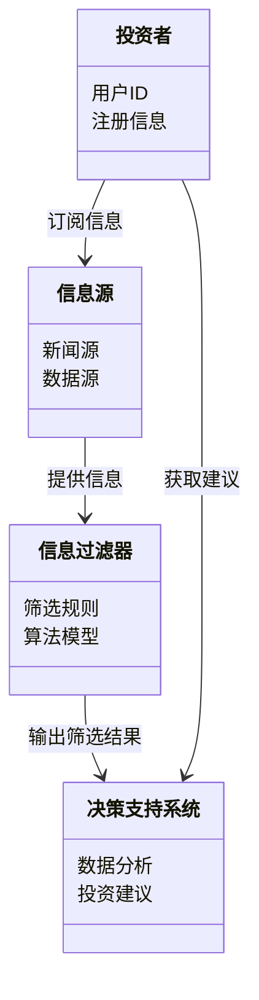
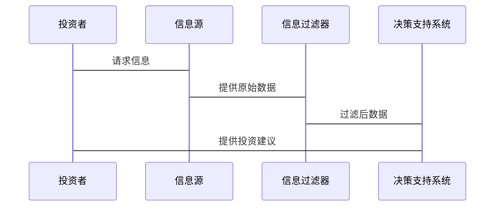

                 


# 有限注意力：信息过载时代的投资决策挑战

## 关键词：
- 有限注意力
- 信息过载
- 投资决策
- 认知偏差
- 算法优化
- 系统架构

## 摘要：
在信息爆炸的时代，投资者面临海量信息的挑战，有限的注意力资源使得有效决策变得困难。本文探讨信息过载对投资决策的影响，分析认知偏差与决策疲劳，介绍技术解决方案如信息过滤算法和注意力管理工具，构建基于有限注意力的投资决策模型，并通过项目实战展示实现过程，总结最佳实践。

---

## 第一章：有限注意力与信息过载概述

### 1.1 有限注意力的定义与特征

有限注意力是指人类在任何时间只能集中处理有限信息的能力。其特征包括：容量有限、选择性、易耗尽和受情绪影响。信息过载导致注意力分散，影响决策质量。

### 1.2 信息过载的背景与问题

信息过载源于数字化时代信息爆炸，投资者难以处理海量数据，导致决策疲劳和认知偏差，影响判断力。

---

## 第二章：认知偏差与决策疲劳

### 2.1 认知偏差的类型与表现

认知偏差如确认偏差、过度自信偏差和情绪偏差，影响投资者判断。确认偏差使投资者固守原有观点，过度自信偏差导致高估自身能力，情绪偏差受市场波动影响决策。

### 2.2 决策疲劳的机制与表现

决策疲劳是由于连续决策导致的注意力耗尽，表现为决策效率下降、判断力减弱和情绪波动增加。

---

## 第三章：投资者行为分析

### 3.1 投资者认知与决策过程

投资者经历信息处理、决策和行动三个阶段，情绪波动和认知偏差影响每个阶段。理性与感性之间的冲突是投资决策的核心挑战。

### 3.2 情感与情绪对投资决策的影响

情感影响投资者判断，情绪波动引发非理性决策。恐惧和贪婪是主要情绪偏差，导致追涨杀跌和错失投资机会。

---

## 第四章：信息过滤与注意力管理技术

### 4.1 信息过滤算法

基于机器学习和自然语言处理的信息过滤算法，如TF-IDF和LDA，帮助筛选有价值信息。深度学习技术用于内容推荐，优化信息处理效率。

### 4.2 注意力管理工具

时间管理工具如番茄工作法和信息组织工具如Evernote，帮助投资者专注处理重要信息。专注训练工具通过冥想等方式提升注意力质量。

---

## 第五章：基于有限注意力的投资决策模型

### 5.1 模型构建与算法选择

模型目标是优化信息筛选和决策流程，选择适合的算法，如聚类分析和决策树，进行模型训练和优化。

### 5.2 算法实现与案例分析

以股票筛选系统为例，使用Python实现信息过滤算法。代码示例如下：

```python
import numpy as np
from sklearn.feature_extraction.text import TfidfVectorizer
from sklearn.cluster import KMeans

# 假设 news_data 是包含股票新闻的数据
vectorizer = TfidfVectorizer()
tfidf = vectorizer.fit_transform(news_data)

# 使用K-means进行聚类
kmeans = KMeans(n_clusters=5)
kmeans.fit(tfidf)
clusters = kmeans.predict(tfidf)
```

该模型通过聚类分析筛选相关股票信息，提升决策效率。

---

## 第六章：系统架构与实现

### 6.1 系统功能设计

系统功能包括信息采集、筛选、分析和决策支持。领域模型如下：



### 6.2 系统架构设计

系统架构采用分层设计，包括数据层、业务逻辑层和用户界面层。架构图如下：


### 6.3 系统接口设计

系统接口包括数据输入、处理和输出。交互图如下：



---

## 第七章：项目实战与总结

### 7.1 项目实战

以股票筛选系统为例，实现信息过滤算法。代码如下：

```python
import pandas as pd
from sklearn.decomposition import LatentDirichletAllocation

# 加载股票新闻数据
df = pd.read_csv('stock_news.csv')

# 应用LDA进行主题建模
tf_vectorizer = TfidfVectorizer(max_features=1000)
tf = tf_vectorizer.fit_transform(df['news'])
lda = LatentDirichletAllocation(n_topics=5, random_state=0)
lda.fit(tf)
```

### 7.2 项目总结

通过项目实战，验证了信息过滤算法的有效性，优化了投资决策流程。系统架构设计确保了高效性和可扩展性。

### 7.3 小结

有限注意力是信息过载时代的核心挑战，技术解决方案如信息过滤算法和注意力管理工具，帮助投资者做出更有效的决策。

### 7.4 注意事项

投资者需结合技术工具与个人判断，避免过度依赖算法，保持理性决策。

### 7.5 拓展阅读

推荐阅读《算法之美》和《认知偏差手册》，深入理解算法原理和人类行为。

---

通过本文的分析与实践，读者可以系统地理解有限注意力对投资决策的影响，并掌握相应的技术解决方案，提升投资决策效率和质量。

