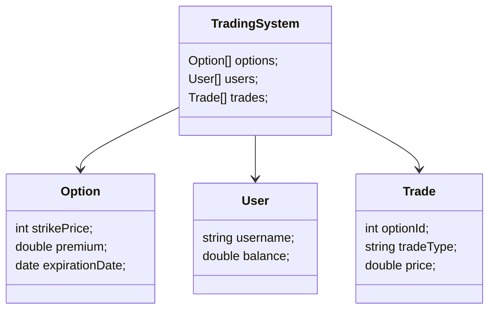
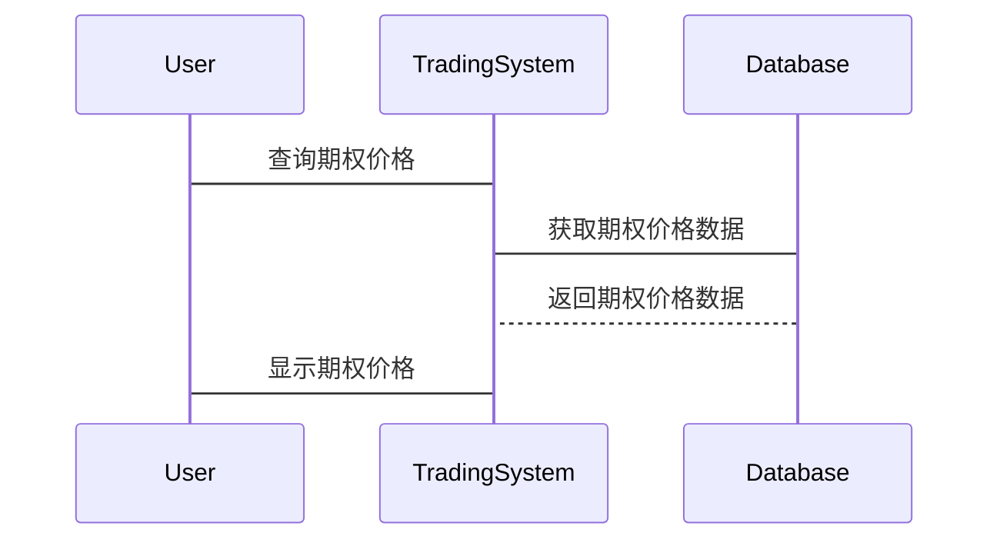

                 


# 期权策略：利用衍生品管理投资风险

## 关键词：期权策略，风险管理，金融衍生品，Black-Scholes模型，交易策略

## 摘要：  
期权是一种强大的金融工具，用于对冲和管理投资风险。本文从期权的基本概念入手，详细探讨其在风险管理中的应用，包括期权的定价模型、交易策略、系统架构设计以及实际案例分析。通过本文，读者将了解如何利用期权策略来有效管理投资组合中的风险。

---

# 第一部分: 期权策略基础

## 第1章: 期权的基本概念与背景

### 1.1 期权的定义与特点
#### 1.1.1 期权的基本定义
期权是一种金融衍生品，赋予买方在特定时间以特定价格买入或卖出标的资产的权利。期权可以是基于股票、指数或其他资产的衍生品。

#### 1.1.2 期权的主要特点
- **杠杆效应**：买方可以用较少的资金控制较大的头寸。
- **有限风险**：买方的潜在损失仅限于支付的期权费，而卖方的潜在损失可能是无限的。
- **灵活性**：期权可以用于对冲风险或投机市场走势。

#### 1.1.3 期权与股票、期货的区别
| 特性 | 股票 | 期货 | 期权 |
|------|------|------|------|
| 权益 | 所有权 | 远期合同 | 选择权 |
| 风险 | 高 | 高 | 有限 |
| 杠杆 | 低 | 高 | 中等 |

### 1.2 期权市场的历史与发展
#### 1.2.1 期权市场的起源
期权交易可以追溯到古希腊，哲学家亚里士多德提到的塔勒斯预测橄榄油价格上涨并买入期权的故事。

#### 1.2.2 现代期权市场的演变
1973年，Black-Scholes模型的提出为现代期权定价奠定了基础。

#### 1.2.3 全球主要期权交易市场
- 美国：芝加哥期权交易所（CBOE）
- 欧洲：欧洲期货交易所（Eurex）
- 亚洲：香港交易所（HKEX）

### 1.3 期权在投资中的作用
#### 1.3.1 投资风险管理的重要性
投资者需要通过期权对冲价格波动、利率变化等风险。

#### 1.3.2 期权在风险对冲中的应用
- 对冲市场波动风险
- 对冲利率风险
- 对冲信用风险

#### 1.3.3 期权与其他金融工具的结合
期权可以与股票、期货、债券等工具结合使用，构建复杂的投资组合。

---

## 第2章: 期权的基本原理

### 2.1 期权的权利与义务
#### 2.1.1 期权买方的权利
- 有权在特定时间以特定价格买入或卖出标的资产。
- 无需承担任何义务。

#### 2.1.2 期权卖方的义务
- 卖方必须在买方行权时以约定价格买入或卖出标的资产。
- 卖方承担潜在的无限损失。

#### 2.1.3 期权的内在价值与时间价值
- **内在价值**：期权在到期时的执行价值。
- **时间价值**：期权剩余的有效时间的价值。

### 2.2 期权的类型
#### 2.2.1 看涨期权与看跌期权
- **看涨期权**：买方有权以行权价买入标的资产。
- **看跌期权**：买方有权以行权价卖出标的资产。

#### 2.2.2 欧式期权与美式期权
- **欧式期权**：只能在到期日行权。
- **美式期权**：可以在到期日前的任何时间行权。

#### 2.2.3 其他类型的期权
- **奇异期权**：如障碍期权、平均期权等。

### 2.3 期权的定价模型
#### 2.3.1 Black-Scholes模型简介
Black-Scholes模型用于定价欧式期权，假设标的资产价格服从几何布朗运动。

#### 2.3.2 期权定价的数学公式
看涨期权的价格公式为：
$$C = S_0 N(d_1) - K e^{-rT} N(d_2)$$
其中：
- $S_0$：标的资产当前价格
- $K$：行权价
- $r$：无风险利率
- $T$：到期时间
- $N(d)$：标准正态分布的累积分布函数
- $d_1 = \frac{\ln(\frac{S_0}{K}) + (r + \frac{\sigma^2}{2})T}{\sigma \sqrt{T}}$$
- $d_2 = d_1 - \sigma \sqrt{T}$

#### 2.3.3 影响期权价格的主要因素
| 因素 | 影响 |
|------|------|
| 标的资产价格 | 正相关 |
| 行权价 | 负相关 |
| 时间 | 正相关 |
| 波动率 | 正相关 |
| 利率 | 负相关 |

---

## 第3章: 期权的风险管理

### 3.1 风险管理的基本概念
#### 3.1.1 投资风险的分类
- **市场风险**：价格波动导致的损失。
- **流动性风险**：无法快速买卖资产的风险。
- **信用风险**：交易对手违约的风险。

#### 3.1.2 期权在风险管理中的作用
- 通过期权对冲价格波动风险。

#### 3.1.3 风险与收益的平衡
- 高风险意味着高潜在收益，但需要谨慎管理。

### 3.2 期权的风险指标
#### 3.2.1 Delta值的含义与应用
- Delta衡量期权价格对标的资产价格变化的敏感性。
- 公式：$$\Delta = \frac{\partial C}{\partial S}$$

#### 3.2.2 Gamma值的含义与应用
- Gamma衡量Delta对标的资产价格变化的敏感性。
- 公式：$$\Gamma = \frac{\partial \Delta}{\partial S}$$

#### 3.2.3 Vega值的含义与应用
- Vega衡量期权价格对波动率变化的敏感性。
- 公式：$$Vega = \frac{\partial C}{\partial \sigma}$$

### 3.3 风险对冲策略
#### 3.3.1 利用期权对冲市场波动风险
- 买入看涨期权对冲上涨风险，卖出看跌期权对冲下跌风险。

#### 3.3.2 利用期权对冲利率风险
- 通过期权锁定融资成本。

#### 3.3.3 利用期权对冲信用风险
- 通过信用违约期权对冲债券违约风险。

---

## 第4章: 期权策略的制定与执行

### 4.1 确定投资目标与风险承受能力
#### 4.1.1 投资目标的设定
- 清晰的投资目标是制定期权策略的基础。

#### 4.1.2 风险承受能力的评估
- 评估投资者对风险的承受能力，制定相应的对冲策略。

#### 4.1.3 期权在投资组合中的角色
- 期权可以作为投资组合的一部分，用于对冲或投机。

### 4.2 制定期权交易策略
#### 4.2.1 基于市场趋势的策略
- **买入认购期权**：预期标的资产价格上涨。
- **卖出认沽期权**：预期标的资产价格下跌。

#### 4.2.2 基于波动率的策略
- **买入波动率期权**：押注市场波动率上升。

#### 4.2.3 基于对冲的策略
- **保护性认购策略**：买入股票并卖出认购期权，锁定卖出价格。

### 4.3 执行期权交易
#### 4.3.1 选择合适的执行时机
- 根据市场走势和波动率选择合适的时间行权或平仓。

#### 4.3.2 监控交易头寸
- 定期监控期权头寸的Delta、Gamma等风险指标。

#### 4.3.3 调整交易策略
- 根据市场变化及时调整期权策略。

---

## 第5章: 系统分析与架构设计

### 5.1 期权交易系统的需求分析
#### 5.1.1 问题场景介绍
- 投资者需要一个系统来管理期权交易和风险。

#### 5.1.2 项目介绍
- 开发一个期权交易管理系统，提供实时价格、风险指标和交易执行功能。

### 5.2 系统功能设计
#### 5.2.1 领域模型Mermaid类图


#### 5.2.2 系统架构设计Mermaid架构图


#### 5.2.3 系统接口设计
- **API接口**：提供期权价格查询、交易执行、风险指标计算等接口。

#### 5.2.4 系统交互Mermaid序列图


---

## 第6章: 项目实战

### 6.1 环境安装
#### 6.1.1 安装Python环境
- 使用Anaconda安装Python 3.8及以上版本。

#### 6.1.2 安装相关库
- 使用pip安装numpy、pandas、scipy等库。

### 6.2 核心实现源代码
#### 6.2.1 期权定价模型实现
```python
import numpy as np
from scipy.stats import norm

def black_scholes(S, K, r, T, sigma):
    d1 = (np.log(S/K) + (r + sigma**2/2)*T) / (sigma * np.sqrt(T))
    d2 = d1 - sigma * np.sqrt(T)
    C = S * norm.cdf(d1) - K * np.exp(-r*T) * norm.cdf(d2)
    return C

# 示例计算
S = 100
K = 105
r = 0.05
T = 1
sigma = 0.2

price = black_scholes(S, K, r, T, sigma)
print(f"期权价格：{price}")
```

#### 6.2.2 风险指标计算
```python
def calculate_delta(S, K, r, T, sigma):
    d1 = (np.log(S/K) + (r + sigma**2/2)*T) / (sigma * np.sqrt(T))
    delta = norm.cdf(d1)
    return delta

delta = calculate_delta(S, K, r, T, sigma)
print(f"Delta值：{delta}")
```

### 6.3 案例分析
#### 6.3.1 实际案例分析
假设当前股票价格为100元，行权价为105元，无风险利率为5%，波动率为20%，到期时间为1年。

计算期权价格和Delta值：
```python
S = 100
K = 105
r = 0.05
T = 1
sigma = 0.2

price = black_scholes(S, K, r, T, sigma)
delta = calculate_delta(S, K, r, T, sigma)
print(f"期权价格：{price}")
print(f"Delta值：{delta}")
```

#### 6.3.2 代码应用解读与分析
- 期权价格计算结果：约7.5元。
- Delta值：约0.4，表示股票价格每上涨1元，期权价格预计上涨0.4元。

### 6.4 项目小结
通过代码实现Black-Scholes模型，可以快速计算期权价格和风险指标，为实际交易提供参考。

---

## 第7章: 最佳实践与小结

### 7.1 最佳实践
- **风险管理**：始终将风险管理放在首位，避免过度杠杆。
- **策略调整**：根据市场变化及时调整交易策略。
- **系统支持**：利用技术系统辅助期权交易和风险管理。

### 7.2 小结
期权是一种强大的风险管理工具，但需要深入理解其原理和策略。通过本文的分析，读者可以掌握期权的基本概念、定价模型和交易策略，从而更好地管理投资风险。

### 7.3 注意事项
- 期权交易具有高风险，需谨慎操作。
- 建议投资者在使用期权前，充分了解相关知识并咨询专业顾问。

### 7.4 拓展阅读
- 《期权、期货和其他衍生品》（John C. Hull）
- 《金融工程与金融创新》（Philip J. Downman）

---

通过以上内容，读者可以系统地了解期权策略的理论与实践，掌握利用衍生品管理投资风险的方法。

