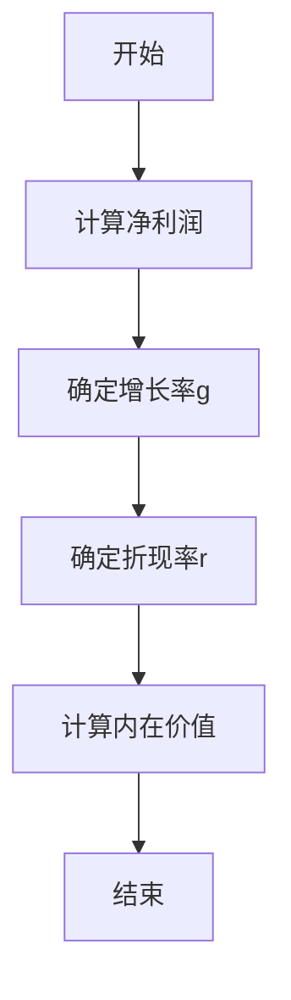
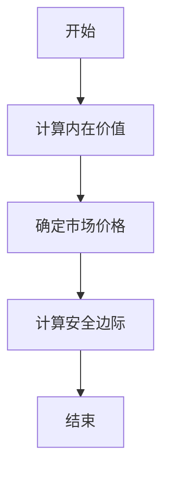

                 


# 本杰明·格雷厄姆的企业价值计算方法

> 关键词：本杰明·格雷厄姆, 企业价值计算, 内在价值, 安全边际, 投资策略, 财务分析, 估值模型

> 摘要：本杰明·格雷厄姆作为价值投资之父，提出了企业价值计算的核心方法，包括内在价值和安全边际的概念。本文将详细分析这些方法的背景、原理、算法实现以及实际应用，帮助读者掌握如何正确评估企业价值。

---

# 第一部分: 本杰明·格雷厄姆与企业价值计算方法

## 第1章: 本杰明·格雷厄姆的生平与投资理念

### 1.1 本杰明·格雷厄姆的生平简介
- **早年经历**：出生于1897年，毕业于哥伦比亚大学，早期在华尔街从事证券交易工作。
- **投资理念**：主张以安全边际为核心，寻找被市场低估的企业进行投资。
- **著作**：与戴维·多德合著《证券分析》，奠定了价值投资的基础。

### 1.2 企业价值计算方法的背景与意义
- **问题背景**：传统估值方法（如市盈率、市净率）在企业估值中的局限性。
- **方法意义**：格雷厄姆的方法强调基本面分析，注重企业的内在价值而非市场情绪。

### 1.3 格雷厄姆方法的核心概念
- **内在价值**：企业未来现金流的现值。
- **安全边际**：市场价格与内在价值之间的差距，确保投资的安全性。

---

## 第2章: 格雷厄姆企业价值计算的核心原理

### 2.1 内在价值的计算公式
- **公式推导**：
  $$\text{内在价值} = \frac{\text{净利润} \times (1 + g)}{r - g}$$
  其中，$g$ 是净利润增长率，$r$ 是折现率。
- **公式解释**：通过将未来现金流折现，计算企业的真实价值。

### 2.2 安全边际的计算与应用
- **安全边际公式**：
  $$\text{安全边际} = \text{市场价格} - \text{内在价值}$$
- **应用意义**：确保投资在合理估值范围内，降低风险。

### 2.3 核心概念对比表格
| 概念       | 格雷厄姆方法 | 市盈率法 | 市净率法 |
|------------|-------------|----------|----------|
| 定义       | 内在价值     | 市盈率   | 市净率   |
| 计算公式   | 净利润折现   | 市盈率=股价/每股收益 | 市净率=股价/每股净资产 |
| 适用场景   | 低增长企业   | 高增长企业 | 金融企业 |

---

## 第3章: 格雷厄姆企业价值计算的算法原理

### 3.1 内在价值计算的算法流程


### 3.2 安全边际计算的算法流程


### 3.3 Python代码实现
```python
def calculate_intrinsic_value(net_profit, growth_rate, discount_rate):
    return (net_profit * (1 + growth_rate)) / (discount_rate - growth_rate)

def calculate_margin_of_safety(mark_price, intrinsic_value):
    return mark_price - intrinsic_value
```

---

## 第4章: 格雷厄姆方法的实际应用与案例分析

### 4.1 案例背景
- 选取某公司过去5年的净利润数据，假设未来增长率保持不变。

### 4.2 数据分析与计算
- 计算内在价值：
  $$\text{内在价值} = \frac{100 \times (1 + 0.05)}{0.10 - 0.05} = 20 \times 1.05 = 210$$
- 计算安全边际：
  $$\text{安全边际} = 150 - 210 = -60$$
  （负值表示市场价格过高，不建议投资）

### 4.3 结论与启示
- 安全边际为负，说明市场价格高于内在价值，投资风险较大。

---

## 第5章: 格雷厄姆方法的改进与扩展

### 5.1 现代对格雷厄姆模型的改进
- 引入更多财务指标（如ROE、ROA）进行综合评估。
- 考虑通货膨胀对折现率的影响。

### 5.2 改进模型的优缺点
- **优点**：提高估值的准确性。
- **缺点**：增加计算复杂性，可能需要更多数据支持。

---

## 第6章: 最佳实践与投资策略

### 6.1 投资策略建议
- 优先选择安全边际为正的企业。
- 结合宏观经济环境调整估值模型。

### 6.2 风险管理
- 分散投资以降低风险。
- 定期复评企业价值。

---

## 第7章: 总结与展望

### 7.1 本章总结
- 格雷厄姆的企业价值计算方法为企业估值提供了科学的理论基础。
- 安全边际是确保投资安全的重要指标。

### 7.2 未来展望
- 结合人工智能技术优化估值模型。
- 进一步研究多因素对企业价值的影响。

---

## 第8章: 注意事项与扩展阅读

### 8.1 投资者注意事项
- 避免过度简化模型，忽略重要财务指标。
- 定期更新财务数据以保持估值的准确性。

### 8.2 扩展阅读
- 《证券分析》——本杰明·格雷厄姆
- 《价值投资实战》——彼得·林奇

---

通过以上结构，您可以逐步展开每个部分的内容，结合实际案例和数学公式，深入剖析格雷厄姆的企业价值计算方法。希望这个目录大纲能为您提供清晰的写作思路！

