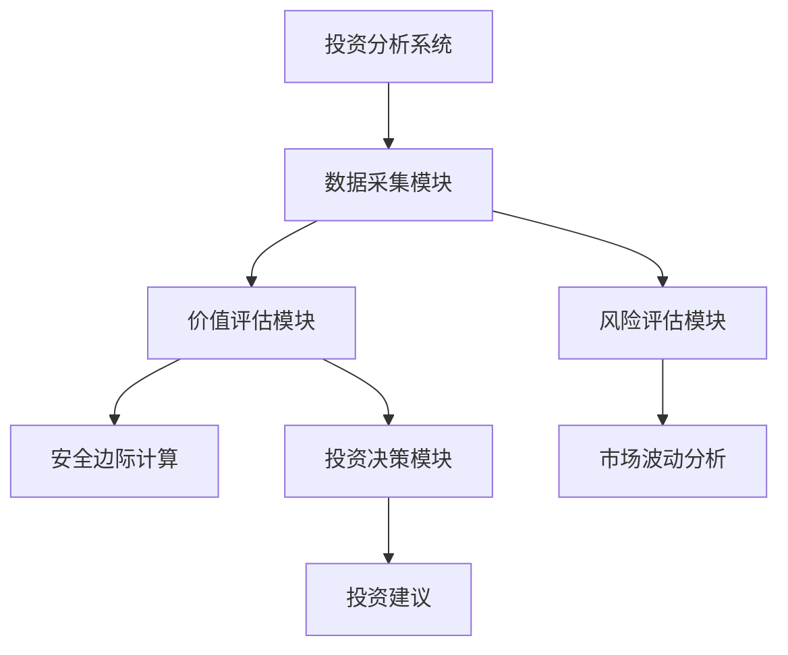

                 


# 本杰明·格雷厄姆的安全边际现代诠释

> **关键词**：安全边际，价值投资，投资策略，内在价值，风险管理

> **摘要**：本文详细探讨了本杰明·格雷厄姆提出的安全边际概念，并分析其在现代投资中的应用。通过数学模型和实际案例，文章解释了安全边际的计算方法及其在降低投资风险中的作用，结合系统架构和项目实战，展示了如何在现代投资环境中有效应用这一经典策略。

---

## 第一部分：安全边际的背景介绍

### 第1章：安全边际的核心概念

#### 1.1 安全边际的定义与背景

安全边际是价值投资中的核心概念，由本杰明·格雷厄姆提出。它是指股票的市场价格与内在价值之间的差距，旨在为投资者提供一个缓冲区，以应对市场的不确定性和波动性。安全边际的引入，使得投资者能够在市场价格低于内在价值时买入，从而降低亏损风险并确保收益。

- **定义**：安全边际 = 内在价值 - 市场价格  
  公式为：$$ \text{安全边际} = \text{内在价值} - \text{市场价格} $$  
  当安全边际为正时，表明股票价格被低估，具备投资价值。

- **历史背景**：20世纪初，股市波动剧烈，投资者常因情绪化决策导致重大损失。格雷厄姆通过安全边际的概念，强调理性分析和价值评估，帮助投资者在市场恐慌或狂热中保持冷静。

- **重要性**：安全边际是价值投资的核心原则，它不仅帮助投资者识别被低估的股票，还提供了风险管理的工具，确保投资组合的稳定性。

#### 1.2 安全边际的理论基础

安全边际的理论基础植根于基本面分析和心理因素的结合：

- **价值投资的基本原理**：格雷厄姆认为，市场的短期波动是不可预测的，但长期来看，股票价格会回归其内在价值。安全边际的存在，为这一回归过程提供了时间和空间的保障。

- **安全边际与市场波动的关系**：市场波动越大，安全边际的作用越显著。在市场恐慌时，股票价格可能大幅低于内在价值，此时具备较大的安全边际，为投资者提供了买入的机会。

- **安全边际与投资者心理**：投资者的心理偏差（如过度乐观或悲观）会导致市场定价偏离内在价值。安全边际通过量化这一偏差，帮助投资者在极端市场条件下做出理性决策。

---

## 第二部分：安全边际的核心概念与联系

### 第2章：安全边际的计算与应用

#### 2.1 安全边际的计算方法

安全边际的计算涉及内在价值的评估，而内在价值的计算又依赖于多种因素，如收益能力、资产状况和行业地位等。以下是计算步骤的详细说明：

1. **评估公司的内在价值**  
   内在价值是公司未来现金流的现值。计算方法包括股利折现模型（DDM）和贴现现金流模型（DCF）。  
   DCF模型公式：$$ V = \sum_{t=1}^{n} \frac{CF_t}{(1 + r)^t} $$  
   其中，\( CF_t \) 为第 \( t \) 年的现金流，\( r \) 为折现率。

2. **计算安全边际**  
   根据内在价值与市场价格的差额计算安全边际。公式为：$$ \text{安全边际} = \text{内在价值} - \text{市场价格} $$  
   如果安全边际为正，表明股票价格低于其真实价值，具备投资价值。

3. **考虑安全边际的比例**  
   通常，建议的安全边际比例为内在价值的15%-25%。例如，如果内在价值为100元，市场价格为80元，安全边际为20元，比例为20%，处于合理区间。

#### 2.2 安全边际与其他投资策略的对比

为了更好地理解安全边际的应用，我们将其与其它投资策略进行对比：

- **与技术分析的对比**  
  技术分析依赖价格走势和成交量数据，而安全边际注重基本面分析。两者结合使用，可以互补优势，提高决策的准确性。

- **与成长型投资的对比**  
  成长型投资侧重于高增长潜力的公司，而安全边际关注低估值股票。两者在投资目标和风险承受上有明显差异，但可以通过组合投资来平衡风险。

- **与股息增长模型的对比**  
  股息增长模型基于股息的持续增长，而安全边际基于价格与价值的差异。两者都考虑了收益，但侧重点不同，前者注重收益的可持续性，后者注重价格的可接受性。

---

## 第三部分：安全边际的算法原理

### 第3章：安全边际的数学模型与计算

#### 3.1 安全边际的数学模型

安全边际的计算可以表示为一个数学模型，其中内在价值 \( V \) 和市场价格 \( P \) 是关键变量。公式如下：

$$ \text{安全边际} = V - P $$

为了计算内在价值 \( V \)，我们采用贴现现金流模型（DCF）：

$$ V = \frac{CF_1}{(1 + r)^1} + \frac{CF_2}{(1 + r)^2} + \cdots + \frac{CF_n}{(1 + r)^n} $$

其中，\( CF_t \) 是第 \( t \) 年的自由现金流，\( r \) 是折现率。

#### 3.2 安全边际的计算流程

以下是一个简化的计算流程：

1. **收集公司财务数据**：包括收入、利润、现金流等。
2. **预测未来现金流**：基于历史数据和行业趋势，预测未来5-10年的现金流。
3. **确定折现率**：通常采用无风险利率加上风险溢价。
4. **计算内在价值**：使用DCF模型计算公司价值。
5. **计算安全边际**：将内在价值与当前市场价格进行比较。

#### 3.3 安全边际的代码实现

以下是用Python计算安全边际的示例代码：

```python
def calculate_intrinsic_value(cash_flows, discount_rate):
    present_value = 0
    for year, cf in enumerate(cash_flows):
        if year == 0:
            continue
        present_value += cf / (1 + discount_rate) ** year
    return present_value

# 示例数据
cash_flows = [100, 120, 150, 180, 200]  # 第1年到第5年的现金流
discount_rate = 0.08  # 折现率8%

iv = calculate_intrinsic_value(cash_flows, discount_rate)
market_price = 100  # 市场价格

margin_of_safety = iv - market_price
print(f"内在价值：{iv}")
print(f"市场价格：{market_price}")
print(f"安全边际：{margin_of_safety}")
```

---

## 第四部分：系统架构与应用场景

### 第4章：系统架构设计

#### 4.1 系统功能设计

为实现安全边际的现代化应用，我们设计了一个投资分析系统，包含以下功能模块：

1. **数据采集模块**：收集公司财务数据和市场数据。
2. **价值评估模块**：计算内在价值和安全边际。
3. **风险评估模块**：分析市场波动对安全边际的影响。
4. **投资决策模块**：基于安全边际结果，提供投资建议。

#### 4.2 系统架构图

使用Mermaid绘制系统架构图：



---

## 第五部分：项目实战

### 第5章：安全边际的实战应用

#### 5.1 项目背景

假设我们分析一家公司XYZ，其财务数据如下：

- **现金流预测**：$100, $120, $150, $180, $200
- **折现率**：8%
- **市场价格**：$100

#### 5.2 安全边际计算

根据DCF模型计算内在价值：

$$ V = \frac{100}{1.08} + \frac{120}{1.08^2} + \frac{150}{1.08^3} + \frac{180}{1.08^4} + \frac{200}{1.08^5} $$

计算结果约为$480。

因此，安全边际为：

$$ \text{安全边际} = 480 - 100 = 380 $$

这表明，XYZ公司的股票价格具备380%的安全边际，具有较高的投资价值。

---

## 第六部分：最佳实践与总结

### 第6章：最佳实践与总结

#### 6.1 投资策略中的注意事项

- **风险管理**：定期评估投资组合中的安全边际，及时调整持仓。
- **持续学习**：关注市场变化和公司基本面，更新内在价值评估。
- **分散投资**：避免过度集中，降低单一投资的风险。

#### 6.2 项目小结

通过本文的分析，我们了解了安全边际的现代应用方法。从数学模型到系统设计，再到实际案例，展示了如何在现代投资环境中有效应用这一策略。安全边际不仅是降低风险的工具，更是提升投资收益的重要手段。

#### 6.3 拓展阅读

推荐阅读《价值》（The Intelligent Investor）和《投资的艺术》（The Art of Investment），深入了解安全边际的更多应用和策略。

---

通过以上结构，文章详细阐述了安全边际的现代诠释，从理论到实践，为投资者提供了有价值的指导和启示。

