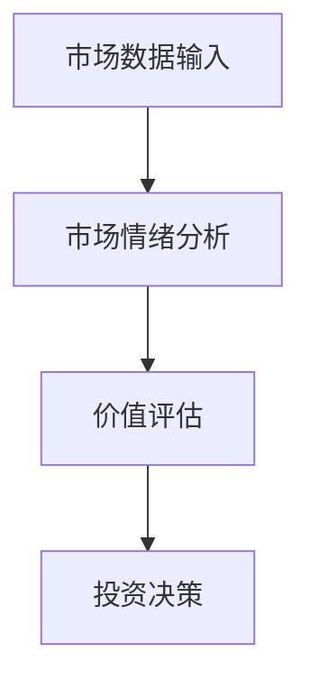

                 


# 本杰明·格雷厄姆的市场先生理论现代应用

## 关键词
- 本杰明·格雷厄姆
- 市场先生理论
- 投资策略
- 市场情绪
- 价值投资

## 摘要
本文深入探讨了本杰明·格雷厄姆提出的市场先生理论在现代投资中的应用。通过分析市场情绪、参与者行为及市场波动，结合算法模型和系统架构设计，展示了如何利用该理论优化投资决策。文章还提供了具体的Python代码实现和案例分析，帮助读者理解并应用这一理论。

---

## 第一部分: 市场先生理论的背景与核心概念

### 第1章: 市场先生理论的起源与发展

#### 1.1 本杰明·格雷厄姆及其投资理念
- **1.1.1 格雷厄姆的生平简介**
  - 本杰明·格雷厄姆是20世纪著名的投资学家，被誉为“价值投资之父”。
  - 他于1924年与戴维·多德合著了《证券分析》，奠定了价值投资的基础。
  
- **1.1.2 格雷厄姆的投资哲学**
  - 强调安全边际和长期投资。
  - 认为市场波动是投资机会的来源。
  
- **1.1.3 市场先生理论的提出背景**
  - 20世纪20年代末至30年代初，美国股市经历剧烈波动。
  - 格雷厄姆希望通过理论帮助投资者在市场波动中找到安全的投资机会。

#### 1.2 市场先生理论的核心观点
- **1.2.1 市场先生的定义与角色**
  - 市场先生代表市场的集体情绪。
  - 他的行为反映了市场的波动性和不确定性。
  
- **1.2.2 市场情绪的波动性**
  - 市场情绪受投资者心理影响，呈现周期性波动。
  - 极度乐观或悲观时，市场先生会偏离理性定价。
  
- **1.2.3 市场先生理论的现代意义**
  - 为行为金融学奠定了基础。
  - 帮助投资者在市场波动中保持理性决策。

### 第2章: 市场先生理论的核心概念与联系

#### 2.1 核心概念原理
- **2.1.1 市场情绪的周期性**
  - 市场情绪呈现周期性波动，从乐观到悲观，再到乐观。
  - 识别情绪周期可以帮助投资者做出更明智的决策。
  
- **2.1.2 市场参与者的心理特征**
  - 投资者通常受贪婪和恐惧驱动。
  - 过度自信可能导致错误决策。
  
- **2.1.3 市场定价的偏差性**
  - 市场价格反映市场情绪，而非真实价值。
  - 价格波动为理性投资者提供了套利机会。

#### 2.2 核心概念属性对比表
| 概念       | 波动性 | 不确定性 | 可预测性 |
|------------|-------|----------|----------|
| 市场情绪    | 高    | 高       | 低       |
| 市场参与者  | 受情绪影响 | 受认知偏差影响 | 受行为驱动 |

#### 2.3 实体关系图（Mermaid）


---

## 第二部分: 市场先生理论的算法原理

### 第3章: 市场先生理论的算法实现

#### 3.1 市场情绪指数计算算法
- **3.1.1 算法目标**
  - 计算市场情绪指数，反映市场的乐观或悲观程度。
  
- **3.1.2 算法步骤**
  1. 收集市场数据（如股票指数、成交量）。
  2. 使用统计方法计算市场情绪指数。
  3. 输出情绪指数并分析其对市场的影响。

- **3.1.3 情绪指数计算公式**
  $$E = \frac{\sum_{i=1}^{n} w_i \times m_i}{\sum_{i=1}^{n} w_i}$$
  其中，$E$ 是市场情绪指数，$w_i$ 是权重，$m_i$ 是情绪指标。

#### 3.2 价值评估模型
- **3.2.1 模型目标**
  - 评估资产的内在价值，识别被市场低估的机会。
  
- **3.2.2 模型步骤**
  1. 收集公司财务数据。
  2. 使用格雷厄姆的估值方法计算内在价值。
  3. 比较内在价值与市场价格，识别投资机会。

- **3.2.3 价值评估公式**
  $$V = \frac{P}{E}$$
  其中，$V$ 是价值评估，$P$ 是市场价格，$E$ 是情绪指数。

#### 3.3 投资决策算法流程图（Mermaid）


---

## 第三部分: 系统分析与架构设计

### 第4章: 投资决策支持系统的架构设计

#### 4.1 问题场景介绍
- **4.1.1 投资者在市场波动中的决策困境**
  - 面对市场波动，投资者容易受情绪影响做出错误决策。
  
- **4.1.2 现代市场环境的复杂性**
  - 信息过载、高频交易、算法交易等增加了市场的复杂性。

#### 4.2 系统功能设计
- **4.2.1 系统目标**
  - 提供市场情绪分析、价值评估和投资建议。
  
- **4.2.2 系统模块**
  1. 数据采集模块：收集市场数据。
  2. 情绪分析模块：计算市场情绪指数。
  3. 价值评估模块：评估资产内在价值。
  4. 投资决策模块：提供投资建议。

#### 4.3 系统架构图（Mermaid）


#### 4.4 系统接口设计
- **4.4.1 接口定义**
  - 数据接口：接收市场数据。
  - 用户接口：显示分析结果和投资建议。

#### 4.5 系统交互流程图（Mermaid）


---

## 第四部分: 项目实战

### 第5章: 投资决策支持系统的实现

#### 5.1 环境安装
- **5.1.1 安装Python**
  - 使用Anaconda安装Python 3.9及以上版本。
  
- **5.1.2 安装依赖库**
  - `pandas`, `numpy`, `scipy`, `matplotlib`

#### 5.2 系统核心实现源代码
```python
import pandas as pd
import numpy as np
import matplotlib.pyplot as plt

def calculate_market_mood(index_data):
    # 计算市场情绪指数
    mood_index = index_data.rolling(20).mean().iloc[-1]
    return mood_index

def value_assessment(price, mood_index):
    # 计算价值评估
    assessment = price / mood_index
    return assessment

# 示例数据
data = pd.DataFrame({
    'price': [100, 105, 110, 115, 120],
    'mood': [0.8, 0.9, 1.0, 0.9, 0.8]
})

mood_index = calculate_market_mood(data['price'])
assessment = value_assessment(data['price'].iloc[-1], mood_index)

print(f"市场情绪指数: {mood_index}")
print(f"价值评估: {assessment}")
```

#### 5.3 代码应用解读与分析
- **5.3.1 代码功能**
  - 计算市场情绪指数，评估资产价值。
  
- **5.3.2 实际案例分析**
  - 使用示例数据，展示如何应用理论进行投资决策。

#### 5.4 项目小结
- **5.4.1 项目成果**
  - 实现了一个基于市场先生理论的投资决策支持系统。
  
- **5.4.2 项目经验**
  - 理论与实践结合的重要性。

---

## 第五部分: 最佳实践与总结

### 第6章: 最佳实践与总结

#### 6.1 最佳实践
- **6.1.1 理论应用**
  - 结合市场先生理论，制定长期投资策略。
  
- **6.1.2 技术实现**
  - 使用现代技术（如大数据分析、机器学习）优化投资决策。

#### 6.2 总结
- 市场先生理论为投资者提供了宝贵的思维方式。
- 结合现代技术，可以更好地应对市场波动和不确定性。

#### 6.3 注意事项
- 避免过度依赖单一理论。
- 定期更新模型，适应市场变化。

#### 6.4 拓展阅读
- 格雷厄姆的《证券分析》和《聪明的投资者》。
- 行为金融学相关书籍。

---

通过以上步骤，我们可以看到市场先生理论在现代投资中的重要性。希望本文能为读者提供有价值的见解和实践指导。

