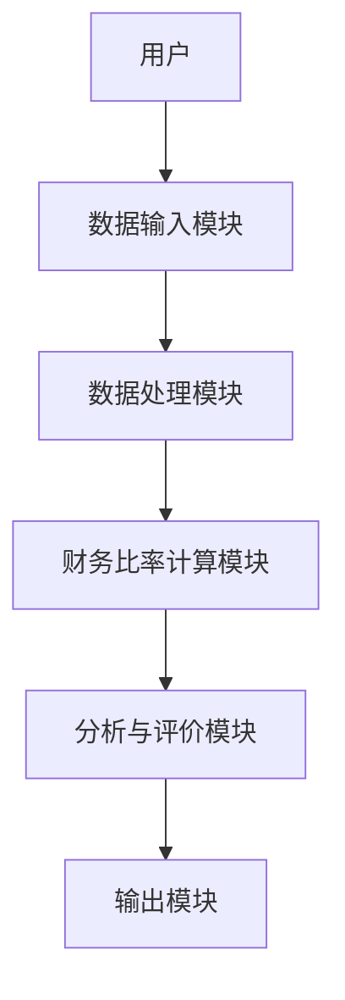
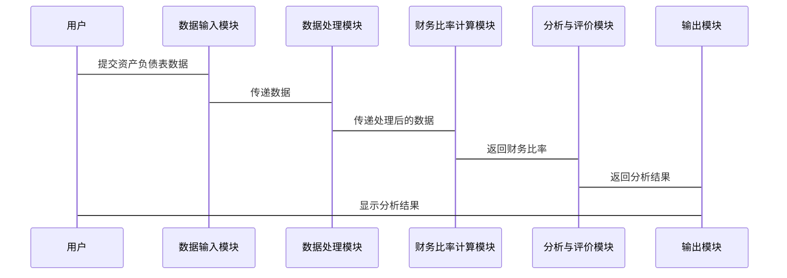

                 


# 本杰明·格雷厄姆的资产负债表分析方法

## 关键词：  
本杰明·格雷厄姆、资产负债表分析、价值投资、财务报表分析、资产分析、负债分析、所有者权益

## 摘要：  
本文将详细介绍本杰明·格雷厄姆的资产负债表分析方法，从基础概念到高级技巧，系统地讲解如何通过分析资产负债表来评估企业的财务健康状况。本文适合投资者、财务分析师以及对价值投资感兴趣的专业人士阅读。

---

## 第1章：本杰明·格雷厄姆及其投资理念

### 1.1 作者简介与投资背景  
本杰明·格雷厄姆是20世纪最伟大的投资思想家之一，被誉为“价值投资之父”。他不仅是成功的投资者，还是一位杰出的教育家，著有《证券分析》和《聪明的投资者》等经典著作。格雷厄姆的投资理念强调安全边际和长期稳健的投资策略，其核心是通过深入分析企业的财务报表，尤其是资产负债表，来评估企业的内在价值。

### 1.2 格雷厄姆分析方法的核心思想  
格雷厄姆的分析方法以基本面分析为核心，强调通过分析企业的财务报表，尤其是资产负债表，来识别具有内在价值的投资标的。他认为，企业的财务状况是决定其长期价值的关键因素，而资产负债表是反映企业财务状况的核心报表之一。

---

## 第2章：资产负债表的基本结构

### 2.1 资产负债表的定义与组成  
资产负债表是反映企业在某一特定时点的财务状况的报表，主要包括以下三个部分：  
1. **资产（Assets）**：企业拥有的资源，能够为企业带来经济利益。  
2. **负债（Liabilities）**：企业需要偿还的债务。  
3. **所有者权益（Owner's Equity）**：企业资产扣除负债后剩余的部分，属于所有者的权益。  

资产负债表的基本公式为：  
$$ \text{资产} = \text{负债} + \text{所有者权益} $$  

### 2.2 资产负债表的核心要素分析  
1. **资产**：分为流动资产和非流动资产。流动资产包括现金、应收账款、存货等，非流动资产包括固定资产、无形资产等。  
2. **负债**：分为流动负债和非流动负债。流动负债包括短期借款、应付账款等，非流动负债包括长期借款、债券等。  
3. **所有者权益**：包括股本、资本公积、 retained earnings（留存收益）等。

---

## 第3章：资产负债表分析方法

### 3.1 财务报表分析的基本框架  
格雷厄姆的分析方法强调对资产负债表的全面分析，包括以下几个步骤：  
1. **数据收集与整理**：获取企业的资产负债表，并确保数据的准确性和完整性。  
2. **计算财务比率**：通过计算各项财务比率，评估企业的偿债能力、运营效率和资本结构。  
3. **综合评价**：结合定量分析和定性分析，对企业财务状况进行综合评价。

### 3.2 资产分析的核心方法  
1. **流动资产分析**：评估企业的短期偿债能力。  
   - **现金及现金等价物**：企业的流动性最强的资产，是衡量企业短期偿债能力的重要指标。  
   - **应收账款**：评估企业赊销的账款回收情况，关注账期和坏账准备。  
   - **存货**：评估企业的库存管理效率，关注存货周转率和成本控制。  

2. **非流动资产分析**：评估企业的长期资产状况。  
   - **固定资产**：评估企业的生产能力，关注折旧计提和资产减值。  
   - **无形资产**：评估企业的核心竞争力，关注无形资产的摊销和价值变化。  

### 3.3 负债分析的深入探讨  
1. **流动负债分析**：评估企业的短期债务偿还能力。  
   - **短期借款**：关注借款的利率和还款期限。  
   - **应付账款**：评估企业的供应链管理能力。  

2. **非流动负债分析**：评估企业的长期债务负担。  
   - **长期借款**：关注借款的利率和还款计划。  
   - **债券 payable**：评估企业的债券发行情况和偿债压力。  

### 3.4 所有者权益分析  
所有者权益是企业资产扣除负债后剩余的部分，反映了企业的净资产价值。  
- **股本**：企业的注册资本，是所有者权益的重要组成部分。  
- **资本公积**：企业资本溢价形成的权益。  
- **留存收益**：企业净利润留存的部分，用于再投资或弥补亏损。  

---

## 第4章：系统分析与架构设计

### 4.1 系统功能设计  
为了实现对资产负债表的全面分析，我们可以设计一个系统，主要包括以下几个功能模块：  
1. **数据输入与处理**：获取企业的资产负债表数据并进行清洗。  
2. **财务比率计算**：根据资产负债表数据，计算各项财务比率。  
3. **分析与评价**：结合定量分析和定性分析，对企业财务状况进行综合评价。  

### 4.2 系统架构设计  
以下是系统的架构设计图：  



### 4.3 接口设计与交互流程  
以下是系统的接口设计与交互流程图：  



---

## 第5章：项目实战

### 5.1 环境安装与配置  
为了进行资产负债表分析，我们需要以下环境：  
- Python 3.8 或更高版本  
- 数据分析库：pandas、numpy、matplotlib  
- 绘图工具：用于生成财务比率图表  

### 5.2 核心代码实现  
以下是资产负债表分析的核心代码示例：  

```python
import pandas as pd
import numpy as np
import matplotlib.pyplot as plt

# 示例数据：假设我们有一个企业的资产负债表数据
data = {
    '资产': [1000, 800, 1200],
    '负债': [600, 500, 700],
    '所有者权益': [400, 300, 500]
}

df = pd.DataFrame(data)

# 计算流动比率（流动资产/流动负债）
流动资产 = df['资产'].iloc[0]
流动负债 = df['负债'].iloc[0]
流动比率 =流动资产 /流动负债
print(f"流动比率: {流动比率}")

# 计算速动比率（（流动资产 - 存货）/流动负债）
速动资产 =流动资产 - 400  # 假设存货为400
速动比率 =速动资产 /流动负债
print(f"速动比率: {速动比率}")

# 可视化资产与负债的分布
plt.figure(figsize=(10,6))
df.plot(kind='bar', stacked=True, title='资产负债表结构')
plt.show()
```

### 5.3 案例分析与解读  
以某制造企业为例，分析其资产负债表：  
- **流动资产**：现金及现金等价物为500万元，应收账款为300万元，存货为200万元，总计1000万元。  
- **流动负债**：短期借款为400万元，应付账款为300万元，其他应付款为200万元，总计900万元。  
- **流动比率**：1000/900 ≈ 1.11，说明企业短期偿债能力较强。  
- **速动比率**：(1000-200)/900 ≈ 0.89，说明企业在扣除存货后，速动资产仍能覆盖流动负债。  

---

## 第6章：总结与展望

### 6.1 最佳实践 tips  
- **数据准确性**：确保资产负债表数据的准确性和完整性。  
- **多维度分析**：结合财务比率和其他财务指标，进行全面分析。  
- **行业对比**：将企业的财务状况与同行业其他企业进行对比，识别优势和劣势。  

### 6.2 小结  
本杰明·格雷厄姆的资产负债表分析方法为投资者提供了强大的工具，帮助他们识别具有内在价值的企业。通过系统的分析和实践，我们可以更好地理解企业的财务状况，做出明智的投资决策。

### 6.3 注意事项  
- 财务分析需要结合企业的经营环境和行业特点。  
- 数据分析工具的选择和使用需要根据具体需求进行调整。  

### 6.4 拓展阅读  
- 《证券分析》——本杰明·格雷厄姆  
- 《聪明的投资者》——本杰明·格雷厄姆  
- 《财务报表分析与股票估值》——任碧云  

---

通过本文的学习，读者可以掌握本杰明·格雷厄姆的资产负债表分析方法，并在实际投资中灵活运用这些技巧，做出更明智的投资决策。

