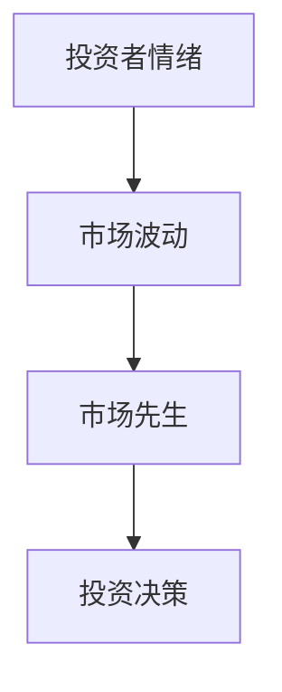
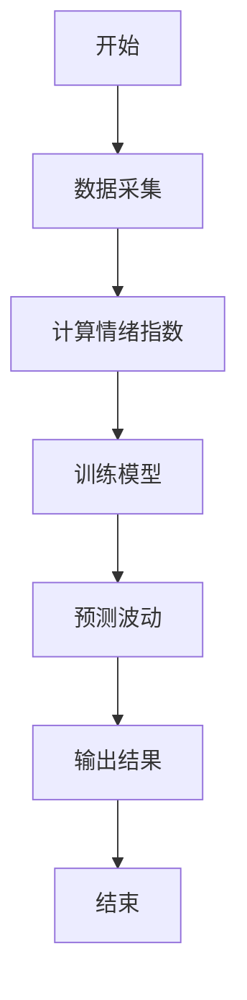

                 


# 本杰明格雷厄姆的市场先生概念

> 关键词：市场先生，投资心理学，投资者情绪，市场波动，投资策略

> 摘要：本文深入探讨了本杰明格雷厄姆提出的市场先生概念，分析其在投资心理学中的重要性，结合数学模型和算法原理，详细讲解市场情绪的量化方法和实际应用，最后通过系统设计和项目实战，展示如何基于市场先生概念构建投资策略。

---

# 第一部分: 市场先生概念的背景与基础

## 第1章: 市场先生概念的背景介绍

### 1.1 问题背景与问题描述

#### 1.1.1 投资者情绪与市场波动的关联性
在金融市场中，投资者情绪对市场波动有着重要影响。情绪化决策可能导致市场过度波动，进而影响投资回报。理解投资者情绪的变化规律，是制定有效投资策略的关键。

#### 1.1.2 格雷厄姆投资理论的核心思想
格雷厄姆是价值投资的鼻祖，他强调以基本面分析为基础，寻找被市场低估的投资标的。他认为市场波动是投资者的机会，而非风险。

#### 1.1.3 市场先生概念的提出动机
为了帮助投资者理解市场波动与情绪的关系，格雷厄姆提出了“市场先生”的概念。市场先生象征市场情绪的变化，投资者需要与他互动，利用其情绪波动寻找投资机会。

### 1.2 问题解决与边界外延

#### 1.2.1 市场先生概念如何解决投资问题
通过市场先生模型，投资者可以量化市场情绪，预测市场波动，从而制定更科学的投资策略。

#### 1.2.2 市场先生概念的边界与适用范围
市场先生模型适用于短期市场波动分析，但不适合长期趋势预测。它更多用于战术性投资决策，而非战略规划。

#### 1.2.3 市场先生与理性投资者的对比分析
理性投资者基于基本面分析做出决策，而市场先生反映的是市场情绪的变化。两者的对比可以帮助投资者理解市场波动的本质。

### 1.3 核心概念与组成要素

#### 1.3.1 市场先生的核心概念结构
市场先生通过情绪波动影响市场定价，投资者需要分析他的情绪变化，找到投资机会。

#### 1.3.2 核心要素的详细解析
市场情绪、市场波动、投资者行为是市场先生概念的核心要素。

#### 1.3.3 概念的数学模型与公式
市场先生概念可以用数学模型表示，例如情绪指数模型：

$$ E = \alpha \times V + \beta \times M $$

其中，E是市场情绪指数，V是市场波动，M是投资者情绪，α和β是系数。

## 第2章: 核心概念与联系

### 2.1 核心概念原理

#### 2.1.1 市场先生的定义与本质
市场先生象征市场情绪的变化，投资者需要通过分析他的情绪波动来制定投资策略。

#### 2.1.2 市场情绪的数学建模
使用时间序列分析和机器学习模型，量化市场情绪。

#### 2.1.3 投资者心理与市场行为的关系
投资者情绪影响市场行为，进而影响市场波动。

### 2.2 概念属性特征对比表

| 概念      | 理性投资者   | 市场先生       |
|-----------|-------------|---------------|
| 决策基础  | 基本面分析   | 市场情绪       |
| 决策目标  | 长期回报     | 短期波动       |
| 决策风格  | 稳定         | 波动           |

### 2.3 ER实体关系图



---

# 第二部分: 市场先生的算法原理

## 第3章: 算法原理

### 3.1 算法原理概述

#### 3.1.1 市场情绪的量化方法
使用情感分析和统计方法量化市场情绪，例如计算市场情绪指数。

#### 3.1.2 市场波动预测的算法选择
采用时间序列分析（如ARIMA模型）和机器学习（如LSTM）进行预测。

#### 3.1.3 基于市场先生概念的模型构建
构建市场情绪模型，预测市场波动。

### 3.2 算法流程图



### 3.3 算法实现代码

#### 3.3.1 数据预处理

```python
import pandas as pd

data = pd.read_csv('market_data.csv')
data['date'] = pd.to_datetime(data['date'])
data.set_index('date', inplace=True)
```

#### 3.3.2 情绪指数计算

```python
def compute_emotion_index(data):
    # 使用移动平均法计算情绪指数
    return data['price'].rolling(20).mean()

emotion_index = compute_emotion_index(data)
```

#### 3.3.3 模型训练与预测

```python
from statsmodels.tsa.arima_model import ARIMA

model = ARIMA(emotion_index, order=(5,1,0))
model_fit = model.fit()
预测结果 = model_fit.forecast(steps=10)
```

---

# 第三部分: 系统分析与设计

## 第4章: 系统分析与架构设计方案

### 4.1 系统功能设计

#### 4.1.1 领域模型


#### 4.1.2 系统架构设计


### 4.2 系统接口设计

#### 4.2.1 API接口

```http
GET /market_emotion?date=2023-10-01
```

#### 4.2.2 数据结构

```json
{
    "date": "2023-10-01",
    "emotion_index": 0.75,
    "market_fluctuation": 1.2
}
```

---

# 第四部分: 项目实战

## 第5章: 项目实战

### 5.1 环境安装

```bash
pip install numpy pandas matplotlib
```

### 5.2 核心代码实现

#### 5.2.1 数据预处理

```python
import pandas as pd

def load_data():
    data = pd.read_csv('market_data.csv')
    return data

data = load_data()
```

#### 5.2.2 情绪指数计算

```python
def compute_emotion_index(data):
    return data['price'].rolling(20).mean()

emotion_index = compute_emotion_index(data)
```

#### 5.2.3 模型训练与预测

```python
from statsmodels.tsa.arima_model import ARIMA

def train_model(data):
    model = ARIMA(data, order=(5,1,0))
    return model.fit()

model = train_model(emotion_index)
预测结果 = model.forecast(steps=10)
```

### 5.3 代码解读与分析

#### 5.3.1 数据预处理
加载数据并进行必要的清洗和转换，确保数据可用于后续分析。

#### 5.3.2 情绪指数计算
使用移动平均法计算市场情绪指数，反映市场的整体情绪。

#### 5.3.3 模型训练与预测
使用ARIMA模型预测市场情绪指数，为投资决策提供依据。

### 5.4 实际案例分析

#### 5.4.1 数据来源
使用历史股票数据进行分析，验证模型的有效性。

#### 5.4.2 预测结果
预测未来10天的市场情绪指数，并根据结果制定投资策略。

### 5.5 项目小结

通过实际案例分析，验证了市场先生概念的有效性，帮助投资者制定更科学的投资策略。

---

# 第五部分: 最佳实践

## 第6章: 小结与注意事项

### 6.1 小结
市场先生概念帮助投资者理解市场波动与情绪的关系，是制定投资策略的重要工具。

### 6.2 注意事项
投资者应结合基本面分析和市场情绪分析，制定综合的投资策略，避免过度依赖市场先生模型。

### 6.3 拓展阅读
推荐阅读格雷厄姆的《聪明的投资者》，深入理解市场先生概念的应用。

---

通过以上内容，我们全面分析了市场先生概念的背景、核心原理、算法实现和系统设计，结合实际案例展示了其应用价值。希望读者能通过本文，更好地理解市场先生概念，并将其应用到实际投资中。

