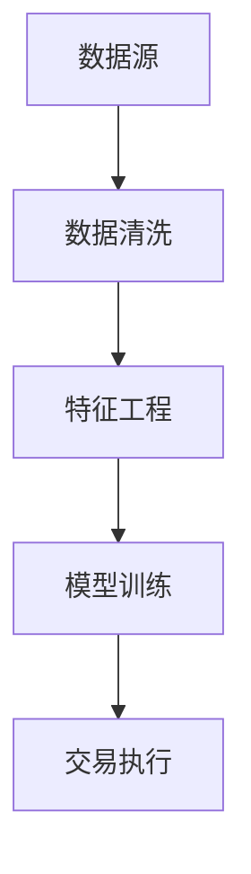

                 

# 机器学习优化交易执行策略

> **关键词**：机器学习，交易执行策略，算法优化，量化交易，风险管理

> **摘要**：本文探讨了机器学习在优化交易执行策略中的应用。通过分析交易执行的核心流程，介绍机器学习的基本概念及其在金融市场的优势，详细讲解了机器学习算法的原理和优化方法。文章还从系统架构和项目实战的角度，展示了如何将机器学习应用于交易执行，并通过实际案例分析和最佳实践，提供了深入的见解和实用建议。

---

# 引言

## 1.1 交易执行的基本概念

交易执行是指在金融市场中按照预定策略将订单转化为交易的过程。交易执行策略的核心目标是通过优化订单执行的时机和方式，降低交易成本，提高收益。传统交易执行方法依赖于人工判断或简单的规则系统，存在效率低、响应慢、决策不精确等问题。

## 1.2 机器学习的引入

机器学习是一种人工智能技术，能够通过数据学习和模式识别，自动优化决策过程。将机器学习应用于交易执行策略，可以显著提高交易的效率和准确性，尤其是在高频交易和复杂市场环境中表现尤为突出。

## 1.3 机器学习优化交易执行的背景

随着金融市场数据的爆炸式增长和交易复杂性的增加，传统交易执行方法已难以满足需求。机器学习凭借其强大的数据处理能力和自适应能力，成为优化交易执行策略的重要工具。

---

# 第1章：机器学习与交易执行的基础

## 1.1 机器学习的基本概念

### 1.1.1 机器学习的定义

机器学习是一种通过数据和经验来训练模型，使其能够进行预测或决策的技术。它分为监督学习、无监督学习和强化学习等多种形式。

### 1.1.2 机器学习的核心算法

包括线性回归、支持向量机（SVM）、随机森林、神经网络等。

### 1.1.3 机器学习与传统交易策略的区别

传统交易策略依赖于人工制定的规则，而机器学习能够通过数据自动优化策略，适应市场变化。

## 1.2 量化交易的基础知识

量化交易是通过数学模型和算法进行交易决策的过程。机器学习在量化交易中的应用能够提高模型的准确性和鲁棒性。

## 1.3 特征工程的重要性

特征工程是将原始数据转化为模型所需特征的过程。在交易执行中，特征工程决定了模型能否有效捕捉市场信号。

---

# 第2章：机器学习优化交易执行的核心算法

## 2.1 监督学习算法

### 2.1.1 线性回归

用于预测交易价格或收益，模型公式为：
$$ y = \beta_0 + \beta_1x + \epsilon $$

### 2.1.2 支持向量机（SVM）

适用于分类问题，通过构建超平面分割数据。

## 2.2 无监督学习算法

### 2.2.1 K均值聚类

用于将交易数据分成不同的类别，便于分析市场状态。

## 2.3 强化学习算法

### 2.3.1 Q-learning

通过奖励机制优化交易决策，适用于动态市场环境。

---

# 第3章：交易执行系统的架构设计

## 3.1 系统架构概述

交易执行系统包括数据收集、特征工程、模型训练和执行系统四个主要部分。

### 3.1.1 数据收集

从多个数据源获取交易数据，清洗和预处理后输入模型。

### 3.1.2 特征工程

将原始数据转化为有用的特征，如移动平均线、波动率等。

### 3.1.3 模型训练

使用训练好的模型进行预测和优化。

### 3.1.4 执行系统

根据模型预测结果执行交易指令。

## 3.2 系统架构图

---

# 第4章：机器学习优化交易执行的实战应用

## 4.1 项目环境安装

安装必要的库，如Python的pandas、numpy、scikit-learn等。

## 4.2 数据收集与预处理

收集历史交易数据，清洗和标准化后进行特征提取。

## 4.3 模型实现

选择合适的算法训练模型，并进行交叉验证优化。

## 4.4 回测与优化

通过回测检验模型的性能，并根据结果调整参数。

## 4.5 结果分析

分析模型的表现，优化策略并进行风险评估。

---

# 第5章：机器学习优化交易执行的高级主题

## 5.1 模型解释性

通过特征重要性分析，理解模型决策的依据。

## 5.2 风险管理

结合VaR等方法，评估交易策略的风险。

## 5.3 高频交易的应用

高频交易中，机器学习能够快速响应市场变化，提高交易效率。

## 5.4 模型调优与优化

通过网格搜索等方法，进一步优化模型性能。

---

# 总结

机器学习在优化交易执行策略中展现出巨大潜力。通过算法优化、系统设计和实战应用，交易执行的效率和准确性得到了显著提升。未来，随着技术的进步，机器学习将在金融领域发挥更加重要的作用。

---

# 参考文献

（此处列出相关文献和资源）

---

通过以上目录和内容，文章详细介绍了机器学习优化交易执行策略的各个方面，从基础概念到算法实现，再到系统设计和实战应用，为读者提供了全面的指导和深入的见解。

