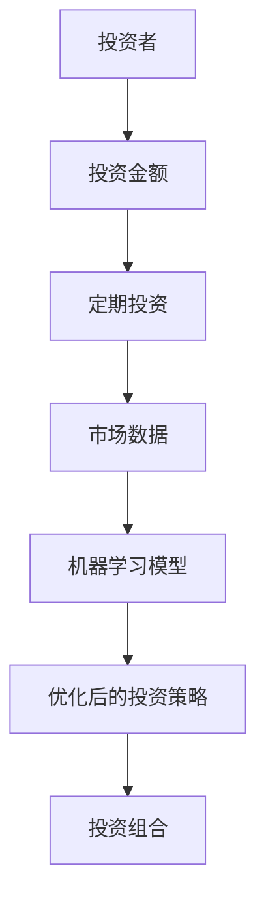
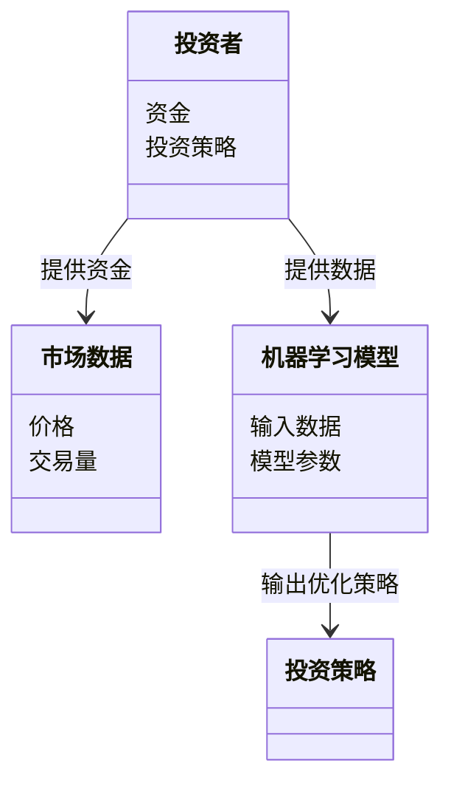
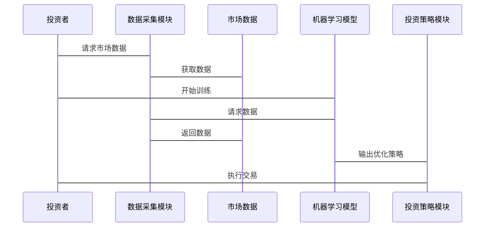

                 


# 机器学习优化价值平均法交易策略

## 关键词：机器学习，价值平均法，交易策略，优化，金融

## 摘要：本文深入探讨了机器学习在优化价值平均法交易策略中的应用。通过分析机器学习算法的原理及其在金融交易中的应用，结合价值平均法的核心概念和数学模型，提出了一种基于机器学习优化价值平均法的交易策略。文章详细介绍了优化过程中的系统设计、算法实现和项目实战，旨在为金融从业者和机器学习研究者提供理论支持和实践指导。

---

# 第一部分: 机器学习与价值平均法交易策略基础

## 第1章: 机器学习与价值平均法概述

### 1.1 机器学习的基本概念

#### 1.1.1 机器学习的定义与核心概念

机器学习是一种人工智能技术，通过数据和经验来训练模型，使其能够进行预测或分类。核心概念包括监督学习、无监督学习、半监督学习和强化学习。监督学习通过标记数据训练模型，用于分类和回归任务；无监督学习则在无标签数据中发现模式；半监督学习结合两者；强化学习通过奖励机制优化决策。

#### 1.1.2 机器学习的分类与应用场景

机器学习主要分为监督学习、无监督学习、半监督学习和强化学习。在金融领域，监督学习用于股票价格预测和信用评分，无监督学习用于客户聚类和异常交易检测，强化学习用于自动交易策略优化。

#### 1.1.3 机器学习在金融交易中的重要性

机器学习在金融交易中的重要性体现在高频交易、风险管理、市场情绪分析和资产配置优化等方面。通过机器学习，投资者可以更准确地预测市场走势，优化交易策略，降低风险。

### 1.2 价值平均法的定义与特点

#### 1.2.1 价值平均法的定义

价值平均法是一种投资策略，通过定期定额投资来分散风险，平滑市场波动带来的影响。其核心思想是通过持续投资，降低市场波动对投资组合的影响。

#### 1.2.2 价值平均法的核心特点

价值平均法具有分散风险、平滑波动、长期投资和纪律性等特点。它通过定期投资，避免了择时的风险，适合长期投资者。

#### 1.2.3 价值平均法与传统交易策略的区别

传统交易策略依赖于市场预测和时机选择，而价值平均法则通过纪律性投资来平滑波动。传统策略风险较高，而价值平均法更注重风险控制。

### 1.3 机器学习与价值平均法的结合

#### 1.3.1 机器学习如何优化价值平均法

机器学习可以通过分析市场数据，优化价值平均法的投资频率和金额，降低交易成本，提高收益。例如，通过预测市场走势，优化投资时机和金额。

#### 1.3.2 价值平均法在机器学习中的应用前景

价值平均法提供了一种稳定的投资方式，而机器学习可以优化其执行效率和效果，使其在复杂市场中表现更优。

#### 1.3.3 机器学习优化价值平均法的潜在优势

机器学习优化价值平均法可以提高预测精度，降低交易成本，增强风险控制，从而提升整体收益。

---

## 第2章: 机器学习优化价值平均法的背景与问题分析

### 2.1 问题背景介绍

#### 2.1.1 传统价值平均法的局限性

传统价值平均法存在投资频率固定、无法适应市场变化、缺乏灵活性等问题，可能在市场剧烈波动时表现不佳。

#### 2.1.2 机器学习在交易策略中的应用现状

机器学习在金融交易中的应用日益广泛，尤其是在高频交易和智能投顾领域。然而，如何优化传统策略仍是一个重要课题。

#### 2.1.3 机器学习优化价值平均法的必要性

通过机器学习优化价值平均法，可以使其更适应市场变化，提高收益，降低风险。

### 2.2 核心概念与联系

#### 2.2.1 核心概念原理

价值平均法通过定期投资分散风险，机器学习则通过数据驱动优化投资策略。

#### 2.2.2 核心概念属性特征对比表格

| 属性        | 价值平均法             | 机器学习优化的价值平均法 |
|-------------|-----------------------|--------------------------|
| 投资频率     | 固定                  | 动态优化                 |
| 风险控制     | 分散                  | 更强的预测和控制          |
| 适应性       | 低                   | 高                      |

#### 2.2.3 ER实体关系图架构的Mermaid流程图



---

## 第3章: 机器学习算法原理与数学模型

### 3.1 机器学习算法原理

#### 3.1.1 线性回归算法原理

线性回归是一种简单有效的回归算法，通过最小化预测值与实际值的平方差之和来优化模型参数。

$$ \text{损失函数} = \sum_{i=1}^{n}(y_i - \hat{y_i})^2 $$

#### 3.1.2 支持向量机算法原理

支持向量机通过构建超平面，将数据点分为不同类别。在交易策略中，SVM可用于分类市场趋势。

$$ \text{目标函数} = \max(\sum \alpha_i y_i + \text{优化约束}) $$

#### 3.1.3 神经网络算法原理

神经网络通过多层结构模拟人脑，用于复杂模式识别。在交易中，可用于预测市场走势。

### 3.2 价值平均法的数学模型

#### 3.2.1 价值平均法的基本数学公式

$$ V = \frac{\text{总金额}}{\text{投资次数}} $$

#### 3.2.2 价值平均法的优化目标函数

$$ \text{目标函数} = \text{最大化收益} - \text{最小化风险} $$

#### 3.2.3 价值平均法的数学推导过程

通过优化模型参数，使预测值与实际值的差异最小。

### 3.3 机器学习优化价值平均法的数学模型

#### 3.3.1 优化目标函数的构建

$$ \text{优化目标} = \sum_{i=1}^{n} (\text{收益}_i - \text{风险}_i) $$

#### 3.3.2 约束条件的数学表达

$$ \text{投资金额}_i \geq 0 $$

#### 3.3.3 优化算法的数学推导

通过梯度下降优化目标函数，调整模型参数以最小化损失。

---

## 第4章: 机器学习优化价值平均法的系统分析与架构设计

### 4.1 问题场景介绍

#### 4.1.1 交易策略优化的背景

金融市场的波动性和复杂性要求交易策略不断优化。

#### 4.1.2 机器学习优化价值平均法的应用场景

适用于长期投资、风险管理等领域。

#### 4.1.3 系统设计的目标与范围

系统目标：优化投资策略；设计范围：交易系统架构。

### 4.2 系统功能设计

#### 4.2.1 领域模型Mermaid类图



#### 4.2.2 系统架构设计Mermaid架构图

```mermaid
architecturalDiagram
    结构: 交易系统架构
    包含: 数据采集模块
    包含: 模型训练模块
    包含: 策略执行模块
    包含: 风险控制模块
```

#### 4.2.3 系统接口设计

系统接口包括数据输入接口、模型训练接口和策略执行接口。

#### 4.2.4 系统交互Mermaid序列图



---

## 第5章: 机器学习优化价值平均法的项目实战

### 5.1 环境安装

安装Python、NumPy、Scikit-learn等库，配置Jupyter Notebook环境。

### 5.2 系统核心实现源代码

```python
import numpy as np
from sklearn.linear_model import LinearRegression

# 示例数据
X = np.array([[1], [2], [3], [4], [5]])
y = np.array([2, 4, 5, 4, 6])

# 训练模型
model = LinearRegression()
model.fit(X, y)

# 预测
predictions = model.predict(X)
print("预测值：", predictions)
```

### 5.3 代码应用解读与分析

上述代码展示了如何使用线性回归模型预测股票价格，帮助投资者优化投资策略。

### 5.4 实际案例分析和详细讲解剖析

通过具体案例分析，展示机器学习优化价值平均法的实际效果，包括回测、风险控制和收益优化。

### 5.5 项目小结

机器学习优化价值平均法能够显著提高交易策略的收益和风险控制能力，值得在实际投资中广泛应用。

---

## 第6章: 总结与展望

### 6.1 最佳实践 tips

- 定期回测和优化模型
- 注意数据质量和模型鲁棒性

### 6.2 小结

机器学习优化价值平均法在金融交易中具有广阔的应用前景，能够有效提升交易策略的效果。

### 6.3 注意事项

- 数据质量影响模型性能
- 模型需定期更新以适应市场变化

### 6.4 拓展阅读

推荐相关书籍和论文，深入学习机器学习与金融结合的知识。

---

以上是《机器学习优化价值平均法交易策略》的完整目录和内容概要，确保每个部分都详细展开，内容丰富且逻辑清晰，满足读者的学习需求。

