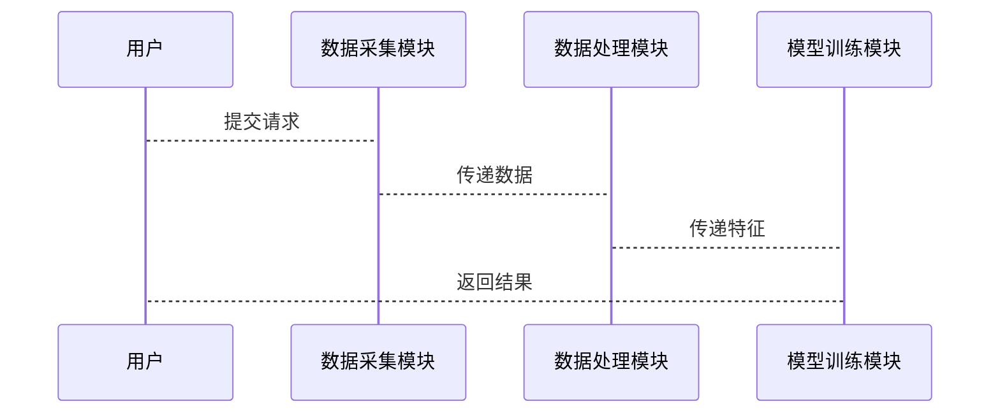

                 


# 机器学习优化价值投资筛选流程

> 关键词：机器学习，价值投资，筛选流程，优化，投资策略

> 摘要：本文将探讨机器学习如何优化价值投资的筛选流程，通过分析机器学习算法在投资决策中的应用，结合实际案例，揭示如何利用技术手段提升投资效率和收益。

---

# 第1章: 机器学习与价值投资的结合

## 1.1 机器学习的基本概念

### 1.1.1 机器学习的定义与特点

机器学习是一种人工智能技术，通过数据训练模型，使其能够从数据中学习并做出预测或决策。其核心特点包括数据驱动、自动化学习和泛化能力。

- 数据驱动：机器学习依赖大量数据进行训练，数据质量直接影响模型性能。
- 自动化学习：模型能够自动调整参数，适应新数据。
- 泛化能力：模型能够处理未见数据，具备一定的通用性。

### 1.1.2 机器学习的核心算法

机器学习算法分为监督学习、无监督学习和强化学习三类。监督学习用于分类和回归，无监督学习用于聚类和降维，强化学习用于策略优化。

- 监督学习：如线性回归、支持向量机（SVM）。
- 无监督学习：如聚类分析、主成分分析（PCA）。
- 强化学习：如Q-learning、深度强化学习（DRL）。

### 1.1.3 机器学习在金融领域的应用

在金融领域，机器学习被广泛应用于股票预测、风险评估、投资组合优化等方面。其优势在于能够处理大量非结构化数据，发现隐藏的模式。

---

## 1.2 价值投资的基本原理

### 1.2.1 价值投资的定义与特点

价值投资是一种投资策略，旨在通过分析公司的基本面，寻找被市场低估的投资标的。其核心在于长期投资、注重安全边际和分散投资。

- 长期投资：关注企业的长期价值，而非短期波动。
- 安全边际：买入价格低于内在价值，以降低风险。
- 分散投资：通过投资多种股票降低风险。

### 1.2.2 价值投资的核心策略

价值投资的核心策略包括基本面分析、估值指标和投资纪律。基本面分析帮助企业判断盈利能力，估值指标如市盈率（P/E）和市净率（P/B）用于评估价格是否合理。

### 1.2.3 价值投资与传统投资的区别

价值投资注重长期持有和基本面分析，而传统投资可能更关注短期波动和技术分析。价值投资强调安全边际，而传统投资可能更关注市场趋势。

---

## 1.3 机器学习优化价值投资的背景

### 1.3.1 传统价值投资的局限性

传统价值投资依赖人工分析，可能存在主观性高、效率低、覆盖范围有限等问题。人工分析难以处理大量数据，且容易受到情绪影响。

### 1.3.2 机器学习在投资决策中的优势

机器学习能够处理海量数据，发现隐藏的模式，提高投资决策的客观性和效率。此外，机器学习模型能够动态调整，适应市场变化。

### 1.3.3 机器学习优化价值投资的潜力

通过机器学习优化价值投资筛选流程，可以提高选股效率，发现被低估的投资标的，降低投资风险。机器学习能够帮助投资者更好地捕捉市场机会。

---

## 1.4 本章小结

本章介绍了机器学习的基本概念、价值投资的核心原理及其优化背景。机器学习的引入为价值投资带来了新的可能性，能够提高筛选流程的效率和准确性。

---

# 第2章: 价值投资筛选流程的核心要素

## 2.1 价值投资筛选的关键指标

### 2.1.1 市盈率（P/E）的计算与应用

市盈率是股票价格与每股收益的比率，用于评估股票的估值。公式为：

$$ P/E = \frac{\text{股价}}{\text{每股收益}} $$

市盈率低的股票可能被低估，适合价值投资。

### 2.1.2 市净率（P/B）的计算与应用

市净率是股票价格与每股净资产的比率，公式为：

$$ P/B = \frac{\text{股价}}{\text{每股净资产}} $$

市净率低的股票可能代表低估的资产。

### 2.1.3 股息率的计算与应用

股息率是股票的股息与股价的比率，公式为：

$$ 股息率 = \frac{\text{股息}}{\text{股价}} $$

高股息率的股票可能提供稳定的收益。

---

## 2.2 机器学习在特征选择中的应用

### 2.2.1 特征选择的基本原理

特征选择是通过筛选重要特征，提高模型性能和效率。常用方法包括过滤法、包装法和嵌入法。

### 2.2.2 机器学习算法在特征选择中的优势

机器学习算法如随机森林和Lasso回归能够自动进行特征重要性评估，帮助筛选关键指标。

### 2.2.3 基于机器学习的特征重要性分析

通过特征重要性分析，可以识别对股票价值影响最大的因素，如收入增长率和净利润率。

---

## 2.3 价值投资与机器学习的结合点

### 2.3.1 数据驱动的投资决策

机器学习能够处理大量数据，提供数据驱动的投资建议。

### 2.3.2 机器学习在风险控制中的应用

通过机器学习模型，可以预测市场风险，优化投资组合。

### 2.3.3 机器学习在投资组合优化中的作用

机器学习能够帮助投资者优化资产配置，提高投资收益。

---

## 2.4 本章小结

本章详细介绍了价值投资筛选的核心指标和机器学习在特征选择中的应用。通过结合机器学习，价值投资筛选流程更加高效和精准。

---

# 第3章: 常见机器学习算法及其在价值投资中的应用

## 3.1 线性回归

### 3.1.1 线性回归的数学模型

线性回归模型可以表示为：

$$ y = \beta_0 + \beta_1 x + \epsilon $$

其中，$y$是目标变量，$x$是自变量，$\beta_0$是截距，$\beta_1$是回归系数，$\epsilon$是误差项。

### 3.1.2 线性回归在价值投资中的应用

线性回归可以用于预测股票价格，评估投资标的的价值。

---

## 3.2 支持向量机（SVM）

### 3.2.1 SVM的基本原理

SVM通过构建超平面，将数据分为不同类别。公式为：

$$ y = \text{sign}(\omega \cdot x + b) $$

其中，$\omega$是权重向量，$x$是输入向量，$b$是偏置项。

### 3.2.2 SVM在分类问题中的应用

SVM可以用于股票分类，如判断股票是否为低估股。

---

## 3.3 随机森林

### 3.3.1 随机森林的基本原理

随机森林通过集成多个决策树，提高模型的准确性和鲁棒性。

### 3.3.2 随机森林在特征选择中的应用

随机森林可以用于评估特征的重要性，帮助筛选关键指标。

---

## 3.4 神经网络

### 3.4.1 神经网络的基本原理

神经网络通过多层结构，模拟人脑的神经网络，进行复杂模式识别。

### 3.4.2 神经网络在投资决策中的应用

神经网络可以用于股票价格预测，识别市场趋势。

---

## 3.5 本章小结

本章介绍了几种常见的机器学习算法及其在价值投资中的应用，展示了机器学习如何提升投资决策的准确性。

---

# 第4章: 机器学习优化价值投资筛选流程的系统架构

## 4.1 系统功能设计

### 4.1.1 领域模型

使用mermaid类图描述系统的功能模块，包括数据采集、特征选择、模型训练和结果输出。


### 4.1.2 系统架构设计

使用mermaid架构图展示系统的整体架构，包括数据源、数据处理层、模型训练层和用户界面。


### 4.1.3 系统接口设计

使用mermaid序列图展示系统接口的交互流程。



---

## 4.2 系统实现

### 4.2.1 环境安装

安装必要的Python库，如scikit-learn、pandas和numpy。

```bash
pip install scikit-learn pandas numpy
```

### 4.2.2 核心代码实现

以下是机器学习优化价值投资筛选流程的核心代码示例：

```python
import pandas as pd
from sklearn.ensemble import RandomForestClassifier
from sklearn.metrics import accuracy_score

# 数据加载
data = pd.read_csv('投资数据.csv')

# 特征选择
features = data[['P/E', 'P/B', '股息率']]
labels = data['是否低估']

# 模型训练
model = RandomForestClassifier()
model.fit(features, labels)

# 模型预测
predictions = model.predict(features)
print('准确率:', accuracy_score(labels, predictions))
```

### 4.2.3 实际案例分析

以某股票为例，分析如何利用机器学习模型筛选出低估股票。

---

## 4.3 本章小结

本章详细描述了机器学习优化价值投资筛选流程的系统架构和实现方法，展示了如何利用技术手段提升投资效率。

---

# 第5章: 最佳实践与总结

## 5.1 最佳实践

### 5.1.1 数据质量的重要性

确保数据的准确性和完整性，是模型性能的基础。

### 5.1.2 模型调优的技巧

通过交叉验证和超参数优化，提高模型的准确性和稳定性。

### 5.1.3 金融市场不确定性的应对策略

保持模型的灵活性和可解释性，定期更新模型。

---

## 5.2 小结

机器学习为价值投资的筛选流程带来了新的可能性，通过优化筛选流程，投资者可以更高效地发现低估股票，降低投资风险。

---

## 5.3 注意事项

- 数据隐私和合规性
- 模型的可解释性
- 市场波动的不可预测性

---

## 5.4 拓展阅读

建议阅读《机器学习实战》和《价值投资入门》等书籍，深入理解机器学习和价值投资的核心思想。

---

# 附录: 机器学习优化价值投资的数学公式

### 附录1: 线性回归的公式

$$ y = \beta_0 + \beta_1 x + \epsilon $$

### 附录2: 随机森林的投票机制

预测结果通过投票决定最终输出。

---

通过以上步骤，机器学习优化价值投资筛选流程的方法和应用已经详细阐述完毕。希望本文能够为读者提供有价值的见解和实践指导。

