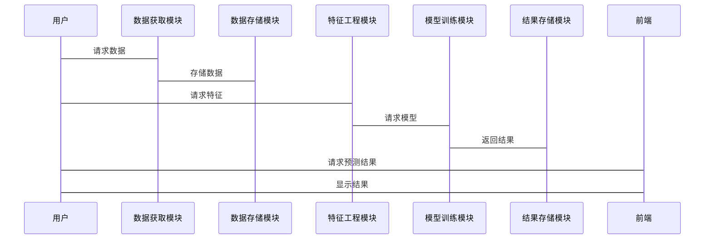

                 


# 机器学习优化价值投资退出决策

> **关键词**：机器学习，价值投资，退出决策，投资策略，风险管理，数据驱动决策，人工智能优化

> **摘要**：机器学习通过分析大量数据，识别市场中的模式和趋势，从而优化价值投资的退出决策。本文从背景介绍、核心概念、算法原理、系统架构设计到项目实战，详细探讨机器学习在价值投资中的应用，结合具体案例，展示如何通过数据驱动的方法提升投资决策的科学性和效率。

---

# 第一部分: 机器学习与价值投资概述

# 第1章: 机器学习与价值投资的背景介绍

## 1.1 机器学习的核心概念

### 1.1.1 机器学习的定义与分类
机器学习是一种人工智能技术，通过算法训练模型，使其能够从数据中学习并做出预测或决策。根据学习方式，可分为监督学习、无监督学习、半监督学习和强化学习。

### 1.1.2 价值投资的基本原理
价值投资是一种投资策略，强调以低于市场价买入具有内在价值的股票，长期持有，等待其价值回归。核心在于识别被市场低估的公司。

### 1.1.3 机器学习在金融领域的应用潜力
机器学习在金融领域的应用广泛，包括股票价格预测、风险管理、投资组合优化等。其强大的数据分析能力使其成为优化投资决策的重要工具。

## 1.2 价值投资退出决策的背景

### 1.2.1 投资退出的定义与重要性
投资退出是指在适当时机卖出投资标的，实现收益。正确的退出决策能最大化收益，减少风险。

### 1.2.2 传统价值投资的局限性
传统价值投资依赖主观判断，存在人为误差和市场变化难以预测的问题，导致退出决策不够科学。

### 1.2.3 机器学习在投资决策中的优势
机器学习能够处理海量数据，发现复杂模式，提供基于数据的决策支持，提高退出决策的科学性。

## 1.3 机器学习优化投资决策的必要性

### 1.3.1 数据驱动决策的优势
通过分析历史数据，机器学习能识别市场趋势和潜在风险，帮助投资者做出更明智的决策。

### 1.3.2 机器学习在风险控制中的作用
机器学习模型能实时监控市场变化，识别潜在风险，优化投资组合，降低风险敞口。

### 1.3.3 技术进步对投资决策的影响
技术进步使得数据获取和处理能力大大提升，机器学习在投资领域的应用越来越广泛和重要。

## 1.4 本章小结
本章介绍了机器学习的核心概念、价值投资的基本原理，以及机器学习在金融领域的潜力，强调了机器学习优化投资决策的必要性。

---

# 第二部分: 机器学习优化价值投资的核心概念

# 第2章: 机器学习在价值投资中的核心概念

## 2.1 机器学习算法与特征工程

### 2.1.1 常见机器学习算法概述
常用的机器学习算法包括线性回归、随机森林、神经网络等，每种算法都有其适用场景和优缺点。

### 2.1.2 特征工程的重要性
特征工程是将原始数据转换为适合模型输入的特征，对模型性能影响重大。在投资中，特征可能包括市盈率、市净率等财务指标。

### 2.1.3 金融数据的特征提取方法
通过统计分析和数据挖掘，提取有用的特征，如动量效应、波动率等，帮助模型更好地捕捉市场信号。

## 2.2 投资决策中的数学模型

### 2.2.1 线性回归模型
线性回归用于预测目标变量与特征变量之间的线性关系，常用于股票价格预测。

### 2.2.2 分类算法在投资决策中的应用
分类算法如随机森林用于将股票分为买、卖或持有类别，帮助投资者做出买卖决策。

### 2.2.3 时间序列分析模型
时间序列模型如ARIMA用于预测未来的价格走势，帮助投资者判断退出时机。

## 2.3 机器学习与投资决策的结合

### 2.3.1 数据驱动的投资策略
基于机器学习模型生成的投资信号，构建数据驱动的投资策略，提升决策的科学性。

### 2.3.2 机器学习在市场预测中的应用
利用机器学习模型分析市场情绪、新闻事件等，预测市场走势，优化退出决策。

### 2.3.3 投资组合优化的机器学习方法
通过机器学习优化投资组合，平衡风险与收益，提升整体投资回报。

## 2.4 本章小结
本章探讨了机器学习算法与特征工程在投资中的应用，分析了数学模型在投资决策中的作用，强调了数据驱动策略的重要性。

---

# 第三部分: 机器学习优化投资决策的算法原理

# 第3章: 机器学习算法原理与实现

## 3.1 线性回归算法

### 3.1.1 线性回归的数学模型
线性回归模型表示为：
$$ y = \beta_0 + \beta_1 x + \epsilon $$
其中，$y$是目标变量，$x$是特征变量，$\epsilon$是误差项。

### 3.1.2 最小二乘法的实现
通过最小化预测值与实际值的平方差之和，求解回归系数$\beta_0$和$\beta_1$。

### 3.1.3 线性回归在投资中的应用
用于预测股票价格，帮助投资者判断退出时机。

## 3.2 随机森林算法

### 3.2.1 随机森林的原理
随机森林是一种集成学习算法，通过构建多棵决策树并集成预测结果，提升模型的准确性和鲁棒性。

### 3.2.2 随机森林在投资决策中的应用
用于股票分类，如判断股票是否为买入、持有或卖出。

### 3.2.3 随机森林的优缺点
优点：抗过拟合，适合高维数据；缺点：计算复杂度高。

## 3.3 神经网络与深度学习

### 3.3.1 神经网络的基本结构
神经网络由输入层、隐藏层和输出层组成，通过多层非线性变换捕捉复杂模式。

### 3.3.2 深度学习在金融中的应用
用于时间序列预测、情感分析等，帮助投资者做出更精准的决策。

### 3.3.3 神经网络的实现示例
使用Keras框架构建一个简单的神经网络模型，用于股票价格预测。

## 3.4 本章小结
本章详细讲解了线性回归、随机森林和神经网络的算法原理及实现，分析了它们在投资中的应用。

---

# 第四部分: 系统架构设计与实现

# 第4章: 系统架构设计与实现

## 4.1 问题场景介绍
构建一个基于机器学习的股票交易系统，帮助投资者优化退出决策。

## 4.2 系统功能设计
系统功能包括数据获取、特征工程、模型训练、预测和策略执行。

### 4.2.1 领域模型（Mermaid 类图）


### 4.2.2 系统架构（Mermaid 架构图）


### 4.2.3 系统交互（Mermaid 序列图）


## 4.3 系统接口设计
定义接口如获取数据接口、特征提取接口、模型预测接口等，确保模块间通信顺畅。

## 4.4 系统实现
使用Python和相关库（如Pandas、Scikit-learn、Keras）实现系统各模块。

## 4.5 系统优化
优化数据处理效率，提升模型预测准确率，确保系统稳定运行。

## 4.6 本章小结
本章通过系统架构设计，展示了如何构建一个完整的机器学习优化投资决策系统。

---

# 第五部分: 项目实战

# 第5章: 项目实战

## 5.1 环境安装

### 5.1.1 安装Python
```bash
# 安装Python
python --version
```

### 5.1.2 安装依赖库
```bash
pip install numpy pandas scikit-learn keras
```

## 5.2 数据获取与预处理

### 5.2.1 获取历史数据
使用Yahoo Finance API获取股票数据。

### 5.2.2 数据清洗
处理缺失值和异常值，确保数据质量。

## 5.3 特征工程

### 5.3.1 提取特征
提取市盈率、市净率等财务指标。

### 5.3.2 数据标准化
使用标准化方法处理特征数据。

## 5.4 模型训练

### 5.4.1 训练线性回归模型
```python
from sklearn.linear_model import LinearRegression
model = LinearRegression()
model.fit(X_train, y_train)
```

### 5.4.2 训练随机森林模型
```python
from sklearn.ensemble import RandomForestClassifier
model = RandomForestClassifier()
model.fit(X_train, y_train)
```

## 5.5 模型预测与结果分析

### 5.5.1 预测股票价格
使用训练好的模型预测未来的价格。

### 5.5.2 结果可视化
绘制实际价格与预测价格的对比图。

## 5.6 实际案例分析
分析具体案例，展示模型在实际投资中的应用效果。

## 5.7 本章小结
本章通过实际项目，展示了如何应用机器学习优化投资决策，从数据获取到模型实现，再到结果分析，提供了一套完整的解决方案。

---

# 第六部分: 总结与展望

# 第6章: 总结与展望

## 6.1 总结
机器学习通过分析海量数据，优化投资决策，提高投资收益和风险管理能力。

## 6.2 最佳实践 tips
- 数据质量至关重要，需进行充分清洗和特征工程。
- 选择合适的算法，结合业务需求进行模型优化。
- 定期更新模型，适应市场变化。

## 6.3 注意事项
- 避免过拟合，确保模型泛化能力。
- 注意数据隐私和合规性，确保合法合规。

## 6.4 未来展望
随着技术进步，机器学习在投资中的应用将更加广泛和深入，如强化学习、生成对抗网络等新技术的应用，将进一步提升投资决策的智能化水平。

## 6.5 本章小结
本章总结了机器学习优化投资决策的优势和应用，并展望了未来的发展方向，为读者提供了进一步研究的方向。

---

# 结语
机器学习在优化价值投资退出决策中的应用前景广阔，通过科学的数据分析和模型优化，投资者能够做出更明智的决策，提升投资收益和风险管理能力。希望本文能为读者提供有价值的参考和启发。

