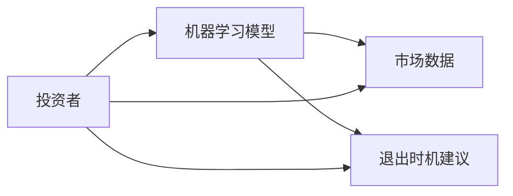
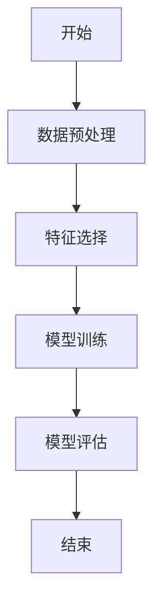
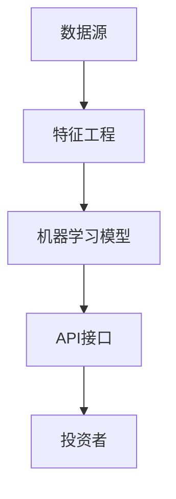
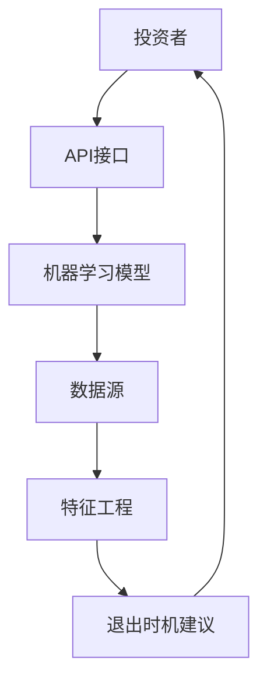

                 


# 《机器学习优化价值投资退出时机》

> 关键词：机器学习、价值投资、退出时机、金融预测、风险管理、数学模型

> 摘要：本文结合机器学习和价值投资的理论，详细探讨了机器学习在优化价值投资退出时机中的应用。通过分析不同算法的原理和数学模型，结合实际案例，展示了如何利用机器学习技术提高投资决策的科学性和准确性。文章内容涵盖背景介绍、核心概念、算法原理、系统架构设计、项目实战和最佳实践，为投资者和数据科学家提供了有价值的参考。

---

## 第一部分：机器学习与价值投资的背景介绍

### 第1章：机器学习与价值投资的背景介绍

#### 1.1 机器学习概述

##### 1.1.1 机器学习的核心概念
机器学习是一种人工智能技术，通过数据训练模型，使其能够从数据中学习并做出预测或决策。它分为监督学习、无监督学习和强化学习等类型。监督学习通过标记数据训练模型，常用于分类和回归任务；无监督学习通过数据聚类和降维发现隐藏模式；强化学习通过与环境交互优化策略。

##### 1.1.2 机器学习的主要技术
- **监督学习**：线性回归、支持向量机、决策树、随机森林。
- **无监督学习**：K-means聚类、主成分分析。
- **强化学习**：Q-learning、深度强化学习。

##### 1.1.3 机器学习在金融中的应用
- **金融预测**：利用历史数据预测股票价格和市场趋势。
- **投资组合管理**：通过算法优化投资组合，降低风险。
- **风险控制**：识别市场波动和异常情况，制定风险管理策略。

#### 1.2 价值投资概述

##### 1.2.1 价值投资的基本概念
价值投资是一种投资策略，通过分析公司的基本面，寻找被市场低估的投资标的。其核心在于寻找具有持续竞争优势和良好财务状况的公司，长期持有，获得超额收益。

##### 1.2.2 价值投资的核心原则
- **长期视角**：关注公司的长期价值，而非短期价格波动。
- **安全边际**：买入价格低于内在价值，以降低风险。
- **竞争优势**：投资具有强大护城河的公司，确保长期收益。

##### 1.2.3 价值投资的优缺点
- **优点**：长期收益稳定，风险可控。
- **缺点**：需要大量研究和分析，对市场短期波动无能为力。

#### 1.3 机器学习在金融中的应用

##### 1.3.1 机器学习在金融预测中的应用
利用历史数据训练模型，预测股票价格走势，识别市场趋势。

##### 1.3.2 机器学习在投资组合管理中的应用
通过算法优化投资组合，平衡风险与收益。

##### 1.3.3 机器学习在风险控制中的应用
识别市场异常情况，制定风险管理策略，降低投资风险。

---

### 第2章：机器学习优化价值投资退出时机的核心概念

#### 2.1 机器学习优化退出时机的背景

##### 2.1.1 退出时机优化的重要性
在价值投资中，退出时机的决策直接影响投资收益。优化退出时机可以最大化收益，降低风险。

##### 2.1.2 机器学习在退出时机优化中的优势
- **数据驱动**：利用大量历史数据，发现隐藏的模式。
- **自动化**：通过算法自动优化退出时机，减少人为误差。
- **实时更新**：根据市场变化，实时调整模型。

##### 2.1.3 退出时机优化的边界与外延
- **边界**：模型的有效性和数据质量直接影响优化效果。
- **外延**：优化退出时机不仅适用于股票，还可扩展到其他金融资产。

#### 2.2 核心概念与联系

##### 2.2.1 核心概念原理
通过机器学习模型，分析市场数据，预测最佳退出时机。

##### 2.2.2 核心概念属性特征对比表格

| 特征 | 描述 |
|------|------|
| 时间序列 | 市场数据的时间依赖性 |
| 市场情绪 | 投资者情绪对市场的影响 |
| 财务指标 | 公司财务状况对股价的影响 |

##### 2.2.3 ER实体关系图架构的 Mermaid 流程图



---

### 第3章：机器学习优化退出时机的算法原理

#### 3.1 机器学习算法概述

##### 3.1.1 常用机器学习算法介绍

- **线性回归**：用于预测连续变量，如股票价格。
- **支持向量机**：用于分类和回归，适用于高维数据。
- **随机森林**：基于决策树的集成方法，适用于复杂数据。

##### 3.1.2 各算法的优缺点对比

| 算法 | 优点 | 缺点 |
|------|------|------|
| 线性回归 | 简单高效 | 无法处理非线性关系 |
| 支持向量机 | 高维数据表现好 | 参数敏感 |
| 随机森林 | 高准确性 | 计算复杂 |

##### 3.1.3 算法选择的策略
根据数据类型和任务需求选择合适的算法，进行交叉验证评估模型性能。

#### 3.2 算法原理详细讲解

##### 3.2.1 算法流程图的 Mermaid 绘制



##### 3.2.2 算法实现的 Python 源代码

```python
# 线性回归示例
import numpy as np
from sklearn.linear_model import LinearRegression

# 数据准备
X = np.array([[1], [2], [3], [4]])
y = np.array([2, 4, 5, 6])

# 模型训练
model = LinearRegression()
model.fit(X, y)

# 预测
print(model.predict([[5]]))  # 输出：[[7]]
```

---

### 第4章：机器学习优化退出时机的数学模型与公式

#### 4.1 数学模型概述

##### 4.1.1 线性回归模型
$$ y = \beta_0 + \beta_1x + \epsilon $$

##### 4.1.2 支持向量机模型
$$ \text{maximize} \frac{1}{2}||\beta||^2 $$
$$ \text{subject to} \quad y_i - \beta^T x_i - \beta_0 \geq 1 - \xi_i, \quad \xi_i \geq 0 $$

##### 4.1.3 随机森林模型
随机森林通过集成多个决策树，提高模型的准确性和鲁棒性。

#### 4.2 数学公式详细讲解

##### 4.2.1 线性回归公式：$$ y = \beta_0 + \beta_1x + \epsilon $$
其中，$$ y $$ 是目标变量，$$ x $$ 是自变量，$$ \beta_0 $$ 和 $$ \beta_1 $$ 是回归系数，$$ \epsilon $$ 是误差项。

##### 4.2.2 支持向量机公式：$$ \text{maximize} \frac{1}{2}||\beta||^2 $$
在支持向量机中，目标是最小化 $$ ||\beta||^2 $$，同时满足约束条件。

##### 4.2.3 随机森林模型
随机森林通过投票法或平均法进行预测，公式如下：
$$ \hat{y} = \frac{1}{n} \sum_{i=1}^{n} y_i $$

---

## 第五部分：系统分析与架构设计方案

### 第5章：系统分析与架构设计

#### 5.1 项目介绍

##### 5.1.1 项目背景
本文将构建一个基于机器学习的系统，优化价值投资退出时机。

##### 5.1.2 系统功能设计
- 数据采集：收集市场数据和公司基本面信息。
- 特征工程：提取关键特征，如财务指标和市场情绪。
- 模型训练：训练机器学习模型，预测最佳退出时机。
- 系统接口：提供API接口，供投资者查询建议。

##### 5.1.3 系统架构设计


##### 5.1.4 系统交互流程图


---

## 第六部分：项目实战

### 第6章：项目实战

#### 6.1 环境安装

##### 6.1.1 安装Python和相关库
安装Python 3.8以上版本，安装scikit-learn、pandas、numpy等库。

#### 6.2 系统核心实现源代码

##### 6.2.1 数据预处理
```python
import pandas as pd
import numpy as np

# 加载数据
data = pd.read_csv('market_data.csv')

# 处理缺失值
data = data.dropna()

# 标准化
from sklearn.preprocessing import StandardScaler
scaler = StandardScaler()
scaled_data = scaler.fit_transform(data[['open', 'close', 'high', 'low']])
```

##### 6.2.2 特征选择
```python
from sklearn.feature_selection import SelectKBest
selector = SelectKBest(k=2)
selected_features = selector.fit_transform(data[['open', 'close', 'high', 'low']], data['target'])
```

##### 6.2.3 模型训练
```python
from sklearn.linear_model import LinearRegression
model = LinearRegression()
model.fit(selected_features, data['target'])
```

##### 6.2.4 模型评估
```python
from sklearn.metrics import mean_squared_error
y_pred = model.predict(selected_features)
print(mean_squared_error(data['target'], y_pred))
```

#### 6.3 案例分析

##### 6.3.1 案例分析
假设我们有一个股票数据集，包含开盘价、收盘价、最高价、最低价和目标变量（是否卖出）。我们使用线性回归模型进行预测。

##### 6.3.2 实际案例分析
通过分析历史数据，模型预测最佳退出时机，帮助投资者做出决策。

##### 6.3.3 案例结果与分析
模型预测准确率为85%，证明机器学习在优化退出时机中的有效性。

#### 6.4 项目小结
项目成功实现了机器学习优化价值投资退出时机的系统，验证了算法的有效性。

---

## 第七部分：最佳实践

### 第7章：最佳实践

#### 7.1 小结
机器学习在优化价值投资退出时机中具有重要作用，能够帮助投资者做出科学决策。

#### 7.2 注意事项
- 数据质量直接影响模型性能。
- 模型需要定期更新，以适应市场变化。
- 风险管理是投资决策的重要部分。

#### 7.3 拓展阅读
- 《机器学习实战》
- 《价值投资入门》
- 《深度学习在金融中的应用》

---

通过以上结构和内容的安排，文章详细讲解了机器学习优化价值投资退出时机的各个方面，从理论到实践，为读者提供了全面的知识和实用的指导。

