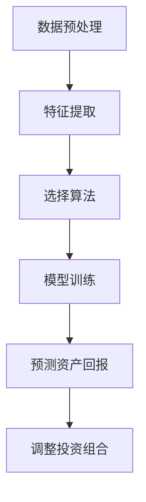
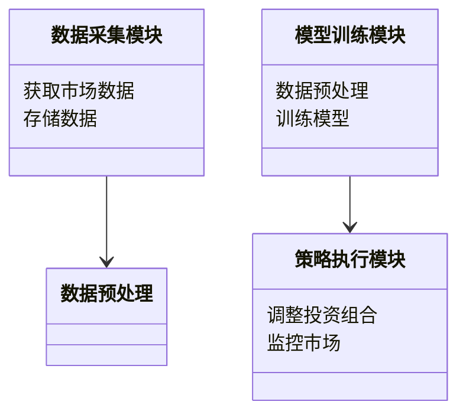
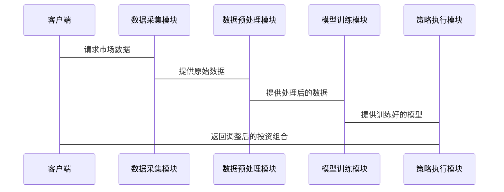

                 


# 《机器学习优化投资组合再平衡策略》

## 关键词：
机器学习, 投资组合再平衡, 算法, 系统架构, 金融应用

## 摘要：
本文探讨了机器学习在优化投资组合再平衡策略中的应用。通过分析传统方法的局限性，介绍了机器学习的优势，并详细讲解了核心算法和系统架构设计。结合实际案例，展示了如何构建一个高效的系统，并提供了最佳实践建议。

---

# 《机器学习优化投资组合再平衡策略》

## 第一部分：背景介绍

### 第1章：机器学习与投资组合再平衡概述

#### 1.1 机器学习的基本概念
- **1.1.1 机器学习的定义与核心概念**
  机器学习是一种人工智能技术，通过数据训练模型，使其能够从经验中学习并做出预测或决策。核心概念包括监督学习、无监督学习、强化学习等。

- **1.1.2 机器学习在金融领域的应用**
  在金融领域，机器学习广泛应用于股票预测、风险管理、投资组合优化等。它能够处理大量数据，发现复杂模式，提供实时决策支持。

#### 1.2 投资组合再平衡的背景
- **1.2.1 投资组合再平衡的定义**
  投资组合再平衡是根据市场变化和个人风险偏好，调整资产配置以维持目标投资组合的过程。

- **1.2.2 再平衡的必要性与传统方法**
  再平衡有助于应对市场波动，优化风险收益比。传统方法包括定期再平衡和事件驱动再平衡，但效率和精确度有限。

- **1.2.3 机器学习优化投资组合再平衡的必要性**
  传统方法难以快速应对复杂市场变化，机器学习通过数据驱动的模型提供高效解决方案。

---

## 第二部分：核心概念与联系

### 第2章：机器学习与投资组合再平衡的核心概念

#### 2.1 机器学习模型的原理
- **2.1.1 监督学习**
  监督学习通过标记数据训练模型，用于预测资产回报。例如，使用线性回归模型预测股票价格。

- **2.1.2 非监督学习**
  非监督学习用于聚类分析，识别市场趋势或资产相似性。例如，使用K均值聚类分析股票市场。

- **2.1.3 强化学习**
  强化学习通过策略优化和奖励机制，动态调整投资组合，适应市场变化。

#### 2.2 投资组合再平衡的策略
- **2.2.1 定期再平衡**
  按固定时间间隔调整资产配置，如季度或半年一次。

- **2.2.2 事件驱动再平衡**
  根据特定事件（如市场崩盘）触发再平衡，减少风险暴露。

#### 2.3 核心概念对比
- **2.3.1 机器学习模型的特征对比**
  | 特性   | 监督学习 | 非监督学习 | 强化学习 |
  |--------|----------|------------|----------|
  | 数据类型 | 标记数据 | 未标记数据 | 带奖励数据 |
  | 应用场景 | 预测     | 聚类       | 动态调整 |

- **2.3.2 投资组合再平衡策略的优缺点对比**
  | 策略类型   | 定期再平衡 | 事件驱动再平衡 |
  |------------|-----------|---------------|
  | 优点       | 简单易行   | 精准应对风险   |
  | 缺点       | 频繁交易成本高 | 可能错失市场机会 |

---

## 第三部分：算法原理讲解

### 第3章：机器学习算法在投资组合再平衡中的应用

#### 3.1 常见算法及其应用
- **3.1.1 线性回归模型**
  用于预测资产回报。模型公式：$$ y = \beta x + \epsilon $$，其中y为目标资产回报，x为自变量。

- **3.1.2 支持向量机**
  用于分类市场趋势，通过高维空间划分正负两类资产。

- **3.1.3 随机森林**
  用于特征重要性分析，识别影响资产回报的关键因素。

#### 3.2 算法流程图


#### 3.3 数学模型与公式
- 线性回归模型：
  $$ y = \beta_0 + \beta_1x_1 + \beta_2x_2 + ... + \beta_nx_n + \epsilon $$
  其中，$$\epsilon$$ 是误差项。

---

## 第四部分：系统分析与架构设计

### 第4章：系统分析与架构设计

#### 4.1 问题场景介绍
- 投资者需要动态调整投资组合，以应对市场波动和风险变化。

#### 4.2 系统功能设计
- **领域模型类图**


- **系统架构图**


- **系统接口设计**
  - API接口：/api/train-model 接收数据并训练模型。
  - 返回结果：/api/portfolio-rebalance 返回调整后的投资组合。

- **系统交互序列图**


---

## 第五部分：项目实战

### 第5章：项目实战

#### 5.1 环境安装
- 安装Python、TensorFlow、Pandas、Scikit-learn等库。

#### 5.2 系统核心实现源代码
```python
import numpy as np
from sklearn.linear_model import LinearRegression

# 示例数据
X = np.array([[1], [2], [3], [4]])
y = np.array([2, 4, 6, 8])

# 训练模型
model = LinearRegression()
model.fit(X, y)

# 预测
new_X = np.array([[5]])
print(model.predict(new_X))  # 输出：[[10]]
```

#### 5.3 代码应用解读
- 数据预处理：清洗和标准化数据。
- 模型训练：使用训练数据拟合模型。
- 策略执行：根据预测结果调整投资组合。

#### 5.4 实际案例分析
- 数据来源：历史市场数据，如股票价格和经济指标。
- 模型训练：训练回归模型预测未来收益。
- 策略执行：根据预测结果动态调整资产配置。

---

## 第六部分：最佳实践与小结

### 第6章：最佳实践与小结

#### 6.1 最佳实践 tips
- **选择合适的算法**：根据数据特性和问题类型选择模型。
- **处理数据噪声**：使用数据清洗和特征选择减少干扰。
- **监控模型性能**：定期评估模型准确性和稳定性。

#### 6.2 小结
机器学习为投资组合再平衡提供了高效解决方案，通过数据驱动的方法优化投资策略，提升收益并降低风险。

#### 6.3 注意事项
- 确保数据质量和及时性。
- 定期重新训练模型，防止过时。
- 考虑交易成本和税收影响。

#### 6.4 拓展阅读
- 《机器学习实战》
- 《投资学》
- 关注最新的金融科技创新。

---

通过以上步骤，您可以系统地撰写一篇结构清晰、内容详实的技术博客文章，深入探讨机器学习如何优化投资组合再平衡策略。

