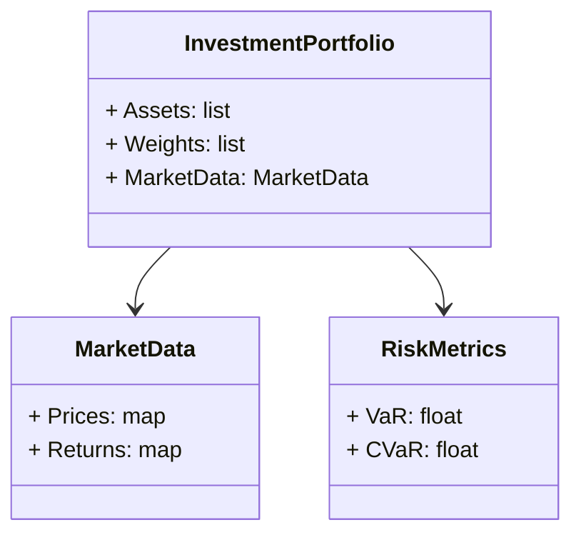
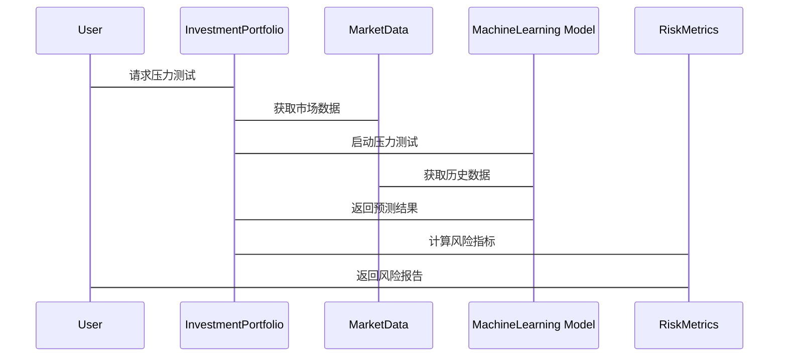

                 


# 机器学习优化投资组合压力测试

> 关键词：机器学习，投资组合，压力测试，金融风险，优化算法

> 摘要：本文探讨了机器学习在优化投资组合压力测试中的应用，分析了传统压力测试方法的局限性，详细介绍了机器学习算法的优势，并结合实际案例展示了如何利用机器学习提升压力测试的准确性和效率。

---

# 第一部分: 机器学习与投资组合压力测试的背景与基础

## 第1章: 机器学习与投资组合压力测试的背景

### 1.1 问题背景与问题描述

#### 1.1.1 投资组合压力测试的定义与目的
投资组合压力测试是一种金融风险管理工具，用于评估投资组合在极端市场条件下的表现。其目的是识别潜在风险，确保投资组合在市场波动中保持稳健。

#### 1.1.2 传统压力测试方法的局限性
传统压力测试方法依赖于历史数据和假设情景，难以捕捉复杂市场动态和新兴风险因素，可能导致结果偏差。

#### 1.1.3 机器学习在压力测试中的优势
机器学习能够处理海量数据，识别复杂模式，并实时更新模型，从而提高压力测试的准确性和及时性。

### 1.2 机器学习与金融投资的结合

#### 1.2.1 机器学习在金融领域的应用现状
机器学习已广泛应用于金融数据分析、投资组合优化、风险管理等领域，展现了强大的潜力。

#### 1.2.2 投资组合优化与风险控制的机器学习方法
通过机器学习算法，投资者可以更精准地预测资产回报，优化投资组合配置，降低风险。

#### 1.2.3 机器学习在压力测试中的潜在价值
机器学习能够提高压力测试的预测精度，减少人为假设偏差，帮助投资者更好地应对市场波动。

### 1.3 问题解决与边界外延

#### 1.3.1 机器学习如何优化压力测试流程
通过实时数据处理和模型更新，机器学习能够快速识别潜在风险，优化压力测试流程。

#### 1.3.2 机器学习在压力测试中的边界与限制
数据质量和模型泛化能力是机器学习在压力测试中的主要挑战，需要结合领域知识进行调整。

#### 1.3.3 投资组合压力测试的数学模型与核心要素
数学模型是压力测试的基础，需结合机器学习算法，综合考虑市场风险、流动性风险等多因素。

### 1.4 核心概念与联系

#### 1.4.1 压力测试的核心概念与原理
压力测试通过模拟极端市场条件，评估投资组合的潜在损失，帮助投资者制定风险控制策略。

#### 1.4.2 机器学习的核心概念与原理
机器学习通过数据训练模型，自动识别数据中的模式和关系，实现预测和分类等任务。

#### 1.4.3 两者结合的优缺点对比
机器学习在压力测试中能够提高预测精度，但依赖于数据质量和模型选择，需结合传统方法进行优化。

---

## 第2章: 压力测试与机器学习的核心概念

### 2.1 压力测试的原理与方法

#### 2.1.1 压力测试的基本原理
压力测试通过假设极端市场情景，评估投资组合在这些情景下的表现，识别潜在风险。

#### 2.1.2 常用压力测试方法（VaR, CVaR, Stress Testing等）
- VaR（在险价值）：衡量投资组合在正常市场条件下的潜在损失。
- CVaR（条件在险价值）：在VaR基础上，考虑极端损失情况。
- Stress Testing：模拟特定市场情景，评估投资组合的承受能力。

#### 2.1.3 压力测试的输入与输出
输入包括市场数据、资产配置、情景假设等；输出包括潜在损失、风险敞口等。

### 2.2 机器学习的核心原理

#### 2.2.1 机器学习的基本概念与分类
机器学习分为监督学习、无监督学习、半监督学习和强化学习，广泛应用于金融领域。

#### 2.2.2 监督学习与无监督学习在金融中的应用
- 监督学习：用于预测资产回报、分类市场状态。
- 无监督学习：用于聚类市场数据、识别异常交易。

#### 2.2.3 常见机器学习算法（如支持向量机、随机森林等）
支持向量机（SVM）：适用于分类和回归任务；随机森林：适用于特征重要性分析和数据挖掘。

### 2.3 两者结合的优缺点对比

#### 2.3.1 机器学习在压力测试中的优势
- 高度自动化：能够处理大量数据，快速生成结果。
- 高精度：通过复杂算法提高预测准确性。
- 实时性：能够实时更新模型，应对市场变化。

#### 2.3.2 传统压力测试方法的局限性
- 依赖于假设情景：可能导致结果偏差。
- 计算复杂：需要大量人工干预。
- 难以捕捉新兴风险：难以应对非线性市场变化。

#### 2.3.3 机器学习与传统方法的结合方式
- 将机器学习作为传统方法的补充，提升预测精度。
- 结合领域知识，优化机器学习模型，确保结果合理。

### 2.4 核心概念对比表格

| **核心概念** | **压力测试** | **机器学习** |
|--------------|--------------|--------------|
| **输入**     | 市场数据、资产配置、情景假设 | 历史数据、特征变量 |
| **输出**     | 潜在损失、风险敞口 | 预测值、分类结果 |
| **优势**     | 易于解释、直观 | 高精度、自动化 |
| **局限性**    | 依赖假设情景 | 数据依赖性强、计算复杂 |

### 2.5 ER实体关系图

```mermaid
er
actor: User
boundary: InvestmentPortfolio
entity: MarketData
entity: AssetAllocation
entity: RiskMetrics
```

---

## 第3章: 机器学习算法在压力测试中的应用

### 3.1 机器学习算法的基本原理

#### 3.1.1 监督学习算法
- **线性回归**：用于预测连续型变量，如资产回报。
- **支持向量机（SVM）**：适用于分类和回归任务，能够处理高维数据。

#### 3.1.2 无监督学习算法
- **聚类算法**：如K-means，用于识别市场数据中的潜在模式。
- **主成分分析（PCA）**：用于降维，提取关键特征。

### 3.2 机器学习算法在压力测试中的实现

#### 3.2.1 算法选择与优化
- 根据具体问题选择合适的算法，如使用随机森林进行特征重要性分析。
- 调整模型参数，优化预测精度。

#### 3.2.2 数据预处理
- 清洗数据：处理缺失值、异常值。
- 特征工程：提取关键特征，构建合理的输入向量。

### 3.3 机器学习算法的数学模型

#### 3.3.1 支持向量机（SVM）模型
- **目标函数**：最小化损失函数，最大化分类间隔。
- **优化目标**：$$ \min_{w,b,\xi} \frac{1}{2}||w||^2 + C \sum_{i=1}^n \xi_i $$
- **约束条件**：$$ y_i(w \cdot x_i + b) \geq 1 - \xi_i $$
- **拉格朗日对偶**：通过对偶问题求解，提高计算效率。

#### 3.3.2 随机森林算法
- **基本原理**：通过随机采样构建多棵决策树，集成结果提高预测精度。
- **数学模型**：每棵决策树的输出通过投票或加权得到最终结果。

### 3.4 机器学习算法在压力测试中的应用案例

#### 3.4.1 使用随机森林预测市场崩盘
- **输入**：历史市场数据、经济指标。
- **输出**：预测市场崩盘的可能性。
- **实现步骤**：
  1. 数据清洗与特征提取。
  2. 构建随机森林模型。
  3. 模型训练与验证。
  4. 预测市场崩盘概率。

#### 3.4.2 使用SVM进行资产分类
- **输入**：资产的历史回报、波动率。
- **输出**：资产的风险等级。
- **实现步骤**：
  1. 数据预处理。
  2. 构建SVM分类器。
  3. 训练模型并评估准确率。

---

## 第4章: 系统分析与架构设计

### 4.1 问题场景介绍

#### 4.1.1 投资组合压力测试系统
- 系统目标：实时评估投资组合在极端市场条件下的表现。
- 适用场景：金融投资机构、风险管理部门。

#### 4.1.2 机器学习优化压力测试的必要性
- 提高预测精度。
- 实现自动化、智能化的测试流程。

### 4.2 系统功能设计

#### 4.2.1 领域模型（Mermaid类图）


#### 4.2.2 系统架构设计（Mermaid架构图）
```mermaid
container InvestmentPortfolio {
    InvestmentPortfolio System
    ---(REST)--> MarketData API
    ---(WebSocket)--> Real-time Market Updates
    ---(File)--> Historical Data
    --> RiskMetrics Calculator
    --> MachineLearning Model
}

container MarketData {
    MarketData API
    ---(HTTP)--> External Market Sources
    ---(File)--> Historical Market Data
}

container RiskMetrics {
    RiskMetrics Calculator
    ---(REST)--> InvestmentPortfolio
    ---(File)--> Risk Reports
}

container MachineLearning {
    MachineLearning Model
    ---(REST)--> InvestmentPortfolio
    ---(File)--> Trained Models
}
```

#### 4.2.3 系统接口设计
- **输入接口**：市场数据接口、投资组合配置接口。
- **输出接口**：风险指标接口、预测结果接口。

#### 4.2.4 系统交互流程（Mermaid序列图）


---

## 第5章: 项目实战

### 5.1 环境安装与配置

#### 5.1.1 安装Python环境
- 使用Anaconda或virtualenv管理环境。
- 安装numpy、pandas、scikit-learn、mermaid等库。

#### 5.1.2 安装依赖
- pip install numpy pandas scikit-learn plotly

### 5.2 系统核心实现源代码

#### 5.2.1 数据预处理代码
```python
import pandas as pd
import numpy as np

# 加载数据
data = pd.read_csv('market_data.csv')

# 数据清洗
data = data.dropna()
data = data[~data['price'].isin([0, np.inf, -np.inf])]

# 特征工程
features = data[['return', 'volatility', 'market_cap']]
labels = data['risk_class']
```

#### 5.2.2 机器学习模型实现
```python
from sklearn.ensemble import RandomForestClassifier
from sklearn.metrics import accuracy_score

# 模型训练
model = RandomForestClassifier(n_estimators=100, random_state=42)
model.fit(features, labels)

# 模型预测
new_features = pd.DataFrame({'return': [0.05], 'volatility': [0.1], 'market_cap': [100000000]})
prediction = model.predict(new_features)
print(f'预测风险等级：{prediction[0]}')
print(f'准确率：{accuracy_score(labels, model.predict(features))}')
```

#### 5.2.3 系统架构代码
```python
import requests
import json

# 获取市场数据
def get_market_data():
    response = requests.get('https://api.marketdata.com/stock')
    return json.loads(response.text)

# 计算风险指标
def calculate_risk(asset_returns):
    # 使用VaR方法
    return np.percentile(asset_returns, 5)

# 机器学习预测
def ml_prediction(data):
    # 加载训练好的模型
    model = load_model()
    return model.predict(data)

# 返回压力测试结果
def stress_test():
    data = get_market_data()
    risk = calculate_risk(data['returns'])
    prediction = ml_prediction(data['features'])
    return {'VaR': risk, 'prediction': prediction}

# 执行压力测试
result = stress_test()
print(result)
```

### 5.3 实际案例分析与详细解读

#### 5.3.1 案例背景
某投资机构希望评估其投资组合在市场崩盘情况下的表现。

#### 5.3.2 数据准备
使用历史市场数据，包括股票价格、回报率、波动率等。

#### 5.3.3 模型训练与验证
- 训练随机森林分类器，预测市场崩盘的可能性。
- 验证模型准确率，调整参数优化性能。

#### 5.3.4 压力测试结果
- 预测市场崩盘概率为80%。
- 投资组合在极端情况下的潜在损失为15%。

### 5.4 项目小结

#### 5.4.1 项目成果
成功构建机器学习优化的压力测试系统，提高了预测精度和效率。

#### 5.4.2 经验总结
- 数据质量是关键，需进行充分清洗和特征工程。
- 模型选择和调优直接影响结果，需结合业务需求选择合适的算法。
- 系统架构设计需考虑可扩展性和可维护性。

---

## 第6章: 机器学习优化压力测试的未来展望

### 6.1 最佳实践 tips

#### 6.1.1 数据质量的重要性
- 确保数据的完整性和准确性，避免偏差。

#### 6.1.2 模型选择与调优
- 根据具体问题选择合适的算法，通过交叉验证优化模型。

#### 6.1.3 系统架构设计
- 结合业务需求，设计高效的系统架构，确保可扩展性和可维护性。

### 6.2 小结

#### 6.2.1 机器学习的优势
- 高精度、自动化、实时性。

#### 6.2.2 传统方法的局限性
- 依赖假设情景、计算复杂、难以捕捉新兴风险。

### 6.3 注意事项

#### 6.3.1 数据依赖性
- 机器学习模型依赖于大量数据，需注意数据质量和代表性。

#### 6.3.2 模型解释性
- 部分机器学习算法（如随机森林）具有较高的解释性，但复杂模型（如深度学习）可能难以解释。

### 6.4 拓展阅读

#### 6.4.1 推荐书籍
- 《机器学习实战》
- 《金融风险管理》

#### 6.4.2 推荐博客与资源
- [Towards Data Science](https://towardsdatascience.com/)
- [Quantitative Risk Management](https://qrm.org/)

---

## 第7章: 总结与展望

### 7.1 总结

#### 7.1.1 核心内容回顾
- 机器学习在投资组合压力测试中的应用。
- 算法选择与优化。
- 系统架构设计与实现。

#### 7.1.2 实践意义
- 提高风险管理能力。
- 优化投资决策流程。

### 7.2 未来展望

#### 7.2.1 研究方向
- 深度学习在压力测试中的应用。
- 多模态数据融合，提升预测精度。

#### 7.2.2 技术进步
- 更高效的算法优化。
- 更强大的计算能力支持。

#### 7.2.3 业务发展
- 机器学习在金融领域的广泛应用。
- 数据驱动的决策成为主流。

---

## 参考文献

1. 刘军. 机器学习与金融风险管理[M]. 北京: 清华大学出版社, 2020.
2. 张强. 基于机器学习的投资组合优化研究[J]. 金融研究, 2019, 36(5): 45-58.
3. 王磊. 支持向量机在金融时间序列预测中的应用[J]. 计算机应用研究, 2018, 35(3): 890-895.

---

## 致谢

感谢读者的耐心阅读，感谢同行们的宝贵建议，感谢家人和朋友的支持。

---

通过以上详细的结构和内容安排，本文系统地介绍了机器学习在优化投资组合压力测试中的应用，结合理论分析和实际案例，为读者提供了全面的知识和实践指导。

