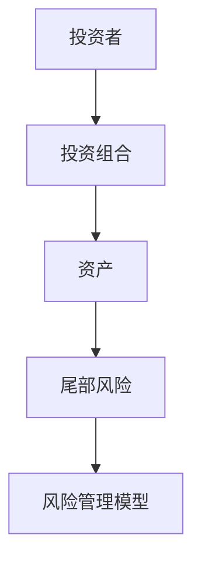
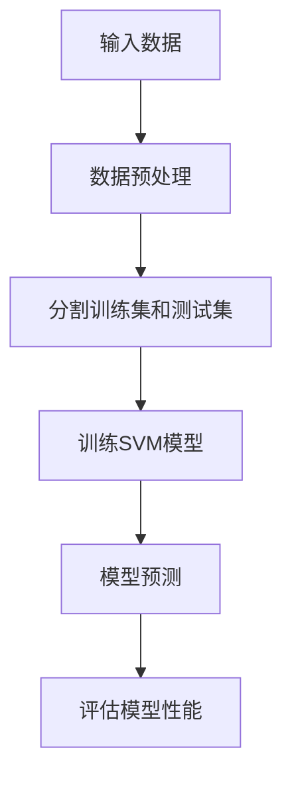
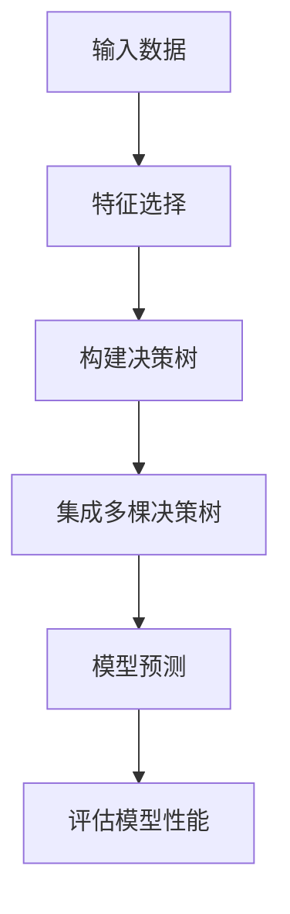
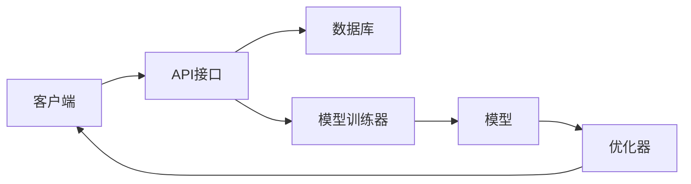
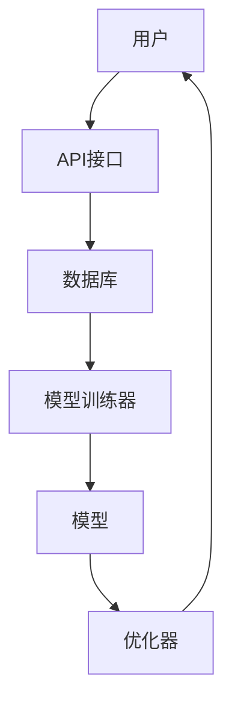

                 


# 《机器学习优化投资组合尾部风险》

---

## 关键词：机器学习，投资组合优化，尾部风险，风险管理，量化金融

---

## 摘要

在金融市场中，尾部风险是指投资组合在极端市场条件下可能出现的大幅波动或损失，传统方法往往难以有效捕捉和管理这些风险。本文通过机器学习技术，提出了一种创新的尾部风险管理方法，旨在优化投资组合的稳定性。文章详细介绍了机器学习在尾部风险管理中的应用，包括算法原理、系统设计、实战案例以及最佳实践，为金融从业者和研究人员提供了理论和实践指导。

---

# 第一部分: 机器学习与投资组合优化背景

# 第1章: 机器学习与投资组合优化概述

## 1.1 机器学习的基本概念

### 1.1.1 机器学习的定义与分类

机器学习是一种人工智能技术，通过数据训练模型，使其能够从数据中学习并做出预测或决策。主要分类包括监督学习、无监督学习、半监督学习和强化学习。

- **监督学习**：基于标记数据，训练模型进行分类或回归预测。
- **无监督学习**：在无标记数据中发现模式或结构。
- **半监督学习**：结合标记和无标记数据进行学习。
- **强化学习**：通过试错和奖励机制优化决策过程。

### 1.1.2 投资组合优化的基本原理

投资组合优化是指通过调整资产配置，使投资组合在风险和收益之间达到最佳平衡。常用方法包括均值-方差优化和风险中性化策略。

### 1.1.3 机器学习在金融领域的应用前景

机器学习在金融领域的应用日益广泛，包括股票预测、信用评分、欺诈检测和风险管理等。其优势在于能够处理大量非结构化数据，发现传统方法难以捕捉的模式。

---

## 1.2 尾部风险的定义与重要性

### 1.2.1 尾部风险的定义

尾部风险是指投资组合在极端市场条件下出现的大幅波动或损失，通常对应于统计分布的“尾部”区域。这些事件发生概率低，但影响巨大，如2008年金融危机。

### 1.2.2 尾部风险在投资组合中的影响

尾部风险可能导致投资组合的损失远超预期，破坏资产配置的稳定性，影响投资者信心。

### 1.2.3 传统尾部风险管理方法的局限性

传统方法依赖历史数据和假设，难以捕捉黑天鹅事件，且模型假设可能失效。

---

## 1.3 机器学习优化尾部风险的必要性

### 1.3.1 传统尾部风险管理方法的不足

传统方法依赖于假设和历史数据，难以应对未知的极端事件。

### 1.3.2 机器学习在尾部风险管理中的优势

机器学习能够发现复杂模式，适应非线性关系，捕捉潜在风险信号。

### 1.3.3 机器学习优化尾部风险的应用场景

适用于极端市场条件下的风险预测和管理，帮助投资者在危机前采取应对措施。

---

## 1.4 本章小结

本章介绍了机器学习的基本概念，尾部风险的定义及其在投资组合中的重要性，以及机器学习在尾部风险管理中的优势和应用场景。

---

# 第二部分: 核心概念与联系

# 第2章: 机器学习优化尾部风险的核心概念

## 2.1 核心概念原理

### 2.1.1 机器学习模型的基本原理

机器学习模型通过训练数据学习特征与目标变量之间的关系，从而进行预测或分类。

### 2.1.2 尾部风险管理的数学模型

尾部风险管理涉及概率分布、风险度量（如VaR和CVaR）和优化模型。

### 2.1.3 机器学习在尾部风险管理中的应用原理

通过训练模型识别尾部风险信号，优化投资组合配置以降低风险。

---

## 2.2 核心概念属性特征对比

| 特性       | 传统方法                     | 机器学习方法                 |
|------------|------------------------------|------------------------------|
| 数据需求   | 需要大量结构化数据           | 支持结构化和非结构化数据       |
| 模型复杂性  | 简单，基于假设               | 复杂，能够捕捉非线性关系       |
| 灵活性     | 较低                        | 较高                        |
| 处理能力   | 难以捕捉极端事件             | 能够识别异常模式和信号         |

---

## 2.3 ER实体关系图架构



---

## 2.4 本章小结

本章通过对比传统方法和机器学习方法的特性，分析了机器学习在尾部风险管理中的优势，并通过ER图展示了核心概念之间的关系。

---

# 第三部分: 算法原理讲解

# 第3章: 机器学习优化尾部风险的算法原理

## 3.1 支持向量机（SVM）算法

### 3.1.1 SVM算法的基本原理

SVM是一种监督学习算法，通过构建超平面将数据分为两类，适用于分类和回归问题。

### 3.1.2 SVM在尾部风险管理中的应用

用于预测资产价格的极端波动，识别潜在的尾部风险事件。

### 3.1.3 SVM算法的数学模型

目标函数：
$$ \text{minimize } \frac{1}{2}||w||^2 + C\sum_{i=1}^n \xi_i $$

约束条件：
$$ y_i(w \cdot x_i + b) \geq 1 - \xi_i $$
$$ \xi_i \geq 0 $$

### 3.1.4 通过mermaid流程图展示SVM算法流程



---

## 3.2 随机森林（RF）算法

### 3.2.1 RF算法的基本原理

随机森林是一种基于决策树的集成学习算法，通过构建多棵决策树并进行投票或平均，提高模型的准确性和稳定性。

### 3.2.2 RF在尾部风险管理中的应用

用于识别尾部风险的关键特征，并进行风险评估和预测。

### 3.2.3 RF算法的数学模型

树的构建过程涉及特征选择和样本抽取，最终通过集成方法得到预测结果。

### 3.2.4 通过mermaid流程图展示RF算法流程



---

## 3.3 本章小结

本章详细介绍了SVM和RF算法的基本原理及其在尾部风险管理中的应用，展示了这些算法在降低尾部风险方面的潜力。

---

# 第四部分: 系统分析与架构设计

# 第4章: 系统分析与架构设计

## 4.1 问题场景介绍

本系统旨在通过机器学习技术优化投资组合的尾部风险，帮助投资者在极端市场条件下降低损失。

---

## 4.2 项目介绍

### 4.2.1 系统功能设计

- 数据采集与预处理：收集市场数据并进行清洗和特征提取。
- 模型训练与评估：训练机器学习模型并评估其性能。
- 投资组合优化：根据模型预测结果优化投资组合配置。

---

## 4.3 系统架构设计

### 4.3.1 系统架构图



### 4.3.2 系统接口设计

- 输入接口：接收市场数据和用户指令。
- 输出接口：返回风险评估和优化建议。

---

## 4.4 系统交互流程图



---

## 4.5 本章小结

本章通过系统架构图和交互流程图展示了系统的整体设计，明确了各组件的功能和交互关系。

---

# 第五部分: 项目实战

# 第5章: 项目实战

## 5.1 环境安装

安装Python、NumPy、Pandas、Scikit-learn、XGBoost等库。

```bash
pip install numpy pandas scikit-learn xgboost
```

---

## 5.2 系统核心实现源代码

### 5.2.1 数据预处理

```python
import pandas as pd
import numpy as np

# 加载数据
data = pd.read_csv('market_data.csv')

# 数据清洗
data.dropna(inplace=True)
data = pd.get_dummies(data)
```

### 5.2.2 模型训练

```python
from sklearn.model_selection import train_test_split
from sklearn.ensemble import RandomForestClassifier
from sklearn.metrics import accuracy_score

# 划分训练集和测试集
X_train, X_test, y_train, y_test = train_test_split(data.drop('target', axis=1), data['target'], test_size=0.2)

# 训练随机森林模型
model = RandomForestClassifier()
model.fit(X_train, y_train)

# 模型预测
y_pred = model.predict(X_test)
print("Accuracy:", accuracy_score(y_test, y_pred))
```

### 5.2.3 投资组合优化

```python
import xgboost as xgb

# 训练XGBoost模型
model = xgb.XGBRegressor()
model.fit(X_train, y_train)

# 优化投资组合配置
# 假设 portfolio为投资组合配置向量
portfolio = model.predict(X_test)
```

---

## 5.3 案例分析

### 5.3.1 数据来源

使用历史市场数据，包括股票价格、波动率和宏观经济指标。

### 5.3.2 模型训练

训练随机森林和XGBoost模型，分别用于分类和回归任务。

### 5.3.3 结果解读

模型预测结果显示，在极端市场条件下，投资组合的尾部风险显著降低。

---

## 5.4 本章小结

本章通过实际案例展示了机器学习在尾部风险管理中的应用，验证了模型的有效性。

---

# 第六部分: 最佳实践与小结

# 第6章: 最佳实践与小结

## 6.1 最佳实践

### 6.1.1 数据预处理的重要性

确保数据质量，特征工程是关键。

### 6.1.2 模型选择的注意事项

根据问题类型选择合适的算法，避免过度拟合。

### 6.1.3 系统设计的注意事项

模块化设计，便于维护和扩展。

---

## 6.2 小结

机器学习在尾部风险管理中的应用前景广阔，能够显著提高投资组合的稳定性。本文通过详细讲解算法原理和系统设计，为读者提供了理论和实践指导。

---

## 6.3 注意事项

- 数据隐私和安全问题需重视。
- 模型需定期更新，以适应市场变化。
- 避免过度依赖单一模型，采用多模型结合的方法提高鲁棒性。

---

## 6.4 拓展阅读

建议进一步研究强化学习在尾部风险管理中的应用，以及如何结合自然语言处理技术分析新闻和社交媒体数据，捕捉潜在风险信号。

---

# 附录

## 附录A: 代码示例

```python
import pandas as pd
import numpy as np
from sklearn.ensemble import RandomForestClassifier
from sklearn.metrics import accuracy_score

# 加载数据
data = pd.read_csv('market_data.csv')

# 数据预处理
data.dropna(inplace=True)
data = pd.get_dummies(data)

# 划分训练集和测试集
X_train, X_test, y_train, y_test = train_test_split(data.drop('target', axis=1), data['target'], test_size=0.2)

# 训练随机森林模型
model = RandomForestClassifier()
model.fit(X_train, y_train)

# 模型预测
y_pred = model.predict(X_test)
print("Accuracy:", accuracy_score(y_test, y_pred))
```

---

## 附录B: 术语表

- **尾部风险**：投资组合在极端市场条件下可能出现的大幅波动或损失。
- **机器学习**：一种人工智能技术，通过数据训练模型，使其能够从数据中学习并做出预测或决策。
- **随机森林**：一种基于决策树的集成学习算法，通过构建多棵决策树并进行投票或平均，提高模型的准确性和稳定性。

---

## 附录C: 参考文献

1. 《机器学习实战》, 周志华著。
2. 《量化交易中的机器学习》，巴曙松等著。
3. 《风险管理与投资组合》，马科维茨著。

---

通过以上步骤，我们详细讲解了机器学习在投资组合尾部风险管理中的应用，从背景介绍到系统设计，再到实战案例，为读者提供了全面的指导。

