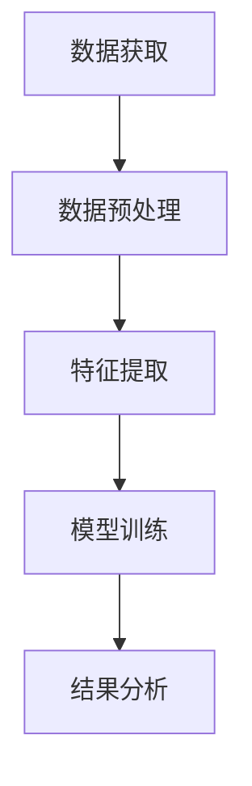
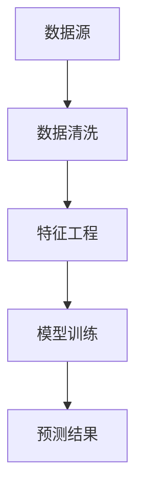
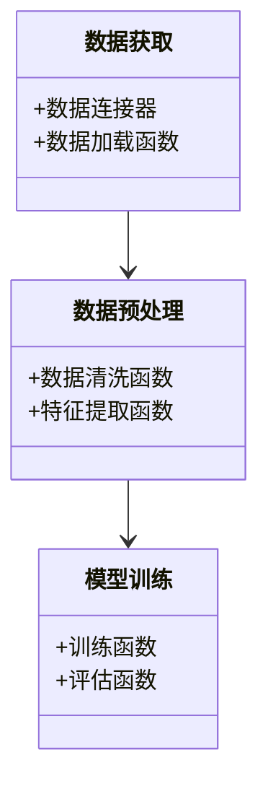

                 


# 机器学习优化费雪成长股选择过程

> 关键词：机器学习，费雪成长股，股票选择，算法优化，系统架构

> 摘要：本文探讨如何利用机器学习技术优化费雪成长股的选择过程。通过分析股票数据的特征，选择合适的算法，并设计高效的系统架构，最终实现自动化、高精度的选股策略。

---

## 第一章：机器学习与费雪成长股选择的背景

### 1.1 费雪成长股的基本概念
- **定义**：费雪成长股指的是那些具有持续增长潜力的公司股票，通常关注公司的收入和利润增长率。
- **核心特征**：高ROE（净资产收益率）、稳定的收入增长、良好的管理团队等。
- **投资策略**：长期持有，关注公司基本面。

### 1.2 机器学习的基本概念
- **定义**：机器学习是一种通过数据训练模型，使其能够做出预测或决策的技术。
- **核心要素**：数据、模型、算法、特征工程。
- **应用领域**：包括图像识别、自然语言处理、金融分析等。

### 1.3 机器学习优化费雪成长股选择的意义
- **传统选股方法的局限性**：依赖经验，主观性强，难以处理大量数据。
- **机器学习的优势**：自动化分析，发现潜在模式，提高选股准确性。
- **结合的可行性**：利用机器学习处理历史数据，预测未来表现。

---

## 第二章：机器学习在股票投资中的应用概述

### 2.1 股票数据分析的特征
- **数据类型**：时间序列数据，包含开盘价、收盘价、最高价、最低价等。
- **特征提取**：移动平均线、相对强弱指数、成交量等技术指标。
- **时间序列特性**：依赖过去的价格走势预测未来。

### 2.2 机器学习在股票预测中的应用
- **回归模型**：用于预测股票价格。
- **分类模型**：用于判断股票是否上涨或下跌。
- **聚类模型**：用于市场分段和风险评估。

### 2.3 费雪成长股选择的机器学习方法
- **基于特征的选股方法**：通过筛选特定的财务指标。
- **基于模型的选股方法**：利用回归或分类模型预测成长潜力。
- **基于规则的选股方法**：结合机器学习和人工规则。

---

## 第三章：机器学习算法与数学模型

### 3.1 线性回归模型
- **基本原理**：通过最小化预测值与实际值的平方差之和来训练模型。
- **数学公式**：$$ y = \beta_0 + \beta_1x + \epsilon $$
- **应用**：预测股票价格。

### 3.2 支持向量机（SVM）
- **基本原理**：通过找到一个超平面，将数据分成两类。
- **数学公式**：$$ \text{目标函数}： \text{最小化} \frac{1}{2}||\beta||^2 + C\sum_{i=1}^n \xi_i $$
- **应用**：用于股票涨跌分类。

### 3.3 随机森林与梯度提升树
- **随机森林**：通过集成多个决策树提高准确性和鲁棒性。
- **梯度提升树**：通过迭代优化模型，减少预测误差。
- **应用**：用于股票价格预测和风险评估。

---

## 第四章：系统架构设计

### 4.1 系统功能设计
- **数据获取**：从数据库获取历史股票数据。
- **数据预处理**：清洗、特征提取和标准化。
- **模型训练**：选择合适的算法，训练模型。
- **结果分析**：评估模型性能，调整参数。

### 4.2 系统架构图（Mermaid）


### 4.3 数据流图（Mermaid）


### 4.4 类图（Mermaid）


---

## 第五章：项目实战

### 5.1 环境配置
- **Python版本**：3.8+
- **库依赖**：pandas、numpy、scikit-learn、xgboost。

### 5.2 数据集介绍
- 数据来源：股票的历史数据，包括开盘价、收盘价、成交量等。
- 数据大小：例如，包含过去5年的每日数据，约1000条记录。

### 5.3 特征选择
```python
# 示例代码
import pandas as pd

# 加载数据
data = pd.read_csv('stock_data.csv')

# 选择特征
features = ['open', 'high', 'low', 'volume', 'close']
target = 'label'  # label可以是涨跌标签

# 特征工程
data = data[features + [target]]
```

### 5.4 模型实现
```python
from sklearn.ensemble import RandomForestRegressor
from sklearn.model_selection import train_test_split

# 数据分割
X_train, X_test, y_train, y_test = train_test_split(data[features], data[target], test_size=0.2)

# 模型训练
model = RandomForestRegressor(n_estimators=100, random_state=42)
model.fit(X_train, y_train)

# 模型预测
y_pred = model.predict(X_test)
```

### 5.5 结果分析
- 模型性能评估：通过准确率、召回率、F1分数等指标评估模型表现。
- 模型调优：使用网格搜索优化参数，如n_estimators、max_depth等。

---

## 第六章：优化与改进

### 6.1 模型调参
- 使用网格搜索或随机搜索优化模型参数，提高预测准确率。

### 6.2 集成学习
- 结合多种算法的结果，如随机森林和XGBoost，进一步提高预测性能。

### 6.3 风险管理
- 结合止损策略，控制投资风险。
- 定期重新训练模型，适应市场变化。

---

## 第七章：总结与展望

### 7.1 总结
- 机器学习为费雪成长股的选择提供了新的思路，提高了选股的准确性和效率。
- 系统化的架构设计和算法优化是实现这一目标的关键。

### 7.2 展望
- 结合NLP技术分析公司新闻，进一步优化选股策略。
- 探索强化学习在动态投资决策中的应用。

---

## 参考文献
- [1] 李航. 《机器学习实战》
- [2] 费雪. 《成长股的非理性定价》
- [3] 周志华. 《机器学习》

---

通过以上目录结构，文章将详细讲解机器学习如何优化费雪成长股的选择过程，从理论到实践，帮助读者全面理解和应用这一方法。

