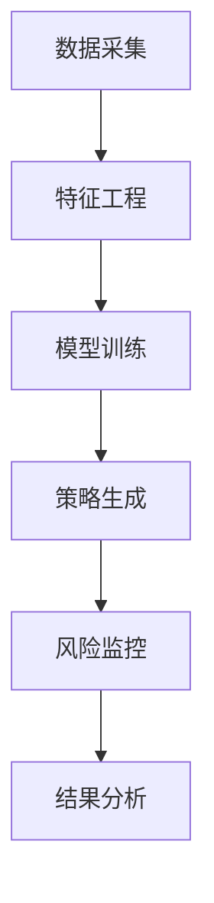
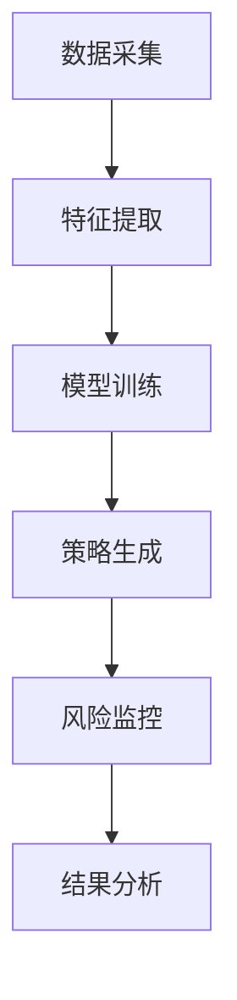
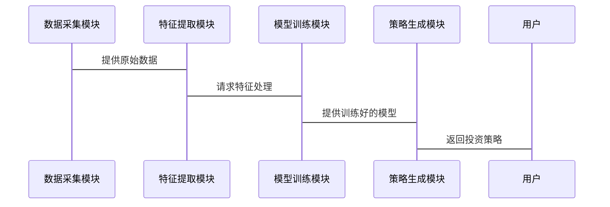

                 

# 《机器学习优化长期价值投资策略》

## 关键词：  
- 机器学习  
- 长期价值投资  
- 投资策略优化  
- 金融数据分析  
- AI在投资中的应用  

## 摘要：  
本文系统地探讨了机器学习在优化长期价值投资策略中的应用。从机器学习的基本原理到其在金融领域的实际应用，再到如何构建高效的投资策略模型，本文为读者提供了全面的理论和实践指导。通过详细分析机器学习算法、投资策略优化方法、系统架构设计以及项目实战案例，本文旨在帮助读者理解如何利用机器学习技术提升投资决策的准确性和效率，最终实现长期稳健的投资回报。

---

# 第一章：背景介绍

## 1.1 机器学习与长期价值投资的背景

### 1.1.1 机器学习的定义与核心概念  
机器学习是一种人工智能技术，通过数据驱动的方式，让模型从数据中学习规律并进行预测或决策。其核心概念包括：  
- **数据驱动**：依赖大量数据进行模式识别。  
- **模型训练**：通过优化算法调整模型参数。  
- **预测与决策**：基于模型输出结果辅助决策。  

### 1.1.2 长期价值投资的定义与核心要素  
长期价值投资是指以企业的基本面分析为基础，寻找具有长期增长潜力的企业进行投资。其核心要素包括：  
- **基本面分析**：关注企业的财务状况、盈利能力、行业地位等。  
- **估值模型**：如DCF模型（ discounted cash flow model）。  
- **投资组合管理**：通过分散投资降低风险。  

### 1.1.3 机器学习在金融领域的应用现状  
- **股票预测**：利用历史数据预测股价走势。  
- **风险管理**：识别市场风险和投资组合风险。  
- **交易策略优化**：基于实时数据优化交易决策。  

### 1.1.4 机器学习优化长期价值投资的必要性  
传统价值投资依赖人工分析，存在主观性强、效率低、难以处理海量数据等问题。机器学习通过自动化分析和大数据处理，能够显著提升投资策略的科学性和效率。

---

## 1.2 问题背景与问题描述  

### 1.2.1 传统价值投资的局限性  
- 分析耗时且主观，容易受情绪影响。  
- 无法有效处理海量数据，难以发现潜在投资机会。  
- 风险控制能力有限，难以应对市场波动。  

### 1.2.2 机器学习在投资策略优化中的作用  
- 提供数据驱动的决策支持。  
- 自动化分析海量数据，发现潜在投资机会。  
- 实时监控市场变化，优化投资组合。  

### 1.2.3 问题解决的思路与目标  
- 利用机器学习技术构建自动化投资策略模型。  
- 结合基本面分析和数据驱动方法，优化投资决策。  
- 实现风险可控、收益最大化的目标。  

### 1.2.4 问题的边界与外延  
- 专注于股票投资领域，不涉及其他金融产品。  
- 短期与长期投资策略相结合，以长期价值投资为主。  

### 1.2.5 核心概念的联系与对比  

#### 表1.1：机器学习与长期价值投资的核心概念对比  

| **核心概念**       | **机器学习**                       | **长期价值投资**                 |
|--------------------|------------------------------------|-----------------------------------|
| 核心目标           | 发现数据中的规律                   | 寻找具有长期增长潜力的企业       |
| 数据来源           | 历史数据、市场数据                 | 企业财务数据、行业数据           |
| 决策方式           | 模型驱动的自动化决策               | 人工分析结合模型辅助决策         |
| 优势               | 高效、客观、可量化                 | 专业性、长期性、风险可控性       |

---

## 1.3 核心概念与联系  

### 1.3.1 机器学习的核心原理  
- 数据驱动：通过大量数据训练模型，提取特征并预测结果。  
- 模型训练：利用优化算法（如梯度下降）调整模型参数，使其更好地拟合数据。  
- 预测与决策：基于训练好的模型，对未来的市场变化进行预测，并生成投资决策。  

### 1.3.2 长期价值投资的策略框架  
- 基于基本面分析，寻找低估的企业。  
- 构建多元化的投资组合，分散风险。  
- 长期持有，关注企业的持续增长。  

### 1.3.3 两者结合的概念结构与核心要素  

#### 图1.1：机器学习优化长期价值投资的流程图  

---

## 1.4 总结与展望  

- 本章总结了机器学习与长期价值投资的基本概念和核心要素，并分析了机器学习在优化投资策略中的重要作用。  
- 展望部分指出，随着AI技术的不断发展，机器学习将在金融领域发挥更大的作用，特别是在投资策略优化和风险管理方面。  

---

# 第二章：机器学习与价值投资的核心概念

## 2.1 机器学习的核心原理  

### 2.1.1 数据驱动的特征提取  
- 从股票数据中提取有用的特征，如市盈率、市净率、ROE等。  
- 使用特征工程方法（如PCA）降维，提高模型效率。  

### 2.1.2 模型训练与优化  
- 选择合适的算法（如随机森林、支持向量机）进行模型训练。  
- 通过交叉验证优化模型参数，防止过拟合。  

### 2.1.3 预测与决策  
- 基于模型预测结果，生成买入、卖出或持有股票的信号。  

---

## 2.2 长期价值投资的策略框架  

### 2.2.1 基本面分析的核心要素  
- **企业财务状况**：利润表、资产负债表、现金流。  
- **行业地位**：市场占有率、竞争格局。  
- **管理层能力**：公司治理、管理团队稳定性。  

### 2.2.2 股票估值模型的构建  
- **DCF模型**：预测未来现金流，折现计算企业价值。  
- **相对估值法**：比较同类企业的估值倍数。  

### 2.2.3 投资组合优化的策略  
- **分散化投资**：降低个股风险。  
- **动态调整**：根据市场变化优化持仓。  

---

## 2.3 核心概念的联系与对比  

### 表2.1：机器学习与传统价值投资的对比  

| **对比维度**       | **机器学习**                       | **传统价值投资**                 |
|--------------------|------------------------------------|-----------------------------------|
| 数据来源           | 大量结构化数据                     | 主要依赖财务数据和行业数据       |
| 分析方式           | 自动化分析，基于算法               | 人工分析，依赖分析师经验         |
| 决策速度           | 高效，实时处理                   | 较慢，依赖人工分析和判断         |
| 适用场景           | 处理海量数据，发现潜在机会         | 适用于长期投资，注重企业基本面   |

---

## 2.4 总结与小结  

- 本章深入分析了机器学习与长期价值投资的核心概念，探讨了两者在数据来源、分析方式和决策速度上的差异。  
- 强调了机器学习在处理海量数据和自动化分析方面的优势，同时也保留了传统价值投资在企业基本面分析方面的专业性。  

---

# 第三章：机器学习算法基础

## 3.1 常见机器学习算法及其在投资中的应用  

### 3.1.1 线性回归  
- **定义**：通过最小化预测值与实际值的平方差之和，建立变量之间的线性关系。  
- **公式**：$$ \text{损失函数} = \sum (y_i - \hat{y_i})^2 $$  
- **应用**：预测股票价格走势，分析变量之间的线性关系。  

### 3.1.2 支持向量机（SVM）  
- **定义**：通过构建超平面，将数据点分为不同类别。  
- **应用**：分类股票的涨跌趋势，识别市场状态。  

### 3.1.3 随机森林  
- **定义**：通过构建多棵决策树，取其预测结果的平均值，提高模型的泛化能力。  
- **应用**：预测股票价格，识别重要特征。  

### 3.1.4 神经网络  
- **定义**：通过多层神经元模拟人脑的神经网络结构，进行复杂模式识别。  
- **应用**：处理非线性关系，预测复杂市场行为。  

---

## 3.2 机器学习算法的优缺点  

### 表3.1：常见机器学习算法的优缺点对比  

| **算法**       | **优点**                               | **缺点**                             |
|----------------|--------------------------------------|--------------------------------------|
| 线性回归       | 简单、解释性强                         | 仅适用于线性关系                     |
| 支持向量机     | 分类能力强，适用于高维数据             | 对数据预处理敏感                   |
| 随机森林       | 鲁棒性强，能够处理噪声数据             | 解释性较弱                         |
| 神经网络       | 处理能力强，适用于复杂模式             | 计算复杂，需要大量数据             |

---

## 3.3 算法选择与优化  

### 3.3.1 算法选择的原则  
- 数据类型：结构化数据适合线性回归，文本数据适合神经网络。  
- 任务类型：分类任务适合SVM，回归任务适合随机森林。  
- 数据量：大数据量适合神经网络，小数据量适合SVM。  

### 3.3.2 算法优化方法  
- **超参数调优**：通过网格搜索或随机搜索优化模型参数。  
- **特征选择**：去除冗余特征，提高模型性能。  
- **交叉验证**：评估模型的泛化能力，防止过拟合。  

---

## 3.4 总结与小结  

- 本章介绍了几种常用的机器学习算法，并分析了它们在投资中的具体应用。  
- 强调了算法选择和优化的重要性，指出不同算法适用于不同的场景和数据类型。  

---

# 第四章：构建投资策略模型

## 4.1 数据预处理与特征工程  

### 4.1.1 数据清洗  
- 删除缺失值、异常值，处理重复数据。  

### 4.1.2 特征工程  
- **特征选择**：提取关键特征，如市盈率、ROE等。  
- **特征变换**：对数据进行标准化或归一化处理。  

### 4.1.3 数据增强  
- 通过数据扩展技术（如合成新数据）增加训练数据量。  

---

## 4.2 模型训练与优化  

### 4.2.1 模型训练  
- 使用训练数据训练模型，调整模型参数。  

### 4.2.2 模型优化  
- 通过交叉验证评估模型性能，防止过拟合。  
- 调整超参数，如学习率、正则化系数等。  

---

## 4.3 风险控制与投资组合优化  

### 4.3.1 风险控制  
- 使用VaR（Value at Risk）模型评估投资组合风险。  

### 4.3.2 投资组合优化  
- 基于模型预测结果，动态调整持仓，分散投资风险。  

---

## 4.4 模型评估与结果分析  

### 4.4.1 模型评估指标  
- **准确率**：预测结果与实际结果的匹配程度。  
- **召回率**：模型识别正类的能力。  
- **F1分数**：综合准确率和召回率的指标。  

### 4.4.2 结果分析  
- 分析模型预测结果，生成投资信号（买入、卖出或持有）。  

---

## 4.5 总结与小结  

- 本章详细介绍了如何构建投资策略模型，包括数据预处理、特征工程、模型训练与优化、风险控制等关键步骤。  
- 强调了模型评估和结果分析的重要性，确保投资策略的有效性和可行性。  

---

# 第五章：系统架构与实现

## 5.1 系统架构设计  

### 5.1.1 系统模块划分  
- 数据采集模块：从数据源获取股票数据。  
- 特征提取模块：对数据进行特征提取和工程处理。  
- 模型训练模块：训练机器学习模型，生成投资策略。  
- 风险监控模块：实时监控市场变化，评估投资组合风险。  

### 5.1.2 系统架构图  

---

## 5.2 系统实现细节  

### 5.2.1 数据采集与存储  
- 使用API接口获取实时股票数据，存储在数据库中。  

### 5.2.2 特征提取与处理  
- 提取关键特征，如市盈率、ROE等，进行标准化处理。  

### 5.2.3 模型训练与部署  
- 使用训练好的模型进行实时预测，生成投资信号。  

---

## 5.3 系统接口设计  

### 5.3.1 API接口定义  
- 数据接口：获取股票数据。  
- 模型接口：接收特征数据，返回预测结果。  

### 5.3.2 接口交互流程  

---

## 5.4 总结与小结  

- 本章详细描述了系统的架构设计与实现细节，展示了如何将机器学习模型集成到投资策略系统中。  
- 强调了系统模块化设计的重要性，确保系统的可扩展性和可维护性。  

---

# 第六章：项目实战

## 6.1 项目背景与目标  

### 6.1.1 项目背景  
- 基于股票数据，构建一个机器学习模型，优化长期价值投资策略。  

### 6.1.2 项目目标  
- 提供一个完整的实战案例，展示如何将机器学习应用于投资策略优化。  

---

## 6.2 数据集获取与分析  

### 6.2.1 数据集来源  
- 从金融数据API获取股票数据，包括开盘价、收盘价、成交量等。  

### 6.2.2 数据预处理  
- 清洗数据，处理缺失值和异常值。  

---

## 6.3 特征工程与模型训练  

### 6.3.1 特征提取  
- 提取市盈率、ROE等关键特征。  

### 6.3.2 模型选择与训练  
- 使用随机森林算法进行模型训练。  

---

## 6.4 模型优化与评估  

### 6.4.1 模型优化  
- 调整超参数，提高模型性能。  

### 6.4.2 模型评估  
- 使用准确率、召回率等指标评估模型性能。  

---

## 6.5 投资策略生成与分析  

### 6.5.1 策略生成  
- 基于模型预测结果，生成买入、卖出或持有的投资信号。  

### 6.5.2 策略分析  
- 分析策略的收益与风险，评估其可行性。  

---

## 6.6 总结与小结  

- 本章通过一个具体案例展示了如何将机器学习应用于投资策略优化。  
- 强调了数据预处理、特征工程和模型优化的重要性，确保投资策略的有效性。  

---

# 第七章：总结与展望

## 7.1 全文总结  

### 7.1.1 核心内容回顾  
- 机器学习在优化长期价值投资策略中的应用。  
- 算法选择、模型训练、系统架构设计的关键步骤。  

### 7.1.2 实战案例分析  
- 通过具体案例展示了机器学习在投资策略优化中的实际应用。  

---

## 7.2 展望  

### 7.2.1 未来发展方向  
- 更复杂模型的应用，如深度学习。  
- 多模态数据的整合，如文本、图像数据的分析。  

### 7.2.2 技术趋势分析  
- 自然语言处理（NLP）在金融分析中的应用。  
- 联合学习（Federated Learning）在保护数据隐私方面的应用。  

---

## 7.3 总结与注意事项  

- 机器学习为长期价值投资提供了新的工具和方法，但其效果依赖于数据质量和模型设计。  
- 在实际应用中，需结合企业的实际情况，选择合适的算法和策略。  
- 风险控制是投资策略优化的核心，需持续监控和调整。  

---

## 参考文献  

（此处列出相关参考文献，如书籍、论文、技术文档等。）

---

## 致谢  

感谢读者的支持，感谢在写作过程中给予帮助的同事和朋友。  

---

