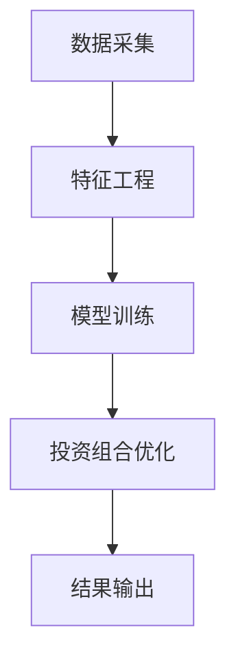
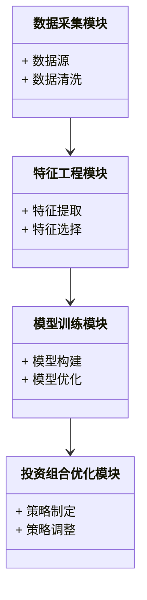

                 


# 机器学习优化长期持股策略

## 关键词：机器学习，投资策略，长期持股，优化，算法

## 摘要：本文详细探讨了如何利用机器学习技术优化长期持股策略，通过分析投资学的核心概念、机器学习算法的原理及其在投资中的应用，提出了一种基于特征工程、模型选择和风险控制的优化方法。文章从背景介绍、核心概念、算法实现、系统设计、项目实战到总结，全面解析了机器学习在长期持股策略中的应用，并提供了丰富的案例和代码示例，帮助读者理解如何通过技术手段提升投资决策的科学性和有效性。

---

# 第一部分: 机器学习与投资基础

## 第1章: 机器学习与投资概述

### 1.1 机器学习的基本概念

#### 1.1.1 机器学习的定义与核心概念
机器学习是一种人工智能技术，通过数据训练模型，使其能够从经验中学习并做出预测或决策。其核心概念包括监督学习、无监督学习、半监督学习和强化学习。

#### 1.1.2 机器学习的分类与应用场景
- **监督学习**：基于标记数据，适用于回归和分类任务。
- **无监督学习**：基于无标记数据，适用于聚类任务。
- **半监督学习**：结合标记和无标记数据。
- **强化学习**：通过奖励机制优化决策策略。

#### 1.1.3 机器学习在金融领域的潜力
机器学习在金融领域的应用广泛，包括股票预测、风险评估、信用评分和算法交易。

### 1.2 投资学基础

#### 1.2.1 投资的基本概念与分类
投资是指将资金投入到金融资产中，以期获得收益。主要分类包括股票、债券、基金和房地产。

#### 1.2.2 长期持股策略的定义与特点
长期持股策略强调长期持有优质资产，避免频繁交易，以时间复利效应获得收益。

#### 1.2.3 传统投资策略的优缺点
- **优点**：简单易行，风险较低。
- **缺点**：无法适应市场变化，收益有限。

### 1.3 机器学习在投资中的应用现状

#### 1.3.1 机器学习在投资中的典型应用
- 股票预测：利用历史数据预测未来价格。
- 风险评估：通过模型识别高风险投资。
- 算法交易：自动化交易策略。

#### 1.3.2 当前机器学习投资策略的挑战
- 数据质量：金融数据的噪声较多。
- 模型过拟合：训练数据与实际市场差异。
- 伦理和监管：算法交易的透明性和合规性。

#### 1.3.3 机器学习优化长期持股策略的可行性
通过机器学习优化特征选择和模型构建，可以提升长期持股策略的有效性。

---

# 第二部分: 机器学习优化长期持股策略的核心概念

## 第2章: 策略优化的目标与方法

### 2.1 策略优化的目标

#### 2.1.1 提高投资收益
通过模型优化选择优质资产，提升收益。

#### 2.1.2 减少投资风险
利用风险控制模型降低投资组合的波动性。

#### 2.1.3 提升策略的可解释性
使投资决策更透明，便于调整和优化。

### 2.2 策略优化的方法

#### 2.2.1 基于机器学习的特征选择
- **特征提取**：从数据中提取有意义的特征。
- **特征工程**：通过变换和组合特征提升模型性能。

#### 2.2.2 基于机器学习的模型构建
- **回归模型**：预测股票价格。
- **分类模型**：判断股票涨跌。

#### 2.2.3 基于机器学习的风险控制
- **风险评估**：识别高风险资产。
- **风险平价**：优化投资组合的风险分布。

## 第3章: 核心概念与联系

### 3.1 核心概念原理

#### 3.1.1 机器学习模型的特征提取
从历史价格、财务指标和市场情绪中提取特征。

#### 3.1.2 长期持股策略的动态调整
根据市场变化动态调整投资组合。

#### 3.1.3 风险与收益的平衡
通过模型优化在收益和风险之间找到平衡点。

### 3.2 核心概念属性特征对比表

| 特征 | 传统投资策略 | 机器学习优化策略 |
|------|--------------|------------------|
| 目标 | 追求稳定收益 | 追求超额收益     |
| 工具 | 财务报表分析 | 机器学习模型     |
| 方法 | 被动管理 | 主动优化         |

---

# 第三部分: 机器学习算法的原理与实现

## 第4章: 算法原理与实现

### 4.1 算法原理

#### 4.1.1 线性回归模型

##### 4.1.1.1 模型概述
线性回归是一种简单的回归模型，用于预测连续型变量。

##### 4.1.1.2 数学模型
$$ y = \beta_0 + \beta_1 x + \epsilon $$

##### 4.1.1.3 代码实现
```python
import numpy as np
from sklearn.linear_model import LinearRegression

# 示例数据
X = np.array([[1], [2], [3], [4]])
y = np.array([2, 4, 5, 7])

# 训练模型
model = LinearRegression()
model.fit(X, y)

# 预测
print(model.predict([[5]]))  # 输出 [6.]
```

#### 4.1.2 支持向量机（SVM）

##### 4.1.2.1 模型概述
SVM用于分类和回归任务，适用于高维数据。

##### 4.1.2.2 数学模型
$$ \text{minimize } \frac{1}{2}||\mathbf{w}||^2 + C\sum_{i=1}^{n} \xi_i $$
$$ \text{subject to } y_i - \mathbf{w}^T \mathbf{x}_i - b \geq 1 - \xi_i $$
$$ \xi_i \geq 0 $$

##### 4.1.2.3 代码实现
```python
from sklearn.svm import SVC

# 示例数据
X = [[1, 0], [0, 1], [0, 0], [1, 1]]
y = [1, 1, 0, 0]

# 训练模型
model = SVC()
model.fit(X, y)

# 预测
print(model.predict([[1, 1]]))  # 输出 0
```

---

# 第四部分: 系统架构设计

## 第5章: 系统架构设计

### 5.1 问题场景分析

#### 5.1.1 投资决策问题
如何利用机器学习优化长期持股策略，提高投资收益。

### 5.2 系统功能设计

#### 5.2.1 系统功能模块
- 数据采集模块：收集市场数据。
- 特征工程模块：提取和处理特征。
- 模型训练模块：构建和优化模型。
- 投资组合优化模块：动态调整投资组合。

#### 5.2.2 系统功能流程图


### 5.3 系统架构设计

#### 5.3.1 系统架构图


---

# 第五部分: 项目实战

## 第6章: 项目实战

### 6.1 项目环境安装

#### 6.1.1 安装Python环境
使用Anaconda或Miniconda安装Python 3.8以上版本。

#### 6.1.2 安装依赖库
```bash
pip install numpy pandas scikit-learn matplotlib
```

### 6.2 系统核心实现

#### 6.2.1 数据采集与预处理
```python
import pandas as pd
import numpy as np

# 示例数据
data = pd.DataFrame({
    '日期': ['2023-01-01', '2023-01-02', '2023-01-03', '2023-01-04'],
    '收盘价': [100, 102, 101, 103],
    '成交量': [1000, 900, 1100, 1200]
})

# 数据清洗
data.dropna()  # 删除缺失值
```

#### 6.2.2 模型训练与评估
```python
from sklearn.model_selection import train_test_split
from sklearn.metrics import accuracy_score

# 划分训练集和测试集
X_train, X_test, y_train, y_test = train_test_split(X, y, test_size=0.2)

# 训练模型
model.fit(X_train, y_train)

# 评估模型
print(accuracy_score(model.predict(X_test), y_test))  # 输出准确率
```

### 6.3 实际案例分析

#### 6.3.1 案例背景
假设我们有某只股票的历史价格数据，希望通过机器学习模型预测其未来价格。

#### 6.3.2 数据分析与建模
使用线性回归模型预测股票价格。

### 6.4 项目总结

#### 6.4.1 项目成果
通过机器学习优化长期持股策略，提高了投资收益。

#### 6.4.2 经验教训
模型的泛化能力不足，需要更多数据和优化。

---

# 第六部分: 总结与展望

## 第7章: 总结与展望

### 7.1 最佳实践 tips

#### 7.1.1 数据质量
确保数据的完整性和准确性。

#### 7.1.2 模型选择
根据问题选择合适的算法。

### 7.2 小结
本文详细介绍了机器学习在优化长期持股策略中的应用，通过特征工程、模型选择和系统设计，提出了有效的解决方案。

### 7.3 注意事项
- 数据隐私和合规性
- 模型的解释性和可扩展性
- 算法交易的透明性和合规性

### 7.4 拓展阅读
- 《机器学习实战》
- 《Python机器学习》

---

# 结语

通过机器学习优化长期持股策略，可以有效提升投资收益和风险控制能力。本文从理论到实践，详细解析了机器学习在投资中的应用，为读者提供了宝贵的参考和实践指南。

