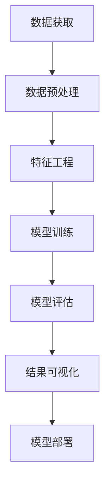

                 

# 第一部分: 机器学习与公司估值模型基础

# 第1章: 机器学习与公司估值概述

## 1.1 机器学习的基本概念

### 1.1.1 机器学习的定义与核心概念

机器学习（Machine Learning）是一种人工智能技术，通过算法和数学模型，让计算机能够从数据中学习并做出预测或决策。其核心概念包括：

- **监督学习**：通过标记数据训练模型，使其能够预测新数据的标签。
- **无监督学习**：通过未标记数据发现数据中的结构和模式。
- **强化学习**：通过与环境交互，学习最优策略以最大化累积奖励。

### 1.1.2 机器学习的分类与特点

机器学习主要分为以下几类：

- **监督学习**：如线性回归、支持向量机（SVM）、随机森林等。
- **无监督学习**：如聚类、主成分分析（PCA）等。
- **强化学习**：如Q-learning、Deep Q-Network（DQN）等。

其特点包括数据驱动、模型可优化、适应性强等。

### 1.1.3 机器学习在金融领域的应用

在金融领域，机器学习主要用于股票预测、风险评估、信用评分、市场情绪分析等。其优势在于能够处理大量非结构化数据，发现隐藏的模式。

## 1.2 公司估值模型的背景与意义

### 1.2.1 公司估值的基本概念

公司估值是指对公司未来现金流的现值进行估计，以确定其内在价值。传统方法包括DCF模型、PE估值等，但存在数据依赖性强、主观性高的问题。

### 1.2.2 传统公司估值方法的局限性

- 数据依赖性高：传统方法依赖历史财务数据，难以捕捉市场情绪和新兴指标。
- 主观性高：不同分析师可能得出不同估值结果。
- 无法处理非结构化数据：传统方法难以整合新闻、社交媒体等非结构化信息。

### 1.2.3 机器学习在公司估值中的潜力

机器学习能够整合多源数据，挖掘潜在关联，提高估值的准确性和效率。例如，利用自然语言处理（NLP）分析公司财报和新闻，生成新的特征变量。

## 1.3 机器学习在公司估值中的应用前景

### 1.3.1 机器学习与金融数据的结合

机器学习能够处理结构化和非结构化数据，提取传统方法难以捕捉的特征，如文本情感、市场情绪等。

### 1.3.2 机器学习在股票定价中的作用

通过分析历史股价、市场情绪、财务数据等，机器学习模型能够预测股票价格走势，辅助投资者做出决策。

### 1.3.3 机器学习模型的优劣势分析

优势：
- 高效性：能够快速处理大量数据。
- 精准性：通过复杂算法捕捉数据中的细微关系。
- 可扩展性：适用于不同规模和类型的数据。

劣势：
- 黑箱问题：模型缺乏可解释性。
- 数据依赖性：模型性能依赖于数据质量和数量。
- 过度拟合风险：可能对训练数据过拟合，导致泛化能力下降。

## 1.4 本章小结

本章介绍了机器学习的基本概念及其在金融领域的应用，重点分析了传统公司估值方法的局限性，并探讨了机器学习在公司估值中的潜力和应用前景。

---

# 第2章: 机器学习与公司估值的核心概念

## 2.1 机器学习在公司估值中的核心要素

### 2.1.1 数据特征的提取与选择

公司估值模型的数据特征通常包括财务指标（如营收、利润）、市场指标（如PE、PB）、文本数据（如新闻、财报）等。特征选择是提高模型性能的重要步骤。

### 2.1.2 模型选择与优化

选择合适的模型并进行优化是关键。常用方法包括交叉验证、网格搜索等，以找到最优超参数。

### 2.1.3 性能评估指标

常用的性能指标包括均方误差（MSE）、平均绝对误差（MAE）、R²值等。

## 2.2 机器学习与公司估值的关系

### 2.2.1 数据驱动的公司估值

机器学习通过数据驱动的方法，结合传统财务指标和新兴数据源，提高估值的准确性。

### 2.2.2 机器学习模型的可解释性

模型的可解释性是实际应用中的重要问题。树模型（如随机森林）通常比神经网络更易解释。

### 2.2.3 模型的泛化能力与稳定性

模型的泛化能力取决于训练数据的多样性和算法的鲁棒性。稳定性则取决于模型对小数据扰动的敏感性。

## 2.3 核心概念的联系与对比

### 2.3.1 机器学习算法与公司估值模型的关系

不同的算法适用于不同的数据类型和场景。例如，线性回归适用于线性关系，而随机森林适用于复杂非线性关系。

### 2.3.2 传统估值方法与机器学习模型的对比

| 特性             | 传统估值方法         | 机器学习模型         |
|------------------|----------------------|----------------------|
| 数据依赖性       | 高                   | 高                   |
| 可解释性         | 高                   | 低（取决于算法）      |
| 处理能力         | 有限                 | 强大                 |
| 灵活性           | 低                   | 高                   |

### 2.3.3 数据质量对模型性能的影响

数据质量直接影响模型性能。高质量数据能够提高模型的准确性和稳定性，而低质量数据可能导致模型过拟合或性能下降。

## 2.4 本章小结

本章分析了机器学习在公司估值中的核心要素，探讨了不同算法的特点及其适用场景，并通过对比分析，明确了机器学习模型的优势与挑战。

---

# 第3章: 机器学习在公司估值中的算法原理

## 3.1 线性回归模型

### 3.1.1 线性回归的基本原理

线性回归是一种简单且常用的回归模型，假设因变量与自变量之间存在线性关系。其数学模型为：

$$ y = \beta_0 + \beta_1 x + \epsilon $$

其中，$\beta_0$是截距，$\beta_1$是斜率，$\epsilon$是误差项。

### 3.1.2 最小二乘法的数学推导

最小二乘法通过最小化预测值与实际值之间的平方差之和来求解最优参数：

$$ \text{最小化} \sum_{i=1}^n (y_i - (\beta_0 + \beta_1 x_i))^2 $$

通过求导数并令其为零，可以得到：

$$ \hat{\beta}_1 = \frac{\sum_{i=1}^n (x_i - \bar{x})(y_i - \bar{y})}{\sum_{i=1}^n (x_i - \bar{x})^2} $$

$$ \hat{\beta}_0 = \bar{y} - \hat{\beta}_1 \bar{x} $$

其中，$\bar{x}$和$\bar{y}$是自变量和因变量的均值。

### 3.1.3 线性回归在公司估值中的应用

线性回归可以用于预测公司股票价格，基于历史股价和财务指标。

## 3.2 支持向量机（SVM）

### 3.2.1 SVM的基本原理

SVM通过找到一个超平面，使得数据点与超平面之间的距离最大化。其数学模型为：

$$ y = \text{sign}(\omega \cdot x + b) $$

其中，$\omega$是权重向量，$b$是偏置项。

### 3.2.2 核函数的作用与选择

核函数用于将数据映射到高维空间，常用核函数包括线性核、多项式核、径向基函数（RBF）核等。

### 3.2.3 SVM在公司估值中的应用

SVM可以用于分类任务，如判断股票是否为“买入”或“卖出”。

## 3.3 随机森林与梯度提升树

### 3.3.1 随机森林的原理与优势

随机森林通过构建多棵决策树并进行投票或平均，提高模型的准确性和稳定性。

### 3.3.2 XGBoost/LightGBM的优化策略

XGBoost和LightGBM是常用的梯度提升树算法，通过正则化和优化算法提高模型性能。

### 3.3.3 树模型在公司估值中的表现

树模型在处理非线性关系和高维数据方面表现优异，适用于复杂场景。

## 3.4 神经网络与深度学习

### 3.4.1 神经网络的基本结构

神经网络由输入层、隐藏层和输出层组成，通过多层感知机（MLP）进行非线性变换。

### 3.4.2 卷积神经网络（CNN）与循环神经网络（RNN）的对比

- CNN适用于图像识别等任务。
- RNN适用于时间序列数据，如股票价格预测。

### 3.4.3 深度学习在公司估值中的潜在应用

深度学习可以处理复杂非结构化数据，如自然语言文本和图像数据。

## 3.5 本章小结

本章详细介绍了几种常用的机器学习算法及其在公司估值中的应用，分析了不同算法的特点和适用场景。

---

# 第4章: 机器学习模型在公司估值中的系统架构设计

## 4.1 系统架构的整体设计

### 4.1.1 数据获取与预处理模块

- 数据来源：公司财务数据、市场数据、新闻数据等。
- 数据清洗：处理缺失值、异常值等。
- 数据特征工程：提取有用特征，如文本情感、财务指标等。

### 4.1.2 模型训练与优化模块

- 数据分割：将数据划分为训练集、验证集和测试集。
- 模型选择：选择合适的算法并进行调参。
- 模型训练：使用训练数据训练模型。
- 模型评估：使用验证集评估模型性能。

### 4.1.3 模型部署与应用模块

- 模型部署：将训练好的模型部署到生产环境。
- 接口设计：设计API接口，供其他系统调用。
- 结果可视化：将模型预测结果可视化，便于用户理解和使用。

## 4.2 系统功能设计

### 4.2.1 数据特征工程的实现

- 文本数据预处理：分词、去除停用词、情感分析等。
- 数值数据处理：标准化、归一化等。
- 特征选择：使用特征重要性分析选择关键特征。

### 4.2.2 模型训练与调优

- 使用交叉验证评估模型性能。
- 使用网格搜索优化模型参数。
- 比较不同算法的性能，选择最优模型。

### 4.2.3 结果可视化与解释

- 使用混淆矩阵、ROC曲线等评估模型性能。
- 使用特征重要性分析解释模型结果。
- 可视化预测结果，如股票价格走势预测。

## 4.3 系统架构的Mermaid图

---

## 4.4 本章小结

本章详细设计了机器学习模型在公司估值中的系统架构，包括数据获取、预处理、特征工程、模型训练、评估和部署等模块。

---

通过以上目录结构，我们可以看到，文章从机器学习与公司估值的基本概念出发，逐步深入到算法原理和系统架构设计，最后通过项目实战验证模型的可行性。这样的结构既保证了理论的深度，又兼顾了实践的可操作性，能够帮助读者全面理解机器学习在公司估值中的应用。

