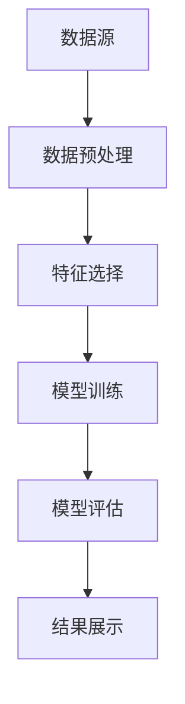

                 

# 《机器学习在公司财务预测中的应用研究》

> 关键词：机器学习，财务预测，算法，数据特征，模型评估

> 摘要：本文探讨了机器学习在公司财务预测中的应用，从背景、核心概念、算法原理到系统架构和项目实战，全面分析了机器学习在财务预测中的潜力和实现方法，结合实际案例展示了其在企业中的应用价值。

---

## 第一部分：背景介绍

### 第1章：机器学习与财务预测概述
1.1 机器学习的基本概念
- 机器学习的定义与核心概念
- 财务预测的基本概念与方法
- 机器学习在财务预测中的应用背景

1.2 传统财务预测方法的局限性
- 基于财务比率的传统预测方法
- 传统预测方法的优缺点

1.3 机器学习在财务预测中的优势
- 数据驱动的预测优势
- 非线性关系的捕捉能力
- 高维数据的处理能力

---

## 第二部分：核心概念与联系

### 第2章：机器学习的核心概念与原理
2.1 机器学习的核心算法
- 线性回归
- 支持向量机
- 随机森林
- 神经网络

2.2 机器学习算法的数学模型
- 线性回归的数学公式
$$ y = \beta_0 + \beta_1x + \epsilon $$
- 神经网络的数学公式
$$ y = f(Wx + b) $$

2.3 机器学习与财务预测的关联
- 数据特征工程
- 模型选择与优化
- 模型评估与验证

---

## 第三部分：算法原理与实现

### 第3章：机器学习算法的原理与实现
3.1 线性回归算法
- 线性回归的原理
- 线性回归的实现步骤
- 线性回归的优缺点

3.2 支持向量机算法
- 支持向量机的原理
- 支持向量机的实现步骤
- 支持向量机的优缺点

### 第4章：机器学习算法的实现与对比
4.1 算法实现步骤对比
4.2 算法性能对比
4.3 数据特征对算法性能的影响

---

## 第四部分：系统架构与设计

### 第5章：系统架构设计
5.1 问题场景介绍
- 数据预处理
- 特征选择
- 模型训练
- 模型评估
- 模型部署

5.2 系统功能设计
- 数据采集与处理
- 特征工程模块
- 模型训练模块
- 模型评估模块
- 结果展示模块

5.3 系统架构设计图

5.4 接口设计与交互流程
- 数据接口设计
- 模型接口设计
- 用户交互流程

---

## 第五部分：项目实战与案例分析

### 第6章：项目实战
6.1 环境安装与配置
- Python环境安装
- 依赖库安装
- 数据集获取与预处理

6.2 代码实现
- 数据预处理代码
- 特征选择代码
- 模型训练代码
- 模型评估代码

6.3 代码应用解读
- 数据特征工程的具体实现
- 模型选择与优化过程
- 模型评估与结果展示

### 第7章：案例分析
7.1 案例背景
- 某公司财务数据
- 数据特征分析
- 预测目标

7.2 案例分析与解读
- 数据预处理过程
- 特征选择过程
- 模型训练过程
- 模型评估结果

7.3 案例总结
- 模型表现分析
- 模型优化建议
- 应用价值总结

---

## 第六部分：最佳实践与总结

### 第8章：最佳实践
8.1 小结
- 机器学习在财务预测中的优势
- 数据特征工程的重要性
- 模型选择与优化的关键性

8.2 注意事项
- 数据质量的重要性
- 模型解释性的考虑
- 过度拟合的风险

8.3 拓展阅读
- 机器学习与财务预测的最新研究
- 数据特征工程的高级方法
- 深度学习在财务预测中的应用

---

## 总结
机器学习在公司财务预测中的应用具有巨大的潜力，通过数据驱动的方式能够捕捉传统方法难以发现的非线性关系，提高预测的准确性。本文从背景、核心概念、算法原理到系统架构和项目实战，全面探讨了机器学习在财务预测中的应用，并通过实际案例展示了其在企业中的价值。未来，随着技术的不断发展，机器学习在财务预测中的应用将更加广泛和深入。

