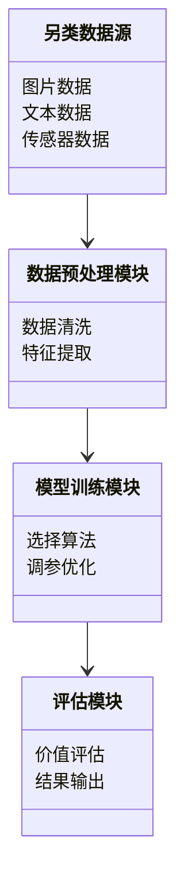
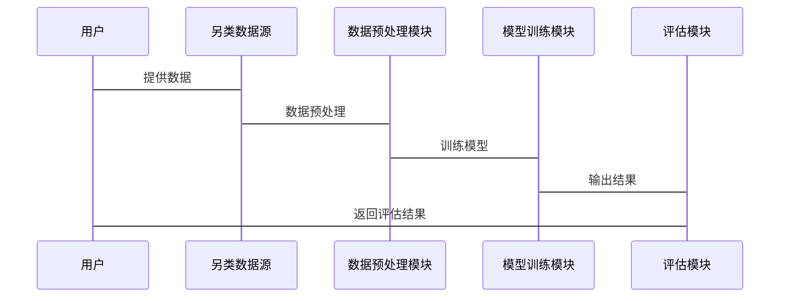

                 


# 机器学习在另类数据价值评估中的应用

**关键词**：机器学习、另类数据、价值评估、算法原理、系统架构

**摘要**：  
机器学习在另类数据价值评估中的应用是当前技术领域的重要研究方向。随着数据类型的多样化，另类数据（如卫星图像、社交媒体数据、IoT数据等）在金融、医疗、物流等行业的应用越来越广泛。本文将从机器学习的基本概念出发，深入探讨其在另类数据价值评估中的核心原理、算法实现、系统架构及实际应用案例，帮助读者全面理解如何利用机器学习技术提升另类数据的评估效率和准确性。

---

# 1. 机器学习与另类数据概述

## 1.1 机器学习的基本概念

### 1.1.1 机器学习的定义与核心概念  
机器学习是一种人工智能技术，通过数据训练模型，使其能够从经验中学习并做出预测或决策。其核心概念包括：

- **监督学习**：通过标记数据训练模型，预测新数据的标签。
- **非监督学习**：在无标签数据中发现模式或结构。
- **强化学习**：通过与环境交互，学习最优策略。

### 1.1.2 机器学习的主要流派与分类  
机器学习主要分为三类：
1. **符号学习**：基于逻辑推理。
2. **基于实例的学习**：基于记忆。
3. **基于模型的学习**：基于数据建模。

### 1.1.3 机器学习的应用场景与挑战  
- **场景**：金融预测、图像识别、自然语言处理。
- **挑战**：数据质量、计算复杂度、模型解释性。

## 1.2 另类数据的基本概念

### 1.2.1 另类数据的定义与特点  
另类数据是指非传统结构的数据，如图像、音频、文本、传感器数据等。其特点包括：
- **多样性**：数据类型多样。
- **复杂性**：难以直接处理。
- **实时性**：数据生成速度快。

### 1.2.2 另类数据的常见类型与来源  
- **文本数据**：社交媒体、新闻。
- **图像数据**：卫星图像、医疗影像。
- **视频数据**：监控录像。
- **传感器数据**：IoT设备。

### 1.2.3 另类数据在金融领域的应用  
- **股票预测**：利用社交媒体情绪分析。
- **风险管理**：通过卫星图像分析经济活动。

## 1.3 机器学习与另类数据的结合

### 1.3.1 机器学习在另类数据处理中的优势  
- **自动化**：自动提取特征。
- **高精度**：通过复杂模型提升准确性。
- **实时性**：快速处理流数据。

### 1.3.2 另类数据如何为机器学习提供新价值  
- **丰富特征**：提供更多维度的特征。
- **创新应用**：开拓新的业务场景。

### 1.3.3 机器学习与另类数据结合的典型应用场景  
- **金融：股票预测、信用评估。**
- **医疗：疾病预测、图像诊断。**

---

# 2. 另类数据价值评估的核心概念

## 2.1 另类数据价值评估的背景与问题描述

### 2.1.1 另类数据在金融分析中的重要性  
- **实时性**：快速捕捉市场动态。
- **丰富性**：提供更多维度的信息。

### 2.1.2 传统数据评估方法的局限性  
- **数据维度有限**：难以捕捉复杂关系。
- **计算效率低**：处理海量数据耗时。

### 2.1.3 机器学习如何解决另类数据评估的难点  
- **高效特征提取**：通过模型自动提取关键特征。
- **复杂关系建模**：处理非线性关系。

## 2.2 核心概念与联系

### 2.2.1 另类数据价值评估的核心要素  
- **数据预处理**：清洗和转换。
- **特征提取**：提取有价值的信息。
- **模型训练**：构建预测模型。

### 2.2.2 机器学习模型与另类数据的关系  
- **模型依赖数据**：模型性能依赖数据质量。
- **数据驱动模型优化**：通过数据优化模型。

### 2.2.3 数据特征与模型性能的对比分析表  
| 特征类型 | 对模型性能的影响 |
|----------|------------------|
| 文本特征  | 提供情感信息       |
| 图像特征  | 提供视觉信息       |

### 2.2.4 实体关系图（ER图）的 Mermaid 流程图  
```mermaid
erd
    图片数据表
        图片ID {pk}
        图片路径
        图片标签
    文本数据表
        文本ID {pk}
        文本内容
        文本标签
    关联表
        关系ID {pk}
        图片ID {fk}
        文本ID {fk}
```

---

# 3. 机器学习算法原理与数学模型

## 3.1 常见机器学习算法及其特点

### 3.1.1 监督学习算法  
- **线性回归**：用于回归问题。
- **支持向量机（SVM）**：适用于分类和回归。

### 3.1.2 非监督学习算法  
- **聚类分析**：K-means算法。

### 3.1.3 强化学习算法  
- **Q-Learning**：基于策略的学习。

## 3.2 支持向量机（SVM）算法原理

### 3.2.1 SVM 的基本原理与数学模型  
SVM的目标是最小化损失函数，同时最大化分类间隔。数学模型如下：

$$
\min_{w,b,\xi} \frac{1}{2}||w||^2 + C \sum_{i=1}^n \xi_i \\
\text{subject to} \quad y_i(w \cdot x_i + b) \geq 1 - \xi_i, \quad \xi_i \geq 0
$$

### 3.2.2 SVM 的优化目标与约束条件  
优化目标为最小化权重向量的模长，约束条件确保数据点位于正确的一侧。

### 3.2.3 SVM 的核函数与 Mercer 定理  
核函数将数据映射到高维空间， Mercer定理确保核矩阵的半正定性。

## 3.3 随机森林与梯度提升树

### 3.3.1 随机森林的算法原理  
通过随机采样构建多棵决策树，取其预测结果的平均值。

### 3.3.2 XGBoost 的数学模型与优化目标  
XGBoost通过正则化优化目标函数，减少模型偏差和方差。

### 3.3.3 LightGBM 的优势与应用场景  
LightGBM采用叶子权重的思路，训练速度快，适合大数据场景。

---

# 4. 系统分析与架构设计方案

## 4.1 问题场景介绍

### 4.1.1 另类数据价值评估的典型场景  
- **金融：股票价格预测。**
- **医疗：疾病预测与诊断。**

### 4.1.2 系统目标与功能需求  
- **目标**：准确评估数据价值。
- **需求**：实时处理、高精度预测。

## 4.2 系统功能设计

### 4.2.1 领域模型的 Mermaid 类图  


### 4.2.2 系统架构的 Mermaid 架构图  
```mermaid
container 另类数据价值评估系统 {
    另类数据源
    数据预处理模块
    模型训练模块
    评估模块
}
```

### 4.2.3 系统接口设计与交互流程  
- **输入接口**：接收另类数据。
- **输出接口**：输出评估结果。

### 4.2.4 系统交互的 Mermaid 序列图  


---

# 5. 项目实战与代码实现

## 5.1 环境配置与数据

### 5.1.1 环境配置  
- **Python**：3.8+
- **库**：scikit-learn, TensorFlow, PyTorch.

### 5.1.2 数据集  
- **文本数据**：社交媒体评论。
- **图像数据**：卫星图像。

## 5.2 核心实现

### 5.2.1 数据预处理  
```python
import pandas as pd
from sklearn.preprocessing import StandardScaler

# 读取数据
data = pd.read_csv('data.csv')

# 特征提取
features = data[['text', 'image_features']]
labels = data['label']

# 数据标准化
scaler = StandardScaler()
features_scaled = scaler.fit_transform(features)
```

### 5.2.2 模型训练  
```python
from sklearn.svm import SVC
from sklearn.model_selection import train_test_split

# 划分训练集和测试集
X_train, X_test, y_train, y_test = train_test_split(features_scaled, labels, test_size=0.2)

# 训练模型
model = SVC()
model.fit(X_train, y_train)

# 预测
y_pred = model.predict(X_test)
```

### 5.2.3 结果评估  
```python
from sklearn.metrics import accuracy_score

print('准确率:', accuracy_score(y_test, y_pred))
```

## 5.3 案例分析与总结

### 5.3.1 案例分析  
- **案例一**：社交媒体情绪分析。
- **案例二**：卫星图像的经济活动预测。

### 5.3.2 项目小结  
- **优势**：高效准确。
- **挑战**：数据质量、计算资源。

---

# 6. 总结与展望

## 6.1 总结  
机器学习在另类数据价值评估中展现了巨大的潜力，通过高效的数据处理和复杂模型的应用，提升了评估的准确性和效率。

## 6.2 展望  
未来，随着技术进步，另类数据的应用场景将更加广泛，算法也将更加复杂和高效。

---

# 参考文献

（此处列出相关参考文献）

---

# 致谢

感谢读者的支持与关注！

