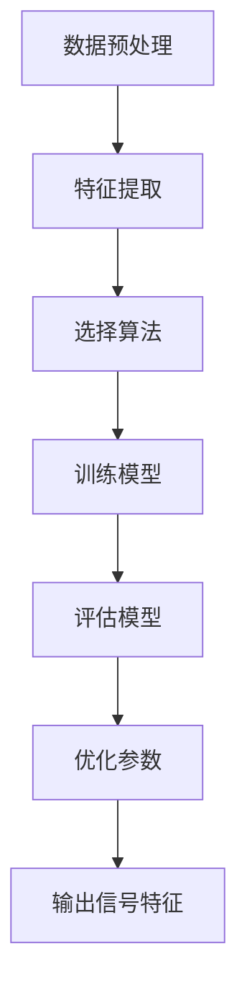
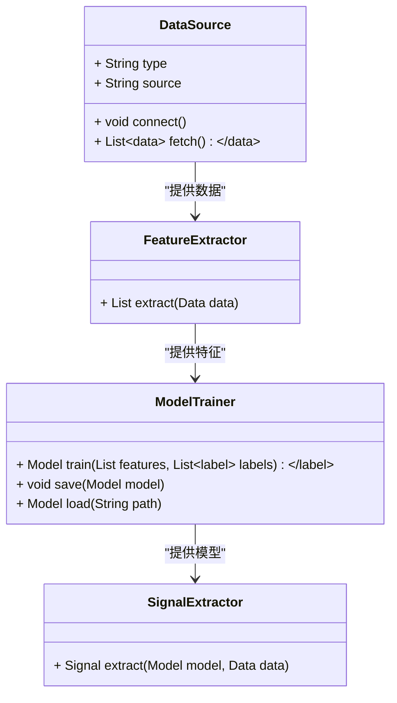
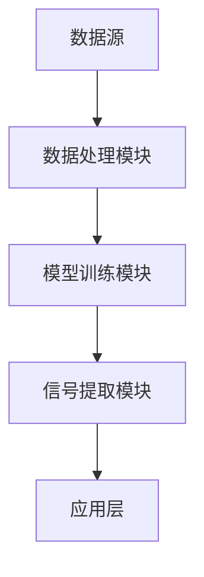
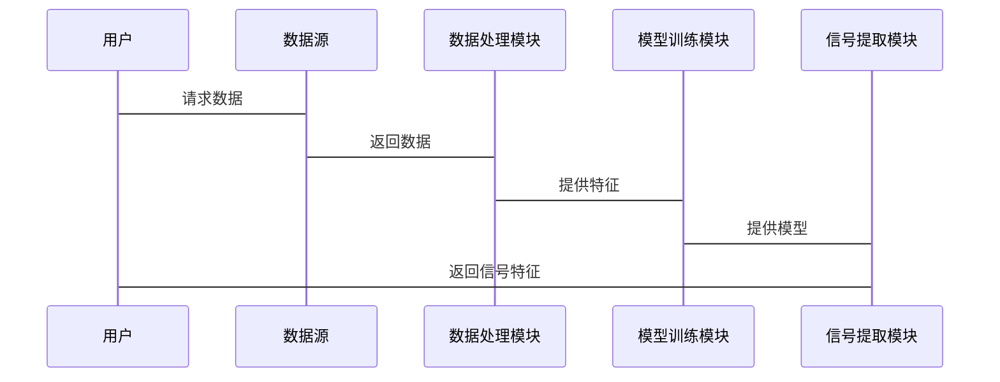

                 


# 《机器学习在另类数据信号提取中的应用》

> 关键词：机器学习，另类数据，信号提取，特征工程，模型训练

> 摘要：  
机器学习在另类数据信号提取中的应用是一个新兴而重要的研究领域。本文从背景介绍、核心概念、算法原理、系统架构到项目实战，系统性地探讨了机器学习如何在处理另类数据信号中发挥关键作用。通过详细分析问题背景、信号处理的基本原理、模型训练的关键步骤，以及实际项目的实现过程，本文旨在为读者提供一个全面而深入的技术指南。我们还将结合具体的案例分析，展示如何通过机器学习技术提取高价值的信号特征，并为后续的信号分析提供可靠的依据。

---

## 第1章 机器学习与另类数据信号提取的背景介绍

### 1.1 问题背景

#### 1.1.1 传统数据与另类数据的定义
- **传统数据**：结构化数据，如表格数据、文本数据，通常具有明确的字段和结构，便于直接处理。
- **另类数据**：非结构化数据，如图像、音频、视频、社交媒体数据等，具有复杂性、多样性和不规则性。

#### 1.1.2 另类数据在金融与经济中的应用
- 另类数据在金融领域的应用：通过分析社交媒体情绪、新闻数据、卫星图像等，提取市场情绪、供需变化等信号。
- 在经济研究中的应用：利用卫星图像分析经济活动、通过传感器数据预测生产情况等。

#### 1.1.3 机器学习技术的崛起
- 机器学习在处理非结构化数据方面的优势：自动提取特征、模式识别、分类与回归能力。
- 机器学习在复杂数据处理中的应用案例：图像识别、语音识别、自然语言处理等。

### 1.2 问题描述

#### 1.2.1 另类数据信号提取的核心问题
- 如何从复杂、多样化的数据源中提取有用的信号特征。
- 如何处理数据中的噪声、冗余信息和缺失值。

#### 1.2.2 机器学习在信号处理中的优势
- 无监督学习：自动发现数据中的潜在模式和结构。
- 监督学习：基于标注数据训练模型，提高信号提取的准确性。
- 强化学习：通过与环境的交互，逐步优化信号提取策略。

#### 1.2.3 当前技术的局限性与挑战
- 数据质量：另类数据通常具有低信噪比，如何有效去噪是关键。
- 数据量：大规模数据处理的计算资源和时间成本问题。
- 模型解释性：如何确保模型的可解释性，特别是在金融和经济领域。

### 1.3 问题解决

#### 1.3.1 机器学习算法的选择与优化
- 算法选择：根据数据类型和任务需求选择合适的算法，如随机森林、支持向量机、神经网络等。
- 算法优化：通过超参数调优、特征选择、降维技术等提高模型性能。

#### 1.3.2 数据预处理与特征提取方法
- 数据清洗：处理缺失值、异常值、重复数据。
- 数据转换：将非结构化数据转化为结构化特征，如图像的哈希值、文本的词袋模型。
- 特征选择：通过统计方法或模型解释性选择重要特征。

#### 1.3.3 模型训练与评估指标
- 训练策略：交叉验证、网格搜索、数据增强等。
- 评估指标：准确率、召回率、F1分数、AUC曲线等。

### 1.4 边界与外延

#### 1.4.1 机器学习在另类数据中的适用范围
- 适用于复杂、多样化数据的特征提取。
- 适用于需要自动识别模式和结构的场景。

#### 1.4.2 相关领域的区别与联系
- 与数据挖掘的区别：数据挖掘注重发现模式，机器学习注重预测和分类。
- 与信号处理的区别：信号处理侧重于物理信号的分析，机器学习侧重于数据驱动的模式识别。

#### 1.4.3 技术发展的未来趋势
- 多模态数据处理：结合图像、文本、语音等多种数据源。
- 自动化特征工程：通过自动化方法提取高阶特征。
- 解可解释性：提高模型的可解释性，特别是在金融和医疗领域。

### 1.5 核心概念的结构与组成

#### 1.5.1 数据流与信号处理的流程
- 数据采集：从多种数据源获取数据。
- 数据预处理：清洗、转换、特征提取。
- 模型训练：选择算法、训练模型、优化参数。
- 信号提取：通过模型输出提取有用的信号特征。
- 信号分析：结合领域知识进行信号解释和应用。

#### 1.5.2 机器学习模型的组成要素
- 数据：输入数据，包括特征和标签。
- 模型：算法实现，如神经网络、随机森林等。
- 参数：模型的超参数，如学习率、正则化系数等。
- 损失函数：衡量预测值与真实值的差异。
- 优化器：更新参数以最小化损失函数。

#### 1.5.3 系统架构的核心组件
- 数据源：多种数据源的集成与管理。
- 数据处理模块：负责数据清洗、特征提取。
- 模型训练模块：负责模型训练、参数优化。
- 信号提取模块：负责信号特征的输出。
- 应用层：将提取的信号应用于实际业务场景。

---

## 第2章 核心概念与联系

### 2.1 核心概念原理

#### 2.1.1 机器学习的基本原理
- 机器学习的核心是通过数据训练模型，使模型能够自动识别模式和结构。
- 监督学习：基于标注数据训练模型，预测新的数据。
- 无监督学习：从无标注数据中发现潜在结构。
- 强化学习：通过与环境的交互，逐步优化决策策略。

#### 2.1.2 另类数据信号的特征分析
- 非结构化数据的复杂性：如图像、文本的多样性。
- 数据的实时性：如实时股票交易数据、社交媒体实时更新。
- 数据的异构性：多种数据类型混合，如图像、文本、数值数据。

#### 2.1.3 信号处理中的数学模型
- 信号处理的基本概念：如信号的时域和频域分析。
- 信号处理的数学模型：如傅里叶变换、小波变换等。

### 2.2 核心概念属性特征对比表

| 特征属性       | 传统数据       | 另类数据       | 机器学习处理   |
|----------------|----------------|----------------|----------------|
| 数据类型       | 结构化         | 非结构化       | 结构化与非结构化 |
| 数据量         | 小             | 大             | 大             |
| 数据来源       | 文本/表格     | 图像/声音       | 多源           |
| 数据处理方式   | 手动           | 自动           | 自动与半自动   |

### 2.3 ER实体关系图

```mermaid
erDiagram
    customer[CUSTOMER] {
        +int id
        +string name
        +int age
    }
    signal[DATA_SIGNAL] {
        +int id
        +string type
        +datetime timestamp
    }
    model[MACHINE_LEARNING_MODEL] {
        +int id
        +string name
        +float accuracy
    }
    (CUSTOMER) --(DATA_SIGNAL): "生成信号"
    (DATA_SIGNAL) --(MACHINE_LEARNING_MODEL): "训练模型"
    (CUSTOMER) --(MACHINE_LEARNING_MODEL): "评估模型"
```

---

## 第3章 算法原理讲解

### 3.1 算法流程图



### 3.2 算法实现代码

```python
import numpy as np
from sklearn.model_selection import train_test_split
from sklearn.ensemble import RandomForestClassifier
from sklearn.metrics import accuracy_score

# 示例数据：假设我们有一个图像数据集，每个样本是图像的特征向量
# 这里简化为二维特征
X = np.random.rand(100, 2)
y = np.random.randint(0, 2, 100)

# 数据划分
X_train, X_test, y_train, y_test = train_test_split(X, y, test_size=0.2)

# 特征选择：这里假设我们已经进行了特征选择
selected_features = X_train.shape[1]

# 选择算法：随机森林
model = RandomForestClassifier(n_estimators=100, max_depth=2, random_state=42)
model.fit(X_train, y_train)

# 模型预测
y_pred = model.predict(X_test)

# 评估指标
print("Accuracy:", accuracy_score(y_test, y_pred))
```

### 3.3 数学模型与公式

#### 3.3.1 线性回归模型
$$ y = \beta_0 + \beta_1x + \epsilon $$

#### 3.3.2 逻辑回归模型
$$ P(Y=1|X) = \frac{e^{\beta_0 + \beta_1x}}{1 + e^{\beta_0 + \beta_1x}} $$

#### 3.3.3 支持向量机模型
$$ \text{目标函数：} \min_{\beta,b,\xi} \frac{1}{2}\|\beta\|^2 + C\sum_{i=1}^n \xi_i $$
$$ \text{约束条件：} y_i(\beta^T x_i + b) \geq 1 - \xi_i $$
$$ \xi_i \geq 0 $$

---

## 第4章 系统分析与架构设计方案

### 4.1 项目场景介绍
假设我们正在开发一个金融信号分析系统，旨在通过分析社交媒体数据、新闻数据和市场数据，提取市场情绪信号，辅助投资决策。

### 4.2 系统功能设计

#### 4.2.1 领域模型类图



### 4.3 系统架构设计

#### 4.3.1 系统架构图



#### 4.3.2 系统接口设计
- 数据源接口：提供数据获取的API。
- 数据处理模块接口：提供特征提取的API。
- 模型训练模块接口：提供模型训练和保存的API。
- 信号提取模块接口：提供信号提取的API。

#### 4.3.3 系统交互序列图



---

## 第5章 项目实战

### 5.1 环境安装
```bash
pip install numpy scikit-learn matplotlib
```

### 5.2 核心代码实现

#### 5.2.1 数据预处理
```python
import pandas as pd
import numpy as np
from sklearn.impute import SimpleImputer
from sklearn.preprocessing import StandardScaler

# 示例数据：加载图像特征数据
data = pd.read_csv('image_features.csv')

# 处理缺失值
imputer = SimpleImputer(missing_values=np.nan, strategy='mean')
imputed_data = imputer.fit_transform(data)

# 标准化处理
scaler = StandardScaler()
processed_data = scaler.fit_transform(imputed_data)
```

#### 5.2.2 模型训练
```python
from sklearn.model_selection import train_test_split
from sklearn.ensemble import RandomForestClassifier
from sklearn.metrics import classification_report

# 数据划分
X_train, X_test, y_train, y_test = train_test_split(processed_data, data['label'], test_size=0.2, random_state=42)

# 训练模型
model = RandomForestClassifier(n_estimators=100, max_depth=2, random_state=42)
model.fit(X_train, y_train)

# 模型预测
y_pred = model.predict(X_test)

# 输出结果
print(classification_report(y_test, y_pred))
```

#### 5.2.3 信号提取
```python
import joblib

# 保存模型
joblib.dump(model, 'signal_model.pkl')

# 提取信号
def extract_signal(new_data):
    processed_new_data = scaler.transform(imputer.transform(new_data))
    signal = model.predict(processed_new_data)
    return signal

# 示例信号提取
new_data = pd.DataFrame([[np.nan, np.nan], [1, 2]], columns=data.columns[:-1])
print(extract_signal(new_data))
```

### 5.3 案例分析与实际应用
假设我们正在分析社交媒体数据，提取市场情绪信号。通过训练好的模型，我们可以预测市场情绪是正面、负面还是中性，并将这些信号应用于投资决策。

### 5.4 项目小结
通过该项目，我们成功地将机器学习应用于另类数据信号提取，展示了从数据预处理、模型训练到信号提取的完整流程。

---

## 第6章 最佳实践与总结

### 6.1 最佳实践

#### 6.1.1 数据预处理的重要性
- 数据清洗：处理缺失值、异常值。
- 特征工程：提取有意义的特征，降低数据维度。

#### 6.1.2 模型调优的关键点
- 超参数调优：使用网格搜索或随机搜索。
- 正则化与防止过拟合：使用L1/L2正则化、Dropout等技术。

#### 6.1.3 信号分析的注意事项
- 确保信号的可解释性：避免黑箱模型。
- 结合领域知识：理解信号的实际意义。

### 6.2 小结

#### 6.2.1 核心概念回顾
- 机器学习的核心是通过数据训练模型，提取有用的信号特征。
- 另类数据的复杂性要求我们采用先进的数据处理和模型训练技术。

#### 6.2.2 算法选择与优化
- 根据数据类型和任务需求选择合适的算法。
- 通过数据增强、特征工程等方法优化模型性能。

### 6.3 注意事项

#### 6.3.1 数据隐私与安全
- 在处理敏感数据时，确保数据隐私和安全。
- 遵守相关法律法规，如GDPR等。

#### 6.3.2 模型的可解释性
- 在关键领域（如金融、医疗）中，确保模型的可解释性。
- 使用可解释的模型（如线性回归、决策树）或提供解释方法（如SHAP值）。

### 6.4 拓展阅读

#### 6.4.1 推荐书籍
- 《机器学习实战》
- 《深入理解机器学习》
- 《Python机器学习》

#### 6.4.2 推荐博客与资源
- [Towards Data Science](https://towardsdatascience.com/)
- [Kaggle](https://www.kaggle.com/)
- [Medium上的机器学习专栏](https://medium.com/machine-learning)

---

## 第7章 总结

通过本文的探讨，我们深入分析了机器学习在另类数据信号提取中的应用，从理论到实践，从算法到系统架构，为读者提供了一个全面而深入的技术指南。机器学习的强大能力为处理复杂、多样化的数据提供了新的可能性，但也带来了数据隐私、模型解释性等挑战。未来，随着技术的进步，机器学习在另类数据信号提取中的应用将更加广泛和深入。

--- 

以上是《机器学习在另类数据信号提取中的应用》的完整目录和部分章节内容，希望对您有所帮助！

