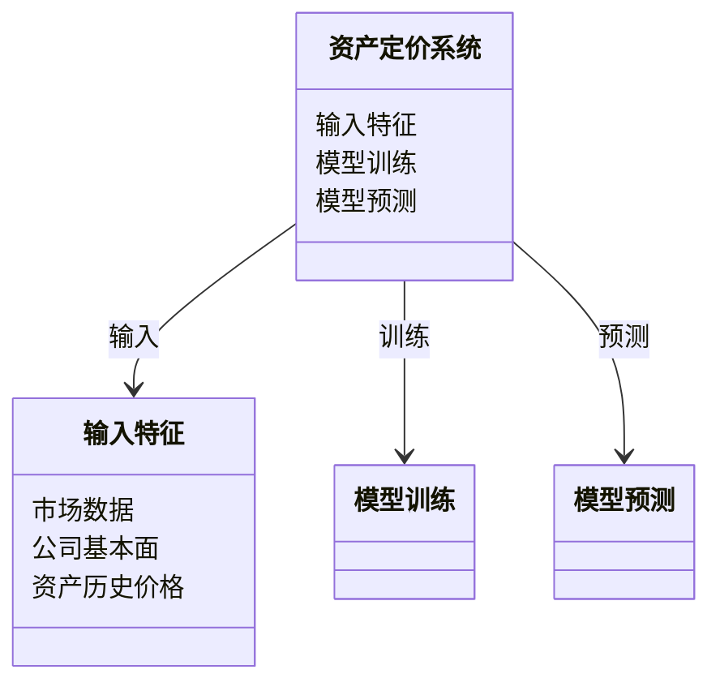
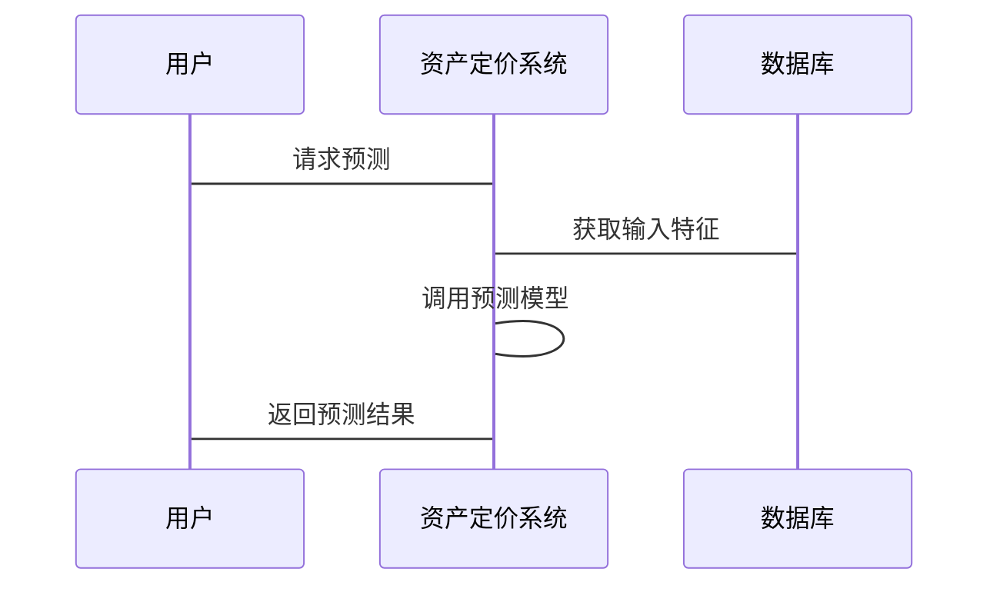

                 


```markdown
# 第3章: 数学模型与公式

## 3.3 随机森林模型
### 3.3.1 随机森林的数学公式
随机森林是一种基于树的集成方法，通过构建多个决策树并进行投票或平均来提高模型的准确性和鲁棒性。其数学公式可以表示为：

$$
\text{预测值} = \sum_{i=1}^{n} \text{决策树}_i(\text{输入特征})
$$

其中，\( n \) 是决策树的数量。

### 3.3.2 随机森林的优化方法
随机森林通过以下方式优化：
1. **袋装法（Bagging）**：通过有放回地抽样训练数据来生成多个训练集。
2. **特征子集选择**：在每个决策树的每个节点分裂时，随机选择部分特征进行分裂，减少相关特征之间的冗余。

### 3.3.3 随机森林的优缺点
- **优点**：高准确率、鲁棒性好、易于处理高维数据。
- **缺点**：计算复杂度高、模型解释性较差。

## 3.4 神经网络模型
### 3.4.1 神经网络的数学公式
神经网络的前向传播过程可以表示为：

$$
y = \sigma(w x + b)
$$

其中，\( y \) 是输出，\( w \) 是权重，\( b \) 是偏置，\( x \) 是输入，\( \sigma \) 是激活函数。

### 3.4.2 神经网络的训练过程
神经网络的训练通常使用反向传播算法（Backpropagation）和梯度下降优化：

1. **前向传播**：计算模型的预测值。
2. **计算损失**：使用损失函数（如均方误差）计算预测值与真实值之间的差异。
3. **反向传播**：通过链式法则计算损失对权重和偏置的梯度。
4. **更新权重**：使用梯度下降方法更新权重和偏置，以最小化损失。

### 3.4.3 神经网络的优缺点
- **优点**：能够处理复杂的非线性关系，模型表达能力强。
- **缺点**：计算复杂度高，需要大量的训练数据，模型解释性较差。

---

# 第4章: 系统分析与架构设计方案

## 4.1 问题场景介绍
在另类资产定价中，我们面临以下问题：
- 数据特征复杂，包括文本、数值等多种类型。
- 资产价格受到多种因素影响，如市场波动、公司基本面等。
- 需要实时或近实时的定价能力。

## 4.2 系统功能设计
### 4.2.1 领域模型
以下是系统功能的领域模型：



### 4.2.2 系统架构
以下是系统的整体架构设计：


### 4.2.3 系统接口设计
系统接口包括：
1. 数据接口：从数据库中读取数据。
2. 训练接口：接收训练数据并返回训练好的模型。
3. 预测接口：接收输入特征并返回预测价格。

### 4.2.4 系统交互
以下是系统的交互流程：



---

# 第5章: 项目实战

## 5.1 环境安装
首先，确保安装了以下环境：
- Python 3.8+
- PyTorch
- Scikit-learn
- Pandas
- Jupyter Notebook

安装命令：
```bash
pip install torch sklearn pandas jupyter
```

## 5.2 数据预处理
### 5.2.1 数据收集
从数据库中获取另类资产的历史价格和相关特征数据。

### 5.2.2 数据清洗
处理缺失值和异常值：

```python
import pandas as pd

# 假设data是包含缺失值的数据框
data = data.dropna()
```

### 5.2.3 特征工程
提取有用的特征，例如：

```python
from sklearn.preprocessing import StandardScaler

scaler = StandardScaler()
features = scaler.fit_transform(features)
```

## 5.3 模型实现
### 5.3.1 线性回归模型
实现线性回归：

```python
import torch
import torch.nn as nn

class LinearRegression(nn.Module):
    def __init__(self, input_dim, output_dim):
        super(LinearRegression, self).__init__()
        self.linear = nn.Linear(input_dim, output_dim)
    
    def forward(self, x):
        return self.linear(x)

# 初始化模型
model = LinearRegression(input_dim=10, output_dim=1)
```

### 5.3.2 随机森林模型
实现随机森林：

```python
from sklearn.ensemble import RandomForestRegressor

# 初始化模型
model = RandomForestRegressor(n_estimators=100, random_state=42)
```

### 5.3.3 神经网络模型
实现神经网络：

```python
class NeuralNetwork(nn.Module):
    def __init__(self, input_dim, hidden_dim, output_dim):
        super(NeuralNetwork, self).__init__()
        self.fc1 = nn.Linear(input_dim, hidden_dim)
        self.fc2 = nn.Linear(hidden_dim, output_dim)
    
    def forward(self, x):
        x = torch.relu(self.fc1(x))
        x = self.fc2(x)
        return x

# 初始化模型
model = NeuralNetwork(input_dim=10, hidden_dim=10, output_dim=1)
```

## 5.4 模型训练
### 5.4.1 线性回归训练
```python
criterion = nn.MSELoss()
optimizer = torch.optim.SGD(model.parameters(), lr=0.01)

# 训练过程
for epoch in range(100):
    outputs = model(X)
    loss = criterion(outputs, y)
    optimizer.zero_grad()
    loss.backward()
    optimizer.step()
```

### 5.4.2 随机森林训练
```python
model.fit(X_train, y_train)
```

### 5.4.3 神经网络训练
```python
criterion = nn.MSELoss()
optimizer = torch.optim.Adam(model.parameters(), lr=0.001)

# 训练过程
for epoch in range(100):
    outputs = model(X)
    loss = criterion(outputs, y)
    optimizer.zero_grad()
    loss.backward()
    optimizer.step()
```

## 5.5 模型预测与评估
### 5.5.1 线性回归预测
```python
predicted = model(X_test)
```

### 5.5.2 随机森林预测
```python
predicted = model.predict(X_test)
```

### 5.5.3 神经网络预测
```python
predicted = model(X_test)
```

## 5.6 实际案例分析
### 5.6.1 数据分析
使用实际的另类资产数据进行分析，例如私募股权的价格预测。

### 5.6.2 模型选择与优化
通过交叉验证选择最佳模型参数。

### 5.6.3 模型评估
使用均方误差（MSE）和R平方值（R²）进行评估：

```python
from sklearn.metrics import mean_squared_error, r2_score

print('MSE:', mean_squared_error(y_test, predicted))
print('R²:', r2_score(y_test, predicted))
```

---

# 第6章: 总结与展望

## 6.1 总结
机器学习在另类资产定价中具有重要的应用价值。通过特征工程、模型选择和系统架构设计，我们可以有效地提高定价的准确性和效率。

## 6.2 最佳实践
- **数据预处理**：确保数据的完整性和准确性。
- **特征工程**：选择合适的特征以提高模型性能。
- **模型选择**：根据具体问题选择合适的机器学习模型。
- **系统架构**：设计合理的系统架构以支持高效的模型训练和预测。

## 6.3 注意事项
- **数据隐私**：确保数据的隐私和安全。
- **模型解释性**：提高模型的解释性以便更好地理解和优化。
- **计算资源**：确保有足够的计算资源支持复杂的模型训练。

## 6.4 拓展阅读
- 《机器学习实战》
- 《金融数据分析与建模》
- 《深度学习在金融中的应用》

---

通过以上内容，我们详细探讨了机器学习在另类资产定价中的应用，从理论到实践，从算法到系统设计，为读者提供了全面的指导和深入的分析。希望本文能够为相关领域的研究和实践提供有价值的参考。
```

