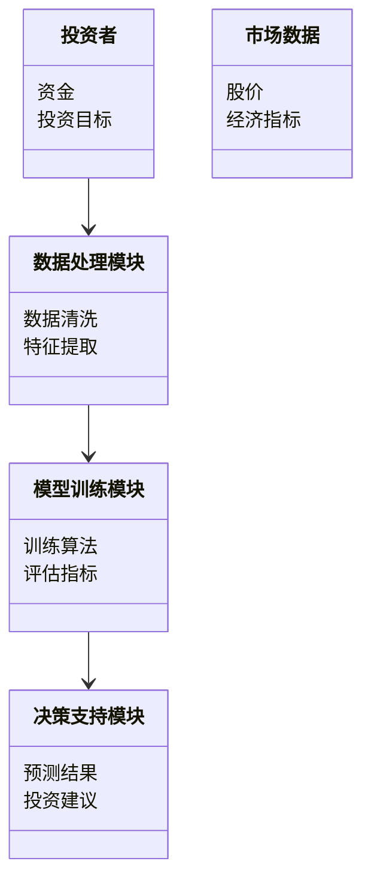

                 


# 《机器学习在投资决策中的应用》

> 关键词：机器学习，投资决策，算法，股票预测，风险控制，投资组合优化

> 摘要：  
本文将探讨机器学习在投资决策中的应用，从基础概念到实际案例，系统性地分析机器学习如何帮助投资者做出更明智的决策。文章涵盖机器学习的核心算法、投资决策的关键要素，以及如何通过系统架构设计将机器学习应用于实际投资场景中。通过案例分析和代码实现，读者将能够理解并掌握机器学习在投资中的应用技巧。

---

# 第1章 机器学习与投资决策的背景

## 1.1 机器学习的基本概念  
### 1.1.1 机器学习的定义  
机器学习是一种人工智能技术，通过数据训练模型，使其能够从数据中学习并做出预测或决策。  

### 1.1.2 机器学习的发展历程  
从早期的线性回归到现代的深度学习，机器学习经历了从简单到复杂的演变。  

### 1.1.3 机器学习的核心特点  
数据驱动、模型训练、自动学习、适应性调整。  

## 1.2 投资决策的复杂性  
### 1.2.1 投资决策的定义  
基于市场信息和数据分析，做出资产配置和交易策略的决策。  

### 1.2.2 投资决策的关键要素  
市场趋势、资产价格、风险评估、投资组合优化。  

### 1.2.3 投资决策的挑战  
市场不确定性、信息不完全、情绪影响、数据噪声。  

## 1.3 机器学习在投资中的应用前景  
### 1.3.1 机器学习在投资中的优势  
数据处理能力强、模式识别精准、自动化决策高效。  

### 1.3.2 机器学习在投资中的潜在应用领域  
股票预测、风险管理、资产配置、量化交易。  

### 1.3.3 机器学习投资的现状与趋势  
量化交易普及、算法优化、实时数据分析。  

---

# 第2章 机器学习与投资决策的核心概念

## 2.1 机器学习的核心概念  
### 2.1.1 数据、特征与标签  
数据是输入，特征是数据的属性，标签是目标输出。  

### 2.1.2 监督学习、无监督学习与强化学习  
- **监督学习**：有标签数据，如线性回归、支持向量机。  
- **无监督学习**：无标签数据，如聚类分析。  
- **强化学习**：基于奖励机制，如Q-Learning。  

### 2.1.3 模型训练、验证与测试  
通过训练数据优化模型，验证集评估泛化能力，测试集验证性能。  

## 2.2 投资决策中的关键概念  
### 2.2.1 股票、债券与基金  
不同资产类型的风险收益特征。  

### 2.2.2 市场趋势与风险评估  
市场波动、宏观经济指标对投资的影响。  

### 2.2.3 投资组合优化与收益最大化  
通过优化算法实现风险可控下的收益最大化。  

## 2.3 机器学习与投资决策的结合  
### 2.3.1 数据驱动的投资决策  
利用大数据分析市场规律，发现投资机会。  

### 2.3.2 机器学习在风险控制中的应用  
识别市场风险，构建风险模型。  

### 2.3.3 机器学习在投资组合优化中的作用  
通过算法优化投资组合配置。  

---

# 第3章 机器学习在投资决策中的核心算法

## 3.1 监督学习算法  
### 3.1.1 线性回归  
$$ y = wx + b $$  
用于预测连续型变量，如股票价格。  

### 3.1.2 支持向量机  
适用于分类问题，如判断市场上涨或下跌。  

### 3.1.3 随机森林  
基于决策树的集成学习算法，适合特征较多的情况。  

## 3.2 非监督学习算法  
### 3.2.1 聚类分析  
将相似的股票或资产归类，便于分析和投资策略制定。  

### 3.2.2 主成分分析  
降维技术，提取数据中的主要特征。  

## 3.3 强化学习算法  
### 3.3.1 Q-Learning  
通过状态-动作-奖励机制优化投资决策。  

### 3.3.2 Deep Q-Learning  
使用深度神经网络近似Q值函数，提高决策精度。  

---

# 第4章 机器学习投资决策系统架构

## 4.1 系统功能设计  
### 4.1.1 数据采集与处理  
从多来源获取市场数据，清洗和特征提取。  

### 4.1.2 模型训练与评估  
选择算法，训练模型，评估性能。  

### 4.1.3 结果展示与决策支持  
可视化分析结果，辅助投资决策。  

## 4.2 系统架构设计  
### 4.2.1 领域模型（Mermaid 类图）  


### 4.2.2 系统架构图（Mermaid 架构图）  


---

# 第5章 项目实战：基于机器学习的股票价格预测

## 5.1 环境安装  
### 5.1.1 安装 Python 和相关库  
```bash
pip install numpy pandas scikit-learn matplotlib
```

## 5.2 数据预处理  
### 5.2.1 数据获取与清洗  
```python
import pandas as pd
import numpy as np

# 获取数据
data = pd.read_csv('stock_data.csv')

# 清洗数据
data = data.dropna()
```

## 5.3 特征工程  
### 5.3.1 特征选择与构建  
```python
from sklearn.preprocessing import StandardScaler

# 标准化处理
scaler = StandardScaler()
features = scaler.fit_transform(data[['open', 'close', 'volume']])
```

## 5.4 模型训练与评估  
### 5.4.1 线性回归模型  
```python
from sklearn.linear_model import LinearRegression
from sklearn.metrics import mean_squared_error

model = LinearRegression()
model.fit(features, data['label'])
```

## 5.5 实际案例分析  
### 5.5.1 模型预测结果  
```python
预测结果 = model.predict(new_features)
```

## 5.6 项目总结  
### 5.6.1 模型表现分析  
均方误差、准确率等指标评估模型性能。  

### 5.6.2 模型优化建议  
调整参数、尝试其他算法、增加特征等。  

---

# 第6章 最佳实践与注意事项

## 6.1 最佳实践  
### 6.1.1 数据质量的重要性  
确保数据准确、完整、及时。  

### 6.1.2 模型过拟合与欠拟合的平衡  
通过交叉验证选择最优模型。  

## 6.2 小结  
机器学习为投资决策提供了强大的工具，但也需要谨慎应用。  

## 6.3 注意事项  
### 6.3.1 风险提示  
模型无法完全预测市场波动，需结合其他分析方法。  

### 6.3.2 持续学习与优化  
市场变化快，模型需定期更新和优化。  

## 6.4 拓展阅读  
推荐书籍和资源，进一步学习机器学习与投资的结合。

---

# 附录：相关工具与库

## 附录A Python库  
- **NumPy**：数组运算  
- **Pandas**：数据处理  
- **Scikit-learn**：机器学习算法  
- **Matplotlib**：数据可视化  

## 附录B 其他工具  
- **TensorFlow/PyTorch**：深度学习框架  
- **QuantLib**：定量金融分析库  

---

通过以上目录，读者可以系统地学习机器学习在投资决策中的应用，从理论到实践，逐步掌握如何利用机器学习优化投资策略。

