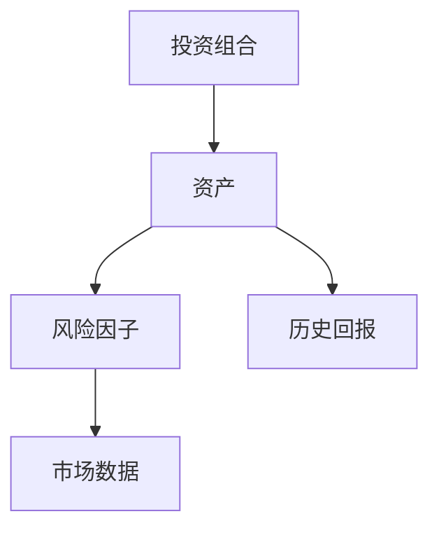
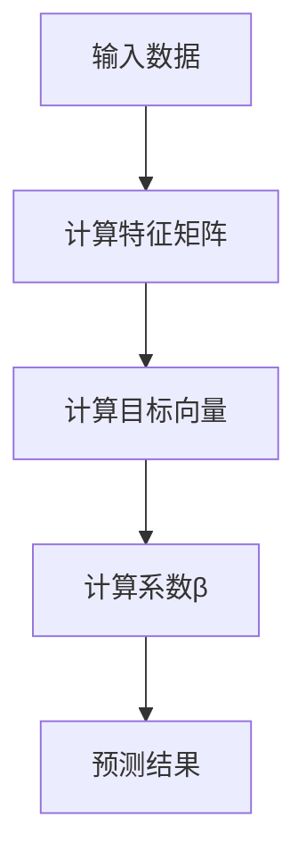
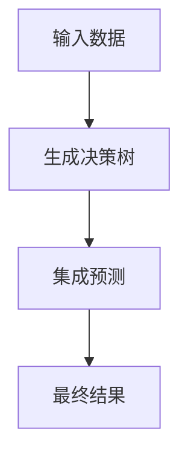
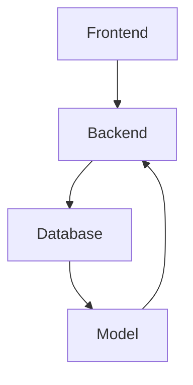
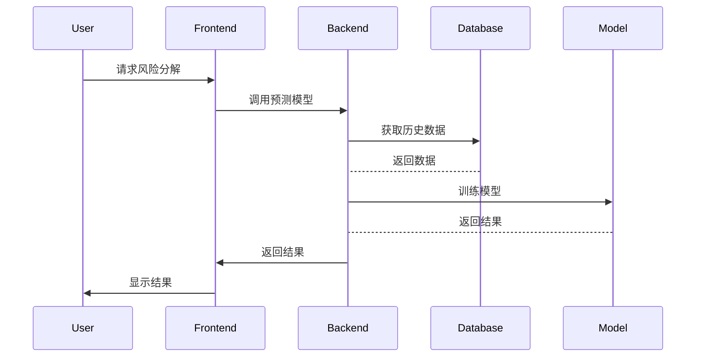

                 


# 目录大纲：《机器学习在投资组合风险分解中的应用》

---

## 第一部分：背景介绍

### 第1章：投资组合风险分解的背景与挑战

#### 1.1 问题背景
- **1.1.1 投资组合风险的重要性**
  - 风险是投资决策的核心考量因素。
  - 投资组合风险分解有助于优化资产配置和风险管理。
- **1.1.2 传统风险分解方法的局限性**
  - 传统方法依赖历史数据和线性模型，难以捕捉复杂市场动态。
  - 面对非线性关系和高维数据时表现不佳。
- **1.1.3 机器学习在金融领域的潜力**
  - 机器学习能够处理复杂数据模式，提供更精准的风险评估。

#### 1.2 问题描述
- **1.2.1 投资组合风险分解的目标**
  - 识别和量化各资产对投资组合风险的贡献。
- **1.2.2 风险分解中的关键问题**
  - 如何准确量化各资产的风险贡献。
  - 如何处理高维数据和非线性关系。
- **1.2.3 数据驱动方法的优势**
  - 利用历史数据和市场信号，构建更精确的风险模型。

#### 1.3 问题解决
- **1.3.1 机器学习如何解决风险分解问题**
  - 使用回归模型预测资产回报，进而分解风险。
- **1.3.2 相关技术与方法的选择**
  - 选择适合的算法（如随机森林、支持向量机）进行风险预测。

#### 1.4 边界与外延
- **1.4.1 机器学习应用的范围**
  - 适用于复杂、高维数据的处理。
- **1.4.2 应用的限制与挑战**
  - 数据质量、模型过拟合、市场变化等风险。
- **1.4.3 相关领域的扩展**
  - 结合市场情绪分析和新闻数据进行风险预测。

#### 1.5 核心要素组成
- **1.5.1 数据来源与特征**
  - 包括资产价格、波动率、市场指数等。
- **1.5.2 模型选择与评估**
  - 选择适合的模型，并通过回测验证其有效性。
- **1.5.3 结果解释与应用**
  - 将模型输出应用于实际投资决策。

---

## 第二部分：核心概念与联系

### 第2章：机器学习模型与投资组合风险分解

#### 2.1 核心概念原理
- **2.1.1 线性回归模型**
  - 用于预测资产回报，分解线性关系。
- **2.1.2 支持向量机**
  - 适用于高维数据，用于分类和回归。
- **2.1.3 随机森林**
  - 集成学习方法，用于非线性风险预测。

#### 2.2 模型对比表格
| 模型类型 | 优点 | 缺点 |
|----------|------|------|
| 线性回归 | 解释性强，计算速度快 | 无法捕捉非线性关系 |
| 支持向量机 | 高维数据表现优秀 | 参数敏感，计算复杂 |
| 随机森林 | 高准确性，鲁棒性强 | 易受噪声影响，解释性较差 |

#### 2.3 ER实体关系图


---

## 第三部分：算法原理讲解

### 第3章：机器学习算法的数学模型与实现

#### 3.1 线性回归模型
- **数学模型**
  $$ y = \beta_0 + \beta_1x + \epsilon $$
- **算法流程图**

- **代码实现**
  ```python
  import numpy as np
  # 示例数据
  X = np.array([1, 2, 3, 4]).reshape(-1, 1)
  y = np.array([2, 4, 6, 8])
  # 线性回归模型
  from sklearn.linear_model import LinearRegression
  model = LinearRegression()
  model.fit(X, y)
  print(model.coef_)
  ```

#### 3.2 随机森林模型
- **数学模型**
  $$ y = \sum_{i=1}^{n} \text{Tree}(x) $$
- **算法流程图**

- **代码实现**
  ```python
  from sklearn.ensemble import RandomForestRegressor
  model = RandomForestRegressor(n_estimators=100)
  model.fit(X, y)
  print(model.predict(X))
  ```

---

## 第四部分：系统分析与架构设计方案

### 第4章：系统架构设计

#### 4.1 问题场景介绍
- 投资组合管理中的风险分解需求。

#### 4.2 项目介绍
- 目标：构建机器学习模型进行风险分解。
- 范围：涵盖数据采集、模型训练、结果分析。

#### 4.3 系统功能设计


#### 4.4 系统架构设计


#### 4.5 系统接口设计
- API定义：RESTful接口，如`/predict`。

#### 4.6 系统交互


---

## 第五部分：项目实战

### 第5章：项目实现与案例分析

#### 5.1 环境安装
- Python 3.8+
- 安装库：scikit-learn、pandas、numpy。

#### 5.2 核心代码实现
```python
import pandas as pd
import numpy as np
from sklearn.ensemble import RandomForestRegressor

# 数据加载与预处理
data = pd.read_csv('portfolio.csv')
X = data[['asset1', 'asset2', 'asset3']]
y = data['return']

# 模型训练
model = RandomForestRegressor()
model.fit(X, y)

# 预测与评估
predictions = model.predict(X)
print("预测值：", predictions)
print("真实值：", y)
```

#### 5.3 代码解读与案例分析
- **代码解读**
  - 数据加载：读取投资组合数据。
  - 特征选择：选取相关资产作为特征。
  - 模型训练：使用随机森林进行训练。
  - 预测与评估：输出预测值和真实值。
- **案例分析**
  - 使用具体数据集进行预测，展示模型效果。
  - 分析预测结果，解释各资产对风险的贡献。

#### 5.4 项目小结
- 成功实现了机器学习模型在投资组合风险分解中的应用。
- 通过案例分析验证了模型的有效性。
- 总结经验，为后续优化提供参考。

---

## 第六部分：最佳实践与注意事项

### 第6章：最佳实践与小结

#### 6.1 最佳实践
- **数据预处理**：确保数据质量和完整性。
- **模型调优**：通过交叉验证优化参数。
- **实时监控**：定期更新模型，适应市场变化。

#### 6.2 小结
- 机器学习为投资组合风险分解提供了强大工具。
- 选择合适的算法和优化模型是关键。
- 实际应用中需考虑数据质量和市场变化。

#### 6.3 注意事项
- 避免过拟合，确保模型泛化能力。
- 定期验证模型，及时调整策略。

#### 6.4 拓展阅读
- 推荐书籍：《机器学习实战》、《Python机器学习》。
- 在线资源：Kaggle上的金融数据分析项目。

---

**摘要**：本文系统地探讨了机器学习在投资组合风险分解中的应用，通过背景介绍、核心概念、算法原理、系统架构设计和项目实战，全面解析了如何利用机器学习技术优化投资组合风险管理。通过具体案例分析和代码实现，展示了机器学习在金融领域的强大潜力。

**关键词**：机器学习、投资组合、风险分解、随机森林、支持向量机、金融数据分析。

