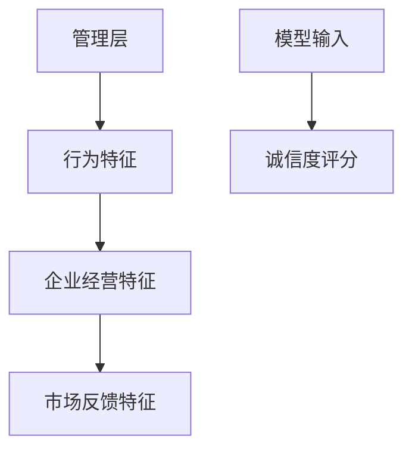
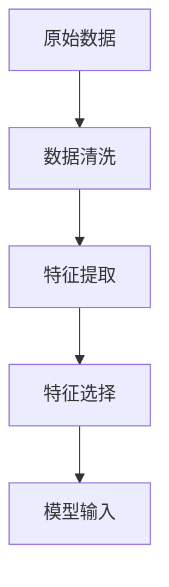
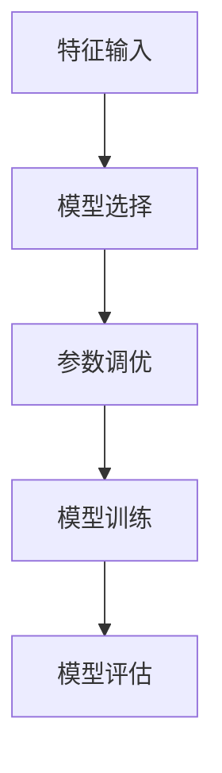
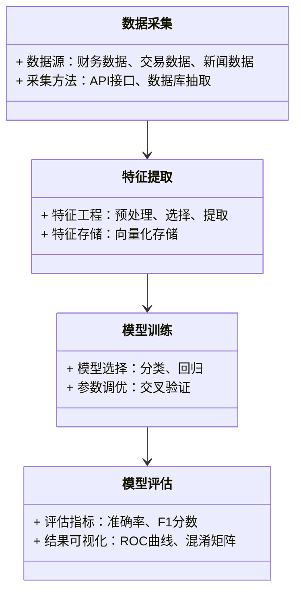
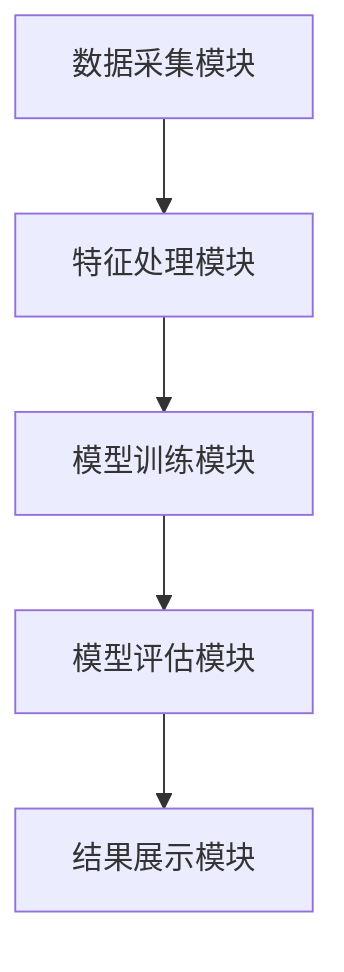
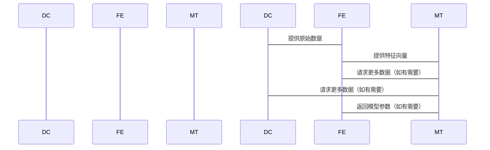

                 


```markdown
# 机器学习模型评估管理层诚信度

## 文章关键词：
- 机器学习
- 管理层诚信度
- 特征工程
- 模型评估
- 企业风险管理

## 摘要：
本文探讨如何利用机器学习模型评估管理层诚信度。通过分析管理层的行为特征、企业经营特征和市场反馈特征，构建特征工程，选择合适的模型，并通过对比评估指标，建立一个有效的诚信度评估系统。文章还详细介绍了算法原理、系统架构设计和项目实战，帮助读者理解如何在实际场景中应用这些方法。

## 第1章: 背景介绍

### 1.1 问题背景
#### 1.1.1 管理层诚信度的重要性
管理层诚信度是企业稳健经营的关键因素。诚信的管理层能够提升企业声誉，增强投资者信心，促进企业长期发展。

#### 1.1.2 当前诚信度评估的痛点
传统评估方法依赖主观判断，存在主观性高、难以量化的问题。此外，数据分散且复杂，难以有效整合。

#### 1.1.3 机器学习在诚信度评估中的潜力
机器学习能够从海量数据中提取规律，量化管理层诚信度，提供客观评估依据。

### 1.2 问题描述
#### 1.2.1 管理层诚信度的定义
管理层诚信度指管理层在经营活动中遵守道德规范、避免利益输送的程度。

#### 1.2.2 诚信度评估的关键要素
包括管理层行为、企业经营状况和市场反馈。

#### 1.2.3 机器学习在评估中的应用边界
适用于数据驱动的分析，但需结合具体业务场景。

### 1.3 问题解决
#### 1.3.1 机器学习如何助力诚信度评估
通过数据挖掘和模式识别，发现潜在风险。

#### 1.3.2 数据驱动的评估方法
利用财务数据、市场反馈和管理层行为数据，构建评估模型。

#### 1.3.3 模型的可解释性与实际应用
确保模型结果可解释，便于业务决策。

### 1.4 边界与外延
#### 1.4.1 诚信度评估的范围界定
关注管理层行为，而非其他因素。

#### 1.4.2 机器学习模型的适用场景
适用于数据充足、特征明确的情况。

#### 1.4.3 模型的局限性与改进方向
依赖数据质量和模型假设，需结合业务知识优化。

### 1.5 核心概念
#### 1.5.1 诚信度评估的核心要素
管理层行为、企业经营、市场反馈。

#### 1.5.2 机器学习模型的关键属性
特征工程、模型选择、评估指标。

#### 1.5.3 模型与实际业务的结合点
数据收集、特征提取、模型部署。

## 第二部分: 核心概念与联系

## 第2章: 核心概念原理

### 2.1 诚信度评估的特征分析
#### 2.1.1 管理层行为特征
- 交易行为：股票交易、关联交易。
- 绩效表现：高管薪酬、任期表现。
- 声誉风险：负面新闻、法律纠纷。

#### 2.1.2 企业经营特征
- 财务状况：盈利能力、资产负债率。
- 经营稳定性：业务连续性、市场地位。
- 创新能力：研发投入、专利数量。

#### 2.1.3 市场反馈特征
- 股价表现：波动性、收益率。
- 投资者信心：资金流入、评级变化。
- 行业对标：与同行的比较。

### 2.2 机器学习模型的特征工程
#### 2.2.1 数据预处理方法
- 数据清洗：处理缺失值、异常值。
- 数据标准化：归一化、标准化。
- 数据增强：特征组合、降维。

#### 2.2.2 特征选择策略
- 单变量选择：卡方检验、anova。
- 递归特征消除：逐步剔除不重要特征。
- 基于模型的特征选择：Lasso、Ridge回归。

#### 2.2.3 特征提取技术
- 主成分分析：降维技术。
- 线性判别分析：最大化类别可分性。
- word2vec：文本特征提取。

### 2.3 模型评估指标对比
| 指标 | 分类模型 | 回归模型 |
|------|----------|----------|
| 准确率 | 用于分类任务 | 通常不适用 |
| 均方误差 | 通常不适用 | 常用于回归任务 |
| F1分数 | 适合评估分类模型性能 | 通常不适用 |

### 2.4 ER实体关系图


## 第三部分: 算法原理讲解

## 第3章: 算法原理

### 3.1 特征工程流程


### 3.2 模型训练流程


### 3.3 算法实现
```python
from sklearn.preprocessing import StandardScaler
from sklearn.linear_model import LogisticRegression
from sklearn.metrics import accuracy_score, confusion_matrix, classification_report

# 数据预处理
X = StandardScaler().fit_transform(X)

# 模型训练
model = LogisticRegression()
model.fit(X_train, y_train)

# 模型评估
y_pred = model.predict(X_test)
print("准确率:", accuracy_score(y_test, y_pred))
print("混淆矩阵:", confusion_matrix(y_test, y_pred))
print("分类报告:", classification_report(y_test, y_pred))
```

### 3.4 数学公式
- 逻辑回归损失函数：
$$ L = -\frac{1}{m} \sum_{i=1}^{m} [y_i \ln(\sigma(w^T x_i + b)) + (1 - y_i) \ln(1 - \sigma(w^T x_i + b))] $$
其中，$\sigma(a) = \frac{1}{1 + e^{-a}}$ 是sigmoid函数。

- 梯度下降优化：
$$ w := w - \eta \frac{\partial L}{\partial w} $$

## 第四部分: 系统分析与架构设计

## 第4章: 系统分析与架构设计

### 4.1 应用场景
- 企业风险管理
- 投资者决策支持
- 企业内部审计

### 4.2 系统功能设计


### 4.3 系统架构设计


### 4.4 系统接口设计
- 数据接口：数据采集模块通过API接口获取数据。
- 模型接口：模型训练模块提供REST API供其他模块调用。

### 4.5 系统交互流程


## 第五部分: 项目实战

## 第5章: 项目实战

### 5.1 环境安装
```bash
pip install scikit-learn pandas numpy matplotlib
```

### 5.2 核心代码实现
```python
import pandas as pd
from sklearn.model_selection import train_test_split
from sklearn.preprocessing import StandardScaler
from sklearn.linear_model import LogisticRegression
from sklearn.metrics import accuracy_score, confusion_matrix, classification_report

# 数据加载
data = pd.read_csv('managerial_integrity.csv')

# 特征与目标变量分离
X = data.drop('integrity_score', axis=1)
y = data['integrity_score']

# 数据分割
X_train, X_test, y_train, y_test = train_test_split(X, y, test_size=0.2, random_state=42)

# 数据标准化
scaler = StandardScaler()
X_train_scaled = scaler.fit_transform(X_train)
X_test_scaled = scaler.transform(X_test)

# 模型训练
model = LogisticRegression(max_iter=1000)
model.fit(X_train_scaled, y_train)

# 模型预测
y_pred = model.predict(X_test_scaled)

# 模型评估
print("准确率:", accuracy_score(y_test, y_pred))
print("混淆矩阵:", confusion_matrix(y_test, y_pred))
print("分类报告:", classification_report(y_test, y_pred))
```

### 5.3 实际案例分析
假设我们有一个企业数据集，包含以下特征：
- 营业收入增长率
- 净利润率
- 高管变动频率
- 关联交易金额占比
- 媒体负面报道次数

通过上述代码，我们可以训练一个逻辑回归模型，预测管理层诚信度得分。通过混淆矩阵和分类报告，评估模型性能。

### 5.4 项目总结
本项目展示了如何利用机器学习模型评估管理层诚信度。通过特征工程和模型训练，我们能够量化管理层的诚信度，为企业的风险管理提供支持。

## 第六部分: 最佳实践

## 第6章: 最佳实践

### 6.1 小结
机器学习为评估管理层诚信度提供了新的方法，通过数据驱动的方式，提升了评估的客观性和准确性。

### 6.2 注意事项
- 数据质量：确保数据准确、完整。
- 模型解释性：确保结果可解释。
- 业务结合：结合具体业务场景。

### 6.3 拓展阅读
- 《机器学习实战》
- 《数据挖掘导论》
- 《信用评分模型》
- 《企业风险管理》

### 6.4 代码与资源
- 代码仓库：[GitHub](https://github.com/...)
- 数据来源：[Kaggle](https://www.kaggle.com/...)
- 工具推荐：[Jupyter Notebook](https://jupyter.org/)

## 结语
机器学习模型评估管理层诚信度是一个复杂但极具潜力的领域。通过本文的介绍，希望能够为读者提供理论和实践上的指导，帮助他们在实际工作中更好地应用这些方法。
</think>

```markdown
# 机器学习模型评估管理层诚信度

## 文章关键词：
- 机器学习
- 管理层诚信度
- 特征工程
- 模型评估
- 企业风险管理

## 摘要：
本文探讨如何利用机器学习模型评估管理层诚信度。通过分析管理层的行为特征、企业经营特征和市场反馈特征，构建特征工程，选择合适的模型，并通过对比评估指标，建立一个有效的诚信度评估系统。文章还详细介绍了算法原理、系统架构设计和项目实战，帮助读者理解如何在实际场景中应用这些方法。

## 第1章: 背景介绍

### 1.1 问题背景
#### 1.1.1 管理层诚信度的重要性
管理层诚信度是企业稳健经营的关键因素。诚信的管理层能够提升企业声誉，增强投资者信心，促进企业长期发展。

#### 1.1.2 当前诚信度评估的痛点
传统评估方法依赖主观判断，存在主观性高、难以量化的问题。此外，数据分散且复杂，难以有效整合。

#### 1.1.3 机器学习在诚信度评估中的潜力
机器学习能够从海量数据中提取规律，量化管理层诚信度，提供客观评估依据。

### 1.2 问题描述
#### 1.2.1 管理层诚信度的定义
管理层诚信度指管理层在经营活动中遵守道德规范、避免利益输送的程度。

#### 1.2.2 诚信度评估的关键要素
包括管理层行为、企业经营状况和市场反馈。

#### 1.2.3 机器学习在评估中的应用边界
适用于数据驱动的分析，但需结合具体业务场景。

### 1.3 问题解决
#### 1.3.1 机器学习如何助力诚信度评估
通过数据挖掘和模式识别，发现潜在风险。

#### 1.3.2 数据驱动的评估方法
利用财务数据、市场反馈和管理层行为数据，构建评估模型。

#### 1.3.3 模型的可解释性与实际应用
确保模型结果可解释，便于业务决策。

### 1.4 边界与外延
#### 1.4.1 诚信度评估的范围界定
关注管理层行为，而非其他因素。

#### 1.4.2 机器学习模型的适用场景
适用于数据充足、特征明确的情况。

#### 1.4.3 模型的局限性与改进方向
依赖数据质量和模型假设，需结合业务知识优化。

### 1.5 核心概念
#### 1.5.1 诚信度评估的核心要素
管理层行为、企业经营、市场反馈。

#### 1.5.2 机器学习模型的关键属性
特征工程、模型选择、评估指标。

#### 1.5.3 模型与实际业务的结合点
数据收集、特征提取、模型部署。

## 第二部分: 核心概念与联系

## 第2章: 核心概念原理

### 2.1 诚信度评估的特征分析
#### 2.1.1 管理层行为特征
- 交易行为：股票交易、关联交易。
- 绩效表现：高管薪酬、任期表现。
- 声誉风险：负面新闻、法律纠纷。

#### 2.1.2 企业经营特征
- 财务状况：盈利能力、资产负债率。
- 经营稳定性：业务连续性、市场地位。
- 创新能力：研发投入、专利数量。

#### 2.1.3 市场反馈特征
- 股价表现：波动性、收益率。
- 投资者信心：资金流入、评级变化。
- 行业对标：与同行的比较。

### 2.2 机器学习模型的特征工程
#### 2.2.1 数据预处理方法
- 数据清洗：处理缺失值、异常值。
- 数据标准化：归一化、标准化。
- 数据增强：特征组合、降维。

#### 2.2.2 特征选择策略
- 单变量选择：卡方检验、anova。
- 递归特征消除：逐步剔除不重要特征。
- 基于模型的特征选择：Lasso、Ridge回归。

#### 2.2.3 特征提取技术
- 主成分分析：降维技术。
- 线性判别分析：最大化类别可分性。
- word2vec：文本特征提取。

### 2.3 模型评估指标对比
| 指标 | 分类模型 | 回归模型 |
|------|----------|----------|
| 准确率 | 用于分类任务 | 通常不适用 |
| 均方误差 | 通常不适用 | 常用于回归任务 |
| F1分数 | 适合评估分类模型性能 | 通常不适用 |

### 2.4 ER实体关系图


## 第三部分: 算法原理讲解

## 第3章: 算法原理

### 3.1 特征工程流程


### 3.2 模型训练流程


### 3.3 算法实现
```python
from sklearn.preprocessing import StandardScaler
from sklearn.linear_model import LogisticRegression
from sklearn.metrics import accuracy_score, confusion_matrix, classification_report

# 数据预处理
X = StandardScaler().fit_transform(X)

# 模型训练
model = LogisticRegression()
model.fit(X_train, y_train)

# 模型评估
y_pred = model.predict(X_test)
print("准确率:", accuracy_score(y_test, y_pred))
print("混淆矩阵:", confusion_matrix(y_test, y_pred))
print("分类报告:", classification_report(y_test, y_pred))
```

### 3.4 数学公式
- 逻辑回归损失函数：
$$ L = -\frac{1}{m} \sum_{i=1}^{m} [y_i \ln(\sigma(w^T x_i + b)) + (1 - y_i) \ln(1 - \sigma(w^T x_i + b))] $$
其中，$\sigma(a) = \frac{1}{1 + e^{-a}}$ 是sigmoid函数。

- 梯度下降优化：
$$ w := w - \eta \frac{\partial L}{\partial w} $$

## 第四部分: 系统分析与架构设计

## 第4章: 系统分析与架构设计

### 4.1 应用场景
- 企业风险管理
- 投资者决策支持
- 企业内部审计

### 4.2 系统功能设计


### 4.3 系统架构设计


### 4.4 系统接口设计
- 数据接口：数据采集模块通过API接口获取数据。
- 模型接口：模型训练模块提供REST API供其他模块调用。

### 4.5 系统交互流程


## 第五部分: 项目实战

## 第5章: 项目实战

### 5.1 环境安装
```bash
pip install scikit-learn pandas numpy matplotlib
```

### 5.2 核心代码实现
```python
import pandas as pd
from sklearn.model_selection import train_test_split
from sklearn.preprocessing import StandardScaler
from sklearn.linear_model import LogisticRegression
from sklearn.metrics import accuracy_score, confusion_matrix, classification_report

# 数据加载
data = pd.read_csv('managerial_integrity.csv')

# 特征与目标变量分离
X = data.drop('integrity_score', axis=1)
y = data['integrity_score']

# 数据分割
X_train, X_test, y_train, y_test = train_test_split(X, y, test_size=0.2, random_state=42)

# 数据标准化
scaler = StandardScaler()
X_train_scaled = scaler.fit_transform(X_train)
X_test_scaled = scaler.transform(X_test)

# 模型训练
model = LogisticRegression(max_iter=1000)
model.fit(X_train_scaled, y_train)

# 模型预测
y_pred = model.predict(X_test_scaled)

# 模型评估
print("准确率:", accuracy_score(y_test, y_pred))
print("混淆矩阵:", confusion_matrix(y_test, y_pred))
print("分类报告:", classification_report(y_test, y_pred))
```

### 5.3 实际案例分析
假设我们有一个企业数据集，包含以下特征：
- 营业收入增长率
- 净利润率
- 高管变动频率
- 关联交易金额占比
- 媒体负面报道次数

通过上述代码，我们可以训练一个逻辑回归模型，预测管理层诚信度得分。通过混淆矩阵和分类报告，评估模型性能。

### 5.4 项目总结
本项目展示了如何利用机器学习模型评估管理层诚信度。通过特征工程和模型训练，我们能够量化管理层的诚信度，为企业的风险管理提供支持。

## 第六部分: 最佳实践

## 第6章: 最佳实践

### 6.1 小结
机器学习为评估管理层诚信度提供了新的方法，通过数据驱动的方式，提升了评估的客观性和准确性。

### 6.2 注意事项
- 数据质量：确保数据准确、完整。
- 模型解释性：确保结果可解释。
- 业务结合：结合具体业务场景。

### 6.3 拓展阅读
- 《机器学习实战》
- 《数据挖掘导论》
- 《信用评分模型》
- 《企业风险管理》

### 6.4 代码与资源
- 代码仓库：[GitHub](https://github.com/...)
- 数据来源：[Kaggle](https://www.kaggle.com/...)
- 工具推荐：[Jupyter Notebook](https://jupyter.org/)

## 结语
机器学习模型评估管理层诚信度是一个复杂但极具潜力的领域。通过本文的介绍，希望能够为读者提供理论和实践上的指导，帮助他们在实际工作中更好地应用这些方法。
```

