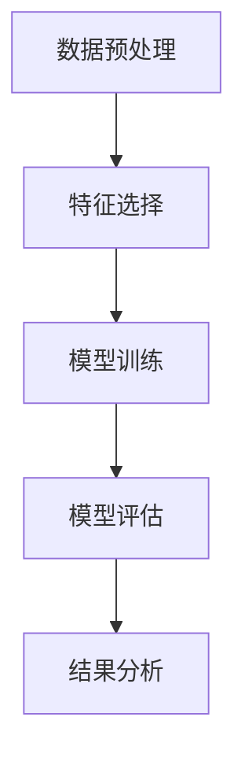
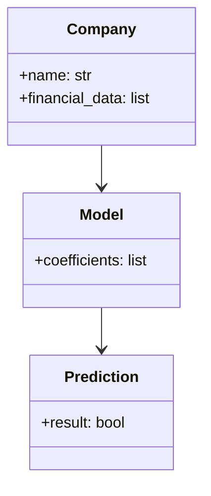

                 


# 《机器学习模型预测公司财务健康》

> 关键词：机器学习，财务健康，预测模型，算法，数据处理

> 摘要：本文将深入探讨如何利用机器学习技术预测公司财务健康。通过分析财务数据，选择合适的算法，并构建预测模型，帮助公司提前识别财务风险，优化决策。本文将从背景介绍、核心概念、算法原理、系统设计、项目实战到总结，逐步解析这一过程。

---

## 第一部分：背景与核心概念

### 第1章：问题背景与描述

#### 1.1 问题背景
- **公司财务健康的重要性**  
  财务健康是企业生存和发展的基础，决定了企业的偿债能力、盈利能力和发展潜力。
- **传统财务分析的局限性**  
  传统方法依赖人工分析，耗时且容易受主观因素影响，难以快速应对复杂市场变化。
- **机器学习在财务预测中的优势**  
  利用机器学习技术，可以快速处理大量数据，发现隐藏的模式，提高预测准确性。

#### 1.2 问题描述
- **财务健康预测的定义**  
  基于历史和当前财务数据，预测公司未来财务状况的健康程度。
- **关键指标**  
  包括资产负债率、净利润率、流动比率、速动比率等。
- **目标与意义**  
  提前识别潜在风险，优化资源配置，提升企业抗风险能力。

#### 1.3 问题解决方法
- **数据驱动的财务分析**  
  通过收集和分析财务数据，提取特征变量。
- **机器学习算法选择**  
  使用逻辑回归、随机森林、XGBoost等算法进行建模。
- **模型优化与验证**  
  通过交叉验证和调参，提升模型性能。

#### 1.4 边界与外延
- **适用范围**  
  适用于上市公司或有足够财务数据的公司。
- **局限性**  
  数据质量影响模型准确性，市场环境变化可能导致模型失效。
- **关联领域**  
  与企业风险管理、投资决策等领域密切相关。

### 第2章：核心概念与联系

#### 2.1 财务健康预测的核心要素
- **财务指标**  
  资产负债表、利润表、现金流量表中的关键指标。
- **数据特征**  
  时间序列特征、行业特征、公司规模特征。
- **模型选择**  
  根据数据特点选择合适的算法，如时间序列数据适合LSTM。

#### 2.2 核心概念的联系
- **财务指标与模型的关系**  
  不同的财务指标影响模型的特征选择和性能。
- **数据预处理的重要性**  
  数据清洗、标准化、特征工程是模型成功的关键。
- **模型解释性与业务决策**  
  高解释性的模型更便于业务人员理解和应用。

#### 2.3 概念属性对比表格
| 概念       | 特征指标         | 机器学习算法       |
|------------|------------------|--------------------|
| 财务健康预测 | 资产负债率       | 逻辑回归          |
|            | 净利润增长率     | 随机森林          |
|            | 流动比率         | XGBoost           |

#### 2.4 ER实体关系图


---

## 第二部分：算法原理与数学模型

### 第3章：算法原理讲解

#### 3.1 常见算法原理
- **逻辑回归**
  - **原理**：通过sigmoid函数将线性组合映射到概率空间，常用于二分类问题。
  - **公式**：\( P(y=1|x) = \frac{e^{\beta x}}{1 + e^{\beta x}} \)
  - **优点**：解释性强，适合线性可分问题。
  - **缺点**：不擅长处理复杂非线性关系。

- **随机森林**
  - **原理**：基于决策树的集成方法，通过随机采样和特征选择提升泛化能力。
  - **优点**：高准确性，鲁棒性强。
  - **缺点**：解释性较差。

- **XGBoost**
  - **原理**：使用提升树算法，通过正则化和剪枝优化模型。
  - **公式**：目标函数为损失函数加正则项，\( L = \sum (y_i - \hat{y}_i) + \lambda \sum \theta^2 \)
  - **优点**：训练速度快，性能优越。

#### 3.2 算法流程图


#### 3.3 数学公式与代码实现
- **逻辑回归代码示例**：
  ```python
  from sklearn.linear_model import LogisticRegression
  model = LogisticRegression()
  model.fit(X_train, y_train)
  ```

---

## 第三部分：系统分析与架构设计

### 第4章：系统设计

#### 4.1 问题场景介绍
- 数据来源：上市公司财报数据，包括资产负债表、利润表等。
- 数据预处理：清洗、缺失值处理、标准化。
- 模型部署：构建API接口，提供实时预测服务。

#### 4.2 系统功能设计


#### 4.3 系统架构设计


---

## 第四部分：项目实战

### 第5章：项目实现

#### 5.1 环境安装
- 安装Python、scikit-learn、xgboost等库。

#### 5.2 核心代码实现
- 数据预处理：
  ```python
  import pandas as pd
  df = pd.read_csv('financial_data.csv')
  df.dropna(inplace=True)
  ```

- 模型训练：
  ```python
  from xgboost import XGBClassifier
  model = XGBClassifier()
  model.fit(X_train, y_train)
  ```

#### 5.3 案例分析
- 使用实际数据训练模型，评估准确率、召回率等指标。

#### 5.4 总结
- 项目小结：模型性能分析，优化建议。

---

## 第五部分：总结与展望

### 第6章：总结与展望

#### 6.1 最佳实践
- 数据预处理至关重要，特征工程提升性能。
- 选择合适的模型，平衡准确性和解释性。

#### 6.2 小结
- 机器学习在财务健康预测中的应用价值显著，但需要结合业务场景优化模型。

#### 6.3 注意事项
- 数据隐私保护，模型更新维护。

#### 6.4 拓展阅读
- 推荐相关书籍和论文，深入学习机器学习与金融结合的应用。

---

通过以上步骤，我们可以系统地构建和优化机器学习模型，准确预测公司财务健康，为企业决策提供有力支持。

