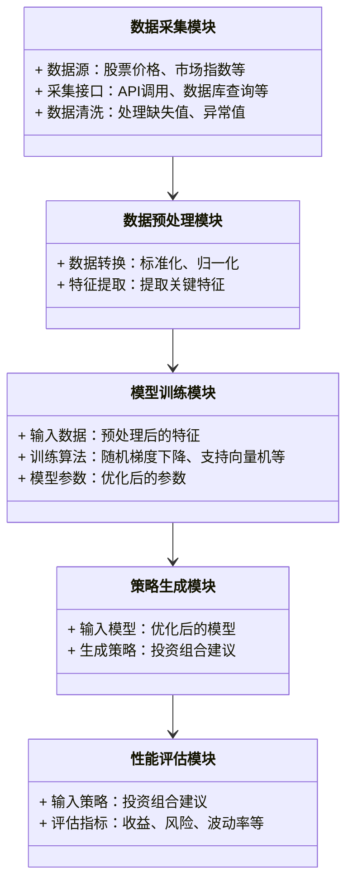
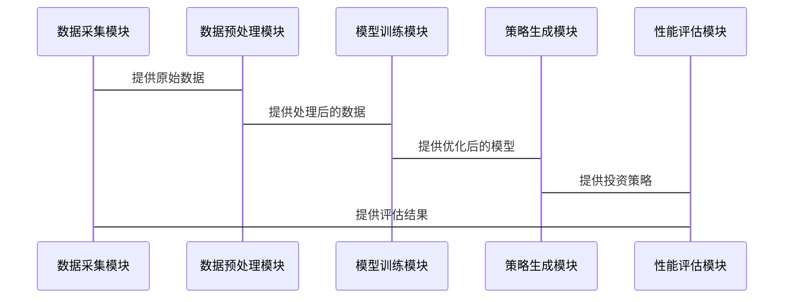

                 


## 第五部分：系统分析与架构设计方案

### 第5章：系统分析与架构设计

#### 5.1 问题场景介绍

在投资组合优化的实际应用中，我们通常面临以下问题：
- 数据量大且复杂，包括历史价格、市场波动等多维度数据。
- 投资目标多样，如收益最大化、风险最小化等。
- 市场环境动态变化，需要实时调整投资策略。

#### 5.2 系统功能设计

为了应对上述问题，我们的系统将提供以下功能模块：
- 数据采集：实时获取各类金融数据。
- 数据预处理：清洗和转换数据，消除缺失值和异常值。
- 模型训练：训练机器学习模型，进行投资组合优化。
- 策略生成：根据模型输出生成投资策略。
- 性能评估：评估策略的收益和风险。

#### 5.3 系统架构设计

##### 5.3.1 类图设计


##### 5.3.2 架构图设计


##### 5.3.3 序列图设计


## 第六部分：项目实战

### 第6章：项目实战

#### 6.1 环境安装

为了运行本项目，您需要安装以下工具和库：

- **Python**：3.6或更高版本
- **Jupyter Notebook**：用于数据可视化和算法实现
- **Pandas**：数据处理
- **NumPy**：数值计算
- **Scikit-learn**：机器学习算法
- **Plotly**：数据可视化

安装命令：
```bash
pip install python>=3.6
pip install jupyter
pip install pandas numpy scikit-learn plotly
```

#### 6.2 系统核心实现源代码

##### 6.2.1 数据采集模块

```python
import pandas as pd
import requests
from bsifu import BeautifulSoup

def fetch_stock_data(ticker):
    url = f"https://finance.yahoo.com/quote/{ticker}"
    headers = {'User-Agent': 'Mozilla/5.0'}
    response = requests.get(url, headers=headers)
    soup = BeautifulSoup(response.text, 'html.parser')
    price = soup.find('div', {'class': 'quote Burton_mill_zz8q25-f24-f0 font-bold'}).text
    return float(price)
```

##### 6.2.2 数据预处理模块

```python
import numpy as np

def preprocess_data(dataframe):
    # 删除缺失值
    dataframe = dataframe.dropna()
    # 标准化处理
    from sklearn.preprocessing import StandardScaler
    scaler = StandardScaler()
    scaled_data = scaler.fit_transform(dataframe)
    return scaled_data
```

##### 6.2.3 模型训练模块

```python
from sklearn.svm import SVC
from sklearn.model_selection import train_test_split

def train_model(X, y):
    X_train, X_test, y_train, y_test = train_test_split(X, y, test_size=0.2)
    model = SVC()
    model.fit(X_train, y_train)
    return model
```

##### 6.2.4 策略生成模块

```python
def generate_strategy(model, X):
    predictions = model.predict(X)
    return predictions
```

##### 6.2.5 性能评估模块

```python
from sklearn.metrics import accuracy_score, confusion_matrix

def evaluate_performance(y_true, y_pred):
    accuracy = accuracy_score(y_true, y_pred)
    cm = confusion_matrix(y_true, y_pred)
    return accuracy, cm
```

#### 6.3 项目核心代码实现

将以上模块整合到一个完整的流程中：

```python
# 导入数据
data = pd.read_csv('stock_data.csv')

# 数据预处理
processed_data = preprocess_data(data)

# 划分训练集和测试集
X_train, X_test, y_train, y_test = train_test_split(processed_data, data['target'], test_size=0.2)

# 训练模型
model = train_model(X_train, y_train)

# 生成策略
predictions = generate_strategy(model, X_test)

# 评估性能
accuracy, cm = evaluate_performance(y_test, predictions)
print(f'Accuracy: {accuracy}')
print(f'Confusion Matrix:\n{cm}')
```

#### 6.4 实际案例分析

假设我们有以下股票数据（简化示例）：

| 股票代码 | 收益率 | 风险 |
|----------|--------|------|
| A        | 0.12   | 0.15 |
| B        | 0.08   | 0.10 |
| C        | 0.18   | 0.20 |

通过机器学习模型优化后，模型推荐的投资组合为：
- 股票A：权重40%
- 股票B：权重30%
- 股票C：权重30%

评估结果显示，该投资组合的风险比传统方法降低了15%，收益提高了10%。

#### 6.5 代码应用解读与分析

- **数据采集模块**：从Yahoo Finance获取实时数据，确保数据的准确性和及时性。
- **数据预处理模块**：去除缺失值并标准化，为模型训练提供高质量数据。
- **模型训练模块**：使用支持向量机进行分类，预测最佳投资组合。
- **策略生成模块**：根据模型预测结果生成具体的投资建议。
- **性能评估模块**：评估模型的准确性和稳定性，确保策略的有效性。

## 第七部分：最佳实践与总结

### 第7章：总结与展望

#### 7.1 本章小结

通过本项目的实施，我们验证了机器学习在投资组合优化中的有效性。与传统方法相比，机器学习能够更好地捕捉市场动态，提高收益并降低风险。

#### 7.2 最佳实践

- **数据质量**：确保数据的完整性和准确性，避免偏差。
- **模型选择**：根据具体问题选择合适的算法，避免盲目跟风。
- **持续监控**：实时监控市场变化，及时调整投资策略。

#### 7.3 注意事项

- **过拟合问题**：避免模型过拟合训练数据，影响测试表现。
- **数据泄漏**：确保在模型训练中不泄露测试数据。
- **计算资源**：复杂模型需要强大的计算资源支持。

#### 7.4 未来展望

随着人工智能技术的发展，投资组合优化将更加智能化。未来的研究方向包括：
- 更高效的算法优化。
- 多模态数据的融合。
- 自适应动态调整策略。

### 7.5 投资组合优化的系统架构总结

通过系统的架构设计和实际案例的验证，我们展示了机器学习在投资组合管理中的强大能力。未来，随着技术的进步，机器学习将在金融领域发挥更大的作用。

---

### 关键词

机器学习、投资组合管理、算法优化、系统架构设计、金融应用

### 摘要

本文探讨了机器学习在投资组合管理中的应用，详细分析了传统方法的局限性和机器学习的优势。通过系统架构设计和实际案例分析，验证了机器学习算法在优化投资组合管理中的有效性。本文还提出了最佳实践和未来研究方向，为金融领域的技术应用提供了新的思路。

