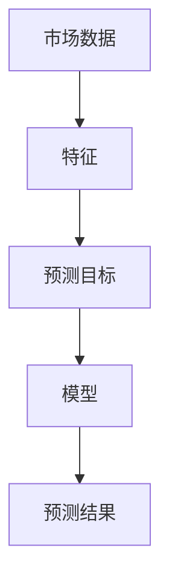

                 


# 机器学习算法在市场预测中的效果评估

> **关键词**：机器学习、市场预测、效果评估、算法选择、数据特征、数学模型

> **摘要**：本文系统地探讨了机器学习算法在市场预测中的应用与效果评估。通过分析传统预测方法的局限性，介绍机器学习的优势，详细讲解了常用算法及其原理，并通过实际案例展示了如何构建预测模型。文章还讨论了模型评估指标、系统架构设计以及最佳实践，为读者提供全面的指导。

---

## 正文

### 第一部分：背景介绍

#### 第1章：机器学习与市场预测的背景

##### 1.1 问题背景
- **传统市场预测方法的局限性**  
  传统的市场预测方法主要依赖统计分析和专家经验，但在面对复杂、动态的市场环境时，往往难以捕捉非线性关系和隐藏模式，预测精度有限。

- **机器学习在市场预测中的优势**  
  机器学习能够处理海量数据，发现复杂模式，提供更高的预测精度和灵活性。

- **当前市场预测中的技术挑战**  
  数据质量、特征工程、模型泛化能力等问题仍待解决。

##### 1.2 问题描述
- **市场预测的核心问题**  
  预测市场趋势，如股票价格、销售量等。
- **数据特征与预测目标的关系**  
  特征工程是提升模型性能的关键。
- **机器学习在市场预测中的应用场景**  
  包括股票价格预测、销售预测、客户行为分析等。

##### 1.3 问题解决
- **机器学习算法的选择与优化**  
  根据数据特性选择合适的算法。
- **数据预处理与特征工程**  
  数据清洗、特征提取、特征选择。
- **模型评估与优化策略**  
  使用交叉验证、网格搜索等方法。

##### 1.4 边界与外延
- **市场预测的边界条件**  
  数据质量和模型假设。
- **相关领域的外延**  
  包括金融、零售、能源等领域。
- **机器学习在市场预测中的适用范围**  
  处理复杂非线性关系，但需注意过拟合和数据泄漏问题。

##### 1.5 核心要素与概念结构
- **数据、特征、模型的关系**  
  特征是数据的高层次表达，模型通过特征学习目标。
- **市场预测的核心要素**  
  数据、特征、模型、目标。
- **机器学习算法的分类与选择**  
  监督学习、无监督学习、深度学习等。

---

### 第二部分：核心概念与联系

#### 第2章：机器学习与市场预测的核心概念

##### 2.1 核心概念原理
- **机器学习的基本原理**  
  从数据中学习模式，用于预测或分类。
- **市场预测的核心要素**  
  数据、特征、模型、目标。
- **机器学习在市场预测中的作用**  
  发现复杂模式，提高预测精度。

##### 2.2 核心概念对比
- **不同机器学习算法的特征对比**  
  | 算法 | 是否需要标签 | 数据类型 | 优点 | 缺点 |
  |------|---------------|----------|------|------|
  | 线性回归 | 是 | 数值型 | 简单、解释性强 | 不能处理非线性关系 |
  | 支持向量机 | 是 | 数值型 | 高精度 | 不适合高维数据 |
  | 随机森林 | 是 | 数值/分类 | 高精度、鲁棒性好 | 易过拟合 |
  | 神经网络 | 是 | 多种类型 | 处理复杂模式 | 训练时间长 |

##### 2.3 ER实体关系图


---

### 第三部分：算法原理讲解

#### 第3章：常用机器学习算法及其原理

##### 3.1 线性回归
- **原理**  
  假设目标与特征呈线性关系，通过最小化平方误差优化模型。
- **数学模型**  
  $$ y = \beta_0 + \beta_1x + \epsilon $$
- **优缺点**  
  优点：简单、易于解释。缺点：不能处理非线性关系。

##### 3.2 支持向量机
- **原理**  
  寻找最优超平面，最大化类别间隔。
- **数学模型**  
  $$ \text{目标：} \min \frac{1}{2}\|w\|^2 + C\sum_{i=1}^n \xi_i $$
  $$ \text{约束：} y_i(w \cdot x_i + b) \geq 1 - \xi_i $$
- **优缺点**  
  优点：高精度。缺点：不适合高维数据。

##### 3.3 随机森林
- **原理**  
  构建多棵决策树，集成预测结果。
- **数学模型**  
  集成学习，无明确公式。
- **优缺点**  
  优点：鲁棒性好。缺点：易过拟合。

##### 3.4 神经网络
- **原理**  
  模拟人脑神经网络，通过多层结构学习复杂模式。
- **数学模型**  
  $$ a^{(l+1)} = \sigma(w^{(l)}a^{(l)} + b^{(l)}) $$
  其中，$\sigma$ 是激活函数。
- **优缺点**  
  优点：处理复杂模式能力强。缺点：训练时间长。

---

### 第四部分：数学模型

#### 第4章：机器学习算法的数学模型

##### 4.1 线性回归
- **损失函数**  
  $$ \text{MSE} = \frac{1}{n}\sum_{i=1}^n (y_i - \hat{y}_i)^2 $$
  
##### 4.2 支持向量机
- **优化目标**  
  $$ \min \frac{1}{2}\|w\|^2 + C\sum_{i=1}^n \xi_i $$
  $$ \text{约束：} y_i(w \cdot x_i + b) \geq 1 - \xi_i $$

##### 4.3 随机森林
- **集成方法**  
  使用袋装法和特征子集法构建多棵决策树，投票或平均结果。

##### 4.4 神经网络
- **前向传播**  
  $$ a^{(l+1)} = \sigma(w^{(l)}a^{(l)} + b^{(l)}) $$
- **反向传播**  
  $$ \frac{\partial L}{\partial w^{(l)}} = a^{(l+1)}(1 - a^{(l+1)}) \cdot \frac{\partial L}{\partial a^{(l+1)}} $$

---

### 第五部分：系统分析与架构设计方案

#### 第5章：系统架构设计

##### 5.1 问题场景介绍
- 市场预测系统用于预测股票价格，帮助投资者做出决策。

##### 5.2 系统功能设计
- **领域模型**  
  ```mermaid
  classDiagram
      class 数据输入 {
          历史数据
          市场数据
      }
      class 特征工程 {
          数据清洗
          特征提取
      }
      class 模型训练 {
          训练数据
          模型参数
      }
      class 模型预测 {
          测试数据
          预测结果
      }
      数据输入 --> 特征工程
      特征工程 --> 模型训练
      模型训练 --> 模型预测
  ```

##### 5.3 系统架构设计
- **系统架构图**  
  ```mermaid
  graph LR
      A[数据输入] --> B[特征工程]
      B --> C[模型训练]
      C --> D[模型预测]
      D --> E[结果输出]
  ```

##### 5.4 系统接口设计
- **接口描述**  
  - 数据输入接口：接收历史和市场数据。
  - 特征工程接口：处理数据，提取特征。
  - 模型训练接口：训练模型，输出参数。
  - 模型预测接口：接收测试数据，返回预测结果。

##### 5.5 系统交互设计
- **交互流程图**  
  ```mermaid
  sequenceDiagram
      User -> 数据输入: 提供数据
      数据输入 -> 特征工程: 请求特征处理
      特征工程 -> 模型训练: 提供特征数据
      模型训练 -> 模型预测: 请求预测
      模型预测 -> User: 返回预测结果
  ```

---

### 第六部分：项目实战

#### 第6章：市场预测系统的实现

##### 6.1 环境安装
- **安装Python和必要的库**  
  ```bash
  pip install numpy pandas scikit-learn matplotlib
  ```

##### 6.2 系统核心实现源代码
- **数据预处理**  
  ```python
  import pandas as pd
  data = pd.read_csv('market_data.csv')
  data.dropna(inplace=True)
  ```

- **特征工程**  
  ```python
  from sklearn.preprocessing import StandardScaler
  scaler = StandardScaler()
  features = data[['feature1', 'feature2']]
  scaled_features = scaler.fit_transform(features)
  ```

- **模型训练**  
  ```python
  from sklearn.ensemble import RandomForestRegressor
  model = RandomForestRegressor(n_estimators=100)
  model.fit(scaled_features, data['target'])
  ```

- **模型预测**  
  ```python
  test_features = scaler.transform(new_data[['feature1', 'feature2']])
  predictions = model.predict(test_features)
  ```

##### 6.3 实际案例分析
- **案例分析**  
  使用股票数据训练模型，预测未来价格。
- **结果解读**  
  分析预测结果与实际值的差异，评估模型性能。

##### 6.4 项目小结
- **项目总结**  
  详细总结项目的实现过程、遇到的问题及解决方案。

---

### 第七部分：最佳实践

#### 第7章：效果评估与优化

##### 7.1 最佳实践 tips
- **数据清洗的重要性**  
  处理缺失值和异常值，确保数据质量。
- **特征工程的关键性**  
  提取有意义特征，提升模型性能。
- **模型评估的全面性**  
  使用准确率、召回率、F1分数等多指标评估。

##### 7.2 小结
- **核心内容总结**  
  系统介绍机器学习在市场预测中的应用，详细讲解算法原理和系统架构。

##### 7.3 注意事项
- **避免过拟合**  
  使用交叉验证和正则化方法。
- **数据泄漏问题**  
  确保训练数据和测试数据的独立性。

##### 7.4 拓展阅读
- **推荐书籍**  
  《机器学习实战》、《深入理解机器学习》。
- **推荐阅读文章**  
  关注行业最新动态和技术进展。

---

### 结语

通过本文的详细讲解，读者可以系统地了解机器学习算法在市场预测中的应用，掌握模型构建和评估的方法。希望本文能为读者提供有价值的指导，帮助他们在实际项目中取得更好的效果。

---

**注**：由于篇幅限制，本文未展开所有细节，后续可以根据需要扩展每个部分的内容。

