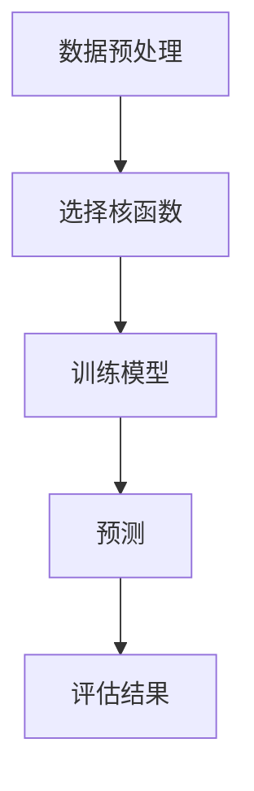
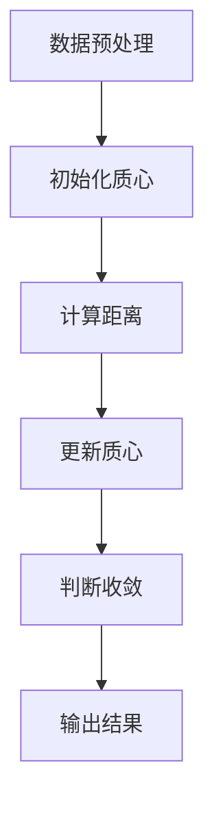
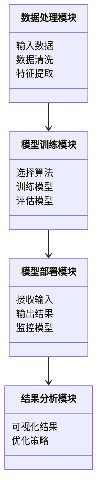
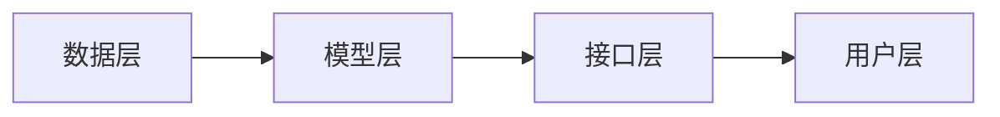

                 


# 机器学习辅助公司创新生态分析

> 关键词：机器学习、公司创新、生态分析、算法原理、系统设计、实战案例

> 摘要：本文深入探讨了机器学习在公司创新生态分析中的应用，从基本概念到具体算法，从系统设计到实战案例，全面解析了机器学习如何辅助公司优化创新生态。文章首先介绍了机器学习和创新生态的基本概念及其联系，然后详细讲解了机器学习算法的原理和创新生态分析中的具体应用，接着从系统设计的角度探讨了创新生态分析的架构和实现方式，最后通过一个实际案例展示了机器学习在公司创新生态分析中的具体应用。

---

## 第一部分：机器学习与公司创新生态的背景介绍

### 第1章：机器学习的基本概念与应用领域

#### 1.1 机器学习的定义与核心概念

机器学习（Machine Learning）是一种人工智能（AI）技术，旨在通过数据和经验来训练模型，使其能够从数据中学习并做出预测或决策，而不需要明确的编程指令。以下是机器学习的核心概念：

- **数据驱动**：机器学习依赖于数据，数据是模型学习的基础。
- **模型训练**：通过算法对数据进行训练，生成能够完成特定任务的模型。
- **预测与决策**：模型能够根据输入的数据，预测结果或做出决策。

#### 1.2 公司创新生态的定义与构成

创新生态是指一个系统或环境中，各种创新活动、资源、参与者和过程相互作用的整体。公司创新生态的核心要素包括：

- **创新资源**：技术、资金、人才等。
- **创新主体**：公司内部的创新团队、外部合作伙伴等。
- **创新过程**：从创意生成到产品落地的全过程。
- **创新成果**：新产品、新技术、新商业模式等。

#### 1.3 机器学习在公司创新生态中的作用

机器学习能够通过数据分析和模型构建，帮助公司更好地理解创新生态，优化创新过程，提升创新效率。具体作用包括：

- **数据驱动的创新分析**：通过机器学习对大量数据进行处理和分析，发现创新趋势和潜在机会。
- **创新趋势预测**：利用机器学习模型预测未来创新方向和市场变化。
- **创新风险评估**：通过模型分析创新过程中的潜在风险，帮助公司制定更合理的创新策略。

### 第2章：机器学习与公司创新生态的联系

#### 2.1 机器学习如何分析创新生态

机器学习通过数据驱动的方式，对创新生态进行深入分析：

- **数据收集与处理**：从公司内部和外部获取创新相关数据，如专利申请、市场趋势、竞争对手信息等。
- **特征提取与建模**：通过对数据进行特征提取，构建适合的机器学习模型，如分类、回归或聚类模型。
- **结果解读与应用**：根据模型输出的结果，分析创新趋势、优化创新策略。

#### 2.2 创新生态中的机器学习模型

在创新生态分析中，常用的机器学习模型包括：

- **监督学习模型**：用于分类任务，如判断一个创新项目是否成功。
- **无监督学习模型**：用于聚类任务，如将创新项目分为不同类别。
- **强化学习模型**：用于模拟创新过程中的决策优化。

#### 2.3 机器学习对创新生态的影响

机器学习能够显著提升创新效率，降低创新成本，并帮助公司发现潜在的创新机会。

---

## 第二部分：机器学习辅助公司创新生态的核心算法

### 第3章：常见机器学习算法及其原理

#### 3.1 监督学习算法

**监督学习**是一种通过标记数据训练模型的机器学习方法。以下是几种常见的监督学习算法：

- **线性回归（Linear Regression）**：用于预测连续型变量，如股票价格预测。
- **支持向量机（Support Vector Machine, SVM）**：用于分类和回归任务，特别适用于高维数据。
- **决策树与随机森林（Decision Tree & Random Forest）**：用于分类和回归任务，决策树易于解释，随机森林通过集成多个决策树提高准确性。

**线性回归的数学模型**：
$$ y = \beta_0 + \beta_1 x + \epsilon $$
其中，$y$ 是目标变量，$x$ 是特征变量，$\beta_0$ 和 $\beta_1$ 是模型参数，$\epsilon$ 是误差项。

**支持向量机的工作流程图**：



#### 3.2 非监督学习算法

**非监督学习**是通过无标记数据训练模型的机器学习方法。以下是几种常见的非监督学习算法：

- **K-means聚类**：将数据划分为K个簇，适用于客户分群。
- **层次聚类**：通过层次化的方法将数据分成树状结构。
- **DBSCAN算法**：基于密度的聚类算法，能够发现任意形状的簇。

**K-means聚类的流程图**：



#### 3.3 强化学习算法

**强化学习**是一种通过试错方式优化决策的机器学习方法。以下是几种常见的强化学习算法：

- **Q-learning**：通过状态-动作-奖励机制优化决策。
- **Deep Q-Networks (DQN)**：结合深度学习和Q-learning，适用于复杂环境。
- **策略梯度法（Policy Gradient Methods）**：通过优化策略的参数直接得到最优策略。

**Q-learning的数学模型**：
$$ Q(s, a) = Q(s, a) + \alpha (r + \gamma \max Q(s', a') - Q(s, a)) $$
其中，$s$ 是状态，$a$ 是动作，$r$ 是奖励，$\gamma$ 是折扣因子，$\alpha$ 是学习率。

---

## 第三部分：系统设计与实现

### 第4章：系统分析与架构设计方案

#### 4.1 问题场景介绍

在公司创新生态分析中，我们需要解决以下问题：

- 如何高效地收集和处理创新相关数据？
- 如何选择合适的算法并构建模型？
- 如何将模型部署到实际业务中并监控其表现？

#### 4.2 系统功能设计

**系统功能设计**包括数据处理模块、模型训练模块、模型部署模块和结果分析模块。

**系统功能模块的类图**：



#### 4.3 系统架构设计

**系统架构设计**包括数据层、模型层、接口层和用户层。

**系统架构图**：



---

## 第四部分：项目实战

### 第5章：项目实战与案例分析

#### 5.1 环境安装与数据准备

- **环境安装**：安装Python、TensorFlow、Scikit-learn等库。
- **数据准备**：收集公司内部的创新项目数据和外部市场数据。

#### 5.2 核心代码实现

以下是使用Python实现的线性回归模型代码：

```python
import numpy as np
from sklearn.linear_model import LinearRegression
from sklearn.metrics import mean_squared_error

# 生成数据
X = np.array([1, 2, 3, 4, 5]).reshape(-1, 1)
y = np.array([2, 4, 5, 4, 6])

# 训练模型
model = LinearRegression()
model.fit(X, y)

# 预测结果
y_pred = model.predict(X)

# 评估模型
 mse = mean_squared_error(y, y_pred)
 print("均方误差:", mse)
```

#### 5.3 案例分析与结果解读

通过上述代码，我们可以训练一个简单的线性回归模型，并预测创新项目的成功概率。模型的均方误差越小，说明预测越准确。

---

## 第五部分：总结与展望

### 第6章：总结与注意事项

- **总结**：机器学习能够显著提升公司创新生态的分析效率和准确性。
- **注意事项**：在实际应用中，需要注意数据质量、模型选择和结果解读等问题。

### 第7章：未来展望

随着机器学习技术的不断发展，创新生态分析将更加智能化和个性化。未来的研究方向包括更复杂的模型设计、多模态数据融合等。

---

## 第六部分：最佳实践与拓展阅读

### 第8章：最佳实践 tips

- **数据预处理**：确保数据的完整性和准确性。
- **模型选择**：根据具体问题选择合适的算法。
- **结果解读**：结合业务背景分析模型输出。

### 第9章：小结

机器学习作为一项强大的技术工具，正在深刻改变公司创新生态的分析方式。通过本文的介绍，读者可以更好地理解和应用这一技术。

### 第10章：注意事项

在实际应用中，需要注意数据隐私、模型泛化能力等问题。

### 第11章：拓展阅读

建议读者进一步学习《机器学习实战》、《深度学习》等书籍，以深入掌握相关技术。

---

通过以上步骤，我们系统地介绍了机器学习在公司创新生态分析中的应用，从理论到实践，从算法到系统设计，全面解析了机器学习如何帮助公司优化创新生态。希望本文能为相关领域的读者提供有价值的参考和启发。

