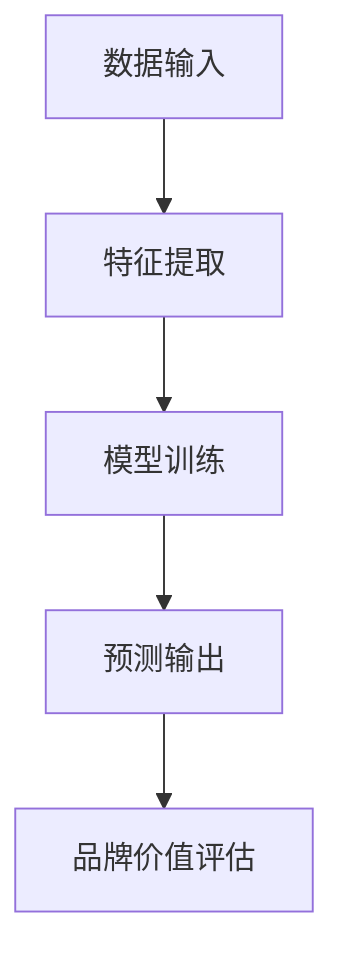

                 


# 机器学习辅助公司品牌价值量化

## 关键词：品牌价值量化，机器学习，数据分析，量化评估，品牌资产，数据驱动，深度分析

## 摘要：  
随着数据科学和人工智能的快速发展，机器学习在品牌价值量化中的应用日益广泛。本文将详细介绍如何利用机器学习技术，通过数据分析和模型构建，实现品牌价值的深度评估和预测。文章将从背景介绍、核心概念、算法原理、系统架构到项目实战，全面解析机器学习在品牌价值量化中的应用，为商业决策提供科学依据。

---

## 第1章：背景介绍

### 1.1 问题背景  
品牌价值是衡量企业核心竞争力的重要指标，它不仅反映了企业的市场地位，还直接影响其市场表现和投资价值。然而，传统的品牌价值评估方法往往依赖于主观判断和经验分析，存在数据不透明、评估标准不统一等问题。  

### 1.2 问题描述  
品牌价值的构成复杂，涉及品牌知名度、品牌忠诚度、品牌联想度等多个维度。传统评估方法难以量化这些维度之间的关系，且缺乏实时性和动态性。  

### 1.3 问题解决方法  
通过机器学习技术，可以利用海量数据和算法模型，量化品牌价值的多维构成，并实时更新评估结果。  

### 1.4 边界与外延  
品牌价值量化主要关注品牌在市场中的表现，不涉及企业内部运营数据。  

---

## 第2章：核心概念与联系

### 2.1 品牌价值构成分析  
品牌价值由品牌知名度、品牌忠诚度、品牌联想度等多个因素构成。  

### 2.2 机器学习模型类型  
- 监督学习：用于回归和分类任务。  
- 非监督学习：用于聚类分析。  

### 2.3 品牌价值与机器学习模型的关系  
通过机器学习模型，可以量化品牌价值的各维度，发现品牌间的关联性。  

---

## 第3章：算法原理讲解

### 3.1 算法选择与原理  
- 线性回归：用于预测品牌价值。  
- 随机森林：用于特征重要性分析。  

### 3.2 算法流程图  


### 3.3 算法实现代码  
```python
import numpy as np
from sklearn.linear_model import LinearRegression
from sklearn.ensemble import RandomForestRegressor

# 示例数据
X = np.array([[1, 2], [3, 4], [5, 6]])
y = np.array([7, 8, 9])

# 线性回归模型
lr = LinearRegression()
lr.fit(X, y)
print("线性回归系数：", lr.coef_)

# 随机森林模型
rf = RandomForestRegressor(n_estimators=100)
rf.fit(X, y)
print("随机森林重要性：", rf.feature_importances_)
```

---

## 第4章：系统分析与架构设计

### 4.1 问题场景介绍  
系统需要实时监测品牌价值，支持多品牌、多市场的评估。  

### 4.2 系统功能设计  
- 数据收集模块：爬取品牌相关数据。  
- 特征提取模块：提取品牌知名度、忠诚度等特征。  
- 模型训练模块：训练机器学习模型。  

### 4.3 系统架构设计  


---

## 第5章：项目实战

### 5.1 环境安装  
安装Python、Scikit-learn等库。  

### 5.2 核心代码实现  
```python
import pandas as pd
from sklearn.model_selection import train_test_split
from sklearn.metrics import mean_squared_error

# 数据加载
data = pd.read_csv('brand_value.csv')

# 数据分割
X_train, X_test, y_train, y_test = train_test_split(data.drop('value', axis=1), data['value'], test_size=0.2)

# 线性回归模型训练
lr_model = LinearRegression()
lr_model.fit(X_train, y_train)

# 模型预测
y_pred = lr_model.predict(X_test)

# 模型评估
print("均方误差：", mean_squared_error(y_test, y_pred))
```

### 5.3 实际案例分析  
以某品牌为例，通过模型预测其品牌价值，并分析结果。  

---

## 第6章：最佳实践与小结

### 6.1 最佳实践  
- 数据质量是关键。  
- 模型可解释性需关注。  

### 6.2 小结  
机器学习为品牌价值量化提供了高效工具，未来将更加依赖数据驱动的决策。

---

## 参考文献  
- 《机器学习实战》  
- 《数据分析与商业决策》  

---

通过以上步骤，我们可以利用机器学习技术，实现品牌价值的量化评估，为企业提供科学的决策支持。

