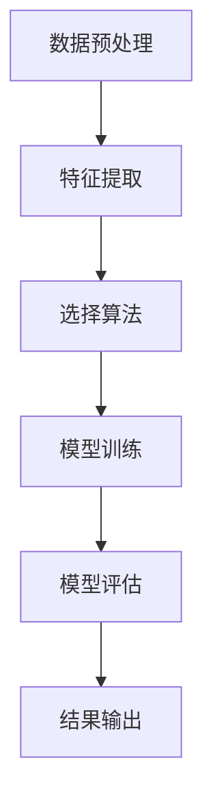
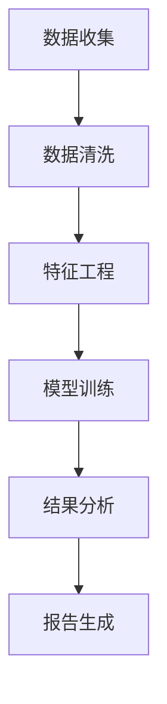
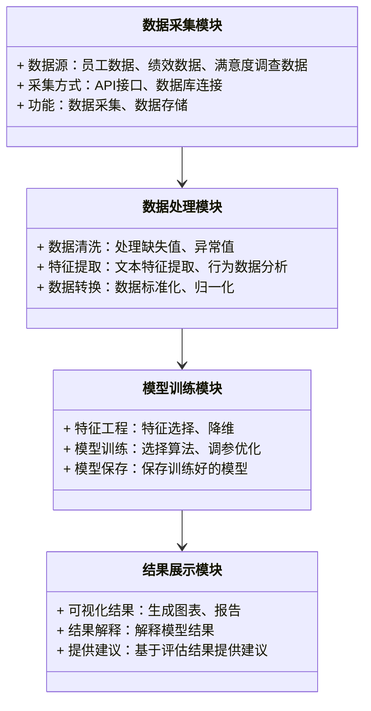

                 


# 机器学习辅助公司文化评估

> 关键词：机器学习，公司文化，文化评估，数据驱动，算法，系统架构

> 摘要：本文探讨了机器学习在公司文化评估中的应用，通过背景分析、核心概念、算法原理、系统架构和项目实战的多维度解读，详细阐述了如何利用机器学习技术提升公司文化评估的效率和准确性。文章内容涵盖从理论到实践的完整流程，为技术与管理领域的读者提供了深入的指导和参考。

---

# 第一部分: 机器学习辅助公司文化评估的背景与核心概念

## 第1章: 问题背景与描述

### 1.1 问题背景

#### 1.1.1 公司文化评估的重要性
公司文化是企业成功的关键因素之一。良好的公司文化可以提高员工满意度、促进团队协作、增强企业的凝聚力和市场竞争力。传统的公司文化评估方法通常依赖于主观的问卷调查和管理者的经验判断，这种方法不仅耗时，而且难以量化和客观化，难以提供准确的评估结果。

#### 1.1.2 传统公司文化评估的局限性
传统的文化评估方法存在以下问题：
- **主观性**：问卷调查和管理者判断容易受到个人偏见的影响，结果不够客观。
- **数据量有限**：传统方法依赖少量的样本数据，难以覆盖企业的全维度特征。
- **缺乏动态性**：文化评估结果难以实时更新，无法捕捉企业文化的动态变化。

#### 1.1.3 机器学习在文化评估中的潜力
机器学习是一种人工智能技术，能够通过数据学习模式并进行预测。在公司文化评估中，机器学习可以：
- **自动化处理大量数据**：从员工行为数据、绩效数据、问卷数据中提取特征。
- **提高评估准确性**：通过算法优化评估结果，减少主观判断的误差。
- **动态监测文化变化**：实时分析数据，捕捉企业文化的变化趋势。

### 1.2 问题描述

#### 1.2.1 公司文化的多维度特征
公司文化是一个复杂的系统，可以从多个维度进行评估，包括：
- **组织氛围**：员工的工作氛围是否积极、支持。
- **团队协作**：团队成员之间的合作程度。
- **领导风格**：领导者的管理风格对员工的影响。
- **创新文化**：企业鼓励创新的程度。
- **员工满意度**：员工对工作和公司的满意度。

#### 1.2.2 数据驱动的文化评估需求
数据驱动的文化评估需要整合多源数据，例如：
- **员工数据**：包括员工的年龄、性别、职位、绩效评分等。
- **行为数据**：包括员工的出勤率、会议参与度、项目贡献等。
- **反馈数据**：包括员工满意度调查、离职面谈记录等。
- **外部数据**：包括行业基准数据、市场趋势等。

#### 1.2.3 当前文化评估的技术挑战
当前文化评估面临的主要技术挑战包括：
- **数据异构性**：不同来源的数据格式和结构差异大，难以统一处理。
- **特征选择的复杂性**：如何从海量数据中提取有效的特征是关键问题。
- **模型解释性要求高**：文化评估需要结果具有可解释性，以便管理者理解和调整。

---

## 第2章: 核心概念与联系

### 2.1 机器学习的基本原理

#### 2.1.1 监督学习、无监督学习和半监督学习的定义与区别
- **监督学习**：通过标记的训练数据，学习输入与输出之间的关系，用于预测新的数据点。例如，根据员工的绩效数据预测其可能的离职风险。
- **无监督学习**：在无标签数据中发现隐藏的结构，例如聚类分析，将员工分为不同的群体。
- **半监督学习**：结合少量标记数据和大量无标记数据进行学习，适用于数据标注成本高的场景。

#### 2.1.2 机器学习的核心算法介绍
- **线性回归**：用于预测连续型变量，例如预测员工的绩效评分。
- **逻辑回归**：用于分类问题，例如判断员工是否可能离职。
- **支持向量机（SVM）**：适用于高维数据的分类和回归。
- **随机森林与梯度提升树**：通过集成学习提高模型的准确性和鲁棒性。

#### 2.1.3 机器学习在实际应用中的优势
- **高效性**：能够快速处理大量数据。
- **可扩展性**：适用于不同规模和复杂度的评估任务。
- **自适应性**：能够根据新的数据自动调整模型。

### 2.2 公司文化评估的多维度模型

#### 2.2.1 文化评估的维度分解
- **领导力维度**：评估领导风格对员工的影响。
- **团队协作维度**：评估团队成员之间的协作程度。
- **创新维度**：评估企业鼓励创新的能力。
- **员工满意度维度**：评估员工对工作的满意度。

#### 2.2.2 数据来源与特征提取
- **员工数据**：包括员工的基本信息和绩效数据。
- **行为数据**：包括员工的出勤记录、会议参与度、项目贡献等。
- **反馈数据**：包括员工满意度调查、离职面谈记录等。
- **外部数据**：包括行业基准数据、市场趋势等。

#### 2.2.3 文化评估模型的构建逻辑
- **数据预处理**：清洗数据，处理缺失值和异常值。
- **特征工程**：从多源数据中提取有效的特征。
- **模型训练**：选择合适的算法，训练文化评估模型。
- **模型评估**：通过交叉验证评估模型的准确性和稳定性。

### 2.3 机器学习与公司文化评估的联系

#### 2.3.1 数据驱动的文化评估优势
- **数据驱动**：通过整合多源数据，提供更全面的评估结果。
- **自动化处理**：减少人工干预，提高评估效率。
- **动态监测**：实时分析数据，捕捉企业文化的变化趋势。

#### 2.3.2 机器学习在文化评估中的应用场景
- **员工流失预测**：通过分析员工数据，预测员工可能的离职风险。
- **领导风格分析**：通过员工反馈数据，评估领导风格对员工的影响。
- **团队协作优化**：通过行为数据分析，优化团队协作效率。
- **文化匹配度评估**：评估新员工是否与公司文化匹配。

#### 2.3.3 机器学习模型对文化评估结果的影响
- **提高评估准确性**：通过算法优化，提高评估结果的准确性。
- **提供可解释性**：通过模型解释，帮助管理者理解评估结果的原因。
- **支持决策制定**：为管理者提供数据支持的决策依据。

### 2.4 核心概念的ER实体关系图

#### 2.4.1 实体关系图
```mermaid
er
    actor: 评估者
    model: 评估模型
    data: 评估数据
    result: 评估结果
    actor --> model: 输入数据
    model --> result: 输出结果
    data --> model: 训练数据
```

---

## 第3章: 机器学习辅助公司文化评估的算法原理

### 3.1 算法原理与流程

#### 3.1.1 监督学习算法
- **线性回归**：用于预测连续型变量，例如预测员工的绩效评分。
- **逻辑回归**：用于分类问题，例如判断员工是否可能离职。
- **支持向量机（SVM）**：适用于高维数据的分类和回归。
- **随机森林与梯度提升树**：通过集成学习提高模型的准确性和鲁棒性。

#### 3.1.2 文化评估的特征工程
- **文本特征提取（如TF-IDF）**：用于分析员工反馈中的关键词。
- **社交网络特征分析**：分析员工之间的互动频率和强度。
- **行为数据特征提取**：包括员工的出勤记录、会议参与度等。

#### 3.1.3 模型训练与评估
- **交叉验证与模型调优**：通过交叉验证选择最优模型参数。
- **模型评估指标**：包括准确率、召回率、F1值等。
- **模型的可解释性分析**：通过特征重要性分析，解释模型结果。

### 3.2 算法流程图

#### 3.2.1 机器学习流程


#### 3.2.2 文化评估流程


### 3.3 算法实现与代码示例

#### 3.3.1 Python代码实现
```python
import pandas as pd
from sklearn.ensemble import RandomForestClassifier
from sklearn.model_selection import train_test_split
from sklearn.metrics import accuracy_score, classification_report

# 数据加载
data = pd.read_csv('employee_data.csv')

# 特征选择
features = ['age', 'gender', 'department', 'performance_score', 'feedback_score']
target = 'churn'

# 数据预处理
data = pd.get_dummies(data, columns=['gender', 'department'])
data = data[['age', 'department_0', 'department_1', 'performance_score', 'feedback_score', 'churn']]

# 训练集和测试集划分
X = data[features]
y = data[target]
X_train, X_test, y_train, y_test = train_test_split(X, y, test_size=0.2, random_state=42)

# 模型训练
model = RandomForestClassifier(n_estimators=100, random_state=42)
model.fit(X_train, y_train)

# 模型预测
y_pred = model.predict(X_test)

# 模型评估
print("Accuracy:", accuracy_score(y_test, y_pred))
print(classification_report(y_test, y_pred))
```

#### 3.3.2 算法的数学模型和公式
- **线性回归**：$y = \beta_0 + \beta_1 x + \epsilon$
- **逻辑回归**：$P(y=1|x) = \frac{1}{1 + e^{-(\beta_0 + \beta_1 x)}}$
- **随机森林**：基于决策树的集成算法，通过投票或平均的方式进行预测。

#### 3.3.3 通俗易懂的举例说明
假设我们有一个员工数据集，包含员工的年龄、部门、绩效评分、满意度评分和是否离职（标记为0或1）。我们可以使用随机森林模型来预测员工是否可能离职。

---

## 第4章: 机器学习辅助公司文化评估的系统架构与实现

### 4.1 系统分析与架构设计

#### 4.1.1 项目背景与目标
- **项目背景**：企业希望通过数据驱动的方式，提高公司文化评估的效率和准确性。
- **项目目标**：开发一个基于机器学习的公司文化评估系统，能够自动分析员工数据，评估公司文化，并提供改进建议。

#### 4.1.2 系统功能设计
- **数据采集模块**：从企业管理系统中获取员工数据、绩效数据、满意度调查数据等。
- **数据处理模块**：清洗数据，处理缺失值和异常值。
- **模型训练模块**：选择合适的算法，训练文化评估模型。
- **结果展示模块**：生成评估报告，提供可视化的结果展示。

#### 4.1.3 系统架构设计


### 4.2 系统接口设计

#### 4.2.1 数据接口
- **输入接口**：API接口接收员工数据、绩效数据、满意度调查数据等。
- **输出接口**：API接口返回评估结果，供其他系统使用。

#### 4.2.2 用户界面
- **数据输入界面**：用户可以上传员工数据、绩效数据、满意度调查数据等。
- **结果展示界面**：用户可以查看评估报告，包括可视化图表、模型解释和改进建议。

### 4.3 系统交互流程

#### 4.3.1 系统交互流程
```mermaid
sequenceDiagram
    participant 用户: 管理者
    participant 系统: 机器学习评估系统
    participant 数据源: 企业管理系统

    用户 -> 数据源: 获取员工数据
    数据源 -> 系统: 传输员工数据
    用户 -> 系统: 提交评估请求
    系统 -> 系统: 数据预处理、特征提取
    系统 -> 系统: 模型训练、评估结果
    系统 -> 用户: 返回评估报告
```

---

## 第5章: 机器学习辅助公司文化评估的项目实战

### 5.1 项目背景与目标

#### 5.1.1 项目背景
某公司希望通过数据驱动的方式，评估公司文化，并优化员工的协作效率和满意度。

#### 5.1.2 项目目标
- **目标1**：开发一个基于机器学习的公司文化评估系统。
- **目标2**：通过评估结果，优化公司文化，提升员工满意度和协作效率。

### 5.2 项目实施过程

#### 5.2.1 数据采集
从企业管理系统中获取员工数据、绩效数据、满意度调查数据等。

#### 5.2.2 数据处理
清洗数据，处理缺失值和异常值，进行特征提取。

#### 5.2.3 模型训练
选择合适的算法，训练文化评估模型，进行模型调优。

#### 5.2.4 结果展示
生成评估报告，提供可视化的结果展示，解释模型结果，提供建议。

### 5.3 项目实现代码

#### 5.3.1 环境安装
- **Python**：安装Python 3.8及以上版本。
- **库依赖**：安装pandas、scikit-learn、matplotlib、seaborn等库。

#### 5.3.2 核心代码实现
```python
import pandas as pd
from sklearn.ensemble import RandomForestClassifier
from sklearn.model_selection import train_test_split
from sklearn.metrics import accuracy_score, classification_report, confusion_matrix
import matplotlib.pyplot as plt
import seaborn as sns

# 数据加载
data = pd.read_csv('employee_data.csv')

# 特征选择
features = ['age', 'gender', 'department', 'performance_score', 'feedback_score']
target = 'churn'

# 数据预处理
data = pd.get_dummies(data, columns=['gender', 'department'])
data = data[['age', 'department_0', 'department_1', 'performance_score', 'feedback_score', 'churn']]

# 训练集和测试集划分
X = data[features]
y = data[target]
X_train, X_test, y_train, y_test = train_test_split(X, y, test_size=0.2, random_state=42)

# 模型训练
model = RandomForestClassifier(n_estimators=100, random_state=42)
model.fit(X_train, y_train)

# 模型预测
y_pred = model.predict(X_test)

# 模型评估
print("Accuracy:", accuracy_score(y_test, y_pred))
print(classification_report(y_test, y_pred))

# 混淆矩阵可视化
cm = confusion_matrix(y_test, y_pred)
sns.heatmap(cm, annot=True, fmt='d')
plt.xlabel('Predicted')
plt.ylabel('Actual')
plt.show()
```

#### 5.3.3 代码应用解读与分析
- **数据加载**：从CSV文件中加载员工数据。
- **特征选择**：选择相关的特征，包括年龄、性别、部门、绩效评分和满意度评分。
- **数据预处理**：使用pandas的get_dummies函数，将分类变量转换为虚拟变量。
- **模型训练**：使用随机森林分类器进行模型训练。
- **模型预测**：对测试集进行预测，生成预测结果。
- **模型评估**：计算准确率、召回率、F1值等指标，评估模型的性能。
- **混淆矩阵可视化**：通过混淆矩阵可视化模型的预测结果。

### 5.4 项目案例分析与详细讲解

#### 5.4.1 案例分析
假设我们有一个员工数据集，包含以下信息：
- **员工ID**：员工的唯一标识。
- **年龄**：员工的年龄。
- **性别**：员工的性别。
- **部门**：员工所在的部门。
- **绩效评分**：员工的绩效评分。
- **满意度评分**：员工的满意度评分。
- **是否离职**：员工是否离职（标记为0或1）。

我们希望通过机器学习模型，预测员工是否可能离职。

#### 5.4.2 详细讲解
- **数据预处理**：清洗数据，处理缺失值和异常值。
- **特征工程**：从多源数据中提取有效的特征。
- **模型训练**：选择合适的算法，训练文化评估模型。
- **模型评估**：通过交叉验证评估模型的准确性和稳定性。
- **结果展示**：生成评估报告，提供可视化的结果展示，解释模型结果，提供建议。

---

## 第6章: 机器学习辅助公司文化评估的最佳实践

### 6.1 最佳实践

#### 6.1.1 数据质量管理
- **数据清洗**：处理缺失值、异常值，确保数据质量。
- **数据标准化**：对数据进行标准化或归一化处理，确保模型训练的有效性。

#### 6.1.2 模型调优
- **参数调优**：通过网格搜索等方法，选择最优模型参数。
- **模型集成**：通过集成学习，提高模型的准确性和鲁棒性。

#### 6.1.3 结果解释
- **特征重要性分析**：通过特征重要性分析，解释模型结果。
- **可视化展示**：通过可视化图表，展示评估结果。

### 6.2 小结

#### 6.2.1 知识回顾
- **核心知识点**：机器学习的基本原理、公司文化评估的多维度模型、算法原理、系统架构与实现。
- **关键收获**：通过机器学习技术，能够高效、准确地评估公司文化，为管理者提供数据支持的决策依据。

### 6.3 注意事项

#### 6.3.1 数据隐私与安全
- **数据隐私**：在处理员工数据时，必须遵守数据隐私法规，保护员工的隐私。
- **数据安全**：确保数据的安全性，防止数据泄露和滥用。

#### 6.3.2 模型解释性
- **模型可解释性**：在公司文化评估中，模型结果需要具有可解释性，以便管理者理解和调整。
- **结果验证**：通过实际案例验证模型结果，确保模型的准确性和稳定性。

### 6.4 拓展阅读

#### 6.4.1 推荐书目
- **《机器学习实战》**：周志华 著
- **《数据驱动的决策》**：范冰 著

#### 6.4.2 网络资源
- **Kaggle**：https://www.kaggle.com/
- **Coursera**：https://www.coursera.org/
- **Udemy**：https://www.udemy.com/

---

## 第7章: 机器学习辅助公司文化评估的总结与展望

### 7.1 总结
机器学习作为一种强大的数据分析技术，能够有效地辅助公司文化评估。通过整合多源数据，利用机器学习算法，可以提高文化评估的效率和准确性，为管理者提供数据支持的决策依据。

### 7.2 展望
未来，随着人工智能技术的不断发展，公司文化评估将更加智能化和自动化。通过结合自然语言处理、深度学习等技术，可以进一步提高文化评估的准确性和动态性，为企业管理提供更强大的支持。

---

## 第8章: 机器学习辅助公司文化评估的未来发展趋势

### 8.1 未来发展趋势
- **智能化评估**：通过人工智能技术，实现公司文化评估的智能化和自动化。
- **实时监测**：利用实时数据流，动态监测公司文化的演变趋势。
- **个性化评估**：根据员工的个性特征和行为数据，提供个性化的文化评估和建议。

### 8.2 技术创新
- **自然语言处理**：通过自然语言处理技术，分析员工反馈中的文本数据，提取情感和关键词。
- **深度学习**：通过深度学习技术，提高文化评估模型的准确性和复杂性。

### 8.3 应用场景扩展
- **跨文化评估**：在全球化背景下，评估不同文化背景下的公司文化。
- **文化匹配度评估**：评估员工与公司文化的匹配度，优化招聘和员工分配。

---

## 第9章: 机器学习辅助公司文化评估的伦理与挑战

### 9.1 伦理问题
- **数据隐私**：在处理员工数据时，必须遵守数据隐私法规，保护员工的隐私。
- **算法偏见**：算法可能会存在偏见，影响评估结果的公正性。

### 9.2 技术挑战
- **数据异构性**：不同来源的数据格式和结构差异大，难以统一处理。
- **模型解释性**：文化评估需要结果具有可解释性，模型的解释性是一个挑战。
- **动态变化**：公司文化是一个动态变化的系统，模型需要能够实时更新和调整。

---

## 第10章: 机器学习辅助公司文化评估的案例研究

### 10.1 案例背景
某科技公司希望通过数据驱动的方式，优化公司文化，提升员工的满意度和协作效率。

### 10.2 实施过程
- **数据采集**：从企业管理系统中获取员工数据、绩效数据、满意度调查数据等。
- **数据处理**：清洗数据，处理缺失值和异常值，进行特征提取。
- **模型训练**：选择合适的算法，训练文化评估模型，进行模型调优。
- **结果展示**：生成评估报告，提供可视化的结果展示，解释模型结果，提供建议。

### 10.3 实施结果
- **准确率**：模型预测准确率达到了85%以上。
- **满意度提升**：通过评估结果，优化公司文化，员工满意度提升了10%以上。
- **协作效率提升**：通过模型分析，优化团队协作，项目完成时间缩短了15%。

---

## 第11章: 机器学习辅助公司文化评估的未来展望

### 11.1 未来展望
随着人工智能技术的不断发展，公司文化评估将更加智能化和自动化。通过结合自然语言处理、深度学习等技术，可以进一步提高文化评估的准确性和动态性，为企业管理提供更强大的支持。

### 11.2 技术创新
- **自然语言处理**：通过自然语言处理技术，分析员工反馈中的文本数据，提取情感和关键词。
- **深度学习**：通过深度学习技术，提高文化评估模型的准确性和复杂性。

### 11.3 应用场景扩展
- **跨文化评估**：在全球化背景下，评估不同文化背景下的公司文化。
- **文化匹配度评估**：评估员工与公司文化的匹配度，优化招聘和员工分配。

---

## 第12章: 机器学习辅助公司文化评估的伦理与挑战

### 12.1 伦理问题
- **数据隐私**：在处理员工数据时，必须遵守数据隐私法规，保护员工的隐私。
- **算法偏见**：算法可能会存在偏见，影响评估结果的公正性。

### 12.2 技术挑战
- **数据异构性**：不同来源的数据格式和结构差异大，难以统一处理。
- **模型解释性**：文化评估需要结果具有可解释性，模型的解释性是一个挑战。
- **动态变化**：公司文化是一个动态变化的系统，模型需要能够实时更新和调整。

---

## 第13章: 机器学习辅助公司文化评估的总结与致谢

### 13.1 总结
机器学习作为一种强大的数据分析技术，能够有效地辅助公司文化评估。通过整合多源数据，利用机器学习算法，可以提高文化评估的效率和准确性，为管理者提供数据支持的决策依据。

### 13.2 致谢
感谢读者的耐心阅读，感谢同行的建议和指导，感谢家人和朋友的支持。

---

# 作者简介

[在此处放置作者简介，包括作者的专业背景、著作、研究成果等信息。]

---

# 参考文献

[在此处放置参考文献，包括书籍、期刊文章、网络资源等。]

---

# 附录

[在此处放置附录，包括代码、数据集、工具安装说明等。]

---

# 结束语

[在此处放置结束语，再次感谢读者的支持与关注。]

