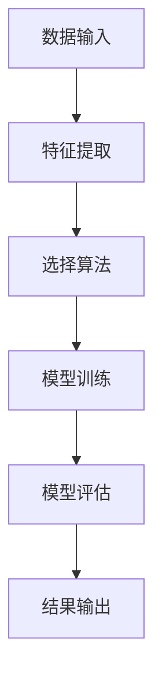
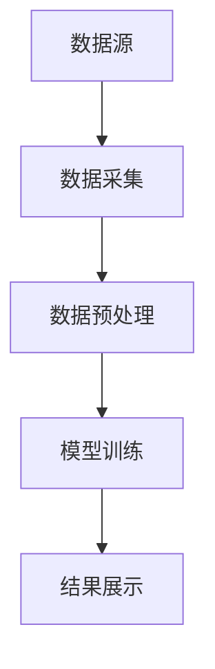

                 


# 机器学习辅助公司研发效率评估

> 关键词：机器学习，研发效率，数据分析，预测模型，系统架构

> 摘要：本文探讨了机器学习在公司研发效率评估中的应用，详细介绍了相关算法、系统架构和项目实战，帮助读者理解如何利用机器学习提升研发效率评估的准确性和效率。

---

## 第1章：机器学习与研发效率评估的背景

### 1.1 机器学习的定义与核心概念

#### 1.1.1 机器学习的基本概念

机器学习是一种人工智能技术，通过数据训练模型，使其能够进行预测或分类。其核心在于数据、特征、模型和算法，这些元素共同决定了模型的学习能力。

#### 1.1.2 机器学习的核心要素

| 核心要素 | 描述 |
|----------|------|
| 数据     | 模型训练的基础，需多样化和代表性 |
| 特征     | 数据的关键属性，影响模型性能 |
| 模型     | 表示数据规律的数学工具 |
| 算法     | 模型训练的具体步骤和方法 |

#### 1.1.3 研发效率评估的重要性

研发效率评估帮助企业识别瓶颈、优化资源分配，提升整体研发速度和质量。传统方法依赖人工分析，效率低下，而机器学习能提供实时、动态的评估。

---

### 1.2 研发效率评估的挑战与机遇

#### 1.2.1 研发效率评估的复杂性

- 数据多样性：涉及时间、成本、人员等多个维度。
- 模型选择：不同场景需不同算法，选择合适的模型是关键。
- 数据质量：噪声和偏差会影响模型性能。

#### 1.2.2 机器学习在研发效率评估中的优势

- **自动化分析**：快速处理大量数据。
- **高精度预测**：基于历史数据，准确预测未来趋势。
- **实时监控**：及时发现异常，优化流程。

#### 1.2.3 企业级应用的潜力

- **资源优化**：合理分配人力和预算，降低浪费。
- **风险控制**：提前预知潜在问题，减少损失。
- **决策支持**：基于数据的决策更科学，提升效率。

---

## 第2章：机器学习的核心概念与原理

### 2.1 监督学习与非监督学习

#### 2.1.1 监督学习的定义与特点

- **定义**：基于有标签的数据进行训练，学习函数$y = f(x)$。
- **特点**：适用于分类和回归任务，如研发周期预测。

#### 2.1.2 非监督学习的定义与特点

- **定义**：基于无标签数据，寻找数据内在结构。
- **特点**：适用于聚类任务，如将项目按效率分组。

#### 2.1.3 两者在研发效率评估中的应用

- **监督学习**：预测项目完成时间。
- **非监督学习**：识别研发团队的效率模式。

### 2.2 算法原理与流程图

#### 2.2.1 机器学习算法的总体流程



#### 2.2.2 线性回归模型

$$y = \beta_0 + \beta_1x + \epsilon$$

- **解释**：$\beta_0$是截距，$\beta_1$是斜率，$\epsilon$是误差。

#### 2.2.3 逻辑回归模型

$$P(y=1|x) = \frac{e^{\beta_0 + \beta_1x}}{1 + e^{\beta_0 + \beta_1x}}$$

- **应用**：用于二分类问题，如判断项目是否按时完成。

---

## 第3章：研发效率评估的系统架构

### 3.1 系统功能设计

#### 3.1.1 数据采集模块

- **功能**：收集研发数据，如时间戳、任务完成情况。
- **输入**：数据库、日志文件。

#### 3.1.2 数据预处理模块

- **功能**：清洗数据，处理缺失值、异常值。
- **输出**：标准化数据集。

#### 3.1.3 模型训练模块

- **功能**：训练机器学习模型，评估性能。
- **输入**：预处理后的数据。

#### 3.1.4 结果展示模块

- **功能**：可视化结果，提供改进建议。
- **输出**：图表、报告。

### 3.2 系统架构图



---

## 第4章：项目实战与代码实现

### 4.1 环境搭建

- **安装Python与机器学习库**
  ```bash
  pip install numpy pandas scikit-learn
  ```

### 4.2 数据清洗与特征工程

#### 4.2.1 数据清洗代码示例

```python
import pandas as pd
data = pd.read_csv('data.csv')
# 删除缺失值
data = data.dropna()
# 处理异常值
data = data[data['时间'] > 0]
```

### 4.3 模型训练与优化

#### 4.3.1 训练代码示例

```python
from sklearn.linear_model import LinearRegression
from sklearn.model_selection import train_test_split

X = data[['时间', '成本']]
y = data['效率']
X_train, X_test, y_train, y_test = train_test_split(X, y, test_size=0.2)
model = LinearRegression()
model.fit(X_train, y_train)
print('模型评分:', model.score(X_test, y_test))
```

---

## 第5章：最佳实践与小结

### 5.1 实践中的注意事项

#### 5.1.1 数据质量的重要性

- 数据清洗和特征工程是模型性能的关键。

#### 5.1.2 模型选择的策略

- 根据问题类型选择算法，如回归或分类。

#### 5.1.3 结果解释的必要性

- 明确模型输出的含义，指导实际优化。

### 5.2 项目小结与未来展望

#### 5.2.1 本书的核心内容总结

- 结合机器学习技术，系统性地提升研发效率评估的准确性。

#### 5.2.2 未来研究方向

- 更复杂模型的应用，如深度学习。
- 实时监控和预测系统的开发。

---

## 总结

机器学习通过自动化分析和高精度预测，显著提升了研发效率评估的效率和准确性。本文从基本概念、算法原理到系统架构和项目实战，全面介绍了如何利用机器学习优化公司研发流程。未来，随着技术进步，机器学习在研发效率评估中的应用将更加广泛和深入。

--- 

通过系统化的分析和实践，企业可以更有效地利用机器学习来提升研发效率，优化资源配置，最终推动业务的持续增长。

