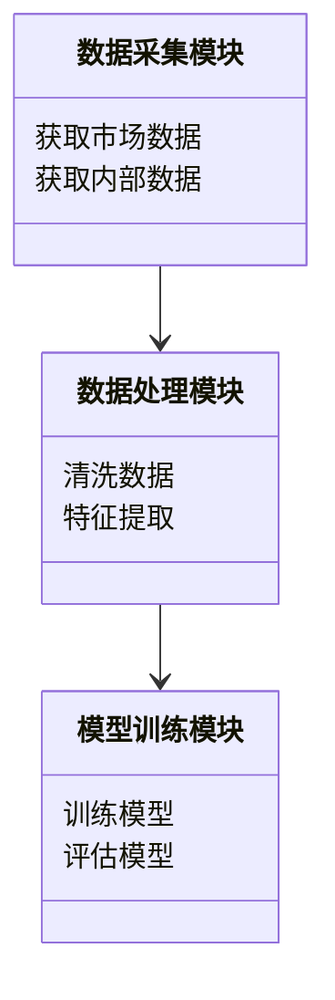

                 


# 《机器学习辅助公司竞争优势分析》

> **关键词**：机器学习、竞争优势、数据分析、商业智能、技术应用  
> 
> **摘要**：随着数据科学和人工智能的快速发展，机器学习技术在商业领域的应用越来越广泛。本文旨在探讨机器学习如何辅助公司进行竞争优势分析，从数据收集、模型构建到实际应用，详细分析机器学习在商业决策中的潜力与价值。通过实际案例和系统设计，本文为读者提供了一个全面理解机器学习如何提升企业竞争优势的框架。

---

## 第一章：机器学习与竞争优势分析的背景

### 1.1 机器学习的基本概念

#### 1.1.1 机器学习的定义
机器学习（Machine Learning）是人工智能（AI）的一个分支，专注于通过数据和算法构建模型，使计算机能够从经验中“学习”并做出预测或决策。其核心在于数据驱动的模式识别和自动化决策。

#### 1.1.2 机器学习的核心特点
- **数据驱动**：依赖大量数据进行模型训练。
- **自动化决策**：通过模型生成预测结果，减少人工干预。
- **适应性**：模型能够根据新数据进行调整和优化。

#### 1.1.3 机器学习与传统数据分析的区别
| 特征 | 传统数据分析 | 机器学习 |
|------|--------------|----------|
| 方法 | 基于规则、统计分析 | 基于模型、数据驱动 |
| 输出 | 描述性分析结果 | 预测性或分类性结果 |
| 复杂性 | 较低 | 较高 |

---

### 1.2 公司竞争优势分析的背景

#### 1.2.1 企业竞争优势的核心要素
竞争优势是企业在市场中胜过竞争对手的关键因素，主要包括：
- **资源**：资金、技术、人才。
- **能力**：研发能力、生产效率、创新能力。
- **战略**：市场定位、品牌影响力。

#### 1.2.2 竞争优势分析的常见方法
- **SWOT分析**：评估企业内部优势和劣势，以及外部机会和威胁。
- ** Porter's Five Forces**：分析行业竞争结构，评估企业面临的竞争压力。
- **价值链分析**：识别企业价值创造的关键环节。

#### 1.2.3 机器学习在竞争优势分析中的潜力
机器学习能够通过数据挖掘和模式识别，发现传统方法难以察觉的竞争优势，例如：
- **市场趋势预测**：通过历史销售数据预测未来市场需求。
- **竞争对手分析**：通过爬取竞争对手数据，分析其市场策略。
- **客户行为预测**：通过客户数据预测客户流失风险。

---

## 第二章：机器学习的核心概念与原理

### 2.1 机器学习的核心概念

#### 2.1.1 数据、特征与标签
- **数据**：是机器学习的基础，可以是结构化数据（表格数据）或非结构化数据（文本、图像）。
- **特征**：数据中的独立变量，用于预测目标变量。
- **标签**：数据中的目标变量，即我们需要预测的结果。

#### 2.1.2 监督学习、无监督学习与强化学习
| 类型 | 描述 | 示例 |
|------|------|------|
| 监督学习 | 基于标记数据进行模型训练 | 预测房价 |
| 无监督学习 | 基于未标记数据进行模式识别 | 聚类客户群体 |
| 强化学习 | 通过与环境交互学习策略 | 游戏AI训练 |

---

### 2.2 机器学习的核心算法

#### 2.2.1 线性回归
线性回归是一种用于预测连续型变量的算法，其数学模型如下：
$$ y = \beta_0 + \beta_1 x_1 + \beta_2 x_2 + \dots + \beta_n x_n $$
其中，$\beta$ 是模型参数，$x$ 是特征变量，$y$ 是目标变量。

#### 2.2.2 支持向量机（SVM）
SVM 用于分类问题，其核心思想是将数据映射到高维空间，并找到一个超平面将数据分割。
$$ \text{目标函数：} \min \frac{1}{2} \|\omega\|^2 + C \sum_{i=1}^n \xi_i $$
$$ \text{约束条件：} y_i (ω·x_i + b) \geq 1 - ξ_i, ξ_i \geq 0 $$

#### 2.2.3 决策树与随机森林
决策树是一种树状结构，用于分类或回归问题。随机森林是一种基于决策树的集成学习方法，通过构建多棵决策树并取多数投票结果。

---

## 第三章：机器学习在公司竞争优势分析中的应用

### 3.1 竞争优势分析的机器学习模型构建

#### 3.1.1 数据收集与预处理
- 数据收集：从企业内部数据库、公开市场数据、竞争对手分析工具等获取数据。
- 数据清洗：处理缺失值、异常值、重复值。
- 数据转换：将非结构化数据转换为结构化数据。

#### 3.1.2 特征工程与选择
- 特征提取：从数据中提取有意义的特征，例如从文本数据中提取关键词。
- 特征选择：使用统计方法或模型评估特征的重要性。

#### 3.1.3 模型训练与优化
- 模型训练：使用训练数据训练机器学习模型。
- 模型优化：通过调整超参数（如学习率、正则化系数）优化模型性能。

---

### 3.2 基于机器学习的竞争优势预测

#### 3.2.1 竞争优势预测的特征选择
- 市场份额、利润率、研发投入、客户满意度等。

#### 3.2.2 基于机器学习的预测模型
- 使用随机森林或XGBoost模型进行预测。

#### 3.2.3 模型结果的解释与分析
- 通过特征重要性分析，识别哪些因素对竞争优势影响最大。

---

### 3.3 机器学习在竞争优势分析中的实际案例

#### 3.3.1 案例背景介绍
某科技公司希望通过机器学习分析其在市场中的竞争优势，预测未来市场趋势。

#### 3.3.2 数据收集与处理
- 数据来源：公司销售数据、客户反馈、市场报告。
- 数据预处理：清洗、转换、标准化。

#### 3.3.3 模型构建与结果分析
- 模型选择：随机森林。
- 模型训练：使用80%数据训练，20%数据验证。
- 结果分析：识别关键竞争优势因素，预测未来市场份额。

---

## 第四章：机器学习算法原理与数学模型

### 4.1 线性回归算法
线性回归的损失函数为均方误差（MSE）：
$$ \text{损失函数} = \frac{1}{2n} \sum_{i=1}^n (y_i - \hat{y}_i)^2 $$
其中，$\hat{y}_i$ 是预测值，$y_i$ 是真实值。

---

## 第五章：机器学习系统架构与实现

### 5.1 竞争优势分析系统的功能模块设计

#### 5.1.1 数据采集模块
- 功能：从多种数据源获取数据。
- 实现：使用爬虫技术抓取公开市场数据，连接企业数据库获取内部数据。

#### 5.1.2 数据处理模块
- 功能：清洗、转换数据，提取特征。
- 实现：使用Python的Pandas库进行数据处理。

#### 5.1.3 模型训练模块
- 功能：训练机器学习模型。
- 实现：使用Scikit-learn库训练随机森林模型。

---

### 5.2 系统架构设计

#### 5.2.1 系统功能设计
- 通过 Mermaid 绘制系统功能类图：


---

## 第六章：项目实战

### 6.1 环境安装与配置
- 安装Python、Pandas、Scikit-learn、Jupyter Notebook。

### 6.2 核心代码实现

#### 6.2.1 数据预处理
```python
import pandas as pd

# 读取数据
data = pd.read_csv('competitiveness.csv')

# 清洗数据
data.dropna(inplace=True)
data = pd.get_dummies(data)  # 特征转换
```

#### 6.2.2 模型训练
```python
from sklearn.ensemble import RandomForestClassifier
from sklearn.model_selection import train_test_split

# 划分数据集
X = data.drop('competitiveness', axis=1)
y = data['competitiveness']
X_train, X_test, y_train, y_test = train_test_split(X, y, test_size=0.2)

# 训练模型
model = RandomForestClassifier()
model.fit(X_train, y_train)
```

#### 6.2.3 结果分析
```python
importances = model.feature_importances_
print(importances)
```

---

## 第七章：最佳实践与总结

### 7.1 小结
机器学习能够显著提升公司竞争优势分析的效率和准确性，通过数据驱动的方式发现潜在机会和威胁。

### 7.2 注意事项
- 数据质量是关键，确保数据准确性和完整性。
- 模型解释性是实际应用中的重要考量，避免“黑箱”模型。

### 7.3 拓展阅读
- 《Hands-On Machine Learning with Scikit-Learn and TensorFlow》
- 《竞争优势分析：方法与实践》

---

通过以上内容，本文系统地介绍了机器学习在公司竞争优势分析中的应用，从理论到实践，为读者提供了全面的知识框架和实际操作指南。

