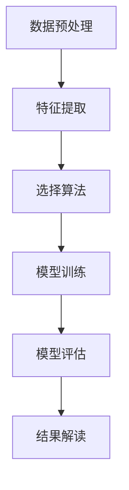
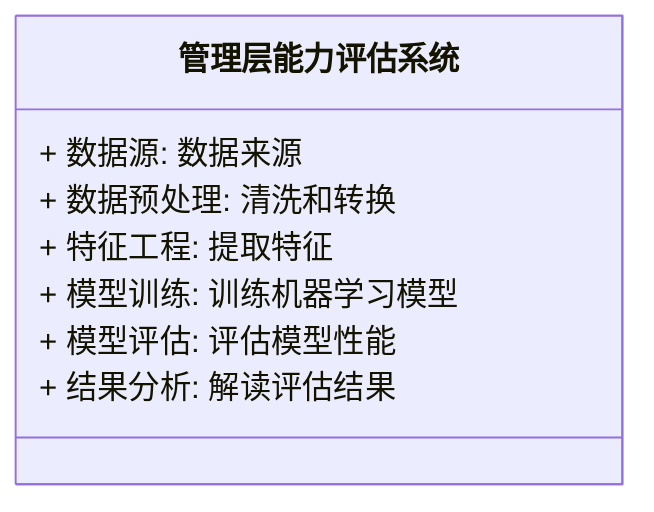
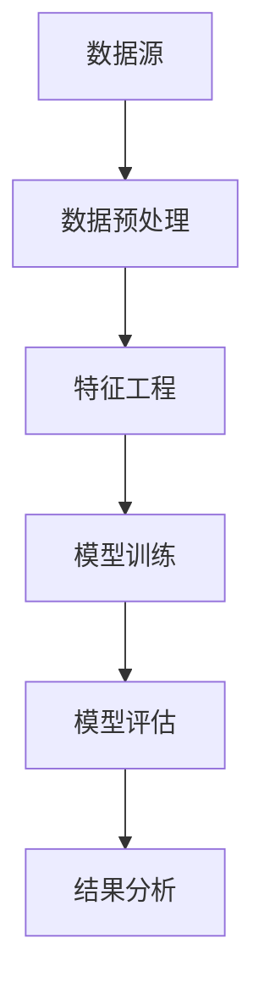
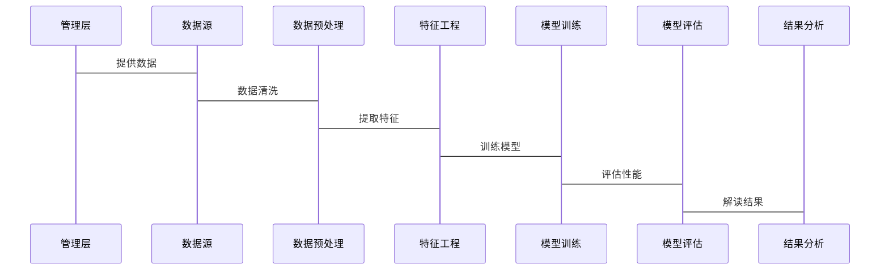

                 


# 机器学习辅助公司管理层能力评估

## 关键词：机器学习，管理层能力评估，数据分析，人工智能，企业管理

## 摘要：  
机器学习作为一种强大的数据分析工具，正在被越来越多地应用于企业管理领域。本文探讨了如何利用机器学习技术来辅助公司管理层的能力评估，通过数据驱动的方法，帮助企业更准确地识别和培养优秀领导者。文章从背景介绍、核心概念、算法原理、系统架构到项目实战，全面阐述了机器学习在管理层能力评估中的应用，并提供了丰富的技术细节和实际案例。

---

# 第一部分: 机器学习辅助公司管理层能力评估的背景与核心概念

## 第1章: 背景介绍

### 1.1 问题背景
#### 1.1.1 管理层能力评估的重要性  
管理层的能力直接关系到企业的战略决策和运营效率。传统的评估方法通常依赖主观判断，存在主观性高、缺乏数据支持的问题。  

#### 1.1.2 传统评估方法的局限性  
传统评估方法主要基于面试、述职报告和主观评分，难以量化管理层的多维度能力，且容易受评估者主观因素的影响。  

#### 1.1.3 机器学习在评估中的潜在优势  
机器学习能够从大量数据中提取模式，发现潜在规律，帮助客观、量化地评估管理层能力，提升评估的科学性和准确性。  

### 1.2 问题描述  
#### 1.2.1 管理层能力的多维度性  
管理层能力包括领导力、决策能力、团队协作能力等多维度，传统方法难以全面覆盖。  

#### 1.2.2 数据驱动评估的需求  
企业需要通过数据驱动的方法，更客观地评估管理层的绩效和潜力。  

#### 1.2.3 机器学习在数据处理中的应用  
机器学习能够处理结构化和非结构化数据，提取关键特征，为管理层能力评估提供支持。  

### 1.3 问题解决  
#### 1.3.1 机器学习在管理层能力评估中的解决方案  
通过收集和分析管理层的历史数据、绩效指标、行为数据等，构建机器学习模型进行预测和评估。  

#### 1.3.2 数据收集与处理的方法  
数据来源包括企业绩效数据、员工反馈、管理行为记录等，需要进行清洗、特征提取和标准化处理。  

#### 1.3.3 模型训练与优化的策略  
选择合适的算法，进行模型训练，通过交叉验证优化模型参数，确保模型的泛化能力。  

### 1.4 边界与外延  
#### 1.4.1 管理层能力评估的边界条件  
明确评估的范围和目标，例如评估的周期、数据的可用性等。  

#### 1.4.2 机器学习在其他管理场景中的应用  
机器学习还可以应用于招聘、团队管理、风险评估等领域。  

#### 1.4.3 技术与管理的结合点  
机器学习作为技术工具，需要与企业管理实践相结合，才能发挥最大价值。  

### 1.5 核心概念  
#### 1.5.1 管理层能力评估的定义  
通过对管理层的多维度数据进行分析，评估其能力、绩效和潜力的过程。  

#### 1.5.2 机器学习在评估中的核心要素  
数据采集、特征工程、模型选择、模型训练和结果解读。  

#### 1.5.3 模型性能与评估指标的关系  
模型性能直接影响评估结果的准确性，评估指标需要与业务目标对齐。  

---

## 第2章: 核心概念与联系

### 2.1 核心概念原理  
#### 2.1.1 机器学习的基本原理  
机器学习通过数据训练模型，使其能够从数据中学习规律并进行预测。  

#### 2.1.2 管理层能力评估的指标体系  
包括领导力、决策能力、团队协作能力、创新能力等多维度指标。  

#### 2.1.3 数据特征与模型选择的关系  
数据特征影响模型性能，模型选择需要根据数据特点和业务需求进行调整。  

### 2.2 概念属性特征对比  
| 概念       | 属性         | 特征               |
|------------|--------------|--------------------|
| 管理层能力 | 多维性        | 包括领导力、决策力等 |
| 数据特征   | 可量性        | 结构化和非结构化数据 |
| 模型选择   | 适应性        | 根据数据特点选择算法 |

### 2.3 ER实体关系图  
```mermaid
erd
    管理层
    评估指标
    数据来源
    模型
    管理层 -> 数据来源: 提供数据
    数据来源 -> 模型: 训练模型
    模型 -> 评估指标: 生成预测结果
```

---

## 第3章: 算法原理讲解

### 3.1 算法原理  
#### 3.1.1 线性回归模型  
线性回归用于预测连续型变量，适用于评估管理层的某些量化指标，如绩效评分。  

#### 3.1.2 支持向量机  
支持向量机适用于分类问题，可用于评估管理层的能力等级划分。  

#### 3.1.3 随机森林  
随机森林是一种集成学习方法，适用于多分类问题，能够处理高维数据。  

### 3.2 算法流程图  


### 3.3 算法实现代码  
```python
# 线性回归模型
from sklearn.linear_model import LinearRegression

# 数据预处理
X = df[['绩效评分', '团队规模']]
y = df['领导力评分']

# 模型训练
model = LinearRegression()
model.fit(X, y)

# 预测结果
y_pred = model.predict(X)
```

### 3.4 数学公式  
线性回归的损失函数：  
$$\text{损失} = \sum_{i=1}^{n} (y_i - \hat{y}_i)^2$$  
其中，$y_i$ 是真实值，$\hat{y}_i$ 是预测值。  

---

## 第4章: 系统分析与架构设计

### 4.1 系统分析  
#### 4.1.1 问题场景介绍  
企业需要通过机器学习模型评估管理层能力，优化人才管理和培养计划。  

#### 4.1.2 项目介绍  
开发一个基于机器学习的管理层能力评估系统，支持数据收集、模型训练和结果分析。  

### 4.2 系统架构设计  
#### 4.2.1 领域模型  


#### 4.2.2 系统架构  


#### 4.2.3 接口设计  
系统提供API接口，支持数据输入和模型调用。  

#### 4.2.4 交互流程图  


---

## 第5章: 项目实战

### 5.1 环境安装  
安装Python、scikit-learn、pandas、mermaid等工具。  

### 5.2 核心代码实现  
```python
# 环境安装
pip install scikit-learn pandas mermaid

# 核心代码
import pandas as pd
from sklearn.ensemble import RandomForestClassifier
from sklearn.metrics import accuracy_score

# 数据加载
data = pd.read_csv('manager_data.csv')

# 特征提取
X = data[['绩效评分', '团队规模', '创新能力']]
y = data['能力等级']

# 模型训练
model = RandomForestClassifier()
model.fit(X, y)

# 模型预测
y_pred = model.predict(X)
print('准确率:', accuracy_score(y, y_pred))
```

### 5.3 案例分析  
通过实际数据训练模型，评估某位管理层的能力，分析结果并提出改进建议。  

---

## 第6章: 最佳实践

### 6.1 小结  
机器学习为管理层能力评估提供了新的思路和技术支持，帮助企业更科学地进行人才管理。  

### 6.2 注意事项  
- 数据质量是关键，需确保数据的完整性和准确性。  
- 模型解释性需重视，确保评估结果可解释。  
- 结果需结合业务实际，避免过度依赖技术。  

### 6.3 拓展阅读  
推荐阅读《机器学习实战》和《数据驱动的管理决策》等书籍，深入理解机器学习在管理中的应用。  

---

# 结语  
通过本文的详细讲解，读者可以全面了解机器学习在公司管理层能力评估中的应用，掌握从数据收集到模型训练的全过程，并能够实际操作相关技术，为企业管理提供有力支持。

